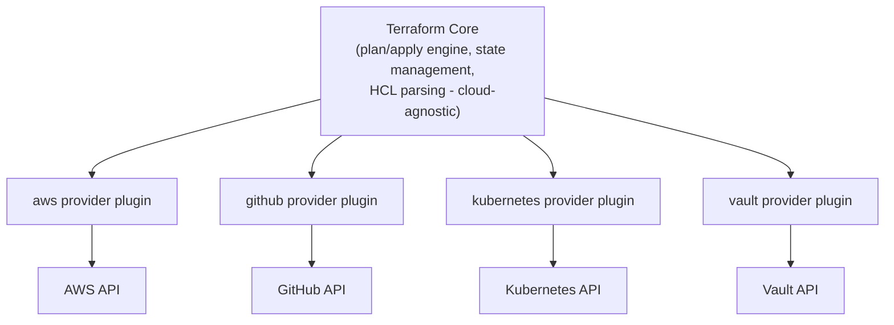

# Domain 1 — Infrastructure as Code (IaC) Concepts

*Official exam objectives covered: 1a (What is IaC), 1b (Advantages of IaC patterns), 1c (Multi-cloud/hybrid/service-agnostic workflows)*
*Course lectures folded in: Installation (Windows/Linux), IDE setup + VS Code extensions, AWS account opening/sign-in/MFA, Authentication vs Authorization, IAM user creation*

---

## 1. What Is Infrastructure as Code? (Objective 1a)

### Definition
Infrastructure as Code is the practice of managing and provisioning infrastructure (servers, networks, load balancers, databases, DNS records — anything with an API) through **machine-readable configuration files**, instead of manual processes like clicking through a cloud console or running one-off CLI commands.

There are two philosophies of IaC, and Terraform is firmly in the second camp:

| | Imperative | Declarative |
|---|---|---|
| You write | *Steps* to reach a goal ("create a VPC, then a subnet, then attach it...") | The *end state* you want ("I want a VPC with these subnets") |
| Execution engine decides | Nothing — you control every step | The order of operations, based on a dependency graph |
| Example tools | Bash scripts, Python + boto3, Ansible (mostly) | **Terraform**, AWS CloudFormation, Pulumi (can do both) |
| Re-running the same script | Might create duplicates, or need custom "if exists, skip" logic you write yourself | Terraform automatically diffs desired vs. current and only changes what's different |

**Example — imperative (what you'd otherwise write by hand):**
```bash
#!/bin/bash
aws ec2 run-instances --image-id ami-0e35ddab05955cf57 --instance-type t3.micro \
  --key-name lappynewawss --subnet-id subnet-0abc123
# Problem: run this script twice, you get TWO instances.
# You'd have to hand-write logic to check "does this instance already exist?"
```

**Example — declarative (Terraform):**
```hcl
resource "aws_instance" "web" {
  ami           = "ami-0e35ddab05955cf57"
  instance_type = "t3.micro"
  key_name      = "lappynewawss"
  subnet_id     = "subnet-0abc123"
}
```
Run `terraform apply` on this ten times in a row — you still get exactly **one** instance, because Terraform checks its state file first and sees the instance already exists. This property is called **idempotency**, and it's the single biggest reason declarative IaC beats hand-written scripts at any real scale.

### What if you don't use IaC at all?
This is worth sitting with, because it's the "why" behind everything else in this course:
- **No audit trail.** If someone clicks "Terminate Instance" in the AWS Console, there's a CloudTrail log entry buried in thousands of others — not a Git diff you can review in a pull request.
- **No repeatability.** Rebuilding "the same environment" in a second AWS region means a human remembering (or re-discovering) every setting that was clicked into place the first time.
- **Configuration drift becomes invisible.** Two "identical" servers built by hand six months apart almost never actually match — one has a patch the other doesn't, a slightly different security group rule, etc. Nobody notices until something breaks in only one of them.
- **Scaling is linear in human effort.** Need 50 identical microservice environments for a multi-tenant SaaS product? By hand, that's 50x the clicking, 50x the chance of a mistake. With Terraform + modules, it's the same module called 50 times with different variables.

### Real-World Scenario 1 — Disaster Recovery
A company's entire production environment (VPC, EC2 fleet, RDS database, load balancer) lives only as manually-clicked AWS Console configuration. The primary AWS region has an outage. Without IaC, the team's disaster recovery plan is "hope someone remembers how everything was configured" — realistically, hours-to-days of manual reconstruction, if it's even fully possible. With the same environment defined in Terraform, disaster recovery is `terraform apply` pointed at a different region's variables file — infrastructure back online in minutes, not days.

### Real-World Scenario 2 — Onboarding a New Environment for a New Client
A B2B SaaS company needs to spin up an isolated environment (VPC + app servers + database) for every new enterprise client, for compliance/data-isolation reasons. Without IaC, onboarding a new client means a DevOps engineer manually repeating ~40 console steps, taking half a day and risking a missed step (e.g., forgetting to enable encryption on one client's database, an actual audit finding). With Terraform modules, onboarding a new client is: `terraform apply -var="client_name=acme-corp"` — same guaranteed-correct infrastructure shape every time, in minutes.

---

## 2. Advantages of IaC Patterns (Objective 1b)

| Advantage | What it actually means in practice |
|---|---|
| **Version control** | Your entire infrastructure history lives in Git — `git blame` tells you who changed a security group rule and when, `git revert` can undo an infra change like it undoes a code change. |
| **Collaboration** | Infrastructure changes go through pull requests, code review, and CI checks — the same rigor as application code, instead of one person's tribal knowledge. |
| **Consistency (no configuration drift)** | Every environment built from the same `.tf` code is guaranteed structurally identical — no "well it works in staging" mysteries caused by an undocumented manual tweak. |
| **Speed / self-service** | A developer can spin up a fully-configured dev environment in minutes via `terraform apply`, instead of filing a ticket and waiting for an ops engineer. |
| **Cost management** | Since environments are defined as code, it's trivial to spin them down completely (`terraform destroy`) when not needed — e.g., destroying an entire QA environment every night and recreating it every morning. |
| **Documentation that can't go stale** | The `.tf` files *are* the documentation of what's running — unlike a wiki page describing infrastructure, which is right the day it's written and wrong six months later. |

### What if you skip these advantages (i.e., stick with manual/imperative management)?
You don't just lose one nice-to-have — these compound. No version control means no easy rollback, which means outages last longer. No consistency means more time debugging environment-specific bugs that shouldn't exist. No self-service means ops becomes a bottleneck for every team that needs infrastructure. Individually survivable; together, they're why "ClickOps" doesn't scale past a small team and a handful of servers.

---

## 3. How Terraform Manages Multi-Cloud, Hybrid Cloud, and Service-Agnostic Workflows (Objective 1c)

### The core idea: Terraform Core knows *nothing* about AWS, Azure, GCP, GitHub, or Kubernetes
All of that platform-specific knowledge lives in **provider plugins**, downloaded separately during `terraform init`. Terraform Core's job is only: read `.tf` files, build a dependency graph, manage state, and call whichever provider plugin owns a given resource type.



This is *why* one tool can manage an EC2 instance, a GitHub repository, a Kubernetes deployment, and a Vault secret in the same `apply` — each resource type is handled by its own provider, but they all share one state file, one workflow, one language (HCL).

### Example — one config, two providers, working together
```hcl
terraform {
  required_providers {
    aws    = { source = "hashicorp/aws", version = "~> 5.0" }
    github = { source = "integrations/github", version = "~> 6.0" }
  }
}

provider "aws" {
  region = "ap-south-1"
}

provider "github" {
  token = var.github_token
}

resource "aws_instance" "ci_runner" {
  ami           = data.aws_ami.amazon_linux.id
  instance_type = "t3.medium"
}

resource "github_repository" "app_repo" {
  name       = "my-app"
  visibility = "private"
}

output "runner_ip" {
  value = aws_instance.ci_runner.public_ip
}
```
Notice: a single `terraform apply` provisions both a real EC2 instance *and* a real GitHub repository, in one dependency-ordered run, tracked in one state file. This is the literal mechanism behind "hybrid cloud" and "multi-cloud" support — it's not a special mode you switch on, it's just what happens naturally when a config declares more than one provider.

### Multi-account / multi-region as a "hybrid" pattern (provider aliasing)
The same mechanism extends to using *the same* provider twice, configured differently — e.g., one AWS account for networking, another for application workloads, or two AWS regions for disaster recovery:
```hcl
provider "aws" {
  alias  = "network_account"
  region = "ap-south-1"
  # assume_role / profile pointing at the networking AWS account
}

provider "aws" {
  alias  = "app_account"
  region = "ap-south-1"
  # assume_role / profile pointing at the application AWS account
}

resource "aws_vpc" "shared_network" {
  provider   = aws.network_account
  cidr_block = "10.0.0.0/16"
}

resource "aws_instance" "app_server" {
  provider  = aws.app_account
  ami       = data.aws_ami.amazon_linux.id
  subnet_id = aws_vpc.shared_network.id  # cross-account reference
}
```
(Full provider aliasing detail — including multiple regions for DR — is covered in Domain 6 and Domain 4c; this is the conceptual seed of it.)

### What if a team ignores this and hand-rolls separate tools per cloud?
Some organizations use CloudFormation for AWS, ARM templates for Azure, and Deployment Manager for GCP — one tool per cloud. The cost: three completely different syntaxes, three different state/drift models, three separate sets of tooling/CI integration to maintain, and no single place to see "everything we've provisioned, across every platform." A multi-cloud company using Terraform instead gets one workflow, one language, and one state model regardless of how many clouds/SaaS platforms are actually involved — the entire value proposition of "service-agnostic" IaC.

### Real-World Scenario 1 — Regulatory Data Residency
A fintech company must keep EU customer data on EU infrastructure but can use cheaper US infrastructure for non-regulated workloads. Using provider aliasing (two `aws` provider blocks, two regions), the same Terraform codebase deploys the regulated tier to `eu-central-1` and the non-regulated tier to `us-east-1`, with a single, auditable set of `.tf` files describing the entire policy — instead of two disconnected manual environments that could silently drift apart.

### Real-World Scenario 2 — Full-Stack Provisioning Beyond "just servers"
A platform team provisions not only AWS infrastructure (VPC, EC2, RDS) but also the GitHub repository + branch protection rules for a new microservice, and a Vault secrets path for its database credentials — all as part of the same "new service" Terraform module. A new engineer runs one `terraform apply` and gets infrastructure, source control, and secrets management fully wired together, instead of three separate manual setup processes across three different tools/consoles.

---

## 4. Practical Setup (Installation, IDE, AWS Account)

This section is the hands-on prerequisite work — necessary before writing any real Terraform, but conceptually simple, so it's covered efficiently here rather than stretched thin.

### 4.1 Installing Terraform
Terraform ships as a single static binary — no installer, no background service.

**Windows:**
```powershell
# Download the zip from developer.hashicorp.com/terraform/install, then:
# 1. Unzip to C:\terraform\
# 2. Add C:\terraform\ to your System PATH
# 3. Open a NEW terminal and confirm:
terraform -version
```

**Linux (two valid approaches):**
```bash
# Manual (good for disposable/CI environments)
wget -O - https://apt.releases.hashicorp.com/gpg | sudo gpg --dearmor -o /usr/share/keyrings/hashicorp-archive-keyring.gpg
echo "deb [arch=$(dpkg --print-architecture) signed-by=/usr/share/keyrings/hashicorp-archive-keyring.gpg] https://apt.releases.hashicorp.com $(grep -oP '(?<=UBUNTU_CODENAME=).*' /etc/os-release || lsb_release -cs) main" | sudo tee /etc/apt/sources.list.d/hashicorp.list
sudo apt update && sudo apt install terraform

# Package manager (good for long-lived machines you'll upgrade later)
wget -O- https://apt.releases.hashicorp.com/gpg | sudo gpg --dearmor -o /usr/share/keyrings/hashicorp-archive-keyring.gpg
echo "deb [signed-by=/usr/share/keyrings/hashicorp-archive-keyring.gpg] https://apt.releases.hashicorp.com $(lsb_release -cs) main" | sudo tee /etc/apt/sources.list.d/hashicorp.list
sudo apt update && sudo apt install terraform
```
For RHEL/CentOS/Fedora/Amazon Linux, the equivalent is HashiCorp's `yum` repo:
```bash
sudo yum install -y yum-utils
sudo yum-config-manager --add-repo https://rpm.releases.hashicorp.com/RHEL/hashicorp.repo
sudo yum -y install terraform
```

**macOS (two valid approaches):**
```bash
# Homebrew (recommended - handles upgrades via `brew upgrade` going forward)
brew tap hashicorp/tap
brew install hashicorp/tap/terraform

# Manual (same zip-based approach as Linux/Windows)
curl -O https://releases.hashicorp.com/terraform/1.9.0/terraform_1.9.0_darwin_amd64.zip   # or _arm64_ on Apple Silicon
unzip terraform_1.9.0_darwin_amd64.zip
sudo mv terraform /usr/local/bin/
```
On first run of a manually-downloaded (non-Homebrew) binary, macOS Gatekeeper may block it as "from an unidentified developer" — approve it once via **System Settings → Privacy & Security → Allow Anyway**, or avoid the prompt entirely by using Homebrew, which handles the notarization/quarantine flag correctly.

**Verify on any OS:**
```bash
terraform -version
```

**What if you install from an untrusted source instead?** You can't verify the binary hasn't been tampered with — always use HashiCorp's official downloads page, or the official apt/yum/Homebrew channels, never a third-party mirror.

### 4.2 Editor Setup
Terraform code is plain text, but VS Code + the official **HashiCorp Terraform extension** gives you syntax highlighting, format-on-save, and schema-aware autocomplete. **Without it**, you lose all of that — typos like `resouce` instead of `resource` go unnoticed until you run `terraform validate`, instead of being underlined instantly as you type.

### 4.3 AWS Account, MFA, and Authentication vs. Authorization
Terraform has no identity system of its own for AWS — it borrows real AWS credentials. Before writing code:
1. Create an AWS account (this creates the **root user** — email + password, tied to a payment method).
2. Enable **MFA** on the root user immediately — a second proof of identity (an authenticator app code) on top of the password, so a leaked password alone isn't enough to sign in.
3. Create a dedicated **IAM user** (e.g., `terraform-deployer`) with programmatic access (an Access Key ID + Secret Access Key) — this, not root, is what Terraform will actually use.

**Authentication vs. Authorization — a distinction worth internalizing, not memorizing:**

| | Authentication | Authorization |
|---|---|---|
| Question | "Who are you?" | "What are you allowed to do?" |
| AWS mechanism | Access Key ID + Secret Access Key (or SSO/federation), strengthened by MFA | IAM **policies** attached to the user/role |
| Failure mode | `InvalidClientTokenId` / `SignatureDoesNotMatch` — the key itself is wrong/malformed | `UnauthorizedOperation` — the key is valid, but that identity isn't allowed to do this specific thing |

**Example demonstrating the difference:**
```hcl
provider "aws" {
  region  = "ap-south-1"
  profile = "terraform-dev"   # authenticates AS terraform-deployer (a real, valid IAM user)
}

resource "aws_instance" "web" {
  ami           = "ami-0e35ddab05955cf57"
  instance_type = "t3.micro"
}
```
If `terraform-deployer`'s IAM policy only grants `AmazonS3ReadOnlyAccess`, this `apply` **authenticates successfully** (AWS recognizes the key as valid) but then **fails authorization** with `UnauthorizedOperation: You are not authorized to perform this operation` when it tries to call `RunInstances`. Two entirely different problems: fixing authentication means fixing/rotating the key; fixing authorization means attaching a broader IAM policy (e.g., `AmazonEC2FullAccess`).

In your Terraform configuration:

```hcl
provider "aws" {
  region  = "ap-south-1"
  profile = "terraform-dev"
}
```

the `profile` tells the AWS provider **which AWS CLI credentials profile to use**.

## Why is `profile` needed?

Terraform needs AWS credentials to create, modify, or delete AWS resources.

It needs:

* Access Key ID
* Secret Access Key
* (Optionally) Session Token

Instead of hardcoding these credentials in your Terraform code (which is insecure), Terraform can reuse the credentials stored by the AWS CLI.

When you run:

```bash
aws configure --profile terraform-dev
```

AWS CLI stores something like:

### `~/.aws/credentials`

```ini
[terraform-dev]
aws_access_key_id = AKIAxxxxxxxxxxxx
aws_secret_access_key = xxxxxxxxxxxxxxxxxxxx
```

### `~/.aws/config`

```ini
[profile terraform-dev]
region = ap-south-1
output = json
```

Then Terraform reads this profile.

---

# How Terraform uses it

Suppose your files contain:

```hcl
provider "aws" {
  region  = "ap-south-1"
  profile = "terraform-dev"
}
```

Terraform internally does something equivalent to:

```
Look inside ~/.aws/credentials

Find:

[terraform-dev]

Use these credentials
```

---

# Example

Suppose you're working with multiple AWS accounts.

### Personal Account

```
[personal]
aws_access_key_id = AAAA...
aws_secret_access_key = BBBB...
```

### Company Dev Account

```
[terraform-dev]
aws_access_key_id = CCCC...
aws_secret_access_key = DDDD...
```

### Production Account

```
[production]
aws_access_key_id = EEEE...
aws_secret_access_key = FFFF...
```

Now you can simply change the profile:

```hcl
provider "aws" {
  region  = "ap-south-1"
  profile = "personal"
}
```

or

```hcl
provider "aws" {
  region  = "ap-south-1"
  profile = "production"
}
```

without changing any credentials.

---

# Where are profiles stored?

### Linux / macOS / WSL

```
~/.aws/credentials
~/.aws/config
```

### Windows

```
C:\Users\<username>\.aws\credentials
C:\Users\<username>\.aws\config
```

---

# How to create a profile

Run:

```bash
aws configure --profile terraform-dev
```

You'll be prompted for:

```
AWS Access Key ID:
AWS Secret Access Key:
Default region:
Output format:
```

After that, Terraform can use:

```hcl
profile = "terraform-dev"
```

---

# What if `profile` is omitted?

Terraform follows the AWS SDK's credential provider chain. It looks for credentials in this general order:

1. Environment variables (`AWS_ACCESS_KEY_ID`, `AWS_SECRET_ACCESS_KEY`)
2. The profile specified by the `AWS_PROFILE` environment variable
3. The `default` profile in `~/.aws/credentials`
4. IAM Role credentials (if running on an EC2 instance)
5. ECS task roles, EKS IAM Roles for Service Accounts (IRSA), and other supported credential sources

For example, if your credentials file contains:

```ini
[default]
aws_access_key_id = AKIA...
aws_secret_access_key = ...
```

then this works without specifying a profile:

```hcl
provider "aws" {
  region = "ap-south-1"
}
```

Terraform automatically uses the `default` profile.

---

# Why use profiles?

Profiles are useful because they let you:

* Use multiple AWS accounts (personal, dev, staging, production).
* Avoid hardcoding secrets in Terraform code.
* Easily switch between accounts.
* Reuse the same credentials that the AWS CLI uses.

---

## Visual workflow

```text
                Terraform
                    │
                    ▼
      provider "aws" {
          profile = "terraform-dev"
      }
                    │
                    ▼
      ~/.aws/credentials
                    │
        [terraform-dev]
          Access Key
          Secret Key
                    │
                    ▼
             AWS Authentication
                    │
                    ▼
            Create EC2, S3, VPC...
```


**What if you skip creating a scoped IAM user and just use root credentials for Terraform?** If that access key ever leaks (committed to a public repo, pasted into a support ticket, left in a Docker image layer), the blast radius is **the entire AWS account** — billing, every service, every resource — not just what Terraform manages. A scoped IAM user limits the blast radius of a leak to whatever that policy actually allows.

### Best practice

For local development, using AWS CLI profiles is a common and secure approach. In CI/CD pipelines (such as GitHub Actions, GitLab CI, or Jenkins), it's generally better **not** to use `profile`. Instead, provide credentials through environment variables or, preferably, use temporary credentials by assuming an IAM role (for example, via OIDC). This avoids storing long-lived credentials on the build server and aligns with AWS security best practices.

### Real-World Scenario 1 — A Leaked Key, Two Different Outcomes
Company A hardcodes their **root** access key into a `provider "aws" {}` block that accidentally gets pushed to a public GitHub repo. Within minutes, automated scanners find it; the attacker has full account control — they can spin up cryptomining instances, exfiltrate S3 data, and even close the account. Company B made the same mistake, but had used a scoped `terraform-deployer` IAM user with only EC2/VPC permissions. The attacker can create/delete EC2 instances (real damage, but contained) — they cannot touch billing, IAM, or any other service. Same mistake, wildly different blast radius, purely because of the authorization design.

### Real-World Scenario 2 — MFA Stopping a Credential Stuffing Attack
An engineer reuses a password across multiple services; one of those services suffers a breach and the password leaks in a public dump. Attackers run automated "credential stuffing" against thousands of sites, including the AWS sign-in page, using that leaked password. Because MFA is enabled on the IAM user, the password alone gets the attacker nowhere — they're blocked at the authenticator-code prompt, and the account owner never even notices the attempt happened.

### 4.4 Your First Resource — Launching an EC2 Instance
Everything up to this point has been setup. This is the moment it becomes real: one `resource` block, one `apply`, one actual running server in your AWS account.

```hcl
# main.tf
provider "aws" {
  region  = "ap-south-1"
  profile = "terraform-dev"
}

resource "aws_instance" "first_server" {
  ami           = "ami-0e35ddab05955cf57"   # Amazon Linux 2, ap-south-1 — replace with a current AMI
  instance_type = "t3.micro"                # eligible for the AWS free tier
}
```

**Reading this block like a beginner should, argument by argument:**
- `resource "aws_instance" "first_server"` — the **type** (`aws_instance`, owned by the AWS provider) and the **local name** (`first_server`, how *you* refer to it elsewhere in this config — it is not the AWS resource's actual name/ID).
- `ami` — which machine image to boot from. This is **required**; Terraform will refuse to `plan` without it.
- `instance_type` — the hardware size (vCPU/RAM) to rent. Also required.
- Everything else (a `key_name`, a `subnet_id`, `tags`) is **optional** — omit them and AWS applies its own defaults (e.g., the instance lands in your account's default VPC/subnet).

**What actually happens when you run the three commands for the very first time:**
```bash
terraform init     # downloads the aws provider plugin — nothing exists in AWS yet
terraform plan     # shows a "+ create" diff — still nothing exists, this is read-only
terraform apply    # asks for confirmation, then actually calls the AWS RunInstances API
```
After `apply` succeeds, two things now exist that didn't before: a real, billable EC2 instance in your AWS account, and an entry for it in `terraform.tfstate` — the local file Terraform uses to remember "I created this, here's its real AWS ID" so that the *next* `plan` can compare desired vs. current instead of blindly creating a second instance. (The full mechanics of the state file are the subject of Domain 2's next file — this is deliberately just enough to make your first `apply` make sense.)

**What if you skip `terraform plan` and go straight to `apply`?** `apply` runs its own plan internally and still shows you the diff before asking for confirmation, so nothing is silently hidden — but making `plan` a distinct, deliberate step in your habit builds the reflex of *reading the diff before approving it*, which matters enormously once your configs are managing dozens of resources and a mistaken change could otherwise slip past an on-autopilot `yes`.

### 4.5 Important Security Pointer (Before You Go Further)
Two habits to lock in right now, before your first real project, because they're much harder to retrofit later:
1. **Never hardcode a real access key, secret key, or session token directly inside a `.tf` file** — not even "just for this test," not even in a private repo. Use a named CLI profile (`profile = "terraform-dev"`, as shown above) or environment variables (`AWS_ACCESS_KEY_ID`/`AWS_SECRET_ACCESS_KEY`), so credentials never exist as text inside a file that Git might one day track.
2. **Watch what you actually launch.** `t3.micro` is free-tier eligible; it's easy to follow an online example that specifies a much larger instance type, run `apply`, and get billed for it. Always sanity-check `instance_type` (and any `count`/`for_each` multiplying it) against what you intend to pay for — and remember to `terraform destroy` anything you spin up purely to practice, so it doesn't keep accruing charges after you've moved on to the next lecture.

Both of these are small habits now and expensive incidents later — a leaked key or an un-destroyed practice environment left running for a month are two of the most common ways beginners get an unpleasant AWS bill.

---

## 5. Practice Questions

### Easy
1. What's the key difference between declarative and imperative infrastructure management?
2. Name two concrete advantages of IaC over manually clicking through a cloud console.
3. True/False: Terraform Core has built-in, hardcoded knowledge of the AWS API.

### Medium
4. Explain, using the idempotency property, why running the same Terraform config's `apply` twice doesn't create duplicate resources — but running the equivalent imperative AWS CLI script twice, might.
5. A company uses three different IaC tools (one per cloud they operate in). List two concrete costs of this approach that a single, provider-based tool like Terraform avoids.
6. An IAM user authenticates successfully with a valid access key but gets `UnauthorizedOperation` trying to launch an EC2 instance. Diagnose the two separate concepts at play and how you'd fix it.

### Hard
7. Design a provider-aliasing setup (sketch the HCL) for a fintech company that must keep EU customer data in `eu-central-1` while using `us-east-1` for non-regulated workloads, all from one Terraform codebase.
8. A startup's root AWS credentials get accidentally committed to a public repository. Walk through, step by step, what an attacker could do with root-level access versus what they could do if the leaked credentials instead belonged to a `terraform-deployer` IAM user scoped to `AmazonEC2FullAccess` and `AmazonVPCFullAccess` only.

---
**Next:** [02-domain2-terraform-fundamentals.md](02-domain2-terraform-fundamentals.md)
