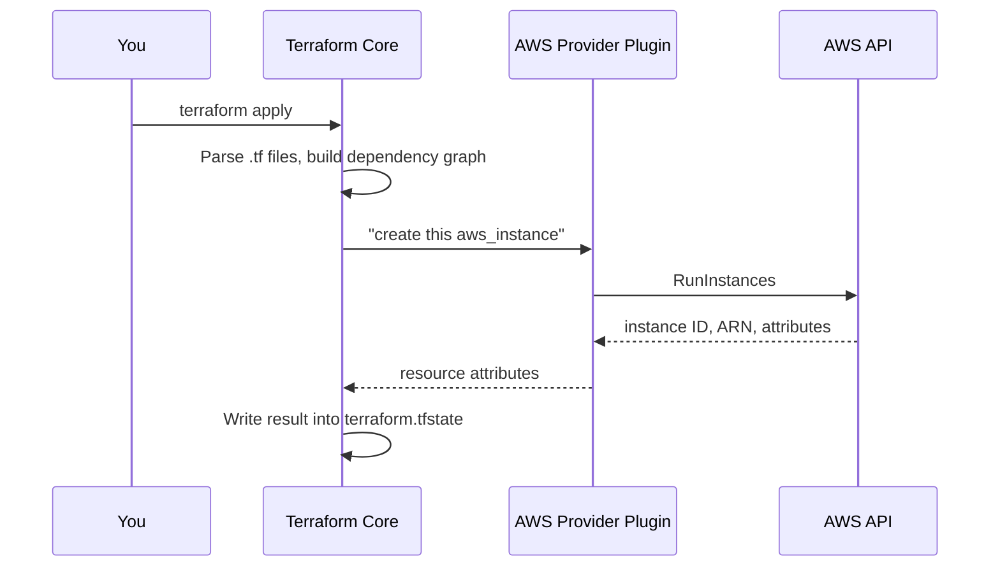
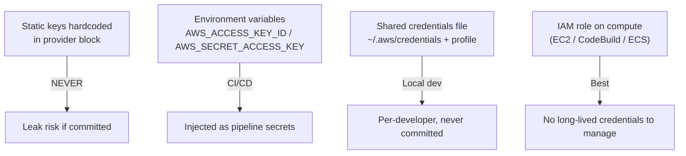
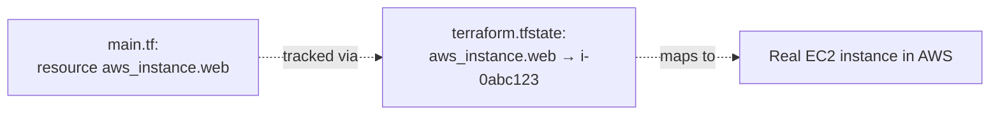
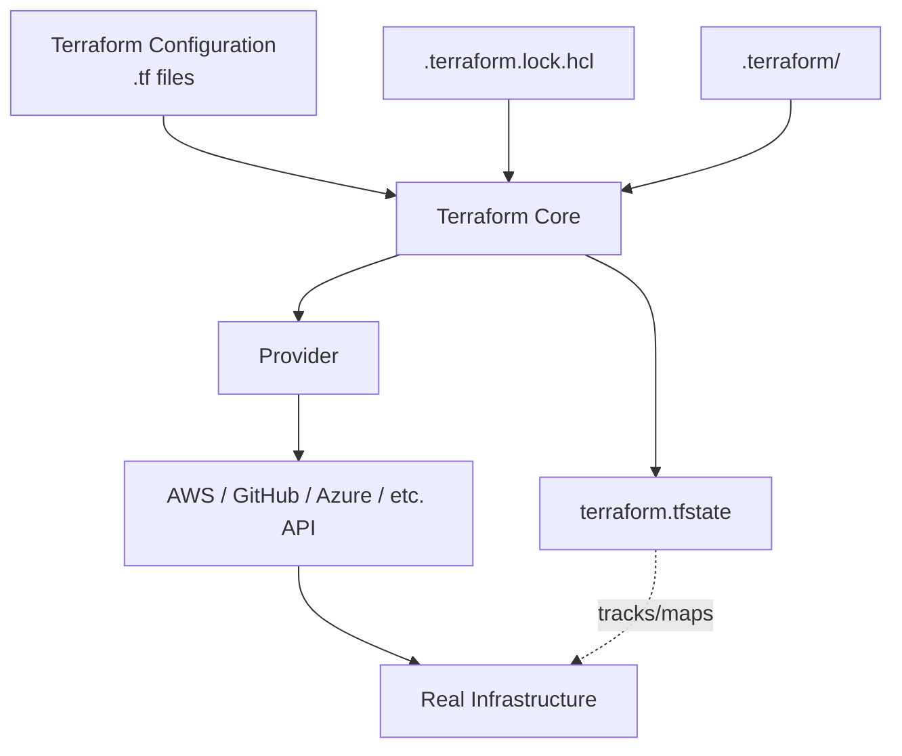

# Domain 2 — Terraform Fundamentals

## 1. What is a Provider?

### Core idea

* A **provider is a plugin** that allows Terraform to communicate with an external platform/API.
* Terraform Core itself doesn't know how to create an EC2, S3 bucket, GitHub repository, etc.
* The provider contains the platform-specific knowledge.

### Think of it like this

```text
Terraform Core
      |
      ↓
AWS Provider
      |
      ↓
AWS API
      |
      ↓
EC2 / S3 / VPC
```

### Example

You write:

```hcl
resource "aws_instance" "web" {
  ami           = "ami-123"
  instance_type = "t3.micro"
}
```

Terraform Core understands:

> "I need to create a resource."

The **AWS provider** understands:

> "This is an `aws_instance`, so I need to call the AWS EC2 API."

### Mermaid — Provider flow



### Remember

> **Terraform Core = orchestration/planning**
> **Provider = talks to the actual platform**

---

# 2. Provider Tiers

Terraform providers generally fall into these categories:

| Tier          | Maintained by                | Example            |
| ------------- | ---------------------------- | ------------------ |
| **Official**  | HashiCorp                    | `hashicorp/aws`    |
| **Partner**   | Verified third-party company | `datadog/datadog`  |
| **Community** | Community/individuals        | Various            |
| **Archived**  | No longer maintained         | Avoid for new work |

### Important exam point

**Official does NOT mean built into Terraform.**

For example:

```text
hashicorp/aws
```

is still downloaded separately when you run:

```bash
terraform init
```

### Easy way to remember

```text
Official  → HashiCorp
Partner   → Verified company
Community → Community developer
Archived  → No longer maintained
```

---

# 3. Provider Versioning

Terraform needs to know:

> "Which version of the provider should I use?"

You define this inside:

```hcl
terraform {
  required_providers {
    aws = {
      source  = "hashicorp/aws"
      version = "~> 5.0"
    }
  }
}
```

### Three important things

* `aws` → local provider name
* `hashicorp/aws` → provider source
* `~> 5.0` → version constraint

---

# 4. Version Constraints

This is important for the exam.

| Constraint    | Meaning          |
| ------------- | ---------------- |
| `= 5.31.0`    | Exactly 5.31.0   |
| `>= 5.0`      | 5.0 or newer     |
| `~> 5.0`      | 5.x versions     |
| `~> 5.31`     | 5.31.x versions  |
| No constraint | Latest available |

### Most important

```text
~> 5.0
```

means:

> Allow updates within the **5.x** series, but don't move to 6.x.

Example:

```text
5.0 ✅
5.10 ✅
5.62 ✅
5.99 ✅
6.0 ❌
```

Whereas:

```text
~> 5.31
```

means:

```text
5.31.0 ✅
5.31.5 ✅
5.31.9 ✅

5.32.0 ❌
6.0.0 ❌
```

### Exam shortcut

> `~>` = **allow updates, but stay within the specified compatibility boundary.**

---

# 5. Why Provider Versioning Matters

Imagine your Terraform code works today with:

```text
AWS Provider 5.x
```

Six months later, someone runs:

```bash
terraform init
```

and gets:

```text
AWS Provider 6.x
```

If there are breaking changes, the same Terraform code might stop working.

That's why we use:

```hcl
version = "~> 5.0"
```

---

# 6. Dependency Lock File

Terraform creates:

```text
.terraform.lock.hcl
```

### What does it do?

The version constraint says:

> "Which versions are allowed?"

The lock file says:

> "Which exact version did we actually select?"

For example:

```hcl
provider "registry.terraform.io/hashicorp/aws" {
  version     = "5.62.0"
  constraints = "~> 5.0"
}
```

So:

```text
Constraint
   ↓
~> 5.0
   ↓
Terraform selects
   ↓
5.62.0
   ↓
Lock file remembers it
```

### Why is this useful?

Everyone can use the same provider version:

```text
Developer → 5.62.0
CI        → 5.62.0
Developer → 5.62.0
```

instead of:

```text
Developer → 5.62.0
CI        → 5.70.0
Developer → 5.65.0
```

---

# 7. Provider Checksums

The lock file also contains hashes/checksums.

Think of a checksum as a **fingerprint of the provider binary**.

Terraform can check:

```text
Downloaded provider
        ↓
Calculate hash
        ↓
Compare with lock file
        ↓
Match? → Use it
No match? → Reject
```

This helps protect against a tampered/corrupted provider binary.

### Exam takeaway

> `.terraform.lock.hcl` stores the **selected provider version and hashes**.

### Git rule

```text
.terraform.lock.hcl → ✅ Commit
.terraform/         → ❌ Don't commit
```

---

# 8. `terraform init` and Providers

When you run:

```bash
terraform init
```

Terraform:

* Reads `required_providers`
* Finds the required provider
* Determines the allowed version
* Checks the lock file
* Downloads the provider
* Stores it under `.terraform/`
* Creates/updates `.terraform.lock.hcl`

### Important

`terraform init` **doesn't create your infrastructure**.

It prepares Terraform.

```text
terraform init
      ↓
Download AWS provider
      ↓
Terraform is ready
```

---

# 9. Provider Authentication

Terraform also needs credentials to access AWS.

There are several ways.

### Preferred order conceptually



### For local development

A common approach:

```hcl
provider "aws" {
  region  = "ap-south-1"
  profile = "terraform-dev"
}
```

The profile points to credentials stored by AWS CLI.

---

# 10. AWS CLI Profile

You can create a profile:

```bash
aws configure --profile terraform-dev
```

Then Terraform uses:

```hcl
provider "aws" {
  region  = "ap-south-1"
  profile = "terraform-dev"
}
```

Think:

```text
Terraform
    ↓
profile = terraform-dev
    ↓
~/.aws/credentials
    ↓
AWS credentials
    ↓
AWS
```

### Why use profiles?

Useful when you have multiple accounts:

```text
personal
terraform-dev
staging
production
```

You can switch which credentials Terraform uses without putting secrets in `.tf` files.

---

# 11. CI/CD Authentication

For CI/CD, you generally don't want:

```hcl
provider "aws" {
  access_key = "..."
  secret_key = "..."
}
```

Instead, credentials can be supplied through environment variables or, preferably, temporary credentials obtained through an IAM role/OIDC-based setup.

Example:

```hcl
provider "aws" {
  region = "ap-south-1"
}
```

Credentials are supplied outside the Terraform configuration.

### Remember

```text
Local machine → AWS profile
CI/CD         → Environment/temporary credentials
AWS compute   → IAM role
```

---

# 12. Multiple Providers

Terraform can use multiple **different providers** in the same configuration.

Example:

```text
Terraform
   |
   +---- AWS Provider
   |
   +---- GitHub Provider
   |
   +---- Random Provider
```

For example:

```hcl
terraform {
  required_providers {
    aws = {
      source = "hashicorp/aws"
    }

    random = {
      source = "hashicorp/random"
    }
  }
}
```

Then:

```hcl
resource "random_id" "suffix" {
  byte_length = 4
}

resource "aws_s3_bucket" "logs" {
  bucket = "my-app-logs-${random_id.suffix.hex}"
}
```

### Why use `random_id`?

S3 bucket names must be globally unique.

Instead of:

```text
my-app-logs
```

you can get:

```text
my-app-logs-a81f92bc
```

So the random provider generates the unique part, while the AWS provider creates the bucket.

### Important distinction

**Multiple providers:**

```text
aws
random
github
```

Different plugins.

---

# 13. Provider Aliasing

This is different from using multiple providers.

Here we use the **same provider multiple times** with different configurations.

### Example

```hcl
provider "aws" {
  region = "ap-south-1"
}

provider "aws" {
  alias  = "us_east"
  region = "us-east-1"
}
```

Now we have:

```text
AWS Provider
   |
   +---- Default → ap-south-1
   |
   +---- us_east → us-east-1
```

A resource can explicitly choose the aliased provider:

```hcl
resource "aws_instance" "dr" {
  provider = aws.us_east

  ami           = "ami-123"
  instance_type = "t3.micro"
}
```

### Very important rule

If you don't specify:

```hcl
provider = aws.us_east
```

Terraform uses the **default AWS provider**.

So:

```hcl
resource "aws_instance" "server" {
  ...
}
```

uses:

```text
default AWS provider
```

while:

```hcl
resource "aws_instance" "server" {
  provider = aws.us_east
  ...
}
```

uses:

```text
us_east provider
```

### Exam takeaway

> **Different providers → multiple provider types.**
> **Provider alias → multiple configurations of the same provider.**

---

# 14. Why Provider Aliases Are Useful

Suppose your application runs in:

```text
ap-south-1
```

and DR is in:

```text
us-east-1
```

Instead of duplicating the entire Terraform project:

```text
project-india/
project-us/
```

you can have:

```text
One Terraform project
       |
       +---- AWS default → India
       |
       +---- AWS alias → US
```

This keeps the infrastructure definition in one codebase.

---

# 15. Terraform State

Now the most important concept of Domain 2.

Terraform maintains a state file:

```text
terraform.tfstate
```

### What is state?

State is Terraform's record of:

> **Which real infrastructure resources correspond to the resources in my Terraform configuration.**

Example:

```text
main.tf

aws_instance.web
       |
       ↓
terraform.tfstate
       |
       ↓
i-0abc123
       |
       ↓
Real EC2 instance
```

### Mermaid



---

# 16. Why Does Terraform Need State?

Imagine your code says:

```hcl
resource "aws_instance" "web" {
  ...
}
```

Terraform needs to know:

> "Which actual EC2 instance is `aws_instance.web`?"

State remembers that relationship:

```text
aws_instance.web
       ↓
i-0abc123
```

Without this mapping, Terraform wouldn't have the same reliable record of which real resource corresponds to the configuration.

### Simple example

First apply:

```text
main.tf
   ↓
Create EC2
   ↓
i-123
   ↓
Save mapping in state
```

Second apply:

```text
main.tf
   ↓
State says aws_instance.web = i-123
   ↓
Terraform knows the resource already exists
```

---

# 17. Desired State vs Current State

This is another very important concept.

### Desired State

What your Terraform code says you **want**.

Example:

```hcl
instance_type = "t3.small"
```

### Current State

What actually exists in AWS.

Example:

```text
EC2 = t3.medium
```

Terraform compares them.

```text
Desired
t3.small
   |
   | compare
   ↓
Current
t3.medium
```

Terraform then proposes a change.

---

# 18. Configuration Drift

**Drift = real infrastructure has changed outside Terraform.**

Example:

Terraform says:

```text
t3.small
```

Someone manually changes the EC2 through AWS Console:

```text
t3.medium
```

Now:

```text
Terraform desired → t3.small
AWS actual        → t3.medium
```

That's **configuration drift**.

When Terraform refreshes and runs a plan, it can detect the difference and propose bringing AWS back to the desired configuration.

### Important

Terraform doesn't say:

> "Someone changed AWS manually, so I'll make t3.medium the new desired state."

Your Terraform code remains the desired state.

---

# 19. `terraform plan` — What is Really Happening?

Conceptually:

```text
        Terraform Code
        Desired State
              |
              ↓
        Compare with
              |
              ↓
      Real Infrastructure
        Current State
              |
              ↓
        What changed?
              |
              ↓
       Create a plan
```

Example:

```text
.tf says       → t3.small
AWS currently  → t3.medium

Plan:
~ change t3.medium → t3.small
```

`~` means modify.

---

# 20. Terraform Refresh

Refresh means:

> Update Terraform's understanding of the real infrastructure.

Historically you could run:

```bash
terraform refresh
```

Conceptually:

```text
AWS
 ↓
Read current resource information
 ↓
Update Terraform state
```

It **doesn't itself modify the AWS resource**.

### Important modern behavior

`terraform plan` and `terraform apply` normally refresh information automatically.

So you generally don't need to manually run:

```bash
terraform refresh
```

every time.

### Exam concept

Understand what **refresh means**:

> **Refresh updates Terraform's state information from the real infrastructure.**

---

# 21. State Is Not Global

This is a useful concept.

Terraform state belongs to a particular Terraform configuration/state scope.

Imagine:

```text
Engineer A
   ↓
Terraform Project A
   ↓
State A
```

and:

```text
Engineer B
   ↓
Terraform Project B
   ↓
State B
```

Both could potentially create similar AWS resources because Terraform doesn't have one global state file for the entire AWS account.

That's why teams eventually use **shared/remote state**.

You don't need to go deeply into remote state yet.

---

# 22. Important File Comparison

| File                  | Purpose                                         |
| --------------------- | ----------------------------------------------- |
| `.tf` files           | Desired infrastructure                          |
| `.terraform.lock.hcl` | Provider version/checksum lock                  |
| `.terraform/`         | Local Terraform/provider files                  |
| `terraform.tfstate`   | Terraform's mapping/record of managed resources |

### Easy mental model

```text
main.tf
   ↓
"What I WANT"

terraform.tfstate
   ↓
"What Terraform KNOWS about what exists"

AWS
   ↓
"What ACTUALLY EXISTS"
```

---

# 23. The Full Domain 2 Mental Model

This is the diagram I'd keep in your notes:



Think of it as:

```text
.tf files
   ↓
Desired state
   ↓
Terraform Core
   ↓
Provider
   ↓
Platform API
   ↓
Real infrastructure

Terraform state
   ↓
Keeps track of the relationship
between Terraform resources and
real infrastructure
```

---

# 24. Domain 2 — What You Actually Need to Remember

## Providers

* Provider = plugin that communicates with an external platform.
* Terraform Core does **not** contain AWS-specific logic.
* `hashicorp/aws` → AWS provider.
* Provider is downloaded during `terraform init`.

## Provider tiers

```text
Official → HashiCorp
Partner → Verified third party
Community → Community maintained
Archived → No longer maintained
```

## Versioning

```hcl
version = "~> 5.0"
```

* `= 5.31.0` → exact version
* `>= 5.0` → 5.0 or newer
* `~> 5.0` → stay within 5.x
* `~> 5.31` → stay within 5.31.x

## Lock file

```text
.terraform.lock.hcl
```

* Records selected provider version.
* Contains hashes/checksums.
* Helps reproducibility and integrity.
* **Commit it to Git.**

## Authentication

```text
Local → AWS profile
CI/CD → environment/temporary credentials
AWS compute → IAM role
```

* Avoid hardcoded credentials.

## Multiple providers

```text
AWS Provider
+
GitHub Provider
+
Random Provider
```

Different provider types can work in one Terraform configuration.

## Provider aliases

Same provider, different configuration:

```text
aws.default → ap-south-1
aws.us_east → us-east-1
```

Use:

```hcl
provider = aws.us_east
```

to select the aliased configuration.

## State

```text
terraform.tfstate
```

* Maps Terraform resources to real infrastructure.
* Helps Terraform determine what already exists.
* Used when determining what changes are required.
* Don't confuse **desired state** (`.tf`) with **state** (`terraform.tfstate`).

## Drift

```text
Terraform says → t3.small
AWS actually   → t3.medium
```

That's **configuration drift**.

---

## Commands to remember

```text
terraform init
      ↓
Initialize + download providers

terraform plan
      ↓
Preview changes

terraform apply
      ↓
Make changes

terraform destroy
      ↓
Remove managed resources
```

### One-line memory trick

> **Provider talks to AWS. Lock file locks the provider. State tracks the resources. `.tf` defines what you want.**

This version is much better suited to **learning + Terraform Associate revision** than the original notes, while retaining the Mermaid diagrams where they actually help.
