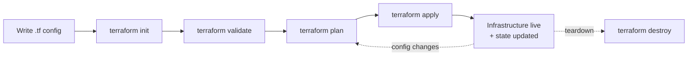

# Domain 3 — Core Terraform Workflow

*Official exam objectives covered: 3a (Describe the workflow), 3b (Initialize), 3c (Validate), 3d (Generate/review a plan), 3e (Apply changes), 3f (Destroy), 3g (Formatting/style)*
*Course lectures folded in: init/validate/plan/apply/destroy/fmt, Terraform Graph, Saving Terraform Plan to File, Terraform Output, Terraform Settings, Load Order & Semantics, Resource Targeting, Dealing with Larger Infrastructure, Comments, Tainting Resources, Terraform Troubleshooting Model, Reporting Terraform Bugs*

---

## 1. The Terraform Workflow, End to End (Objective 3a)



Every Terraform project, from a single EC2 instance to a 500-resource enterprise platform, goes through this exact same loop. Understanding *why* each step exists (not just its name) is what the exam actually tests — so each gets its own section below with multiple examples.

### What if you skip steps (e.g., go straight from writing code to `apply`, with no `plan` review)?
Technically `apply` runs its own internal plan and asks for confirmation, so you're never *fully* blind — but a habit of skipping deliberate `plan` review means you're reading the diff for the first time in the same breath as approving it, under time pressure, in a terminal that might scroll past something important. Every real production incident caused by "an unexpected Terraform apply" traces back to not slowing down at the `plan` step.

---

## 2. `terraform init` (Objective 3b)

### What it does
1. Downloads provider plugins listed in `required_providers` (into `.terraform/providers/`).
2. Downloads/initializes any modules referenced by `module` blocks (into `.terraform/modules/`).
3. Configures the backend (where state will be stored — local by default, or remote if a `backend` block exists).
4. Writes/updates `.terraform.lock.hcl` with exact resolved provider versions.

```bash
terraform init
```

**Example 1 — first run in a brand-new project:**
```
Initializing the backend...
Initializing provider plugins...
- Finding hashicorp/aws versions matching "~> 5.0"...
- Installing hashicorp/aws v5.31.0...
Terraform has been successfully initialized!
```

**Example 2 — re-running after adding a new provider to the config:**
```hcl
# added to required_providers
random = { source = "hashicorp/random", version = "~> 3.6" }
```
```bash
terraform init
# Initializing provider plugins...
# - Installing hashicorp/random v3.6.0...
```
`init` is **safe to re-run** any time — it's idempotent and only does work if something's actually missing or changed (new provider, new module, changed backend config).

### What if you skip `init` (or delete `.terraform/` and try to `plan` directly)?
```
Error: Could not load plugin
...
provider registry.terraform.io/hashicorp/aws: no available releases match...
```
Every other command depends on the providers/modules `init` sets up — there is no working around it, by design. This is a genuinely required first step, not a formality.

### Real-World Scenario 1 — CI Pipeline Caching
A CI pipeline that runs `terraform init` fresh on every build wastes minutes redownloading the same provider binaries every single run. Teams cache the `.terraform` directory (keyed on the lock file's hash) between CI runs specifically to skip redundant provider downloads — a very common real-world optimization once Terraform-in-CI scales past a handful of daily runs.

### Real-World Scenario 2 — Backend Migration Prompt
A team changes their `backend "s3" {}` configuration (e.g., pointing at a new bucket after a security review). Running `terraform init` afterward doesn't just silently swap it — it detects the backend config changed and interactively asks "Do you want to migrate existing state to the new backend?" This is `init`'s safety mechanism preventing an accidental, silent loss of state history.

---

## 3. `terraform validate` (Objective 3c)

### What it does — and, just as importantly, what it does NOT do
```bash
terraform validate
```
Checks HCL syntax and internal logical consistency (correct argument types, required arguments present, valid references) — entirely **offline**, with no AWS API calls and no credentials required.

**Example 1 — a real validate failure (missing required argument):**
```hcl
resource "aws_instance" "web" {
  instance_type = "t3.micro"
  # missing required "ami" argument
}
```
```
Error: Missing required argument
  on main.tf line 1, in resource "aws_instance" "web":
The argument "ami" is required, but no definition was found.
```

**Example 2 — what `validate` will NOT catch:**
```hcl
resource "aws_instance" "web" {
  ami           = "ami-doesnotexist12345"   # syntactically valid string, but this AMI doesn't exist
  instance_type = "t3.micro"
}
```
`terraform validate` passes cleanly here — the string is a syntactically valid AMI ID shape. Only `terraform plan` (which *does* call the AWS API) discovers the AMI doesn't actually exist.

### What if you rely on `validate` alone and skip `plan` before applying?
You'll catch syntax mistakes but sail straight past anything that requires real-world knowledge — a wrong AMI ID, a CIDR block that overlaps an existing VPC, insufficient IAM permissions. `validate` is a fast, cheap **first** gate (and excellent in CI, since it needs no cloud credentials) — never a substitute for reviewing a real `plan`.

---

## 4. `terraform plan` (Objective 3d)

### What it does
Computes the difference between desired state (config), last-known state, and (by default) freshly-refreshed real infrastructure — then prints a human-readable diff **without changing anything**.

```bash
terraform plan
```
**Example — reading the plan symbols:**
```
  # aws_instance.web will be updated in-place
  ~ resource "aws_instance" "web" {
        id            = "i-0abc123"
      ~ instance_type = "t3.micro" -> "t3.small"
    }

  # aws_security_group.new_sg will be created
  + resource "aws_security_group" "new_sg" {
      + id = (known after apply)
    }

  # aws_eip.old_ip will be destroyed
  - resource "aws_eip" "old_ip" {
      - id = "eipalloc-0xyz" -> null
    }

Plan: 1 to add, 1 to change, 1 to destroy.
```
| Symbol | Meaning |
|---|---|
| `+` | Create |
| `-` | Destroy |
| `~` | Update in place |
| `-/+` | Destroy and recreate (replacement — the resource can't be updated in place, e.g., changing an EC2 instance's AMI) |

### Saving a plan to a file (the production-safe pattern)
```bash
terraform plan -out=tfplan
terraform apply tfplan
```
**Why this matters:** a bare `terraform apply` re-computes its own plan fresh, immediately before applying. If reality changed between when *you* reviewed a plan and when you actually hit "yes," you could be applying something different from what you approved. Saving to a file and applying that *exact* file closes that gap — and it's how CI/CD pipelines with a manual approval gate are built (someone reviews the saved plan's output; a separate `apply` step, possibly hours later, applies precisely that file).

`terraform show tfplan` re-displays a saved plan later (`-json` for machine-readable tooling, e.g., a policy-as-code check reading the plan programmatically).

### What if you never save plans, and always `apply` fresh?
For a solo developer on a low-stakes project, this is fine. For a team modifying shared production infrastructure, it means every `apply` re-diffs against a target that could have moved since your last look — you lose the guarantee that "what I reviewed is what gets applied."

### Real-World Scenario 1 — A Race Between Two Applies
Engineer A runs `terraform plan`, reviews it, steps away to grab coffee, and comes back to run `apply` without re-checking. In the meantime, Engineer B applied an unrelated change to the same state. Because A ran a bare `apply` (no saved plan file), Terraform recomputes the plan at apply-time and picks up B's changes into the diff too — potentially surprising A with unrelated modifications bundled into what they thought they'd already reviewed. Using `-out=tfplan` and applying that exact file would have made A's apply fail loudly (stale plan) instead of silently absorbing B's change.

### Real-World Scenario 2 — Policy Gate Reading a Plan
A compliance team wants to block any `apply` that would create a publicly-readable S3 bucket, across dozens of Terraform projects. Using `terraform plan -out=tfplan && terraform show -json tfplan`, a CI script parses the JSON plan output and scans for any `aws_s3_bucket` resource with a public ACL — failing the pipeline before `apply` ever runs, entirely without needing HCP Terraform/Sentinel (though Sentinel, Domain 8, automates this exact pattern natively).

---

## 5. `terraform apply` (Objective 3e)

```bash
terraform apply                 # computes its own plan, asks for confirmation
terraform apply -auto-approve   # skips confirmation - use ONLY in trusted CI pipelines
terraform apply tfplan          # applies a previously-saved, already-reviewed plan
```
**What if you use `-auto-approve` in a human's everyday workflow (not CI)?** You lose the one remaining safety check standing between "I typed a command" and "real infrastructure changed." Reserve `-auto-approve` for automated pipelines where the *plan* was already reviewed by a human at an earlier gate — never as a shortcut to skip thinking about a change.

---

## 6. `terraform destroy` (Objective 3f)

```bash
terraform destroy                              # tears down everything tracked in state
terraform destroy -target=aws_instance.web     # tears down only this resource (+ dependents)
```
Reads the state file, computes the reverse-dependency order, and issues delete calls.

**What if you use `-target` as your everyday way to do partial teardown?** HashiCorp explicitly documents `-target` as a break-glass tool for exceptional situations (recovering from a botched apply, isolating a debug session) — not a routine workflow. Habitually targeting specific resources for destroy means other pending changes in the rest of the config go unnoticed and unapplied, creating silent drift between your code and reality that surfaces confusingly later.

### `destroy`'s confirmation prompt, and what actually happens when `prevent_destroy` is in the way
Like `apply`, a bare `terraform destroy` computes its own plan first and shows exactly what will be deleted before asking `Do you really want to destroy all resources?` — read this the same way you'd read an apply plan, not as a rubber-stamp prompt to click through. If any resource in scope has `lifecycle { prevent_destroy = true }` (Domain 4c), the destroy **fails outright** for that resource with `Error: Instance cannot be destroyed` — Terraform refuses to proceed rather than silently skipping the protected resource and destroying everything else, so a `prevent_destroy`-guarded resource must have its lifecycle block explicitly removed (a deliberate, reviewable code change) before it can ever be torn down.

### Real-World Scenario 1 — Nightly Cost Savings
A company destroys its entire QA environment every night (`terraform destroy` against the QA workspace) and recreates it every morning (`terraform apply`), specifically to avoid paying for idle EC2/RDS resources overnight. This only works safely because the *whole* environment is defined in Terraform — nothing is "hand-added" outside of it that would be silently lost on destroy.

### Real-World Scenario 2 — Destroying Against the Wrong Workspace
An engineer means to tear down a personal `dev` sandbox but forgets they left their terminal on the `staging` workspace from an earlier debugging session (`terraform workspace show` would have revealed this, but they didn't check). `terraform destroy` computes its plan against `staging`'s state and lists every staging resource for deletion. Because the plan output is shown before the confirmation prompt, the engineer notices resources they don't recognize as "theirs" and aborts — but only because they actually read the plan instead of typing `yes` on reflex. This is the concrete, everyday reason the destroy confirmation prompt (and workspace-aware backend naming, Domain 6) exists: the tool gives you one last chance to notice you're pointed at the wrong target before anything real is deleted.

---

## 7. `terraform fmt` (Objective 3g)

```bash
terraform fmt              # rewrites files to canonical style (indentation/alignment) in place
terraform fmt -check       # CI-friendly: exits non-zero if formatting is needed, without rewriting
terraform fmt -recursive   # format every .tf file in subdirectories too
```
**Example — before and after:**
```hcl
# before
resource "aws_instance" "web" {
ami = "ami-0e35ddab05955cf57"
    instance_type="t3.micro"
}
```
```hcl
# after `terraform fmt`
resource "aws_instance" "web" {
  ami           = "ami-0e35ddab05955cf57"
  instance_type = "t3.micro"
}
```
**What if you skip `fmt` and every teammate uses their own indentation style?** Every pull request becomes noisy with whitespace-only diffs mixed into real changes, making actual logic changes harder to review. `terraform fmt -check` as a CI gate (failing a PR that isn't formatted) is the standard fix — cheap to add, permanently removes an entire category of review noise.

---

## 8. Supporting Workflow Commands & Concepts

### `terraform graph`
```bash
terraform graph | dot -Tsvg > graph.svg   # requires Graphviz's `dot`
```
Emits the internal dependency graph in DOT format. **Use case:** a 100+ resource config applies in an order you don't expect — visualizing the graph shows exactly which reference is forcing that ordering, faster than reading through every resource block manually.

### `terraform output`
```bash
terraform output                    # all outputs
terraform output instance_public_ip # one specific output
terraform output -json              # machine-readable, for scripting/CI
```

### The `terraform {}` Settings Block
```hcl
terraform {
  required_version = ">= 1.7.0"     # pins the Terraform CLI itself
  required_providers {
    aws = { source = "hashicorp/aws", version = "~> 5.0" }
  }
  backend "s3" { ... }              # full detail in Domain 6
}
```
`required_version` guards against a teammate running an incompatible **Terraform CLI** version — a separate concern from `required_providers`, which pins the **plugin** version.

### Load Order & Semantics
Terraform loads **every** `.tf` file in a directory as if it were one combined file — `main.tf`/`variables.tf`/`outputs.tf` naming is a human convention Terraform itself ignores. Declaration order (inside or across files) doesn't matter either; Terraform builds its execution order purely from the dependency graph (attribute references), never from top-to-bottom read order. The one real exception is `.tfvars` file load order, which *does* matter for variable value precedence (Domain 4a).

### Resource Targeting
```bash
terraform plan -target=aws_instance.web
terraform apply -target=module.vpc
```
Restricts an operation to one resource/module plus its dependencies. Same break-glass caveat as `destroy -target` above — a debugging/recovery tool, not a routine workflow habit.

### Dealing with Larger Infrastructure
As a config grows past what one team can safely reason about in a single `plan`, the real fixes are: split into **modules** by concern (Domain 5), split **state** per environment/project (Domain 6/7's `terraform_remote_state`), and use `-target` only as a temporary escape hatch — never as the primary scaling strategy.

### Tainting Resources
```bash
terraform apply -replace="aws_instance.web"   # modern syntax
terraform taint aws_instance.web              # legacy standalone command, still exam-tested
```
Forces destroy + recreate on the next apply with **no config change** — useful when a resource is "broken" in a way Terraform's normal diff can't detect (a corrupted instance, failed boot).

### Comments
```hcl
# preferred single-line style
// also valid
/* block
   comment */
```
No functional difference; `#` is HashiCorp's style convention (and what `terraform fmt`-adjacent tooling/generators default to). `fmt` normalizes whitespace/alignment, not comment style — it will not rewrite `//` to `#` for you.

**What if a team mixes all three styles inconsistently?** Nothing breaks functionally — but a mixed style is a small, constant tax on code review (is `//` here a stylistic choice or a leftover from a generated/copy-pasted block?) and is exactly the kind of thing worth putting in a one-line team convention doc rather than re-litigating in every PR. A common real convention: `#` for genuinely hand-written comments, `//`/`/* */` reserved for anything emitted by a code generator (so a quick `grep` can distinguish "a human wrote this note" from "a tool produced this").

### Terraform Troubleshooting Model
A methodical order, not a single command: (1) read the full error message — it usually names the exact resource/argument; (2) run `terraform validate` to rule out syntax issues; (3) check provider version pinning; (4) escalate to `TF_LOG` verbose logging (Domain 7) if still opaque; (5) only then consider it a genuine provider bug.

**Worked example:** `terraform apply` fails with `Error: creating EC2 Instance: UnauthorizedOperation`. Step 1 (read the message) already tells you this isn't a syntax problem — it's an AWS authorization failure. Step 2 (`validate`) would pass cleanly, confirming the config itself is fine. Step 3 (provider pinning) is irrelevant here — the error is about IAM, not a provider version mismatch. The actual fix is checking the IAM policy attached to whatever identity is running Terraform, not digging through TF_LOG output or filing a provider bug — recognizing *which* step in the model actually applies to a given error, rather than mechanically running through all five every time, is the real skill being tested.

**What if you skip straight to `TF_LOG` verbose logging for every error, including simple ones?** You'll drown a five-second fix (a missing required argument, an obvious IAM message) in megabytes of trace output that took longer to read than the error message itself would have. Reserve `TF_LOG` for genuinely opaque failures — provider-internal errors with no clear resource/argument named, or behavior that contradicts what the plan predicted.

### Reporting Terraform Bugs
Confirmed bugs almost always belong on the **provider's** own GitHub repo (e.g., `hashicorp/terraform-provider-aws/issues`), not Terraform Core's — unless the bug is in HCL parsing or state handling itself. Include Terraform version, provider version, a minimal reproducing config, and relevant log output.

**What if you report a provider-specific bug to the wrong repository** (Terraform Core instead of `terraform-provider-aws`)? At best it sits untriaged until someone notices and redirects it; at worst it's closed as "wrong repo" with no further action, and the actual maintainers who could fix it never see it. Since Core and each provider are separately maintained projects (Section 1 of this file), knowing which one owns your specific symptom is part of getting a bug looked at at all, not just a formality.

---

## 9. Practice Questions

### Easy
1. Which command must succeed before `plan` or `apply` will work in a brand-new directory?
2. Does `terraform validate` make any real API calls?
3. What symbol in a `plan` output means "destroy and recreate," as opposed to a simple in-place update?

### Medium
4. Write the two-command sequence that guarantees you apply the *exact* plan you reviewed, even if the real infrastructure changes in between.
5. A CI pipeline runs `terraform fmt -check` as a required gate. Explain what problem this specifically prevents in code review.
6. Explain why `terraform validate` can pass on a config referencing a nonexistent AMI ID, while `terraform plan` on the same config fails.

### Hard
7. Design a CI policy check using `terraform show -json` on a saved plan file that blocks any `apply` creating a publicly-readable S3 bucket — describe the pipeline steps in order.
8. A team habitually uses `terraform destroy -target=X` for routine cleanup instead of maintaining properly scoped configs. Describe two concrete ways this creates silent drift, and what happens when a later, untargeted `apply` runs against the same config.

---
**Next:** [04-domain4a-resources-variables-types.md](04-domain4a-resources-variables-types.md)
