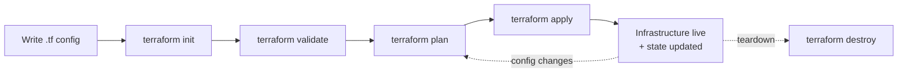
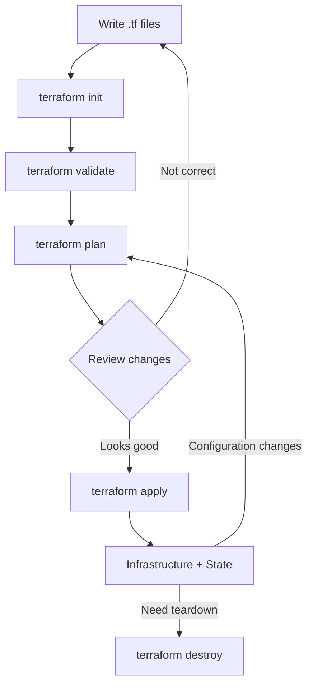

# Domain 3 — Core Terraform Workflow

## 1. Terraform Workflow

The basic Terraform workflow is:



### What each command does

| Command              | Purpose                          |
| -------------------- | -------------------------------- |
| `terraform init`     | Prepare the working directory    |
| `terraform validate` | Check configuration syntax/logic |
| `terraform plan`     | Show what Terraform will change  |
| `terraform apply`    | Actually make the changes        |
| `terraform destroy`  | Delete managed infrastructure    |
| `terraform fmt`      | Format Terraform code            |

### Easy way to remember

**Init → Validate → Plan → Apply**

* **Init** → "Get Terraform ready"
* **Validate** → "Is my code valid?"
* **Plan** → "What will change?"
* **Apply** → "Make the change"

---

# 2. `terraform init`

```bash
terraform init
```

### What it does

`init` prepares a Terraform project for use.

It:

* Downloads required **providers**
* Downloads required **modules**
* Initializes/configures the **backend**
* Creates/updates `.terraform.lock.hcl`

For example:

```hcl
terraform {
  required_providers {
    aws = {
      source  = "hashicorp/aws"
      version = "~> 5.0"
    }
  }
}
```

Running:

```bash
terraform init
```

downloads the required AWS provider.

### Important

`terraform init` **does NOT create infrastructure**.

It only prepares Terraform.

### Can you run `init` multiple times?

Yes.

```bash
terraform init
```

is safe to run again.

For example, if you add:

```hcl
random = {
  source  = "hashicorp/random"
}
```

run `terraform init` again so Terraform downloads the new provider.

### Exam takeaway

> **`terraform init` = initialize the working directory and download dependencies.**

---

# 3. `terraform validate`

```bash
terraform validate
```

### What it checks

It checks whether your Terraform configuration is structurally valid:

* HCL syntax
* Required arguments
* Correct argument types
* Valid references
* Internal configuration consistency

Example:

```hcl
resource "aws_instance" "web" {
  instance_type = "t3.micro"
}
```

If `ami` is required and missing, `validate` catches it.

### What `validate` does NOT do

It does **not** check whether the real AWS infrastructure is valid.

For example:

```hcl
resource "aws_instance" "web" {
  ami           = "ami-doesnotexist12345"
  instance_type = "t3.micro"
}
```

The configuration can be syntactically valid.

So:

```bash
terraform validate
```

may pass.

But:

```bash
terraform plan
```

can discover that the AMI doesn't exist.

### Key difference

**Validate:**

> "Is my Terraform code valid?"

**Plan:**

> "Can this configuration actually work against the real infrastructure?"

### Exam takeaway

> `terraform validate` does **not** make cloud API calls.

---

# 4. `terraform plan`

```bash
terraform plan
```

This is one of the **most important Terraform commands**.

It shows what Terraform intends to change **without actually making the changes**.

Example:

```hcl
resource "aws_instance" "web" {
  ami           = "ami-123"
  instance_type = "t3.small"
}
```

Suppose the existing instance is:

```text
t3.micro
```

Terraform may show:

```text
~ resource "aws_instance" "web" {
    ~ instance_type = "t3.micro" -> "t3.small"
}
```

### Plan symbols

| Symbol | Meaning              |
| ------ | -------------------- |
| `+`    | Create               |
| `-`    | Destroy              |
| `~`    | Update in-place      |
| `-/+`  | Destroy and recreate |

### Example

```text
+ aws_security_group.web
```

→ Create

```text
~ aws_instance.web
```

→ Modify existing resource

```text
- aws_eip.old
```

→ Delete

```text
-/+ aws_instance.web
```

→ Destroy old instance and create a new one

### Why `-/+` matters

Some changes cannot be performed in-place.

For example, changing certain immutable properties may require:

```text
Destroy old resource
        ↓
Create new resource
```

---

## Save a plan to a file

You can save the exact plan:

```bash
terraform plan -out=tfplan
```

Then apply it:

```bash
terraform apply tfplan
```

This is especially useful in **CI/CD**.

### Why?

Without a saved plan:

```bash
terraform plan
```

then later:

```bash
terraform apply
```

`apply` calculates a **new plan**.

But:

```bash
terraform plan -out=tfplan
terraform apply tfplan
```

means:

> Review this plan → apply this exact plan.

### View saved plan

```bash
terraform show tfplan
```

For machine-readable output:

```bash
terraform show -json tfplan
```

### Exam takeaway

> `terraform plan` shows proposed changes but does not change infrastructure.

> `terraform plan -out=tfplan` + `terraform apply tfplan` applies the exact saved plan.

---

# 5. `terraform apply`

```bash
terraform apply
```

This actually creates/updates infrastructure.

Typical workflow:

```bash
terraform plan
terraform apply
```

Or simply:

```bash
terraform apply
```

Terraform will generate a plan and ask for confirmation.

### `-auto-approve`

```bash
terraform apply -auto-approve
```

Skips the confirmation.

Commonly used in automated CI/CD pipelines.

### Applying a saved plan

```bash
terraform apply tfplan
```

Applies the previously saved plan.

### Remember

```text
plan  → tells you what will happen
apply → actually does it
```

---

# 6. `terraform destroy`

```bash
terraform destroy
```

Deletes the infrastructure managed by Terraform.

Example:

```text
EC2
Security Group
EBS
Elastic IP
```

Terraform determines the correct dependency order and deletes them.

### Important

`destroy` normally shows a plan first and asks for confirmation.

This is important because you get a chance to notice:

> "Wait, this is deleting my production resources!"

### Targeting a resource

```bash
terraform destroy -target=aws_instance.web
```

This focuses the operation on that resource and its dependencies.

⚠️ **Don't use `-target` as your normal workflow.**

It's mainly useful for exceptional/debugging/recovery situations.

### `prevent_destroy`

If a resource has:

```hcl
lifecycle {
  prevent_destroy = true
}
```

Terraform will refuse to destroy it.

---

# 7. `terraform fmt`

Terraform provides a standard formatting command:

```bash
terraform fmt
```

Example:

### Before

```hcl
resource "aws_instance" "web" {
ami = "ami-123"
instance_type="t3.micro"
}
```

### After

```hcl
resource "aws_instance" "web" {
  ami           = "ami-123"
  instance_type = "t3.micro"
}
```

### Useful options

```bash
terraform fmt
```

Format files.

```bash
terraform fmt -recursive
```

Format `.tf` files in subdirectories too.

```bash
terraform fmt -check
```

Check formatting without modifying files.

Very useful in CI:

```text
Pull Request
     ↓
terraform fmt -check
     ↓
Fail if formatting is incorrect
```

### Exam takeaway

> `terraform fmt` = automatically formats Terraform configuration.

---

# 8. `terraform graph`

```bash
terraform graph
```

Shows Terraform's **dependency graph**.

For example:

```text
VPC
 ↓
Subnet
 ↓
EC2
 ↓
Application
```

Terraform uses dependencies to determine the correct order of operations.

You can generate a visual graph with Graphviz:

```bash
terraform graph | dot -Tsvg > graph.svg
```

### Exam idea

Terraform does **not** simply execute resources from top to bottom.

It uses the **dependency graph**.

---

# 9. `terraform output`

If you define:

```hcl
output "instance_public_ip" {
  value = aws_instance.web.public_ip
}
```

You can retrieve it:

```bash
terraform output
```

Get one output:

```bash
terraform output instance_public_ip
```

Machine-readable:

```bash
terraform output -json
```

### Remember

> `terraform output` reads values defined in Terraform `output` blocks.

---

# 10. `terraform {}` Settings Block

The `terraform {}` block controls Terraform-level settings.

Example:

```hcl
terraform {
  required_version = ">= 1.7.0"

  required_providers {
    aws = {
      source  = "hashicorp/aws"
      version = "~> 5.0"
    }
  }

  backend "s3" {
    # backend configuration
  }
}
```

### Important distinction

There are **two different version constraints** here:

```hcl
required_version = ">= 1.7.0"
```

→ Terraform **CLI version**

Whereas:

```hcl
required_providers {
  aws = {
    version = "~> 5.0"
  }
}
```

→ AWS **provider version**

### Exam trap

**Terraform version ≠ Provider version**

---

# 11. How Terraform Loads `.tf` Files

Suppose your directory contains:

```text
main.tf
variables.tf
outputs.tf
network.tf
security.tf
```

Terraform effectively treats them as **one configuration**.

You don't need to worry about:

```text
main.tf executes first
variables.tf executes second
...
```

That's not how Terraform works.

Terraform looks at the **dependency graph**.

### Example

Even if this appears in `security.tf`:

```hcl
resource "aws_security_group" "web" {
  ...
}
```

and this appears in `main.tf`:

```hcl
resource "aws_instance" "web" {
  vpc_security_group_ids = [
    aws_security_group.web.id
  ]
}
```

Terraform understands:

```text
Security Group
      ↓
     EC2
```

because of the reference:

```hcl
aws_security_group.web.id
```

### Exam takeaway

> Terraform loads all `.tf` files in the directory together. File names and declaration order don't determine execution order.

---

# 12. Resource Targeting

You can target a specific resource:

```bash
terraform plan -target=aws_instance.web
```

or:

```bash
terraform apply -target=module.vpc
```

This tells Terraform:

> Focus this operation on this resource/module and its dependencies.

### Important

`-target` is **not recommended for normal workflows**.

Use it mainly for:

* Debugging
* Recovery
* Exceptional situations

Don't use:

```bash
terraform apply -target=...
```

as your normal way of managing infrastructure.

---

# 13. Larger Infrastructure

As infrastructure becomes larger, don't solve complexity by constantly using:

```bash
-target
```

Instead:

### Use modules

```text
Terraform
   │
   ├── VPC module
   ├── EKS module
   ├── Database module
   └── Monitoring module
```

### Split state appropriately

For example:

```text
dev state
staging state
prod state
```

This keeps plans smaller and reduces the blast radius.

### Remember

> **Modules + properly scoped state** are the normal scaling strategy.

`-target` is the emergency tool.

---

# 14. Replacing a Resource

Sometimes Terraform needs to recreate a resource even though the configuration hasn't changed.

Modern command:

```bash
terraform apply -replace="aws_instance.web"
```

This forces:

```text
Destroy
   ↓
Create
```

for that resource.

### Example use case

An EC2 instance is corrupted or behaving incorrectly, but Terraform sees no configuration difference.

You can force replacement:

```bash
terraform apply -replace="aws_instance.web"
```

### Older command

You may also see:

```bash
terraform taint aws_instance.web
```

This is the **legacy** approach.

For exam purposes, know that `taint` forces a resource to be recreated, but the modern approach is:

```bash
terraform apply -replace="..."
```

---

# 15. Terraform Comments

Terraform supports:

### Single-line

```hcl
# This creates the web server
```

Also:

```hcl
// This creates the web server
```

### Multi-line

```hcl
/*
  This is a
  multi-line comment
*/
```

For normal Terraform style, `#` is commonly preferred.

Comments don't affect Terraform execution.

---

# 16. Terraform Troubleshooting

When Terraform fails, don't immediately jump to complicated debugging.

Use a simple approach:

### Step 1 — Read the error

Terraform often tells you exactly what went wrong.

### Step 2 — Check configuration

```bash
terraform validate
```

### Step 3 — Check provider/version issues

Look at:

```text
required_providers
.terraform.lock.hcl
```

### Step 4 — Use verbose logging if necessary

```bash
TF_LOG=DEBUG terraform apply
```

Only use this when the normal error message isn't enough.

### Example

If you get:

```text
Error: UnauthorizedOperation
```

on EC2 creation, the likely issue is:

```text
IAM permissions
```

Not:

```text
Terraform syntax
```

So don't waste time debugging HCL if the error clearly indicates AWS authorization.

---

# 17. Reporting Terraform Bugs

If you confirm a provider-specific bug, report it to the **provider's repository**, not automatically to Terraform Core.

For example:

```text
Terraform Core
      │
      └── Terraform/provider logic

AWS Provider
      │
      └── AWS-specific functionality
```

### When reporting a bug, provide:

* Terraform version
* Provider version
* Minimal Terraform configuration reproducing the problem
* Relevant error/log output

### Exam idea

> Know whether the problem belongs to Terraform Core or a provider.

---

# 18. Commands You Should Know for the Exam

| Command                         | What to remember                               |
| ------------------------------- | ---------------------------------------------- |
| `terraform init`                | Initialize project, download providers/modules |
| `terraform validate`            | Validate configuration                         |
| `terraform plan`                | Preview changes                                |
| `terraform plan -out=tfplan`    | Save exact plan                                |
| `terraform show tfplan`         | Display saved plan                             |
| `terraform apply`               | Apply changes                                  |
| `terraform apply tfplan`        | Apply saved plan                               |
| `terraform apply -auto-approve` | Apply without confirmation                     |
| `terraform destroy`             | Destroy managed infrastructure                 |
| `terraform fmt`                 | Format configuration                           |
| `terraform fmt -check`          | Check formatting                               |
| `terraform graph`               | Show dependency graph                          |
| `terraform output`              | Display outputs                                |
| `terraform apply -replace=...`  | Force resource replacement                     |
| `terraform taint`               | Legacy way to mark resource for replacement    |
| `terraform plan -target=...`    | Target resource/module — exceptional use       |

---

# 19. Most Important Exam Concepts

### `init`

> **Prepare Terraform**

Downloads providers/modules, initializes backend, handles lock file.

### `validate`

> **Is my Terraform configuration valid?**

No real infrastructure/API validation.

### `plan`

> **What is Terraform going to change?**

Doesn't modify infrastructure.

### `apply`

> **Make the changes**

Creates/updates infrastructure.

### `destroy`

> **Delete managed infrastructure**

Shows a destruction plan and asks for confirmation.

### `fmt`

> **Format Terraform code**

---

# 20. One Mental Model for Domain 3



## Final memory trick

**`init` → Prepare**

**`validate` → Check code**

**`plan` → Preview**

**`apply` → Create/change**

**`destroy` → Delete**

**`fmt` → Format**

And the **big exam distinction**:

> **`validate` checks Terraform configuration. `plan` checks the proposed real-world changes. `apply` actually changes infrastructure.** 
