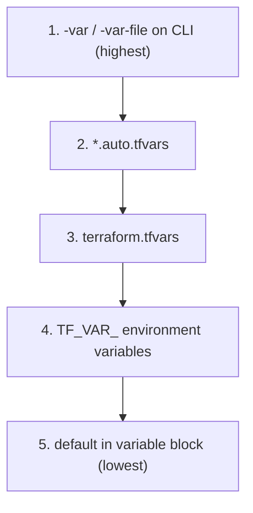
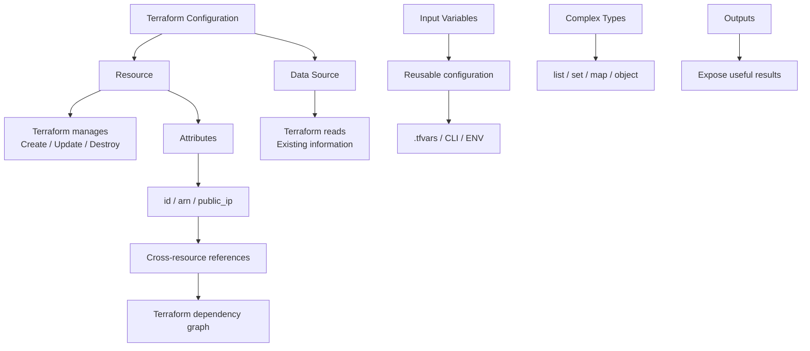

# Domain 4 (Part A) — Resources, Data Sources, Attributes, Variables, Outputs & Complex Types

## What this domain covers

This part focuses on four important Terraform concepts:

1. **Resource vs Data blocks**
2. **Attributes and cross-resource references**
3. **Variables and Outputs**
4. **Complex data types**

These are heavily connected. A common Terraform flow is:

**Data → Resource → Attribute → Output**

while **Variables** provide reusable inputs to the configuration.

---

# 1. `resource` vs `data` Blocks

## 1.1 What is a `resource`?

A `resource` block tells Terraform:

> **"Terraform should manage this infrastructure."**

Terraform can:

* Create it
* Update it
* Destroy it
* Track it in the state file

Example:

```hcl
resource "aws_security_group" "web_sg" {
  name   = "web-sg"
  vpc_id = data.aws_vpc.existing.id
}
```

Here Terraform owns the security group.

If you run:

```bash
terraform destroy
```

Terraform will attempt to delete this security group.

---

## 1.2 What is a `data` block?

A `data` block tells Terraform:

> **"This infrastructure already exists. Just give me information about it."**

Terraform does **not** manage the lifecycle of the object represented by a data source.

It does not:

* Create it
* Update it
* Destroy it

Example:

```hcl
data "aws_vpc" "existing" {
  filter {
    name   = "tag:Name"
    values = ["shared-vpc"]
  }
}
```

Then another resource can use:

```hcl
vpc_id = data.aws_vpc.existing.id
```

### Important distinction

|                                | `resource`                    | `data`                         |
| ------------------------------ | ----------------------------- | ------------------------------ |
| Creates infrastructure?        | Yes                           | No                             |
| Updates infrastructure?        | Yes                           | No                             |
| Destroys infrastructure?       | Yes                           | No                             |
| Reads existing infrastructure? | Yes                           | Yes                            |
| Managed by Terraform?          | Yes                           | No — read-only                 |
| Typical use                    | Infrastructure Terraform owns | Existing/shared infrastructure |

### Exam memory

> **Resource = Terraform manages it**
> **Data = Terraform reads it**

---

# 2. Why Do We Need Both?

Imagine your company has a central networking team.

They created:

* VPC
* Subnets
* NAT Gateways
* Route tables

Your application team needs to deploy EC2 instances inside that VPC.

Should your application Terraform configuration create the VPC again?

**No.**

The networking team owns it.

Instead:

```hcl
data "aws_vpc" "shared" {
  filter {
    name   = "tag:Name"
    values = ["shared-vpc"]
  }
}
```

Then:

```hcl
resource "aws_security_group" "app_sg" {
  name   = "app-sg"
  vpc_id = data.aws_vpc.shared.id
}
```

The application project can **use** the VPC without **owning** it.

### Why this matters

If the VPC were incorrectly defined as a `resource` in the application project:

```hcl
resource "aws_vpc" "shared" {
  ...
}
```

then:

```bash
terraform destroy
```

would consider that VPC part of the application's managed infrastructure.

That creates a serious ownership problem.

### Mental model

> **`resource` = "This is mine; manage its lifecycle."**
> **`data` = "This exists elsewhere; give me its information."**

---

# 3. AWS Security Groups — Important Background

A Security Group (SG) is essentially a **virtual firewall** attached at the instance/ENI level.

## 3.1 Security Groups are stateful

If you allow inbound traffic:

```text
Client → EC2 : 80
```

the response traffic is automatically allowed back:

```text
EC2 : 80 → Client
```

You don't need to create a separate outbound rule just for the response.

This is because Security Groups are **stateful**.

### Compare with NACL

| Security Group                       | Network ACL                               |
| ------------------------------------ | ----------------------------------------- |
| Stateful                             | Stateless                                 |
| Instance/ENI level                   | Subnet level                              |
| Allow rules                          | Allow + Deny                              |
| Return traffic automatically allowed | Return traffic must be explicitly allowed |

For the exam, remember:

> **SG = stateful**
> **NACL = stateless**

---

# 4. Default Security Group Behavior

A new security group generally starts with:

* **Inbound:** Deny by default
* **Outbound:** Allow by default

Security Groups are also **allow-only**.

There is no explicit:

```text
deny TCP 22
```

rule in a Security Group.

If you don't want traffic, you simply don't create an allow rule for it.

---

# 5. Security Group Example

```hcl
resource "aws_security_group" "web_sg" {
  name   = "web-sg"
  vpc_id = aws_vpc.main.id
}
```

Then add rules:

```hcl
resource "aws_vpc_security_group_ingress_rule" "ssh" {
  security_group_id = aws_security_group.web_sg.id

  cidr_ipv4   = "203.0.113.0/24"
  from_port   = 22
  to_port     = 22
  ip_protocol = "tcp"
}
```

And HTTP:

```hcl
resource "aws_vpc_security_group_ingress_rule" "http" {
  security_group_id = aws_security_group.web_sg.id

  cidr_ipv4   = "0.0.0.0/0"
  from_port   = 80
  to_port     = 80
  ip_protocol = "tcp"
}
```

### Security lesson

Opening HTTP to the internet:

```text
0.0.0.0/0 → TCP 80
```

can be normal for a public web server.

But opening SSH:

```text
0.0.0.0/0 → TCP 22
```

is generally dangerous.

Prefer:

```text
Office/VPN CIDR → TCP 22
```

or an appropriate bastion/security-group-based design.

---

# 6. Security Groups Can Reference Other Security Groups

A Security Group doesn't have to use only IP/CIDR addresses.

You can use another Security Group as the source.

For example:

```text
Internet
   |
   v
Web SG
   |
   v
App SG
   |
   v
Database SG
```

The database can allow traffic only from the application Security Group.

Conceptually:

```text
App SG → Database SG : 5432
```

This is preferable to saying:

```text
10.0.0.0/16 → Database : 5432
```

when the actual requirement is:

> "Only application servers should reach the database."

---

# 7. Resource + Data Together

This pattern is extremely important.

Suppose the VPC already exists.

Read it:

```hcl
data "aws_vpc" "shared" {
  filter {
    name   = "tag:Name"
    values = ["shared-vpc"]
  }
}
```

Find its subnets:

```hcl
data "aws_subnets" "shared_public" {
  filter {
    name   = "vpc-id"
    values = [data.aws_vpc.shared.id]
  }
}
```

Then create your own resource inside that VPC:

```hcl
resource "aws_security_group" "app_sg" {
  name   = "app-sg"
  vpc_id = data.aws_vpc.shared.id
}
```

Notice the ownership:

```text
Existing VPC
     |
     | data
     v
Application Terraform
     |
     | resource
     v
Application Security Group
```

Terraform manages the Security Group, but only reads the VPC.

---

# 8. Data Sources for Dynamic AMI Selection

A very common Terraform pattern is finding an AMI dynamically rather than hardcoding an AMI ID.

```hcl
data "aws_ami" "amazon_linux" {
  most_recent = true
  owners      = ["amazon"]

  filter {
    name   = "name"
    values = ["amzn2-ami-hvm-*-x86_64-gp2"]
  }
}
```

Then:

```hcl
resource "aws_instance" "web" {
  ami           = data.aws_ami.amazon_linux.id
  instance_type = "t3.micro"
}
```

The important part is:

```hcl
data.aws_ami.amazon_linux.id
```

Terraform asks AWS:

> "Find me the latest matching AMI."

Then the EC2 resource uses that result.

### Why is this better than hardcoding?

Instead of:

```hcl
ami = "ami-123456"
```

you can dynamically find the appropriate AMI.

This reduces maintenance when AMIs are rotated or replaced.

### Exam concept

A data source is useful when:

> **You need information about something that already exists.**

---

# 9. Provider Documentation and Resource Syntax

Terraform providers evolve.

You may encounter:

```hcl
resource "aws_security_group" "web_sg" {
  ingress {
    ...
  }
}
```

and newer configurations using separate resources such as:

```hcl
resource "aws_vpc_security_group_ingress_rule" "http" {
  ...
}
```

The important exam/real-world lesson is:

> **Check the Terraform Registry documentation for the provider version you're actually using.**

Don't blindly mix different resource-management styles.

The source notes specifically warn that mixing inline `ingress`/`egress` rules with separate per-rule resources for the same Security Group can cause conflicts.

---

# 10. Attributes

A resource has two broad categories of values:

### Arguments

These are values **you provide**.

Example:

```hcl
resource "aws_instance" "web" {
  ami           = "ami-123456"
  instance_type = "t3.micro"
}
```

You provide:

```text
ami
instance_type
```

### Attributes

These are values Terraform/provider can expose after the resource exists.

For example:

```text
id
arn
public_ip
private_ip
```

Example:

```hcl
output "instance_id" {
  value = aws_instance.web.id
}
```

You didn't manually set:

```hcl
id = "..."
```

AWS generates the instance ID.

Terraform receives it from AWS and stores it in state.

---

# 11. Example of Resource Attributes

```hcl
resource "aws_instance" "web" {
  ami           = "ami-0e35ddab05955cf57"
  instance_type = "t3.micro"
}
```

You can then access:

```hcl
aws_instance.web.id
```

or:

```hcl
aws_instance.web.arn
```

or:

```hcl
aws_instance.web.public_ip
```

depending on what the resource exposes.

### Mental model

```text
Resource
   |
   +-- arguments → values YOU provide
   |
   +-- attributes → values Terraform/provider gives you
```

---

# 12. Elastic IP (EIP)

An Elastic IP is a **static public IPv4 address**.

A normal EC2 public IP can change when an instance is stopped/started or replaced.

An EIP gives you a stable public address that can be moved between supported resources.

For example:

```text
Without EIP:
EC2 → Public IP A
       |
       | replacement
       v
     Public IP B

With EIP:
EIP → EC2
 |
 | instance replaced
 v
EIP → New EC2
```

The address remains stable.

---

# 13. Creating and Associating an EIP

Modern Terraform configurations can treat allocation and association separately:

```hcl
resource "aws_eip" "web_ip" {
  domain = "vpc"
}
```

This allocates the EIP.

Then:

```hcl
resource "aws_eip_association" "web_assoc" {
  instance_id   = aws_instance.web.id
  allocation_id = aws_eip.web_ip.id
}
```

This associates it with the EC2 instance.

### Important

An allocated but unused EIP can incur charges.

So don't allocate EIPs and leave them unattached unnecessarily.

---

# 14. Cross-Resource Attribute References

This is one of the **most important Terraform concepts**.

Suppose:

```hcl
resource "aws_instance" "web" {
  ami           = var.ami_id
  instance_type = "t3.micro"
}
```

Then:

```hcl
resource "aws_eip" "web_ip" {
  instance = aws_instance.web.id
  domain   = "vpc"
}
```

This:

```hcl
aws_instance.web.id
```

is a **cross-resource reference**.

Terraform understands:

```text
EC2 must exist
     ↓
EIP needs EC2 ID
     ↓
EIP can be associated
```

Therefore Terraform automatically builds an **implicit dependency**.

---

# 15. Why Attribute References Are Better Than Hardcoding

### Bad

```hcl
resource "aws_eip" "web_ip" {
  instance = "i-0abc123"
}
```

The ID is hardcoded.

If Terraform replaces the EC2 instance:

```text
Old instance → i-0abc123
New instance → i-0789xyz
```

the EIP configuration is still pointing at:

```text
i-0abc123
```

That's a problem.

### Good

```hcl
resource "aws_eip" "web_ip" {
  instance = aws_instance.web.id
}
```

Now Terraform automatically gets the **current** instance ID.

### Key benefit

The reference does two jobs:

1. Gives Terraform the required value.
2. Creates a dependency in Terraform's graph.

---

# 16. Cross-Resource Reference Chain

Consider:

```hcl
resource "aws_instance" "web" {
  ami           = data.aws_ami.amazon_linux.id
  instance_type = "t3.micro"
}
```

Then:

```hcl
resource "aws_eip" "web_ip" {
  instance = aws_instance.web.id
  domain   = "vpc"
}
```

Then:

```hcl
resource "aws_route53_record" "web_dns" {
  zone_id = data.aws_route53_zone.main.zone_id
  name    = "app.example.com"
  type    = "A"
  ttl     = 300

  records = [aws_eip.web_ip.public_ip]
}
```

Terraform sees:

```text
AMI
 ↓
EC2
 ↓
EIP
 ↓
DNS record
```

The dependency graph is created automatically from the references.

During destruction, Terraform reverses the required dependency order.

The source's three-resource example demonstrates exactly this chain.

---

# 17. Attribute Reference Mental Model

Think of:

```hcl
aws_instance.web.id
```

as:

```text
resource_type.resource_name.attribute
```

Example:

```hcl
aws_instance.web.public_ip
```

means:

```text
aws_instance
     ↓
web
     ↓
public_ip
```

For data sources:

```hcl
data.aws_vpc.shared.id
```

means:

```text
data
 ↓
aws_vpc
 ↓
shared
 ↓
id
```

---

# 18. Output Values

An **output** exposes a value produced by Terraform.

Example:

```hcl
output "instance_public_ip" {
  value       = aws_instance.web.public_ip
  description = "Public IP of the web server"
}
```

After:

```bash
terraform apply
```

Terraform can display:

```text
instance_public_ip = "54.x.x.x"
```

---

# 19. Why Outputs Are Useful

Outputs can be consumed by:

### 1. Humans

For example:

```text
What is the EC2 public IP?
```

Run:

```bash
terraform output
```

### 2. CI/CD pipelines

Example:

```hcl
output "alb_dns_name" {
  value = aws_lb.app.dns_name
}
```

Then:

```bash
DNS=$(terraform output -raw alb_dns_name)

curl -f "https://$DNS/healthz" || exit 1
```

### 3. Other Terraform configurations

Another Terraform project can consume outputs through mechanisms such as:

```text
terraform_remote_state
```

This is covered more deeply later.

### Mental model

> **Output = Terraform's public-facing result.**

---

# 20. Sensitive Outputs

You can mark an output as sensitive:

```hcl
output "db_password" {
  value     = aws_db_instance.main.password
  sensitive = true
}
```

This prevents the value from being displayed normally in CLI/log output.

### But remember

`sensitive = true` **does NOT encrypt the state file**.

The value can still exist in:

```text
terraform.tfstate
```

This is a major exam trap.

> **Sensitive = hide from display**
> **Sensitive ≠ encrypt state**

---

# 21. Input Variables

Variables make Terraform configurations reusable.

Without variables:

```hcl
resource "aws_instance" "web" {
  instance_type = "t3.micro"
}
```

Changing environments might require modifying the Terraform code itself.

With a variable:

```hcl
variable "instance_type" {
  type        = string
  description = "EC2 instance size"
  default     = "t3.micro"
}
```

Use it:

```hcl
resource "aws_instance" "web" {
  instance_type = var.instance_type
}
```

Now the same Terraform code can be used for:

```text
dev     → t3.micro
staging → t3.small
prod    → t3.large
```

without changing the resource definition.

---

# 22. Variable Declaration vs Variable Value

This distinction is important.

### Declaration

Usually:

```hcl
variable "instance_type" {
  type        = string
  description = "EC2 instance size"
}
```

This says:

> "Terraform has an input variable called `instance_type`."

### Value

Could come from:

```hcl
instance_type = "t3.small"
```

in a `.tfvars` file.

So:

```text
variable block
     ↓
declares the input

tfvars / CLI / ENV / default
     ↓
provides the value
```

---

# 23. `.tfvars` Files

A `.tfvars` file is used to provide variable values.

Example:

```hcl
# terraform.tfvars

ami_id        = "ami-0e35ddab05955cf57"
instance_type = "t3.small"
```

Terraform can automatically load:

```text
terraform.tfvars
```

and:

```text
*.auto.tfvars
```

This lets you keep the Terraform code generic while environment-specific values are supplied separately.

For example:

```text
main.tf

dev.tfvars
prod.tfvars
```

The same Terraform configuration can be used for both environments.

---

# 24. Ways to Assign Variable Values

Terraform supports several methods.

### 1. Default

```hcl
variable "instance_type" {
  default = "t3.micro"
}
```

### 2. `terraform.tfvars`

```hcl
instance_type = "t3.small"
```

### 3. `*.auto.tfvars`

Example:

```text
network.auto.tfvars
database.auto.tfvars
```

### 4. CLI `-var`

```bash
terraform apply -var="instance_type=t3.large"
```

### 5. CLI `-var-file`

```bash
terraform apply -var-file="prod.tfvars"
```

### 6. Environment variable

```bash
export TF_VAR_instance_type=t3.small
```

Terraform automatically recognizes:

```text
TF_VAR_<variable_name>
```

### 7. Interactive prompt

If Terraform still doesn't have a value and there is no default, it can ask you interactively.

This is generally undesirable in CI/CD because the pipeline can wait for input.

---

# 25. Variable Precedence — VERY IMPORTANT

For the assignment methods covered in these notes, remember this order:

```text
Highest priority
      ↓
1. -var / -var-file
      ↓
2. *.auto.tfvars
      ↓
3. terraform.tfvars
      ↓
4. TF_VAR_ environment variables
      ↓
5. default
      ↓
Lowest priority
```

Mermaid mental model:



### Exam example

Suppose:

```hcl
variable "env" {
  default = "dev"
}
```

Environment variable:

```bash
export TF_VAR_env=staging
```

`terraform.tfvars`:

```hcl
env = "prod"
```

And CLI:

```bash
terraform apply -var="env=canary"
```

Final value:

```text
canary
```

because CLI `-var` has the highest priority among these sources.

### Easy exam memory

> **CLI beats files, files beat environment variables, environment variables beat defaults.**

---

# 26. A Common Precedence Trap

Suppose:

```bash
export TF_VAR_environment=staging
```

and:

```hcl
# terraform.tfvars
environment = "dev"
```

Which wins?

**`terraform.tfvars` wins.**

Why?

```text
terraform.tfvars
     priority 3

TF_VAR_environment
     priority 4
```

Lower number = higher priority in our memorized list.

Don't assume:

> "Environment variables always override files."

They don't in this precedence sequence.

---

# 27. Complex Data Types

Terraform has primitive types:

```text
string
number
bool
```

and collection/structural types:

```text
list
set
map
object
```

The most important distinctions:

| Type     | Meaning                               |
| -------- | ------------------------------------- |
| `string` | Text                                  |
| `number` | Numeric value                         |
| `bool`   | true/false                            |
| `list`   | Ordered collection                    |
| `set`    | Unique, unordered collection          |
| `map`    | Key → value                           |
| `object` | Structured collection of named fields |

---

# 28. `list`

A list is:

> **Ordered and allows duplicates.**

Example:

```hcl
variable "azs" {
  type    = list(string)
  default = [
    "ap-south-1a",
    "ap-south-1b"
  ]
}
```

Access by index:

```hcl
var.azs[0]
```

returns:

```text
ap-south-1a
```

And:

```hcl
var.azs[1]
```

returns:

```text
ap-south-1b
```

### Remember

```text
list = ordered + duplicates allowed
```

---

# 29. `set`

A set is:

> **Unique and unordered.**

Example:

```hcl
variable "allowed_ports" {
  type = set(number)

  default = [
    22,
    80,
    443
  ]
}
```

A set does not care about positional order.

It also guarantees uniqueness.

Conceptually:

```text
[22, 80, 443, 80]
```

becomes a collection containing:

```text
22, 80, 443
```

### Remember

```text
set = unique + unordered
```

This makes sets particularly useful when you care about **which values exist**, rather than their position.

---

# 30. `map`

A map stores:

> **key → value**

Example:

```hcl
variable "instance_size_by_env" {
  type = map(string)

  default = {
    dev     = "t3.micro"
    staging = "t3.small"
    prod    = "t3.large"
  }
}
```

You can access:

```hcl
var.instance_size_by_env["prod"]
```

Result:

```text
t3.large
```

Think:

```text
dev     → t3.micro
staging → t3.small
prod    → t3.large
```

### Remember

> **map = lookup by meaningful key**

---

# 31. `lookup()` Function

Instead of directly accessing:

```hcl
var.instance_size_by_env["staging"]
```

you can use:

```hcl
lookup(
  var.instance_size_by_env,
  "staging",
  "t3.micro"
)
```

The structure is:

```hcl
lookup(map, key, default)
```

So:

```hcl
lookup(var.instance_size_by_env, "staging", "t3.micro")
```

means:

> "Find `staging`. If it doesn't exist, use `t3.micro`."

---

# 32. Direct Map Indexing vs `lookup()`

### Direct indexing

```hcl
var.instance_size_by_env["staging"]
```

If `staging` doesn't exist:

```text
ERROR
```

### `lookup()`

```hcl
lookup(
  var.instance_size_by_env,
  "staging",
  "t3.micro"
)
```

If `staging` doesn't exist:

```text
t3.micro
```

### Exam mental model

> **Certain key → direct indexing is fine.**
> **Possibly missing key → `lookup()` with a fallback.**

---

# 33. `object`

An object represents a structured record containing named fields.

Example:

```hcl
variable "subnets" {
  type = list(object({
    name = string
    cidr = string
    az   = string
  }))

  default = [
    {
      name = "public-1"
      cidr = "10.0.1.0/24"
      az   = "ap-south-1a"
    },
    {
      name = "public-2"
      cidr = "10.0.2.0/24"
      az   = "ap-south-1b"
    }
  ]
}
```

Each object represents one subnet.

For example:

```text
Subnet 1
 ├── name
 ├── cidr
 └── az

Subnet 2
 ├── name
 ├── cidr
 └── az
```

This keeps related information together.

---

# 34. Why Objects Are Better Than Parallel Lists

### Bad approach

```hcl
variable "names" {
  type = list(string)
}

variable "cidrs" {
  type = list(string)
}

variable "azs" {
  type = list(string)
}
```

Now Terraform relies on indexes:

```text
names[0] → subnet 1 name
cidrs[0] → subnet 1 CIDR
azs[0]   → subnet 1 AZ
```

If somebody accidentally changes one list differently from the others, the values can become mismatched.

### Better

```hcl
variable "subnets" {
  type = list(object({
    name = string
    cidr = string
    az   = string
  }))
}
```

Now the values travel together:

```text
{
  name = "public-1"
  cidr = "10.0.1.0/24"
  az   = "ap-south-1a"
}
```

There is much less risk of accidentally pairing one subnet's name with another subnet's CIDR.

---

# 35. `list(object(...))`

This is an important Terraform pattern.

You can combine collection and structural types:

```hcl
list(object({
  name = string
  cidr = string
  az   = string
}))
```

Read it from the outside inward:

```text
list
 ↓
object
 ↓
name = string
cidr = string
az   = string
```

Meaning:

> "A list where every element is a structured object containing `name`, `cidr`, and `az`."

This becomes especially useful with `for_each`, which is covered in the next Domain 4 section.

---

# 36. Map + Environment Example

A very common practical pattern is:

```hcl
variable "instance_size_by_env" {
  type = map(string)

  default = {
    dev     = "t3.micro"
    staging = "t3.small"
    prod    = "t3.large"
  }
}
```

Then:

```hcl
resource "aws_instance" "app" {
  instance_type = lookup(
    var.instance_size_by_env,
    terraform.workspace,
    "t3.micro"
  )
}
```

Conceptually:

```text
workspace
    |
    v
    +-- dev     → t3.micro
    +-- staging → t3.small
    +-- prod    → t3.large
    +-- unknown → t3.micro
```

The fallback makes the configuration safer when a new environment name isn't present in the map.

---

# 37. The Big Picture

All these concepts work together.



---

# 38. Exam Traps You Should Know

### Trap 1 — `data` creates infrastructure

**False.**

```text
data = read only
```

---

### Trap 2 — `resource` only creates infrastructure

**False.**

A resource represents the full lifecycle:

```text
Create
Update
Destroy
```

---

### Trap 3 — Hardcoded IDs are equivalent to references

**False.**

Prefer:

```hcl
aws_instance.web.id
```

over:

```hcl
"i-123456"
```

because references also create dependency relationships.

---

### Trap 4 — `sensitive = true` encrypts state

**False.**

It hides values from normal CLI output, but the value can still exist in plaintext state.

---

### Trap 5 — `TF_VAR_*` always wins over `.tfvars`

**False.**

For the precedence covered here:

```text
CLI
↓
*.auto.tfvars
↓
terraform.tfvars
↓
TF_VAR_*
↓
default
```

---

### Trap 6 — A list and set are basically the same

**False.**

```text
list = ordered, duplicates allowed
set  = unordered, unique
```

---

### Trap 7 — `map["missing-key"]` automatically returns a default

**False.**

Direct indexing can fail.

Use:

```hcl
lookup(map, key, default)
```

when a fallback is required.

---

### Trap 8 — Outputs are only for displaying values

Not necessarily.

Outputs can be consumed by:

* Humans
* Scripts/CI pipelines
* Other Terraform configurations

They act as a deliberate interface for values produced by a Terraform project.

---

# 39. Practice Questions

## Easy

### 1.

Will a `data` block ever create or destroy a real AWS resource?

### 2.

What attribute would you reference to obtain an EC2 instance's automatically assigned public IP?

### 3.

Write:

```hcl
variable "bucket_name" {
  ...
}
```

for a required string variable with no default.

---

## Medium

### 4.

You have:

```hcl
# terraform.tfvars
region = "us-east-1"
```

and run:

```bash
terraform apply -var="region=eu-west-1"
```

Which value is used?

**Answer:** `eu-west-1`.

Why?

CLI `-var` has higher precedence.

---

### 5.

Convert these parallel lists:

```hcl
variable "names" {
  type = list(string)
}

variable "cidrs" {
  type = list(string)
}

variable "azs" {
  type = list(string)
}
```

into a structured:

```hcl
list(object(...))
```

design.

---

### 6.

Why is:

```hcl
aws_s3_bucket.data.arn
```

better than hardcoding the S3 bucket ARN inside an IAM policy?

Think about:

* Dynamically generated values
* Dependency graph
* Resource replacement
* Avoiding stale values

---

## Hard

### 7.

A shared VPC is incorrectly defined as a `resource` inside an application team's Terraform project.

What happens when that team runs:

```bash
terraform destroy
```

on that project?

How would changing the VPC to a `data` block change the ownership and destruction behavior?

---

### 8.

Create:

```hcl
map(string)
```

for:

```text
dev
staging
prod
```

with different EC2 instance sizes.

Then use:

```hcl
lookup()
```

with a safe default.

Finally, explain what happens if a new environment appears but isn't present in the map.

---

# Final Cheat Sheet

## Resource vs Data

```text
resource → Terraform manages
data     → Terraform reads
```

## Attributes

```text
aws_instance.web.id
aws_instance.web.arn
aws_instance.web.public_ip
```

Values generated/exposed by the provider can be referenced elsewhere.

## Cross-resource reference

```hcl
aws_instance.web.id
```

gives Terraform the value **and** creates an implicit dependency.

## Output

```hcl
output "ip" {
  value = aws_instance.web.public_ip
}
```

> Exposes useful Terraform results.

## Variable

```hcl
variable "instance_type" {
  type    = string
  default = "t3.micro"
}
```

> Makes configuration reusable.

## Variable precedence

```text
-var / -var-file
        ↓
*.auto.tfvars
        ↓
terraform.tfvars
        ↓
TF_VAR_*
        ↓
default
```

## Complex types

```text
list   → ordered, duplicates allowed
set    → unique, unordered
map    → key → value
object → structured fields
```

## `lookup`

```hcl
lookup(map, key, default)
```

> Safe fallback when a key may not exist.

## Security Group

```text
Stateful
Inbound deny by default
Outbound allow by default
Allow-only
```

## Most important mental model

> **Resource = manage it**
> **Data = read it**
> **Attribute = value produced/exposed by a resource**
> **Reference = connect resources + create dependency**
> **Output = expose a result**
> **Variable = provide reusable input**
> **List = ordered**
> **Set = unique**
> **Map = key/value**
> **Object = structured data**

And the overall Terraform flow to remember is:

```text
Variable
   ↓
Configuration
   ↓
Data ──────────────┐
   ↓               │
Resource ←─────────┘
   ↓
Attributes
   ↓
Cross-resource references
   ↓
Dependency graph
   ↓
Outputs
```
