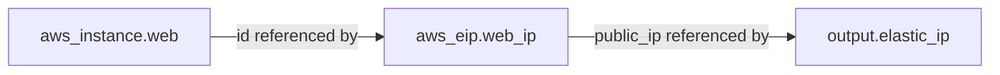
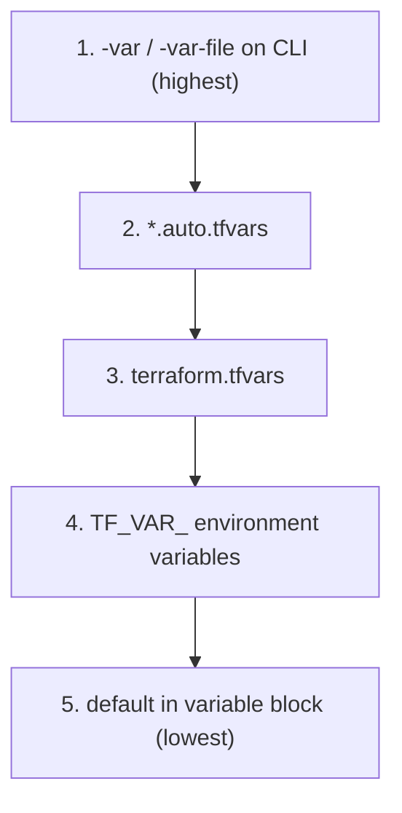
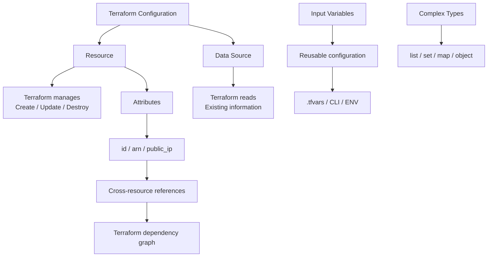

# Domain 4A — Resources, Data, Attributes, Variables & Complex Types

## 1. `resource` vs `data`

This is one of the most important concepts.

### `resource`

A `resource` means:

> **Terraform manages this infrastructure.**

Terraform can:

* Create it
* Update it
* Destroy it

Example:

```hcl
resource "aws_security_group" "web" {
  name   = "web-sg"
  vpc_id = aws_vpc.main.id
}
```

Terraform **owns** this security group.

---

### `data`

A `data` block means:

> **Terraform only reads existing information.**

Terraform does **not**:

* Create it
* Update it
* Destroy it

Example:

```hcl
data "aws_vpc" "existing" {
  filter {
    name   = "tag:Name"
    values = ["shared-vpc"]
  }
}
```

Now you can use:

```hcl
vpc_id = data.aws_vpc.existing.id
```

### Simple comparison

```text
resource
   ↓
Terraform OWNS it
   ↓
Create / Update / Destroy


data
   ↓
Terraform READS it
   ↓
Use existing information
```

### Real-world example

Suppose:

```text
Networking Team
      ↓
Owns VPC
      ↓
Application Team
      ↓
Needs to use VPC
```

Application team should use:

```hcl
data "aws_vpc" "shared" {
  ...
}
```

instead of creating another VPC.

### Why?

If the application team used:

```hcl
resource "aws_vpc" "shared" {
  ...
}
```

Terraform considers that VPC part of **their managed infrastructure**.

A later:

```bash
terraform destroy
```

could attempt to delete it.

### Exam takeaway

> **`resource` = manage infrastructure**

> **`data` = read existing infrastructure/information**

---

# 2. Security Groups — Basics You Need

A Security Group (SG) is essentially a **virtual firewall** for AWS resources such as EC2.

### Important properties

* SG is **stateful**
* Inbound traffic is **deny by default**
* Outbound traffic is **allow by default**
* SG rules are **allow rules only**
* You don't create explicit `deny` rules in an SG
* An SG can reference another SG as the source

### Stateful means

Suppose you allow:

```text
Internet → EC2 : TCP 80
```

The response:

```text
EC2 → Internet
```

is automatically allowed because SGs are stateful.

You don't need a separate outbound rule just for the response.

### SG-to-SG communication

For example:

```text
Internet
   ↓
Load Balancer SG
   ↓
Application SG
   ↓
Database SG
```

The database SG can allow traffic **from the application SG** rather than allowing an entire CIDR range.

---

## Example

```hcl
resource "aws_security_group" "web" {
  name   = "web-sg"
  vpc_id = aws_vpc.main.id
}
```

Allow HTTP:

```hcl
resource "aws_vpc_security_group_ingress_rule" "http" {
  security_group_id = aws_security_group.web.id
  cidr_ipv4         = "0.0.0.0/0"

  from_port   = 80
  to_port     = 80
  ip_protocol = "tcp"
}
```

### Security warning

Avoid:

```hcl
cidr_ipv4 = "0.0.0.0/0"
from_port = 22
```

for SSH in real environments.

That means:

> Anyone on the internet can attempt to connect to port 22.

Prefer a known office/VPN CIDR or another controlled access mechanism.

---

# 3. Using `resource` + `data` Together

A very common pattern is:

> **Read existing infrastructure → create something inside/using it.**

Example:

```hcl
data "aws_vpc" "shared" {
  filter {
    name   = "tag:Name"
    values = ["shared-vpc"]
  }
}
```

Then create a new security group inside that VPC:

```hcl
resource "aws_security_group" "app" {
  name   = "app-sg"
  vpc_id = data.aws_vpc.shared.id
}
```

Here:

```text
Existing VPC
    ↓
data.aws_vpc.shared
    ↓
Read VPC ID
    ↓
Create new Security Group
```

### Exam takeaway

A `data` source can be used as an input to a `resource`.

---

# 4. Data Sources Are Useful for Dynamic Information

A common example is finding the latest AMI.

```hcl
data "aws_ami" "amazon_linux" {
  most_recent = true
  owners      = ["amazon"]

  filter {
    name   = "name"
    values = ["amzn2-ami-hvm-*-x86_64-gp2"]
  }
}
```

Then:

```hcl
resource "aws_instance" "web" {
  ami           = data.aws_ami.amazon_linux.id
  instance_type = "t3.micro"
}
```

Instead of hardcoding:

```hcl
ami = "ami-123456"
```

Terraform queries AWS for the matching AMI.

### Mental model

```text
data.aws_ami
      ↓
Find AMI
      ↓
Get AMI ID
      ↓
aws_instance
```

---

# 5. Attributes

A resource has values that Terraform knows about.

Some values you provide:

```hcl
instance_type = "t3.micro"
```

Other values are generated by AWS:

```text
id
arn
public_ip
private_ip
```

Example:

```hcl
resource "aws_instance" "web" {
  ami           = "ami-123"
  instance_type = "t3.micro"
}
```

After creation, AWS may give it:

```text
id        = i-123abc
public_ip = 54.x.x.x
arn       = arn:aws:ec2:...
```

You can reference these values.

```hcl
output "instance_id" {
  value = aws_instance.web.id
}
```

---

# 6. Cross-Resource References

This is **very important** for Terraform.

Suppose we have:

```hcl
resource "aws_instance" "web" {
  ami           = "ami-123"
  instance_type = "t3.micro"
}
```

And:

```hcl
resource "aws_eip" "web_ip" {
  instance = aws_instance.web.id
  domain   = "vpc"
}
```

This:

```hcl
aws_instance.web.id
```

is a **cross-resource reference**.

Terraform understands:

```text
EC2
 ↓
EIP
```

So Terraform knows the EC2 must exist before the EIP can be associated.

### Important concept

You don't normally need to tell Terraform:

```text
Create EC2 first
Then create EIP
```

The reference itself tells Terraform about the dependency.

---

## Dependency graph



This is called an **implicit dependency**.

---

# 7. Why Hardcoding Resource IDs Is Bad

Don't do this:

```hcl
resource "aws_eip" "web_ip" {
  instance = "i-0abc123"
  domain   = "vpc"
}
```

Instead:

```hcl
resource "aws_eip" "web_ip" {
  instance = aws_instance.web.id
  domain   = "vpc"
}
```

### Why?

Suppose Terraform replaces the EC2.

Old:

```text
i-0abc123
```

New:

```text
i-0xyz789
```

With the reference:

```hcl
aws_instance.web.id
```

Terraform automatically gets the new ID.

With the hardcoded value:

```hcl
"i-0abc123"
```

Terraform still has the old ID.

### Exam takeaway

> Use Terraform references instead of hardcoding dynamically generated resource attributes.

---

# 8. Elastic IP — What You Need to Know

An Elastic IP (EIP) is a **static public IPv4 address**.

Normal EC2 public IP:

```text
Instance stops/restarts/recreated
            ↓
Public IP may change
```

EIP:

```text
Instance replaced
      ↓
EIP can be attached to new instance
      ↓
Same public IP
```

### Terraform example

Allocate EIP:

```hcl
resource "aws_eip" "web_ip" {
  domain = "vpc"
}
```

Associate it:

```hcl
resource "aws_eip_association" "web" {
  instance_id   = aws_instance.web.id
  allocation_id = aws_eip.web_ip.id
}
```

### Important

An EIP is the **address**.

The association determines **what resource gets that address**.

---

# 9. Outputs

Outputs expose useful values from your Terraform configuration.

Example:

```hcl
output "instance_public_ip" {
  value = aws_instance.web.public_ip
}
```

After:

```bash
terraform apply
```

you can see the value with:

```bash
terraform output
```

Or:

```bash
terraform output instance_public_ip
```

### `-json`

```bash
terraform output -json
```

Useful for scripts and CI/CD.

---

## Outputs can be used by other systems

Example:

```hcl
output "alb_dns_name" {
  value = aws_lb.app.dns_name
}
```

A CI pipeline could retrieve it:

```bash
terraform output -raw alb_dns_name
```

and then use that DNS name for a smoke test.

### Sensitive outputs

```hcl
output "db_password" {
  value     = aws_db_instance.main.password
  sensitive = true
}
```

This hides the value from normal CLI output.

⚠️ **Important exam point:**

`sensitive = true` does **not** mean the value is encrypted in Terraform state.

---

# 10. Input Variables

Variables allow you to make Terraform configuration reusable.

Without variables:

```hcl
instance_type = "t3.micro"
```

You would have to modify your Terraform code for every environment.

With a variable:

```hcl
variable "instance_type" {
  type        = string
  description = "EC2 instance size"
  default     = "t3.micro"
}
```

Use it:

```hcl
resource "aws_instance" "web" {
  instance_type = var.instance_type
  ami           = var.ami_id
}
```

Now:

```text
Same Terraform code
       ↓
 ┌─────┴─────┐
 ↓           ↓
Dev         Prod
 ↓           ↓
t3.micro    t3.large
```

---

# 11. `.tfvars` Files

Instead of putting variable values directly into the resource configuration, you can put them in a `.tfvars` file.

Example:

```hcl
# terraform.tfvars

ami_id        = "ami-123456"
instance_type = "t3.small"
```

Terraform automatically loads:

```text
terraform.tfvars
```

You can also have:

```text
dev.tfvars
prod.tfvars
```

and explicitly select one:

```bash
terraform apply -var-file="prod.tfvars"
```

---

# 12. Ways to Provide Variable Values

Terraform can get variable values from several places.

Know these:

1. `default` in `variable`
2. `terraform.tfvars`
3. `*.auto.tfvars`
4. `-var`
5. `-var-file`
6. `TF_VAR_name` environment variable
7. Interactive prompt

Example:

```bash
terraform apply -var="instance_type=t3.large"
```

---

# 13. Variable Precedence — VERY IMPORTANT

When multiple sources provide the same variable, Terraform has a precedence order.



### Easy way to remember

**CLI wins.**

Then:

```text
auto.tfvars
     ↓
terraform.tfvars
     ↓
environment variable
     ↓
default
```

### Example

```hcl
variable "env" {
  default = "dev"
}
```

Environment:

```bash
export TF_VAR_env=staging
```

`terraform.tfvars`:

```hcl
env = "prod"
```

CLI:

```bash
terraform apply -var="env=canary"
```

Final value:

```text
canary
```

because CLI has the highest priority.

### Exam takeaway

> If the question gives multiple variable sources, **check precedence before answering**.

---

# 14. Complex Data Types

Terraform has basic types:

```text
string
number
bool
```

And collection/structured types:

```text
list
set
map
object
```

The important difference is **how you access and organize the data**.

---

# 15. `list`

A list is:

> **Ordered collection**

Example:

```hcl
variable "azs" {
  type    = list(string)
  default = [
    "ap-south-1a",
    "ap-south-1b"
  ]
}
```

Access by index:

```hcl
var.azs[0]
```

Result:

```text
ap-south-1a
```

### Remember

```text
list = ordered
```

Duplicates are allowed.

---

# 16. `set`

A set is:

> **Unique, unordered values**

Example:

```hcl
variable "allowed_ports" {
  type = set(number)

  default = [
    22,
    80,
    443
  ]
}
```

Use a set when:

* Order doesn't matter
* Duplicate values shouldn't exist

### Remember

```text
list → ordered
set  → unique + unordered
```

---

# 17. `map`

A map is:

> **Key → value**

Example:

```hcl
variable "instance_size_by_env" {
  type = map(string)

  default = {
    dev     = "t3.micro"
    staging = "t3.small"
    prod    = "t3.large"
  }
}
```

You can retrieve:

```hcl
var.instance_size_by_env["prod"]
```

Result:

```text
t3.large
```

---

## `lookup()`

You can safely retrieve a map value with a fallback:

```hcl
lookup(
  var.instance_size_by_env,
  "test",
  "t3.micro"
)
```

If `test` doesn't exist:

```text
t3.micro
```

is returned.

### Why use `lookup()`?

Direct access:

```hcl
var.instance_size_by_env["test"]
```

can fail if the key doesn't exist.

With:

```hcl
lookup(map, key, default)
```

you can provide a fallback.

### Remember

> `map` = key/value lookup.

---

# 18. `object`

An object groups related fields together.

Example:

```hcl
variable "subnet" {
  type = object({
    name = string
    cidr = string
    az   = string
  })
}
```

Value:

```hcl
subnet = {
  name = "public-1"
  cidr = "10.0.1.0/24"
  az   = "ap-south-1a"
}
```

Think of it like a structured record:

```text
subnet
 ├── name
 ├── cidr
 └── az
```

---

# 19. Why `object` Is Better Than Parallel Lists

### Bad approach

```hcl
names = ["public-1", "public-2"]

cidrs = [
  "10.0.1.0/24",
  "10.0.2.0/24"
]

azs = [
  "ap-south-1a",
  "ap-south-1b"
]
```

Everything depends on matching indexes.

```text
index 0
 ├── public-1
 ├── 10.0.1.0/24
 └── ap-south-1a
```

If someone accidentally changes one list, the data can become mismatched.

### Better

```hcl
variable "subnets" {
  type = list(object({
    name = string
    cidr = string
    az   = string
  }))

  default = [
    {
      name = "public-1"
      cidr = "10.0.1.0/24"
      az   = "ap-south-1a"
    },
    {
      name = "public-2"
      cidr = "10.0.2.0/24"
      az   = "ap-south-1b"
    }
  ]
}
```

Now each subnet's information stays together.

---

# 20. Quick Comparison of Data Types

| Type     | Remember it as          | Example                       |
| -------- | ----------------------- | ----------------------------- |
| `string` | Text                    | `"prod"`                      |
| `number` | Number                  | `10`                          |
| `bool`   | True/false              | `true`                        |
| `list`   | Ordered values          | `["a","b"]`                   |
| `set`    | Unique unordered values | `["a","b"]`                   |
| `map`    | Key → value             | `{dev="small", prod="large"}` |
| `object` | Structured fields       | `{name="web", port=80}`       |

---

# 21. Most Important Exam Traps

### Trap 1 — Resource vs Data

```text
resource → Terraform manages it
data     → Terraform only reads it
```

---

### Trap 2 — Cross-resource references

```hcl
aws_instance.web.id
```

doesn't just retrieve the ID.

It also creates a **dependency relationship**.

---

### Trap 3 — Hardcoding IDs

Prefer:

```hcl
aws_instance.web.id
```

over:

```hcl
"i-123456"
```

Terraform can then correctly track dependencies and replacements.

---

### Trap 4 — Outputs

```hcl
sensitive = true
```

hides the value from normal CLI output.

It does **not** mean the value is absent/encrypted in state.

---

### Trap 5 — Variable precedence

Highest:

```text
-var / -var-file
```

Lowest:

```text
default
```

---

### Trap 6 — List vs Set

```text
list → ordered, duplicates allowed
set  → unique, unordered
```

---

### Trap 7 — Map

```text
map = key → value
```

Example:

```hcl
lookup(var.sizes, "prod", "t3.micro")
```

---

### Trap 8 — Object

```text
object = related fields grouped together
```

Good for things like:

```text
name + CIDR + AZ
```

---

# 22. Final Domain 4A Mental Model



## Final memory trick

> **Resource = Create/Manage**

> **Data = Read**

> **Attribute = Value from a resource**

> **Reference = Connect resources + create dependency**

> **Output = Expose a value**

> **Variable = Input to make configuration reusable**

> **List = Ordered**

> **Set = Unique**

> **Map = Key → Value**

> **Object = Structured data**

And for variables:

> **CLI > auto.tfvars > terraform.tfvars > ENV > default**.
