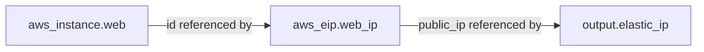
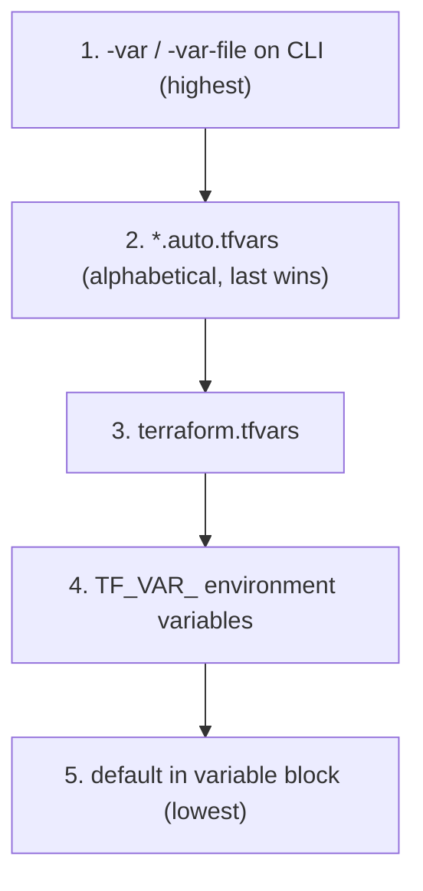

# Domain 4 (Part A) — Resource/Data Blocks, Attributes, Variables, Outputs, Complex Types

*Official exam objectives covered: 4a (resource vs. data blocks), 4b (attributes & cross-resource references), 4c (variables and outputs), 4d (complex types)*
*Course lectures folded in: Basics of Firewalls/Security Groups, Elastic IP, Basic of Attributes, Cross Resource Attribute References, Output Values, Overview of Terraform Variables, Variable Definitions File (TFVARS), Approaches for Variable Assignment, Variable Definition Precedence, Data Types (list/map/set/object), Fetching Data from Maps and Lists*

---

## 1. `resource` vs. `data` Blocks (Objective 4a)

### Definition
- A **`resource`** block tells Terraform to **create, update, and destroy** something — it's under Terraform's full lifecycle management.
- A **`data`** block **reads** something that already exists — Terraform will never create, modify, or destroy whatever a data source points at. It's read-only, every single time.

```hcl
resource "aws_security_group" "web_sg" {   # Terraform OWNS this - creates/updates/destroys it
  name   = "web-sg"
  vpc_id = data.aws_vpc.existing.id         # data.* - Terraform only READS this
}

data "aws_vpc" "existing" {                 # a VPC that already exists, managed elsewhere
  filter {
    name   = "tag:Name"
    values = ["shared-vpc"]
  }
}
```

### Why both exist — the practical reasoning
Not every piece of infrastructure your config needs should be *created* by that config. A shared VPC, managed by a central networking team, is exactly the kind of thing an application team's Terraform project needs to **reference**, not own. If the application team used a `resource` block for that VPC instead of `data`, running their `terraform destroy` would attempt to delete infrastructure other teams depend on.

### AWS Networking Primer: What a Security Group Actually Is
Before writing any Terraform for one, it's worth being precise about what a security group *is* in AWS, since the Terraform resource is just a thin wrapper around this concept:
- A **security group (SG)** is a **stateful**, instance/ENI-level virtual firewall — "stateful" means if you allow inbound traffic on a port, the *response* traffic is automatically allowed back out, without needing a matching outbound rule. This is different from a **Network ACL (NACL)**, which is **stateless** (subnet-level, and return traffic must be explicitly allowed by a separate rule) — a distinct, coarser-grained layer that most application teams rarely touch directly.
- Security groups are **default-deny inbound, default-allow outbound**: a brand-new SG with zero rules blocks all inbound traffic but permits all outbound traffic until you add rules that change that.
- Rules are **allow-only** — there is no explicit "deny" rule in a security group (NACLs, uniquely, do support explicit deny). To restrict access, you simply don't add an allow rule for it.
- SGs can reference **other security groups as a source**, not just CIDR blocks — this is the "SG chaining" pattern used throughout these notes (e.g., a database SG that allows inbound only from the application tier's SG, by ID, rather than from a CIDR range).

**What if you don't understand the stateful/default-deny model and just copy example rules blindly?** A very common beginner mistake is adding both an inbound *and* an outbound rule for the same port "just in case," not realizing the stateful behavior already permits the response traffic automatically — this doesn't break anything, but it's a sign the underlying model isn't understood yet, and that gap shows up later when a genuinely stateless NACL rule set doesn't behave the way an SG habit would predict.

### Example 1 — Security Groups: a full resource-only example
```hcl
resource "aws_security_group" "web_sg" {
  name   = "web-sg"
  vpc_id = aws_vpc.main.id
}

resource "aws_vpc_security_group_ingress_rule" "ssh" {
  security_group_id = aws_security_group.web_sg.id
  cidr_ipv4         = "203.0.113.0/24"   # a known office/VPN CIDR - NOT 0.0.0.0/0
  from_port         = 22
  to_port            = 22
  ip_protocol       = "tcp"
}

resource "aws_vpc_security_group_ingress_rule" "http" {
  security_group_id = aws_security_group.web_sg.id
  cidr_ipv4         = "0.0.0.0/0"        # public web traffic - fine for port 80
  from_port         = 80
  to_port           = 80
  ip_protocol       = "tcp"
}
```
**What if you allow SSH (22) from `0.0.0.0/0` instead of a known CIDR?** This is the single most common real-world AWS misconfiguration — it means literally anyone on the internet can attempt to brute-force SSH into your instance. Automated scanners find open port 22s within minutes of a public IP going live. Restrict management ports to known CIDRs (office IP, VPN range, or a bastion host's SG); only public-facing web ports (80/443) should ever see `0.0.0.0/0`.

### Example 2 — mixing resource and data: create a security group inside an existing, shared VPC
```hcl
data "aws_vpc" "shared" {
  filter {
    name   = "tag:Name"
    values = ["shared-vpc"]
  }
}

data "aws_subnets" "shared_public" {
  filter {
    name   = "vpc-id"
    values = [data.aws_vpc.shared.id]
  }
}

resource "aws_security_group" "app_sg" {
  name   = "app-sg"
  vpc_id = data.aws_vpc.shared.id   # references, does NOT own, the shared VPC
}
```
**What if you'd instead defined the VPC as a `resource` in this same config?** Running `terraform destroy` on this project (e.g., during routine cleanup of a test environment) would attempt to delete the *shared* VPC — taking down every other team's infrastructure that depends on it. Using `data` here is a deliberate ownership boundary: this config can use the VPC, but it cannot destroy it.

### A Practical Skill: Dealing with Documentation/Code Updates
The security group examples above already use a *specific* choice you should notice: `aws_vpc_security_group_ingress_rule` / `_egress_rule` (one resource per rule), rather than the older style of inline `ingress { }` / `egress { }` blocks nested directly inside `aws_security_group`. Both still exist in the AWS provider — recognizing *why* the notes use the newer form, and building the habit of noticing this kind of change yourself, is a real, transferable skill, not just a one-off fact about security groups.

**The older, still-valid style (for comparison):**
```hcl
resource "aws_security_group" "web_sg_legacy" {
  name   = "web-sg-legacy"
  vpc_id = aws_vpc.main.id

  ingress {
    from_port   = 80
    to_port     = 80
    protocol    = "tcp"
    cidr_blocks = ["0.0.0.0/0"]
  }
}
```
The Terraform Registry's own provider documentation for `aws_security_group` explicitly notes that mixing inline `ingress`/`egress` blocks with the separate per-rule resources on the *same* security group causes rule conflicts that overwrite each other on every `apply` — a warning that only shows up if you actually read the current docs page rather than working from an old tutorial or a memorized pattern.

**The general skill this represents:**
1. **Check the Registry docs page for the exact resource/provider version you're pinned to** (Domain 2's `required_providers`/lock file) — argument names, valid values, and recommended patterns do change between major versions, and the docs page itself usually shows a version selector.
2. **Watch for deprecation notices** in the docs (often a highlighted callout box) — a deprecated argument usually still *works* for a while, but silently stops receiving updates and is eventually removed in a future major version.
3. **When a resource's recommended shape changes, migrate deliberately** — as shown above, don't mix old and new styles on the same resource; pick one and convert fully, then verify with `terraform plan` that the diff shows no unintended changes (an in-place, no-op migration should show zero real infrastructure changes, just a state-representation update).

**What if you never revisit code written against an older provider version's docs?** Nothing breaks immediately — old syntax that was valid at write-time usually keeps working for a long time. The risk compounds silently: by the time you actually need to upgrade the provider (a security fix in a newer version, say), you may be migrating several versions' worth of accumulated deprecations at once, instead of having kept pace incrementally.

### Real-World Scenario 1 — Central Networking Team + Multiple App Teams
A platform/networking team owns and manages the VPC, subnets, and NAT gateways as `resource` blocks in their own Terraform project. Every application team (dozens of them) references that shared network via `data` blocks in their own separate projects. When the networking team needs to add a new subnet, only *their* `apply` touches the VPC — no application team's `destroy` can ever accidentally take down shared network infrastructure, because none of them have `resource` blocks for it.

### Real-World Scenario 2 — Always-Current AMI Selection
```hcl
data "aws_ami" "amazon_linux" {
  most_recent = true
  owners      = ["amazon"]
  filter {
    name   = "name"
    values = ["amzn2-ami-hvm-*-x86_64-gp2"]
  }
}

resource "aws_instance" "web" {
  ami           = data.aws_ami.amazon_linux.id   # always resolves to the CURRENT latest AMI
  instance_type = "t3.micro"
}
```
A company hardcodes an AMI ID once, and eighteen months later that AMI is deprecated/deregistered by AWS — every fresh `terraform apply` in a new region or account start now fails outright with "AMI not found." A sibling team used the `data "aws_ami"` pattern above instead; their configs kept working through every AMI rotation, with zero code changes required, because the data source re-resolves "latest" on every `plan`.

**What if you don't use a data source and just hardcode the AMI?** You save nothing at write-time (the syntax is barely different) but you take on an ongoing maintenance burden: someone has to notice when the AMI is deprecated, look up the new one, and update every config that references it — across every environment, potentially years after the original author has moved to a different team.

---

## 2. Attributes and Cross-Resource References (Objective 4b)

### What an "attribute" is
Beyond the arguments *you* set on a resource, AWS itself generates additional values once a resource exists — an `id`, an `arn`, a `public_ip`. Terraform reads these back from the provider and stores them in state, and you can reference them anywhere else in your config.

```hcl
resource "aws_instance" "web" {
  ami           = "ami-0e35ddab05955cf57"
  instance_type = "t3.micro"
}

output "instance_id"  { value = aws_instance.web.id }    # attribute you never explicitly set
output "instance_arn" { value = aws_instance.web.arn }   # generated entirely by AWS
```

### What an Elastic IP Actually Is, and Why It's Its Own Resource
An **Elastic IP (EIP)** is a static, public IPv4 address that you allocate to your AWS account and can attach to (or move between) resources — most commonly an EC2 instance or a NAT Gateway. The problem it solves: a plain EC2 instance's public IP **changes** if the instance is stopped/started or replaced, which breaks anything that hardcoded the old IP (a DNS record, a firewall allowlist entry on a partner's system). An EIP stays constant regardless of what it's currently attached to.

In Terraform, allocating the address (`aws_eip`) and attaching it to something are conceptually — and in the modern provider, often literally — two different steps:
```hcl
resource "aws_eip" "web_ip" {
  domain = "vpc"   # allocates the static address itself
}

resource "aws_eip_association" "web_assoc" {
  instance_id   = aws_instance.web.id
  allocation_id = aws_eip.web_ip.id
}
```
**What if you never associate the allocated EIP with anything?** AWS bills for Elastic IPs that are allocated but **not attached to a running resource** — a genuinely common, easy-to-overlook cost leak, since an idle allocated-but-unattached EIP produces no visible symptom (no error, no broken app) other than a small recurring line item on the bill. Always pair an `aws_eip` with either an inline `instance =` argument (shown in the cross-reference example below) or an explicit `aws_eip_association`, and clean up any EIP resource whose associated instance was destroyed but the EIP itself wasn't.

### Cross-resource references — the mechanism that builds Terraform's dependency graph
```hcl
resource "aws_eip" "web_ip" {
  instance = aws_instance.web.id   # cross-resource reference
  domain   = "vpc"
}
```
This single line does two things simultaneously: (1) it tells AWS which instance to attach the Elastic IP to, and (2) it tells **Terraform** that `aws_eip.web_ip` depends on `aws_instance.web` — with zero explicit ordering instructions from you. This is called an **implicit dependency** (full contrast with explicit `depends_on` is in Domain 4c).



### Example — a chain of three cross-references
```hcl
resource "aws_instance" "web" {
  ami           = data.aws_ami.amazon_linux.id
  instance_type = "t3.micro"
}

resource "aws_eip" "web_ip" {
  instance = aws_instance.web.id
  domain   = "vpc"
}

resource "aws_route53_record" "web_dns" {
  zone_id = data.aws_route53_zone.main.zone_id
  name    = "app.example.com"
  type    = "A"
  ttl     = 300
  records = [aws_eip.web_ip.public_ip]   # third link in the chain
}
```
Terraform infers the full order — instance, then EIP, then DNS record — purely from these references, and will correctly *reverse* that order on `destroy` (DNS record removed first, then EIP released, then instance terminated).

### What if you hardcode a value instead of referencing the attribute?
```hcl
resource "aws_eip" "web_ip" {
  instance = "i-0abc123"   # hardcoded instance ID, copy-pasted from a previous apply's output
  domain   = "vpc"
}
```
This breaks the dependency graph: Terraform no longer knows the EIP depends on that specific instance. If the instance is ever replaced (a new AMI forces recreation, for example), it gets a **new** ID — and this hardcoded EIP now silently points at a stale, possibly-already-destroyed instance ID, with no error until you notice production traffic isn't reaching the new instance.

### Real-World Scenario 1 — Blue/Green Instance Replacement
An engineer changes an EC2 instance's AMI, forcing Terraform to destroy the old instance and create a new one. Because the EIP resource referenced `aws_instance.web.id` (not a hardcoded ID), Terraform automatically re-attaches the EIP to the *new* instance in the same `apply` — zero manual intervention. If the EIP had referenced a hardcoded ID, the team would have discovered the outage only when customers reported the app was unreachable.

### Real-World Scenario 2 — Auto-Generated ARNs Feeding IAM Policies
```hcl
resource "aws_s3_bucket" "data" {
  bucket = "my-app-data-${random_id.suffix.hex}"
}

resource "aws_iam_policy" "s3_read" {
  policy = jsonencode({
    Version = "2012-10-17"
    Statement = [{
      Effect   = "Allow"
      Action   = ["s3:GetObject"]
      Resource = "${aws_s3_bucket.data.arn}/*"   # the ARN doesn't exist until AWS creates the bucket
    }]
  })
}
```
The bucket's ARN literally doesn't exist as a value until AWS creates it and returns it — there's no way to hardcode this correctly even if you wanted to, since the account ID and exact naming are only known post-creation. This is why attribute references aren't just a style preference; for generated values like ARNs, they're the *only* correct approach.

---

## 3. Output Values (Objective 4c, part 1)

### Purpose
Outputs surface values after `apply` — for a human reading the CLI, for another Terraform project to consume via `terraform_remote_state` (Domain 7), or for a CI pipeline to capture (e.g., a load balancer's DNS name, passed to the next pipeline stage).

```hcl
output "instance_public_ip" {
  value       = aws_instance.web.public_ip
  description = "Public IP of the web server"
}

output "db_password" {
  value     = aws_db_instance.main.password
  sensitive = true   # redacts from CLI/log output - does NOT encrypt the value in state
}
```

### Example — outputs consumed by a CI/CD pipeline
```hcl
output "alb_dns_name" {
  value = aws_lb.app.dns_name
}
```
```bash
DNS=$(terraform output -raw alb_dns_name)
curl -f "https://$DNS/healthz" || exit 1   # pipeline smoke-tests the freshly-deployed ALB
```

### What if you don't define outputs at all?
Every value your config produces stays locked inside the state file — a human would need to run `terraform state show aws_instance.web` and manually read raw attributes to find, say, the public IP, and no *other* Terraform project could reference this project's results at all (no `terraform_remote_state` is possible without at least one output defined). Outputs are the deliberate, documented "public API" of a Terraform project.

### Real-World Scenario 1 — CI Smoke Test
A deployment pipeline runs `terraform apply`, then immediately reads the `alb_dns_name` output to run an automated health check against the just-deployed load balancer, failing the pipeline (and optionally auto-rolling-back) if the health check doesn't return `200` within a timeout.

### Real-World Scenario 2 — Cross-Team Handoff via Remote State
A networking team's Terraform project outputs `vpc_id` and `private_subnet_ids`. An application team's completely separate project reads those exact outputs via `terraform_remote_state` (Domain 7) to place their EC2 instances in the correct subnets — without ever needing write access to the networking team's code or state.

---

## 4. Input Variables (Objective 4c, part 2)

### Why variables exist
Without them, adapting the same config for a different environment means editing the resource block itself — risky, and defeats the entire "one codebase, many environments" value of IaC.

```hcl
# variables.tf - declare
variable "instance_type" {
  type        = string
  description = "EC2 instance size"
  default     = "t3.micro"
}

# main.tf - use
resource "aws_instance" "web" {
  instance_type = var.instance_type
  ami           = var.ami_id
}
```

### Variable Definitions File (`.tfvars`)
```hcl
# terraform.tfvars — auto-loaded, no flag needed
ami_id        = "ami-0e35ddab05955cf57"
instance_type = "t3.small"
```
Splitting *declaration* from *values* means the exact same `main.tf` deploys differently in dev vs. prod just by swapping which `.tfvars` file is loaded.

### Every way to assign a variable's value (Approaches for Variable Assignment)
1. `default` in the `variable` block
2. `terraform.tfvars` (auto-loaded)
3. `*.auto.tfvars` (also auto-loaded — good for splitting vars logically, e.g. `network.auto.tfvars`)
4. `-var="instance_type=t3.small"` on the CLI
5. `-var-file="prod.tfvars"` on the CLI
6. `TF_VAR_instance_type` environment variable
7. Interactive prompt (only if nothing else supplies a value and there's no default — avoid depending on this in CI, it will hang)

### Variable Definition Precedence — memorize this order

**Worked example:**
```hcl
variable "env" { default = "dev" }
```
```bash
export TF_VAR_env=staging
echo 'env = "prod"' > terraform.tfvars
terraform apply -var="env=canary"
```
Result: `env = "canary"` — CLI `-var` beats everything else present, in the order shown above.

### What if two teammates rely on different assignment methods without realizing precedence?
```bash
# Teammate A's shell profile, set months ago and forgotten:
export TF_VAR_environment=staging

# Teammate B's terraform.tfvars, committed to the repo:
environment = "dev"
```
Teammate B expects `dev` (that's what's in the committed file) — but because environment variables are checked *before* `.tfvars`, wait — actually `terraform.tfvars` (priority 3) beats `TF_VAR_` (priority 4), so B's committed value wins here. The dangerous version of this mistake is the reverse: someone assumes an environment variable will safely override a `.tfvars` default, deploys expecting `staging`, and instead silently gets whatever's in the committed `terraform.tfvars` — a real, exam-relevant gotcha precisely because the precedence order is counter-intuitive to guess.

### Real-World Scenario 1 — CI/CD Secret Injection
A CI pipeline injects `TF_VAR_db_password` from a secrets manager as an environment variable at build time — the value is never written to disk, never appears in a `.tfvars` file that could be accidentally committed, and disappears when the CI job ends. This is the standard pattern for injecting secrets into Terraform without ever persisting them in a repo.

### Real-World Scenario 2 — Emergency Override During an Incident
During an incident, an on-call engineer needs to temporarily deploy with a different (larger) instance size than what's in the committed `terraform.tfvars`, without editing and committing a code change under pressure. `terraform apply -var="instance_type=t3.xlarge"` overrides just for this one run — the committed file, and every future normal deploy, is unaffected once the flag isn't passed again.

---

## 5. Complex/Collection Data Types (Objective 4d)

| Type | Shape | Use when... |
|---|---|---|
| `string` / `number` / `bool` | single value | A single text/numeric/boolean value |
| `list(type)` | ordered, duplicates allowed | Order matters, or duplicates are meaningful |
| `set(type)` | unordered, unique | Uniqueness matters, order doesn't — pairs naturally with `for_each` |
| `map(type)` | key → value | Lookups by a meaningful name, not position |
| `object({...})` | structured record, named/mixed-type fields | Multiple related fields that should travel together |

### Example 1 — `list`
```hcl
variable "azs" {
  type    = list(string)
  default = ["ap-south-1a", "ap-south-1b"]
}
# var.azs[0] => "ap-south-1a"
```

### Example 2 — `map`, with a safe lookup
```hcl
variable "instance_size_by_env" {
  type = map(string)
  default = { dev = "t3.micro", prod = "t3.large" }
}
# Safe access with a fallback if the key might not exist:
lookup(var.instance_size_by_env, "staging", "t3.micro")
```
**What if you use `var.instance_size_by_env["staging"]` directly instead of `lookup()`, and "staging" isn't a key?** Terraform errors out immediately with "key does not exist" — a hard failure, rather than a graceful fallback. Use direct indexing only when you're certain the key will always be present; use `lookup()` with a default whenever it might legitimately be missing.

### Example 3 — `set`, for guaranteed-unique, order-independent values
```hcl
variable "allowed_ports" {
  type    = set(number)
  default = [22, 80, 443]
}
```

### Example 4 — `object`, and why it beats parallel lists
```hcl
# BAD - three parallel lists that can silently drift out of sync by index
variable "names" { type = list(string) }
variable "cidrs" { type = list(string) }
variable "azs"   { type = list(string) }
```
```hcl
# GOOD - each item's fields travel together, impossible to misalign
variable "subnets" {
  type = list(object({
    name = string
    cidr = string
    az   = string
  }))
  default = [
    { name = "public-1", cidr = "10.0.1.0/24", az = "ap-south-1a" },
    { name = "public-2", cidr = "10.0.2.0/24", az = "ap-south-1b" },
  ]
}
```
**What if you keep the three-parallel-list design instead?** The moment someone adds a fourth subnet and inserts its CIDR at index 2 of `cidrs` but appends its name at the *end* of `names` (an easy mistake in a large `.tfvars` file), every subnet from that point onward has a name that doesn't match its actual CIDR/AZ — a silent, hard-to-spot data integrity bug that `object` types make structurally impossible.

### Real-World Scenario 1 — Multi-Environment Instance Sizing via Map
```hcl
variable "instance_size_by_env" {
  type = map(string)
  default = { dev = "t3.micro", staging = "t3.small", prod = "t3.large" }
}

resource "aws_instance" "app" {
  instance_type = lookup(var.instance_size_by_env, terraform.workspace, "t3.micro")
}
```
A single resource block automatically sizes correctly across every environment/workspace, with one safe fallback (`t3.micro`) for any environment name not yet explicitly configured — new environments "just work" at a safe default size until someone deliberately sizes them.

### Real-World Scenario 2 — Structured Subnet Configuration for a Multi-Tier VPC
A platform team models their entire subnet layout (name, CIDR, AZ, and a `public`/`private` tier tag) as a `list(object({...}))` variable, fed into a `for_each`-based `aws_subnet` resource (Domain 4b). Onboarding a new AZ or adding a fourth subnet tier means adding one object to this one variable — the module code itself never changes, and there's no risk of a parallel-list misalignment bug during the edit.

---

## 6. Practice Questions

### Easy
1. Will a `data` block ever create or destroy a real AWS resource?
2. Which attribute reference would you use in an `output` to get an EC2 instance's auto-assigned public IP?
3. Write a `variable` block for `bucket_name` of type `string` with no default.

### Medium
4. You have `terraform.tfvars` setting `region = "us-east-1"` and run `terraform apply -var="region=eu-west-1"`. Which region is used, and why?
5. Rewrite this as an `object` type instead of three separate parallel lists, showing one example element: `variable "names" { type = list(string) }`, `variable "cidrs" { type = list(string) }`, `variable "azs" { type = list(string) }`.
6. Explain why an `aws_iam_policy`'s `Resource` field referencing `aws_s3_bucket.data.arn` cannot practically be replaced with a hardcoded string.

### Hard
7. A shared VPC is defined as a `resource` block inside an application team's own Terraform project (instead of a `data` block). Describe, step by step, what happens the first time that team runs `terraform destroy` on a stale test branch, and how using `data` instead would have prevented it.
8. Design a `variable` using `map(string)` for per-environment instance sizing, wire it into a resource using `lookup()` with a safe default, and explain what happens differently if you'd used direct map indexing instead when a new environment name is introduced without an explicit entry.

---
**Next:** [05-domain4b-count-foreach-functions-expressions.md](05-domain4b-count-foreach-functions-expressions.md)
