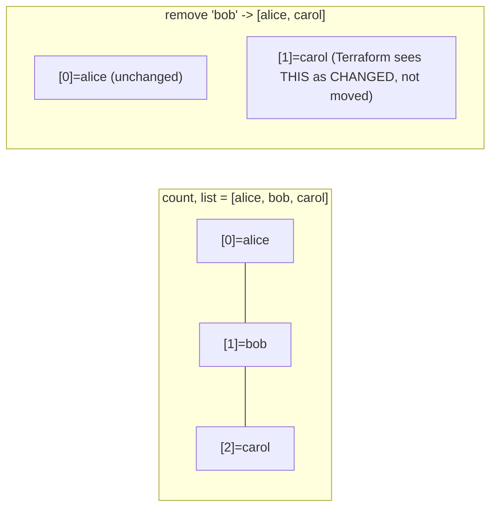
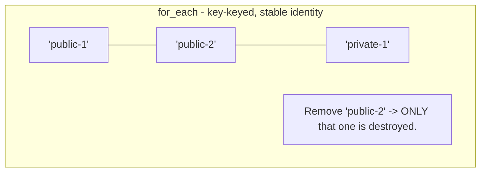

# Domain 4 (Part B) — count, for_each, Conditional Expressions, Functions, Locals, Dynamic Blocks

*Official exam objective covered: 4e (Write dynamic configuration using expressions and functions)*
*Course lectures folded in: The Count Meta-Argument, Count Index, Conditional Expressions, Terraform Functions (+ challenge/solution), Local Values, Dynamic Blocks, Splat Expressions, Zipmap Function*

*This section gets the deepest treatment in these notes — it's where beginners lose the most exam points, because the difference between `count` and `for_each` looks cosmetic until you see it actually break something.*

---

## 1. `count` — What It Is, What Role It Plays, When It's Required

### What it is
`count` is a meta-argument (understood by Terraform Core itself, not any one provider — Domain 4c covers meta-arguments broadly) that turns a single `resource` block into **N instances** of that resource, indexed `0` through `N-1`.

### What role it plays
Without `count`, "I need 5 identical EC2 instances" means literally writing 5 separate `resource "aws_instance" "web_1" {}` ... `resource "aws_instance" "web_5" {}` blocks — pure repetition, hard to maintain, and impossible to parameterize ("make it 8 instances instead of 5" means adding 3 more hand-written blocks). `count` collapses that into one block with a number.

### When it's required / the right situations to reach for it
Use `count` when every copy is **truly interchangeable** — there's no natural, meaningful name to give each one, only a quantity. Good fits: "N identical worker nodes," "N NAT gateways, one per AZ, but otherwise identical," or the classic **optional resource** trick (0 or 1 copies), covered in its own example below.

### Example 1 — the simplest possible case
```hcl
resource "aws_instance" "worker" {
  count         = 3
  ami           = var.ami_id
  instance_type = "t3.micro"

  tags = {
    Name = "worker-${count.index}"
  }
}
```
This single block creates **three** separate EC2 instances: `aws_instance.worker[0]`, `aws_instance.worker[1]`, `aws_instance.worker[2]` — each with its own real instance ID in AWS, tagged `worker-0`, `worker-1`, `worker-2`.

### Example 2 — driving `count` from a variable, so the quantity is configurable
```hcl
variable "worker_count" {
  type    = number
  default = 3
}

resource "aws_instance" "worker" {
  count         = var.worker_count
  ami           = var.ami_id
  instance_type = "t3.micro"
  tags          = { Name = "worker-${count.index}" }
}
```
Now scaling from 3 workers to 10 is a one-line variable change (`worker_count = 10`), not three new hand-written resource blocks.

### Example 3 — the "optional resource" trick (0 or 1 copies via a conditional)
```hcl
variable "create_eip" {
  type    = bool
  default = false
}

resource "aws_eip" "web" {
  count    = var.create_eip ? 1 : 0
  instance = aws_instance.web.id
  domain   = "vpc"
}
```
This is the standard pre-`for_each` pattern for making a resource **conditional** — present only when a variable says so. Referencing it safely afterward requires a guard, because index `[0]` simply doesn't exist when `count` is `0`:
```hcl
output "eip" {
  value = var.create_eip ? aws_eip.web[0].public_ip : null
}
```

### What role `count.index` plays
`count.index` is the **only** signal, inside the resource block, telling you which copy you're currently defining — it's how `count = 3` produces three *different* tags (`worker-0`, `worker-1`, `worker-2`) instead of three identical ones. Reference a *specific* instance from outside the block using that same index: `aws_instance.worker[0].id`, `aws_instance.worker[1].public_ip`.

### What if you don't use `count` at all, and hand-write N blocks instead?
It works, but every quantity change is a manual code edit (add/remove entire resource blocks), every block risks a copy-paste mistake (forgetting to update an index in one of five near-identical blocks), and there's no way to parameterize the quantity via a variable — the number of instances becomes a fact baked into the *shape* of the code, not a configurable input.

### The critical failure mode: `count`'s index instability
This is the single most exam-tested gotcha in this entire topic area.
```hcl
variable "usernames" {
  type    = list(string)
  default = ["alice", "bob", "carol"]
}

resource "aws_iam_user" "team" {
  count = length(var.usernames)
  name  = var.usernames[count.index]
}
```
This creates `aws_iam_user.team[0]` = alice, `[1]` = bob, `[2]` = carol.

**Now remove `"bob"` from the middle of the list:**
```hcl
variable "usernames" {
  default = ["alice", "carol"]   # bob removed
}
```

Terraform diffs **by index**, not by value. It sees index `[1]` change from `"bob"` to `"carol"` — and proposes to **destroy** the IAM user currently at index `[1]` (which is actually "bob" in AWS right now) and **recreate** index `[1]` as "carol." But "carol" already exists at index `[2]`! The plan actually shows: destroy `bob`, update/recreate the user-at-index-1 to be named `carol`, and destroy the user-at-index-2 entirely (since the list is now shorter). Real IAM users get destroyed and recreated that never should have been touched — new ARNs, broken policy attachments, invalidated access keys, all for a change that conceptually should have been "just delete Bob."

### The fix: `for_each` (covered fully in the next section) makes this impossible
```hcl
resource "aws_iam_user" "team" {
  for_each = toset(var.usernames)
  name     = each.value
}
```
Removing `"bob"` from the set now destroys **only** `aws_iam_user.team["bob"]`. Alice and Carol, keyed by their own names, are completely untouched — because identity is the *value itself*, not a position in a list.

### Real-World Scenario 1 — Decommissioning One Server Out of Five
A team uses `count = 5` for a fleet of application servers, with server-specific config (a unique hostname, a unique log-shipping tag) computed from `count.index`. They need to decommission server #2 (the third one, index 2) because it's being replaced by a larger instance type. Removing it from the middle of an underlying list (if the fleet were driven by a list of hostnames) would shift every subsequent server's index — causing Terraform to destroy and recreate servers #3, #4, and #5 as well, each momentarily going offline, purely as a side effect of one server's removal. A `for_each`-based fleet, keyed by hostname, would touch only the one server actually being decommissioned.

### Real-World Scenario 2 — IAM User Offboarding (the exact scenario above, in production)
An engineering team manages IAM users for contractors via `count` + a list of usernames. A contractor's engagement ends and their name is removed from the middle of the list. The next `terraform apply` destroys and recreates two or three *other, unrelated* contractors' IAM users as a side effect — each one loses their existing access keys mid-recreation, breaking their CI pipelines and local AWS CLI sessions until they regenerate new keys. This is a real, well-documented class of incident directly caused by using `count` where `for_each` was the correct tool — and it's precisely why this gotcha has its own dedicated lecture in the course and its own dedicated section here.

---

## 2. `for_each` — The Fix, In Full Depth

### What it is
`for_each` is the alternative meta-argument that creates one resource instance **per key** in a `map` or `set(string)` — instead of per numeric position. Each instance's **identity is the key itself**, permanently, regardless of what happens to other entries.

### Example 1 — basic `for_each` over a map, replacing the broken `count` example above
```hcl
variable "usernames" {
  type    = set(string)
  default = ["alice", "bob", "carol"]
}

resource "aws_iam_user" "team" {
  for_each = var.usernames
  name     = each.value
}
```
Reference a specific user from outside: `aws_iam_user.team["alice"].arn` — by name, never by position.

### Example 2 — `for_each` over a map of objects (the realistic, real-world shape)
```hcl
variable "subnets" {
  type = map(object({
    cidr = string
    az   = string
  }))
  default = {
    "public-1"  = { cidr = "10.0.1.0/24", az = "ap-south-1a" }
    "public-2"  = { cidr = "10.0.2.0/24", az = "ap-south-1b" }
    "private-1" = { cidr = "10.0.101.0/24", az = "ap-south-1a" }
  }
}

resource "aws_subnet" "this" {
  for_each = var.subnets

  vpc_id            = aws_vpc.main.id
  cidr_block        = each.value.cidr
  availability_zone = each.value.az

  tags = { Name = each.key }
}
```
`each.key` = the map key (`"public-1"`), `each.value` = the object (`{cidr, az}`). Removing `"public-2"` from this map destroys **only** `aws_subnet.this["public-2"]` — `public-1` and `private-1` are completely untouched.



### Example 3 — converting a plain list into `for_each`-ready input
`for_each` only accepts a `map` or `set(string)` — **never** a plain `list` directly (a list can contain duplicates and has no inherent uniqueness guarantee, which conflicts with `for_each`'s requirement that every instance have a distinct identity).
```hcl
variable "team_names" {
  type    = list(string)
  default = ["alice", "bob", "carol"]
}

resource "aws_iam_user" "team" {
  for_each = toset(var.team_names)   # convert list -> set first
  name     = each.value
}
```

### What if you feed `for_each` a `list` directly (without `toset()`)?
```
Error: Invalid for_each argument
The "for_each" value depends on resource attributes that cannot be determined
until apply, or "team_names" is a list, which for_each does not accept directly.
```
Terraform will reject it outright — you must explicitly convert to a `set` or `map` first, forcing you to consciously decide how uniqueness/keys work for your specific data, rather than silently allowing ambiguous, duplicate-prone identity.

### `count` vs. `for_each` — the decision table
| | `count` | `for_each` |
|---|---|---|
| Identity of each instance | Numeric index (`[0]`, `[1]`...) | Map key / set value (by name) |
| Safe to remove an item from the middle? | **No** — shifts every later index, causing unrelated destroy/recreate | **Yes** — only the removed key's instance is affected |
| Accepts | `number` | `map` or `set(string)` |
| Best fit | N identical, truly unnamed copies; the "0 or 1 optional resource" trick | Anything with natural, meaningful names — subnets, IAM users, per-environment security groups |

**Practical rule of thumb the exam expects you to apply, not just recite:** if you can imagine wanting to remove *one* item from the middle of the underlying collection without touching anything else, use `for_each`. If the collection is truly just "how many," `count` is fine.

### Real-World Scenario 1 — Per-Environment Security Groups
```hcl
variable "environments" {
  type    = set(string)
  default = ["dev", "staging", "prod"]
}

resource "aws_security_group" "app" {
  for_each = var.environments
  name     = "app-sg-${each.key}"
  vpc_id   = aws_vpc.main.id
}
```
When the company later adds a fourth environment (`"qa"`), or removes `"staging"` entirely during a reorg, only that one environment's security group is created/destroyed — `dev` and `prod` are never touched, never re-evaluated, never at risk of an accidental recreate.

### Real-World Scenario 2 — Multi-Region Disaster Recovery Buckets
```hcl
variable "dr_regions" {
  type = map(string)
  default = {
    primary   = "ap-south-1"
    secondary = "us-east-1"
  }
}

resource "aws_s3_bucket" "dr_backup" {
  for_each = var.dr_regions
  provider = aws   # combined with provider aliasing per region in a real multi-region setup
  bucket   = "my-app-backup-${each.key}"
}
```
If the DR strategy later adds a third region, that's one new map entry — the existing two buckets, already holding production backup data, are never disturbed by the change.

---

## 3. Conditional Expressions

### What they are and why they exist
Terraform's ternary operator: `condition ? true_val : false_val`. It exists because HCL is declarative — there's no `if/else` statement, but resource configuration frequently needs to vary based on a condition (environment, a feature flag, whether a value was supplied).

### Example 1 — sizing an instance differently per environment
```hcl
resource "aws_instance" "app" {
  instance_type = var.environment == "prod" ? "t3.large" : "t3.micro"
}
```

### Example 2 — a default fallback when a variable might be empty
```hcl
locals {
  effective_ami = var.ami_id != "" ? var.ami_id : data.aws_ami.amazon_linux.id
}
```
If `var.ami_id` is left blank, fall back to a data-sourced "latest AMI" instead — the caller isn't *forced* to always supply an AMI explicitly.

### Example 3 — the conditional-resource-count pattern, revisited with the null-safe read
```hcl
resource "aws_eip" "web" {
  count    = var.create_eip ? 1 : 0
  instance = aws_instance.web.id
  domain   = "vpc"
}

output "eip_address" {
  value = var.create_eip ? aws_eip.web[0].public_ip : null
}
```
**What if you skip the guard in the output and just write `aws_eip.web[0].public_ip` unconditionally?** When `create_eip = false`, index `[0]` of a zero-length resource simply doesn't exist, and `terraform plan` errors out immediately — `Invalid index: index 0 out of range`. The conditional in the output isn't optional decoration; it's required correctness whenever the resource itself is conditional.

### Real-World Scenario 1 — Feature-Flagged Infrastructure
A company enables a Web Application Firewall (WAF) only for customers on their "Enterprise" pricing tier.
```hcl
resource "aws_wafv2_web_acl_association" "app" {
  count        = var.customer_tier == "enterprise" ? 1 : 0
  resource_arn = aws_lb.app.arn
  web_acl_arn  = aws_wafv2_web_acl.main.arn
}
```
The same module, called for every customer, silently attaches WAF protection only where the tier variable says to — no separate code path needed.

### Real-World Scenario 2 — Environment-Aware Backup Retention
```hcl
resource "aws_db_instance" "main" {
  backup_retention_period = var.environment == "prod" ? 30 : 3
}
```
Production databases get a full 30-day backup retention (a compliance requirement); dev/staging databases get a minimal 3-day retention, saving on storage costs — one resource block, correct behavior in every environment, with no manual per-environment overrides needed.

---

## 4. Terraform Functions

### What they are, and a fact worth memorizing for the exam
Terraform ships roughly 100 built-in functions covering strings, collections, numbers, dates, encoding, and filesystem access. **You cannot write your own custom functions in HCL** — this is a closed, built-in set; anything more complex must be composed from these.

### The working set you'll actually reach for
| Function | Example | Result |
|---|---|---|
| `length()` | `length(["a","b","c"])` | `3` |
| `join()` | `join("-", ["web","prod"])` | `"web-prod"` |
| `split()` | `split(",", "a,b,c")` | `["a","b","c"]` |
| `merge()` | `merge({a=1}, {b=2})` | `{a=1, b=2}` |
| `lookup()` | `lookup({dev="t3.micro"}, "staging", "t3.micro")` | fallback if key missing |
| `element()` | `element(["a","b","c"], 1)` | `"b"` |
| `concat()` | `concat(["a"], ["b"])` | `["a","b"]` |
| `contains()` | `contains(["a","b"], "a")` | `true` |
| `coalesce()` | `coalesce(null, "", "x")` | first non-null argument |
| `file()` | `file("${path.module}/script.sh")` | file contents as string |
| `templatefile()` | `templatefile("init.tpl", {name="x"})` | rendered template with variables substituted |
| `jsonencode()` | `jsonencode({a=1})` | `"{\"a\":1}"` |
| `zipmap()` | `zipmap(["a","b"],[1,2])` | `{a=1, b=2}` |
| `slice()` | `slice(["a","b","c"], 0, 2)` | `["a","b"]` |
| `toset()` | `toset(["a","a","b"])` | `["a","b"]` (dedup, converts to set) |
| `cidrhost()` | `cidrhost("10.0.0.0/24", 5)` | `"10.0.0.5"` |
| `timestamp()` | `timestamp()` | current UTC time as a string |

### Example 1 — `merge()` for tagging (a near-universal real-world pattern)
```hcl
locals {
  common_tags = { Project = "terraform-course", Owner = "Deepak", ManagedBy = "terraform" }
}

resource "aws_instance" "web" {
  tags = merge(local.common_tags, { Name = "web-server" })
  # result: { Project = "...", Owner = "...", ManagedBy = "...", Name = "web-server" }
}
```
`merge()` is **right-biased** — when two maps share a key, the value from the *later* argument wins.

### Example 2 — the challenge from the original course, worked through fully
```hcl
locals {
  base_tags = { Team = "infra", Env = "dev" }
}

resource "aws_instance" "app" {
  tags = merge(local.base_tags, { Env = "prod", Name = "app-1" })
}
```
**Question:** what is the final value of `Env`?
**Answer:** `"prod"`. `merge()` reads left to right; the second argument's `Env = "prod"` overwrites the first argument's `Env = "dev"`. Final tags: `{ Team = "infra", Env = "prod", Name = "app-1" }`. **What if you swapped the argument order** (`merge({ Env = "prod", Name = "app-1" }, local.base_tags)`)? The result flips — `Env` would end up `"dev"`, because now `local.base_tags` is the *later* argument. Argument order is never cosmetic with `merge()`.

### Example 3 — `templatefile()` for a parameterized boot script
```hcl
resource "aws_instance" "web" {
  user_data = templatefile("${path.module}/init.sh.tpl", {
    app_env  = var.environment
    app_port = 8080
  })
}
```
```bash
# init.sh.tpl
#!/bin/bash
echo "Starting app in ${app_env} mode on port ${app_port}"
```
One template file, reused across every environment, with the differing values substituted in at plan time — instead of maintaining separate boot scripts per environment.

### What if you don't use built-in functions and instead try to precompute values by hand?
```hcl
# BAD - hand-computed and brittle
tags = {
  Project = "terraform-course"
  Owner   = "Deepak"
  Name    = "web-server"
}
# ...repeated, slightly differently, in every other resource block in the file
```
Nothing technically breaks, but every resource re-types the full tag set, and a change to `Owner` means editing every single resource block individually — exactly the repetition `merge()` + `locals` (next section) exists to eliminate.

### Real-World Scenario 1 — Consistent Tagging for Cost Allocation
A finance team requires every AWS resource to carry `CostCenter`, `Environment`, and `ManagedBy` tags for chargeback reporting. Using `merge(local.common_tags, {resource-specific tags})` on every resource guarantees the mandatory tags are always present (defined once, in `locals`) while still letting each resource add its own `Name` — instead of relying on every engineer remembering to manually retype three mandatory tags on every single resource they write.

### Real-World Scenario 2 — Dynamic User-Data via `templatefile()`
A platform team boots EC2 instances into different application environments (dev/staging/prod) using the *same* AMI, with `user_data` supplying environment-specific configuration (API endpoints, log levels) via `templatefile()`. This avoids maintaining separate AMIs per environment — one image, one template, environment-specific values injected at deploy time.

---

## 5. Local Values

### What they are and how they differ from variables
A `local` is a value **computed inside the config itself** — from variables, resource attributes, or other locals — as opposed to a `variable`, which is external input supplied by whoever calls the config.

| | `variable` | `local` |
|---|---|---|
| Set by | The caller (tfvars, CLI, env var) | Computed internally |
| Can reference resource attributes? | No — variables are static inputs, resolved before any resource exists | Yes |
| Purpose | External configuration | DRY reuse of a computed expression |

### Example 1 — a naming-convention local, reused everywhere
```hcl
locals {
  name_prefix = "${var.project}-${var.environment}"
  common_tags = {
    Project     = var.project
    Environment = var.environment
    ManagedBy   = "terraform"
  }
}

resource "aws_instance" "web" {
  tags = merge(local.common_tags, { Name = "${local.name_prefix}-web" })
}

resource "aws_eip" "web" {
  tags = merge(local.common_tags, { Name = "${local.name_prefix}-eip" })
}
```
**What if you don't use a `local` and just repeat `"${var.project}-${var.environment}"` in every resource?** It works today — but the moment the naming convention changes (say, adding a region suffix), you must find and edit every single occurrence across the entire codebase, and it's easy to miss one, leaving an inconsistently-named resource that a later audit has to catch manually.

### Example 2 — a local computed from a resource attribute
```hcl
locals {
  web_url = "https://${aws_lb.app.dns_name}"
}

output "app_url" {
  value = local.web_url
}
```
This is something a `variable` fundamentally cannot do — variables are resolved as static inputs before any resource exists; they cannot reference a resource's generated attribute.

### Real-World Scenario 1 — Centralized Naming Convention Across 20+ Resources
A platform team's root module creates VPCs, subnets, security groups, EC2 instances, and an RDS database — over 20 resources total. A single `local.name_prefix` and `local.common_tags`, referenced everywhere, means a company rebrand (changing the project's short name) or a new mandatory tag requirement is a **two-line change** in `locals.tf`, instantly reflected everywhere, instead of a 20+ location find-and-replace across the codebase.

### Real-World Scenario 2 — Precomputed Conditional Logic Shared by Multiple Resources
```hcl
locals {
  is_prod           = var.environment == "prod"
  instance_type     = local.is_prod ? "t3.large" : "t3.micro"
  backup_retention  = local.is_prod ? 30 : 3
  enable_multi_az   = local.is_prod
}
```
Instead of repeating `var.environment == "prod" ? ... : ...` inline across the RDS instance, EC2 instance, and backup policy resource blocks (three separate places, three chances for a typo to create an inconsistency), the condition is evaluated **once**, named clearly, and reused — a `local` acting as a single source of truth for "is this prod or not," everywhere that matters.

---

## 6. Dynamic Blocks

### What they are and the specific problem they solve
Some resource arguments are themselves **nested blocks**, not simple key-value pairs — e.g., `ingress {}` inside a security group. `count`/`for_each` on the *resource itself* doesn't help you generate a variable *number of nested blocks inside one resource* — `dynamic` is the purpose-built tool for exactly that.

### Example 1 — a variable number of security group ingress rules
```hcl
variable "ingress_rules" {
  type = list(object({
    port        = number
    cidr        = string
    description = string
  }))
  default = [
    { port = 22, cidr = "10.0.0.0/16", description = "SSH internal" },
    { port = 80, cidr = "0.0.0.0/0",   description = "HTTP public" },
    { port = 443, cidr = "0.0.0.0/0",  description = "HTTPS public" },
  ]
}

resource "aws_security_group" "web" {
  name   = "web-sg"
  vpc_id = aws_vpc.main.id

  dynamic "ingress" {
    for_each = var.ingress_rules
    content {
      from_port   = ingress.value.port
      to_port     = ingress.value.port
      protocol    = "tcp"
      cidr_blocks = [ingress.value.cidr]
      description = ingress.value.description
    }
  }
}
```
Adding a fourth rule to `var.ingress_rules` (say, port 3389 for RDP from a specific CIDR) requires **zero** changes to the resource block itself — just one new object in the variable.

### Example 2 — conditionally including a nested block at all
```hcl
dynamic "ebs_block_device" {
  for_each = var.attach_extra_disk ? [1] : []
  content {
    device_name = "/dev/sdh"
    volume_size = 100
  }
}
```
`for_each = var.attach_extra_disk ? [1] : []` is a common trick: a single-element list generates exactly one nested block; an empty list generates none — the nested-block equivalent of the `count = var.x ? 1 : 0` pattern from Section 1.

### What if you hand-write nested blocks instead of using `dynamic`?
```hcl
# BAD - fine for 2 rules, unmanageable for 10, and can't be driven by a variable at all
resource "aws_security_group" "web" {
  ingress { from_port = 22, to_port = 22, protocol = "tcp", cidr_blocks = ["10.0.0.0/16"] }
  ingress { from_port = 80, to_port = 80, protocol = "tcp", cidr_blocks = ["0.0.0.0/0"] }
  ingress { from_port = 443, to_port = 443, protocol = "tcp", cidr_blocks = ["0.0.0.0/0"] }
}
```
This works for a small, fixed number of rules — but the moment the rule *set* needs to vary per environment (dev allows an extra debug port, prod doesn't), you're maintaining separate resource blocks or duplicated modules instead of one data-driven definition.

### Real-World Scenario 1 — Per-Environment Firewall Rules from One Module
A shared "web tier" module accepts an `ingress_rules` variable. The dev environment's `.tfvars` includes an extra rule opening a debug port (9229) from the office CIDR; production's `.tfvars` omits it entirely. The *module code* — the `dynamic "ingress"` block — never changes between environments; only the input data does.

### Real-World Scenario 2 — Conditionally Attaching Extra EBS Volumes
An EC2-provisioning module is reused for both lightweight web servers (no extra storage needed) and data-processing workers (need an extra 500GB volume). A single `dynamic "ebs_block_device"` block, driven by a boolean variable per call site, means one module serves both use cases without forking the code.

---

## 7. Splat Expressions

### What they are
Shorthand for "give me this attribute from every instance of a `count`-based resource" — equivalent to, but shorter than, writing a full `for` expression.

### Example 1
```hcl
resource "aws_instance" "web" {
  count = 3
  # ...
}

output "all_ips" {
  value = aws_instance.web[*].public_ip
  # equivalent to: [for i in aws_instance.web : i.public_ip]
}
```

### Example 2 — the `for_each` equivalent (splat doesn't apply the same way to maps)
```hcl
resource "aws_instance" "web" {
  for_each = toset(["a", "b", "c"])
}

output "all_ips" {
  value = values(aws_instance.web)[*].public_ip   # convert the for_each map to a list of values first
}
```

**What if you use `[*]` on a `for_each`-based resource directly** (`aws_instance.web[*].public_ip`)? It errors — `for_each` resources are addressed as a map (`aws_instance.web["a"]`), not a list, so the list-style splat syntax doesn't apply without first converting via `values()`.

**What if you don't use splat, and instead write out a full `for` expression every time you just need "one attribute from every instance"?** Nothing breaks — splat is pure syntactic sugar over the equivalent `for` expression shown in Example 1's comment — but real codebases end up with this exact pattern (pull one attribute across every instance of a resource) often enough that the shorter splat form measurably improves readability once you're used to it; reserve the full `for` expression for cases that need filtering or transformation, not just attribute extraction.

### Real-World Scenario 1 — Registering a Fleet of Instances with a Load Balancer
A `count`-based fleet of five identical web servers needs every instance's ID handed to an `aws_lb_target_group_attachment` (one attachment resource per instance, via `for_each` over the splat result). `aws_instance.web[*].id` is exactly the list `for_each` needs — without splat, the same result requires a full `for` expression that most engineers would still write identically, just with more characters and a `local` block to hold it.

### Real-World Scenario 2 — The Splat-Plus-count-Instability Interaction
This is directly the scenario named in this file's capstone practice questions (Domain 12): a `count`-based `aws_instance.web` list has an item removed from the *middle*, and a completely separate resource referencing `aws_instance.web[*].id` via splat also shows an unexpected diff on the next `plan` — not because that second resource's own config changed, but because removing the middle list item shifted every subsequent index, and the splat expression re-evaluates against the *new*, shifted list. This is the count index-instability failure mode from Section 1 of this file, propagating through a splat reference into a resource that looks, at first glance, completely unrelated to the list that actually changed.

---

## 8. Zipmap Function

### What it does and when it's genuinely useful
```hcl
zipmap(["web", "app", "db"], ["t3.micro", "t3.small", "t3.medium"])
# => { web = "t3.micro", app = "t3.small", db = "t3.medium" }
```
Builds a map from two parallel lists — useful specifically when an external data source (not your own variable design) hands you two separate arrays that need to become one `for_each`-ready map.

**What if you reach for `zipmap()` as your default design instead of just defining a proper map/object variable from the start?** You've recreated the exact "parallel lists can drift out of sync" risk from Section 5 of Domain 4a — `zipmap()` is a pragmatic escape hatch for data shapes imposed on you externally, not a pattern to deliberately design new variables around.

### Real-World Scenario 1 — Normalizing a Legacy CSV-Sourced Inventory
A platform migrating from a spreadsheet-driven server inventory has two exported lists — server names and their assigned instance types — sitting in a legacy CSV-to-`.tfvars` conversion script that nobody wants to rewrite yet. `zipmap(var.server_names, var.instance_types)` converts these two externally-imposed parallel lists into a single map in one line, immediately usable with `for_each`, without waiting for a broader redesign of the input data's shape.

### Real-World Scenario 2 — Combining Two Data Source Outputs
A `data "aws_availability_zones" "available"` lookup returns a list of AZ names; a separate calculation produces a matching list of desired subnet CIDRs, one per AZ, in the same order. `zipmap(data.aws_availability_zones.available.names, local.subnet_cidrs)` produces an AZ-to-CIDR map in one step — useful specifically because the *source* of the two lists (an AWS data source, on one side) isn't something you can restructure into an object list yourself.

---

## 9. Practice Questions

### Easy
1. What expression gives you the current iteration number inside a `count`-based resource block?
2. Which data types does `for_each` accept — and which does it explicitly reject without conversion?
3. Write the splat expression that returns all `id` values from a `count`-based `aws_instance.web`.

### Medium
4. A team has `count = length(var.subnet_cidrs)` creating subnets, and removes the 2nd CIDR (of 4) from the list. Explain precisely what happens to subnets originally at positions 3 and 4.
5. Rewrite the resource in Q4 using `for_each` and a map so that removing one subnet only ever destroys that one subnet.
6. Using `merge()`, combine `local.common_tags = { Team = "infra" }` with a resource-specific `{ Team = "web", Name = "web-1" }`. What is the final `Team` value, and why?

### Hard
7. Design a `dynamic "ingress"` block driven by a `list(object({port=number, cidr=string}))` variable, then explain what changes (if anything) in the resource block itself when the variable's list grows from 3 rules to 7.
8. A company used `count` to manage IAM users for a list of contractor names. One contractor's name is removed from the middle of the list. Trace exactly what `terraform plan` will propose for the contractors positioned after the removed one, why this is operationally dangerous (specifically for their access keys), and show the `for_each` rewrite that eliminates the risk entirely.

---
**Next:** [06-domain4c-dependencies-lifecycle-validation-secrets.md](06-domain4c-dependencies-lifecycle-validation-secrets.md)
