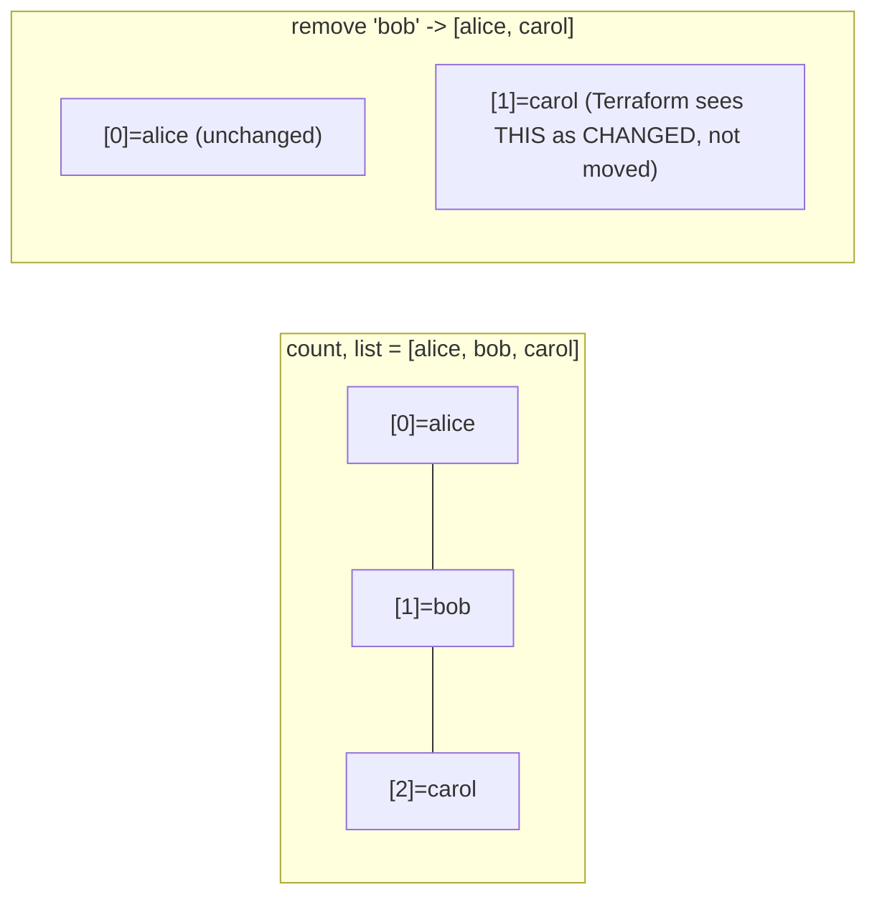
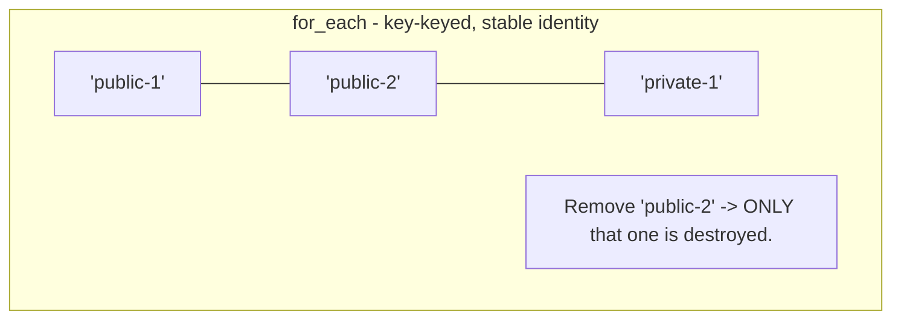
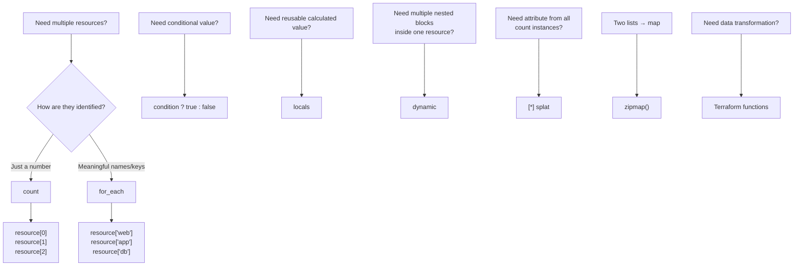

# Domain 4B — Dynamic Configuration

## What this domain covers

This domain focuses on how Terraform can create **dynamic and reusable configurations** instead of forcing you to repeat the same blocks again and again.

The important topics are:

1. `count`
2. `for_each`
3. Conditional expressions
4. Terraform functions
5. Local values
6. Dynamic blocks
7. Splat expressions
8. `zipmap()`

---

# 1. `count`

## What is `count`?

`count` is a **meta-argument** understood directly by Terraform Core.

It allows one resource block to create **multiple instances** of that resource.

Without `count`, if you wanted 3 EC2 instances, you would have to write:

```hcl
resource "aws_instance" "worker_1" {
  # ...
}

resource "aws_instance" "worker_2" {
  # ...
}

resource "aws_instance" "worker_3" {
  # ...
}
```

This is repetitive and difficult to maintain.

With `count`:

```hcl
resource "aws_instance" "worker" {
  count = 3

  ami           = var.ami_id
  instance_type = "t3.micro"

  tags = {
    Name = "worker-${count.index}"
  }
}
```

One block creates three instances:

```text
aws_instance.worker[0]
aws_instance.worker[1]
aws_instance.worker[2]
```

So the basic idea is:

> **`count` = create N copies of a resource.**

---

## `count.index`

When you use `count`, Terraform gives each instance a numeric index.

For:

```hcl
count = 3
```

the indexes are:

```text
0
1
2
```

Inside the resource, you access the current index using:

```hcl
count.index
```

For example:

```hcl
tags = {
  Name = "worker-${count.index}"
}
```

Terraform therefore produces:

```text
worker-0
worker-1
worker-2
```

You can also reference a particular instance from somewhere else:

```hcl
aws_instance.worker[0].id
aws_instance.worker[1].public_ip
```

### Important

`count.index` tells Terraform:

> "Which copy of this resource am I currently creating?"

---

# Using a variable with `count`

Instead of hardcoding:

```hcl
count = 3
```

you can make the number configurable.

```hcl
variable "worker_count" {
  type    = number
  default = 3
}

resource "aws_instance" "worker" {
  count         = var.worker_count
  ami           = var.ami_id
  instance_type = "t3.micro"

  tags = {
    Name = "worker-${count.index}"
  }
}
```

Now:

```text
worker_count = 3
```

creates 3 instances.

Changing it to:

```text
worker_count = 10
```

creates 10 instances.

You don't need to write seven additional resource blocks.

---

# `count` for optional resources

One of the most useful patterns with `count` is creating a resource **only when required**.

For example, suppose an Elastic IP should be optional.

```hcl
variable "create_eip" {
  type    = bool
  default = false
}

resource "aws_eip" "web" {
  count    = var.create_eip ? 1 : 0
  instance = aws_instance.web.id
  domain   = "vpc"
}
```

The expression:

```hcl
var.create_eip ? 1 : 0
```

means:

```text
true  → count = 1 → create EIP
false → count = 0 → don't create EIP
```

So `count` can be used for both:

```text
count = 5
```

→ create 5 resources

and:

```text
count = condition ? 1 : 0
```

→ create either 1 or 0 resources.

---

## Important problem when `count = 0`

If the resource doesn't exist, this doesn't work:

```hcl
aws_eip.web[0].public_ip
```

because there is no `[0]`.

You need to protect the reference:

```hcl
output "eip" {
  value = var.create_eip ? aws_eip.web[0].public_ip : null
}
```

If:

```text
create_eip = true
```

Terraform accesses:

```text
aws_eip.web[0]
```

If:

```text
create_eip = false
```

Terraform returns:

```text
null
```

### Exam trap

A resource with:

```hcl
count = 0
```

has **zero instances**.

Therefore:

```hcl
resource[0]
```

is invalid.

---

# The biggest problem with `count`: index instability

This is one of the most important concepts in this entire section.

Suppose you have:

```hcl
variable "usernames" {
  type    = list(string)

  default = [
    "alice",
    "bob",
    "carol"
  ]
}

resource "aws_iam_user" "team" {
  count = length(var.usernames)
  name  = var.usernames[count.index]
}
```

Terraform sees:

```text
[0] → alice
[1] → bob
[2] → carol
```

So:

```text
aws_iam_user.team[0] = alice
aws_iam_user.team[1] = bob
aws_iam_user.team[2] = carol
```

Now Bob leaves.

You change the list to:

```hcl
default = [
  "alice",
  "carol"
]
```

You might logically think:

> "I only removed Bob."

But Terraform doesn't identify these users by their names.

It identifies them by their **indexes**.

Before:

```text
[0] = alice
[1] = bob
[2] = carol
```

After:

```text
[0] = alice
[1] = carol
```

Terraform sees:

```text
[0] → alice      unchanged
[1] → bob        changed to carol
[2] → carol      no longer exists
```

So Terraform may propose changes to resources that you never intended to touch.



### Why is this dangerous?

Terraform is comparing:

```text
index [1]
```

before and after.

It does **not** think:

> "Bob disappeared, so I'll delete Bob."

Instead it sees:

```text
[1] was bob
[1] is now carol
```

That can result in destroy/recreate behavior.

In a real system, this can cause:

* resource recreation
* new IDs/ARNs
* policy attachment problems
* changed access keys
* service interruptions

This is why using `count` with a list of uniquely identifiable objects can be dangerous.

---

## The fix: `for_each`

Instead of identifying users by position:

```text
[0]
[1]
[2]
```

identify them by their actual names:

```text
["alice"]
["bob"]
["carol"]
```

```hcl
resource "aws_iam_user" "team" {
  for_each = toset(var.usernames)

  name = each.value
}
```

Now removing Bob means:

```text
alice → unchanged
bob   → destroy
carol → unchanged
```

Only Bob is affected.

---

# When should you use `count`?

Use `count` when the instances are essentially **interchangeable** and the important thing is simply the number.

Good examples:

```text
Create 5 identical worker nodes
Create 3 identical instances
Create 0 or 1 optional resource
```

Think:

> **"How many?" → `count`**

If each instance has a meaningful identity such as:

```text
alice
bob
carol

web
app
db

public-1
public-2
private-1
```

then `for_each` is usually the better choice.

---

# 2. `for_each`

## What is `for_each`?

`for_each` is another Terraform meta-argument used to create multiple resource instances.

The key difference is:

* `count` → instances are identified by **numbers**
* `for_each` → instances are identified by **keys**

`for_each` works with:

* `map`
* `set(string)`

---

## Simple `for_each` example

```hcl
variable "usernames" {
  type = set(string)

  default = [
    "alice",
    "bob",
    "carol"
  ]
}

resource "aws_iam_user" "team" {
  for_each = var.usernames

  name = each.value
}
```

Terraform creates:

```text
aws_iam_user.team["alice"]
aws_iam_user.team["bob"]
aws_iam_user.team["carol"]
```

Notice that the identity is the username itself.

---

## `each.key` and `each.value`

Inside a `for_each` resource:

```hcl
each.key
```

means the key.

```hcl
each.value
```

means the value.

For a set:

```text
alice
bob
carol
```

the key/value are effectively the same string.

For a map, they can be different.

---

# `for_each` with a map

This is where `for_each` becomes especially useful.

Suppose you want to create subnets:

```hcl
variable "subnets" {
  type = map(object({
    cidr = string
    az   = string
  }))

  default = {
    "public-1" = {
      cidr = "10.0.1.0/24"
      az   = "ap-south-1a"
    }

    "public-2" = {
      cidr = "10.0.2.0/24"
      az   = "ap-south-1b"
    }

    "private-1" = {
      cidr = "10.0.101.0/24"
      az   = "ap-south-1a"
    }
  }
}
```

Then:

```hcl
resource "aws_subnet" "this" {
  for_each = var.subnets

  vpc_id            = aws_vpc.main.id
  cidr_block        = each.value.cidr
  availability_zone = each.value.az

  tags = {
    Name = each.key
  }
}
```

Terraform creates:

```text
aws_subnet.this["public-1"]
aws_subnet.this["public-2"]
aws_subnet.this["private-1"]
```

For:

```text
public-1
```

we have:

```text
each.key   = "public-1"
each.value = {
    cidr = "10.0.1.0/24"
    az   = "ap-south-1a"
}
```

Therefore:

```hcl
each.value.cidr
```

gives:

```text
10.0.1.0/24
```

and:

```hcl
each.value.az
```

gives:

```text
ap-south-1a
```

---

## Why `for_each` is safer for named resources

Suppose:

```text
public-1
public-2
private-1
```

and you remove:

```text
public-2
```

Terraform sees:

```text
public-1 → still exists
public-2 → removed
private-1 → still exists
```

Only:

```text
aws_subnet.this["public-2"]
```

is destroyed.



This is the fundamental advantage over `count`.

---

# `for_each` cannot directly use a list

This is an important exam point.

This is invalid:

```hcl
for_each = var.team_names
```

if:

```hcl
variable "team_names" {
  type = list(string)
}
```

`for_each` expects:

```text
map
```

or:

```text
set(string)
```

So convert the list to a set:

```hcl
for_each = toset(var.team_names)
```

Example:

```hcl
variable "team_names" {
  type = list(string)

  default = [
    "alice",
    "bob",
    "carol"
  ]
}

resource "aws_iam_user" "team" {
  for_each = toset(var.team_names)

  name = each.value
}
```

### Why does Terraform require this?

A list is position-based:

```text
[0] = alice
[1] = bob
[2] = carol
```

A set provides unique values that can serve as identities:

```text
alice
bob
carol
```

Terraform therefore forces you to explicitly decide how the resources should be identified.

---

# `count` vs `for_each`

|                      | `count`                             | `for_each`                         |
| -------------------- | ----------------------------------- | ---------------------------------- |
| Identity             | Numeric index                       | Key/value                          |
| Example              | `[0]`, `[1]`                        | `["web"]`, `["db"]`                |
| Input                | Number                              | Map or set(string)                 |
| Best for             | Number of interchangeable resources | Resources with meaningful identity |
| Removing middle item | Can cause index shifting            | Safe                               |
| Optional resource    | Excellent                           | Possible, but `count` is simpler   |
| Typical example      | 5 identical workers                 | `web`, `app`, `db`                 |

### Exam rule

Ask:

> **Does each resource have a meaningful identity?**

If **no**, and you just need N copies:

```text
count
```

If **yes**:

```text
for_each
```

---

# 3. Conditional Expressions

Terraform doesn't have a traditional imperative:

```text
if (...) {
}
else {
}
```

Instead, Terraform uses the **conditional/ternary expression**:

```hcl
condition ? true_value : false_value
```

Think:

```text
IF condition is true
    use true_value
ELSE
    use false_value
```

---

## Example: different instance size by environment

```hcl
resource "aws_instance" "app" {
  instance_type = var.environment == "prod"
    ? "t3.large"
    : "t3.micro"
}
```

If:

```text
environment = "prod"
```

then:

```text
t3.large
```

Otherwise:

```text
t3.micro
```

---

## Conditional fallback

Suppose the user may optionally provide an AMI.

```hcl
locals {
  effective_ami = var.ami_id != ""
    ? var.ami_id
    : data.aws_ami.amazon_linux.id
}
```

Meaning:

```text
ami_id supplied?
       |
   yes | no
       |
   use it | use data source AMI
```

This lets one configuration work with either:

* explicitly supplied AMI
* automatically selected AMI

---

# Conditional resource creation

You can combine conditionals with `count`.

```hcl
resource "aws_eip" "web" {
  count = var.create_eip ? 1 : 0

  instance = aws_instance.web.id
  domain   = "vpc"
}
```

And then safely reference it:

```hcl
output "eip_address" {
  value = var.create_eip
    ? aws_eip.web[0].public_ip
    : null
}
```

The guard is important.

Without:

```hcl
var.create_eip ? ... : null
```

Terraform could try:

```hcl
aws_eip.web[0]
```

when there are zero EIPs.

That causes an error such as:

```text
Invalid index: index 0 out of range
```

---

## Conditional expressions: remember this

```hcl
condition ? value_if_true : value_if_false
```

Common uses:

```text
Choose instance size
Choose AMI
Choose backup retention
Enable/disable a resource
Select environment-specific configuration
```

---

# 4. Terraform Functions

Terraform provides many **built-in functions** that allow you to transform and calculate values.

Examples include functions for:

* strings
* lists
* maps
* numbers
* encoding
* IP/CIDR calculations
* files
* templates

For the exam, understand what the commonly used functions do.

---

## Important Terraform functions

| Function         | Example                       | Purpose                          |
| ---------------- | ----------------------------- | -------------------------------- |
| `length()`       | `length(["a","b"])`           | Number of elements               |
| `join()`         | `join("-", ["web","prod"])`   | List → string                    |
| `split()`        | `split(",", "a,b,c")`         | String → list                    |
| `merge()`        | `merge(map1,map2)`            | Combine maps                     |
| `lookup()`       | `lookup(map,key,default)`     | Get map value/fallback           |
| `element()`      | `element(list,1)`             | Get element                      |
| `concat()`       | `concat(list1,list2)`         | Combine lists                    |
| `contains()`     | `contains(list,"a")`          | Check whether value exists       |
| `coalesce()`     | `coalesce(null,"x")`          | First non-null value             |
| `file()`         | `file("script.sh")`           | Read file contents               |
| `templatefile()` | `templatefile("x.tpl", vars)` | Render template                  |
| `jsonencode()`   | `jsonencode({a=1})`           | Terraform value → JSON           |
| `zipmap()`       | `zipmap(keys,values)`         | Two lists → map                  |
| `slice()`        | `slice(list,0,2)`             | Extract part of list             |
| `toset()`        | `toset(["a","a"])`            | Convert to set/remove duplicates |
| `cidrhost()`     | `cidrhost("10.0.0.0/24",5)`   | Calculate host IP                |
| `timestamp()`    | `timestamp()`                 | Current UTC timestamp            |

---

# `length()`

Returns the number of elements.

```hcl
length(["a", "b", "c"])
```

Result:

```text
3
```

Common use:

```hcl
count = length(var.instances)
```

---

# `join()`

Combines list elements into one string.

```hcl
join("-", ["web", "prod"])
```

Result:

```text
"web-prod"
```

---

# `split()`

Does the opposite.

```hcl
split(",", "a,b,c")
```

Result:

```text
["a", "b", "c"]
```

---

# `merge()`

Combines maps.

```hcl
merge(
  { a = 1 },
  { b = 2 }
)
```

Result:

```text
{
  a = 1
  b = 2
}
```

## Very important: later values win

Suppose:

```hcl
merge(
  { Env = "dev" },
  { Env = "prod" }
)
```

The result is:

```text
Env = "prod"
```

because the second/later map overrides the earlier value.

### Exam trap

Order matters.

```hcl
merge(
  { Env = "dev" },
  { Env = "prod" }
)
```

→ `prod`

But:

```hcl
merge(
  { Env = "prod" },
  { Env = "dev" }
)
```

→ `dev`

So remember:

> **`merge()` is right-biased: the later argument wins.**

---

## Practical `merge()` example

```hcl
locals {
  common_tags = {
    Project  = "terraform-course"
    Owner    = "Deepak"
    ManagedBy = "terraform"
  }
}

resource "aws_instance" "web" {
  tags = merge(
    local.common_tags,
    {
      Name = "web-server"
    }
  )
}
```

The resulting tags contain:

```text
Project
Owner
ManagedBy
Name
```

This allows common tags to be defined once and resource-specific tags to be added separately.

---

# `lookup()`

Gets a value from a map.

Example:

```hcl
lookup(
  {
    dev  = "t3.micro"
    prod = "t3.large"
  },
  "prod",
  "t3.micro"
)
```

Result:

```text
t3.large
```

If the requested key doesn't exist, the third argument acts as the fallback.

---

# `contains()`

Checks whether a collection contains a value.

```hcl
contains(
  ["dev", "staging", "prod"],
  "prod"
)
```

Result:

```text
true
```

---

# `coalesce()`

Returns the first non-null value.

```hcl
coalesce(null, "", "x")
```

The exact handling of empty strings depends on the values supplied, but the key idea to remember is:

> `coalesce()` searches for the first usable non-null value.

---

# `toset()`

Converts a collection into a set.

```hcl
toset(["alice", "alice", "bob"])
```

Result is a set containing:

```text
alice
bob
```

Duplicates are removed.

A common use is:

```hcl
for_each = toset(var.usernames)
```

when `var.usernames` is a list.

---

# `templatefile()`

`templatefile()` reads a template file and substitutes values into it.

Example:

```hcl
resource "aws_instance" "web" {
  user_data = templatefile(
    "${path.module}/init.sh.tpl",
    {
      app_env  = var.environment
      app_port = 8080
    }
  )
}
```

Template:

```bash
#!/bin/bash

echo "Starting app in ${app_env} mode on port ${app_port}"
```

If:

```text
environment = "prod"
```

the generated script contains the corresponding value.

### Why use this?

Instead of creating separate scripts:

```text
dev-script
staging-script
prod-script
```

you can have one template and inject environment-specific values.

---

# `jsonencode()`

Converts a Terraform value into JSON.

```hcl
jsonencode({
  name = "web"
})
```

Produces a JSON string representation.

This is particularly useful when an AWS/API argument expects JSON.

---

# 5. Local Values

## What is a local?

A `local` is a value that Terraform **calculates internally** and lets you reuse throughout the configuration.

Example:

```hcl
locals {
  name_prefix = "${var.project}-${var.environment}"
}
```

You can then use:

```hcl
local.name_prefix
```

throughout your configuration.

---

# Variable vs Local

This distinction is important.

|                                    | Variable          | Local                      |
| ---------------------------------- | ----------------- | -------------------------- |
| Who provides it?                   | Caller/user       | Terraform configuration    |
| Purpose                            | External input    | Internal calculation/reuse |
| Example                            | `var.environment` | `local.name_prefix`        |
| Can depend on resource attributes? | No                | Yes                        |
| Main idea                          | Input             | Computed value             |

Think:

```text
variable = "What information does the caller give Terraform?"

local = "What value does Terraform calculate and reuse internally?"
```

---

## Example: common naming convention

```hcl
locals {
  name_prefix = "${var.project}-${var.environment}"

  common_tags = {
    Project     = var.project
    Environment = var.environment
    ManagedBy   = "terraform"
  }
}
```

Then:

```hcl
resource "aws_instance" "web" {
  tags = merge(
    local.common_tags,
    {
      Name = "${local.name_prefix}-web"
    }
  )
}
```

And:

```hcl
resource "aws_eip" "web" {
  tags = merge(
    local.common_tags,
    {
      Name = "${local.name_prefix}-eip"
    }
  )
}
```

Instead of repeating:

```hcl
"${var.project}-${var.environment}"
```

everywhere, you calculate it once.

This is the **DRY principle**:

> Don't repeat the same logic in many places.

---

# A local can reference resource attributes

This is an important difference between variables and locals.

```hcl
locals {
  web_url = "https://${aws_lb.app.dns_name}"
}
```

Then:

```hcl
output "app_url" {
  value = local.web_url
}
```

The local is calculated using:

```hcl
aws_lb.app.dns_name
```

which is an attribute of a resource.

A variable cannot be used this way because a variable represents input supplied to the configuration rather than a value calculated from created resources.

---

# Locals for reusable conditional logic

Suppose several resources need to know whether the environment is production.

Instead of repeating:

```hcl
var.environment == "prod"
```

everywhere:

```hcl
locals {
  is_prod          = var.environment == "prod"
  instance_type    = local.is_prod ? "t3.large" : "t3.micro"
  backup_retention = local.is_prod ? 30 : 3
  enable_multi_az  = local.is_prod
}
```

Now multiple resources can use:

```hcl
local.instance_type
local.backup_retention
local.enable_multi_az
```

This gives you a single source of truth.

---

# 6. Dynamic Blocks

This is another very important exam concept.

Sometimes a resource contains **nested blocks**.

For example:

```hcl
resource "aws_security_group" "web" {

  ingress {
    # rule 1
  }

  ingress {
    # rule 2
  }

  ingress {
    # rule 3
  }
}
```

Here:

```text
aws_security_group
    |
    +-- ingress
    +-- ingress
    +-- ingress
```

These `ingress` blocks are nested inside one resource.

The problem is:

> What if the number of ingress rules is variable?

You don't want to manually write:

```text
ingress
ingress
ingress
ingress
...
```

for every environment.

This is where `dynamic` blocks are useful.

---

# `dynamic` block example

Define the rules as data:

```hcl
variable "ingress_rules" {
  type = list(object({
    port        = number
    cidr        = string
    description = string
  }))

  default = [
    {
      port        = 22
      cidr        = "10.0.0.0/16"
      description = "SSH internal"
    },
    {
      port        = 80
      cidr        = "0.0.0.0/0"
      description = "HTTP public"
    },
    {
      port        = 443
      cidr        = "0.0.0.0/0"
      description = "HTTPS public"
    }
  ]
}
```

Then:

```hcl
resource "aws_security_group" "web" {
  name   = "web-sg"
  vpc_id = aws_vpc.main.id

  dynamic "ingress" {
    for_each = var.ingress_rules

    content {
      from_port   = ingress.value.port
      to_port     = ingress.value.port
      protocol    = "tcp"
      cidr_blocks = [ingress.value.cidr]
      description = ingress.value.description
    }
  }
}
```

Terraform generates one `ingress` block for every item in:

```hcl
var.ingress_rules
```

So three objects produce three ingress blocks.

If you add another object:

```hcl
{
  port        = 3389
  cidr        = "10.0.10.0/24"
  description = "RDP"
}
```

Terraform generates a fourth `ingress` block.

You don't have to modify the resource block.

---

# The most important `dynamic` distinction

Do not confuse:

```text
for_each
```

with:

```text
dynamic
```

### `for_each` on a resource

Creates **multiple resource instances**.

```hcl
resource "aws_iam_user" "team" {
  for_each = var.users
}
```

Result:

```text
aws_iam_user.team["alice"]
aws_iam_user.team["bob"]
aws_iam_user.team["carol"]
```

### `dynamic` block

Creates **multiple nested blocks inside ONE resource**.

```hcl
resource "aws_security_group" "web" {

  dynamic "ingress" {
    for_each = var.ingress_rules

    content {
      # ...
    }
  }
}
```

Result conceptually:

```text
aws_security_group.web
    |
    +-- ingress
    +-- ingress
    +-- ingress
```

### Exam memory

> **Multiple resources → `count` / `for_each`**

> **Multiple nested blocks inside one resource → `dynamic`**

---

# Conditional dynamic block

You can also use `dynamic` to optionally create a nested block.

Example:

```hcl
dynamic "ebs_block_device" {
  for_each = var.attach_extra_disk ? [1] : []

  content {
    device_name = "/dev/sdh"
    volume_size = 100
  }
}
```

If:

```text
attach_extra_disk = true
```

then:

```hcl
[1]
```

contains one element → one block is created.

If:

```text
attach_extra_disk = false
```

then:

```hcl
[]
```

contains zero elements → no block is created.

This is similar to:

```hcl
count = var.x ? 1 : 0
```

but for a **nested block**.

---

# 7. Splat Expressions

A splat expression is a convenient way of saying:

> "Give me this attribute from every instance."

The common syntax is:

```hcl
[*]
```

---

## Splat with `count`

Suppose:

```hcl
resource "aws_instance" "web" {
  count = 3

  # ...
}
```

You want all three public IP addresses.

Without splat, you could use a `for` expression:

```hcl
[for i in aws_instance.web : i.public_ip]
```

With splat:

```hcl
aws_instance.web[*].public_ip
```

Much shorter.

Example:

```hcl
output "all_ips" {
  value = aws_instance.web[*].public_ip
}
```

Result:

```text
[
  "10.0.1.10",
  "10.0.1.11",
  "10.0.1.12"
]
```

---

# Splat and `for_each`

There is an important difference.

A `count` resource behaves like a list:

```text
resource[0]
resource[1]
resource[2]
```

A `for_each` resource behaves like a map:

```text
resource["web"]
resource["app"]
resource["db"]
```

Therefore, this:

```hcl
aws_instance.web[*].public_ip
```

works naturally for `count`.

But directly using the same form for a `for_each` resource doesn't work in the same way.

For `for_each`, use:

```hcl
values(aws_instance.web)[*].public_ip
```

`values()` first converts the map of resource instances into a list of values, and then the splat can operate on that list.

---

## Splat mental model

```text
count-based resource
        |
        v
resource[*].attribute
        |
        v
attribute from ALL instances
```

Example:

```hcl
aws_instance.web[*].id
```

means:

```text
Give me the ID of every instance.
```

---

# Splat vs `for` expression

These are conceptually equivalent for simple attribute extraction:

```hcl
aws_instance.web[*].public_ip
```

and:

```hcl
[for i in aws_instance.web : i.public_ip]
```

Splat is basically a convenient shorthand.

Use a full `for` expression when you need more complicated processing, such as:

* filtering
* transforming
* conditional selection

---

# 8. `zipmap()`

## What does `zipmap()` do?

`zipmap()` takes:

```text
one list of keys
+
one list of values
```

and creates a map.

Example:

```hcl
zipmap(
  ["web", "app", "db"],
  ["t3.micro", "t3.small", "t3.medium"]
)
```

Result:

```text
{
  web = "t3.micro"
  app = "t3.small"
  db  = "t3.medium"
}
```

So:

```text
keys:
web
app
db

values:
t3.micro
t3.small
t3.medium
```

becomes:

```text
web → t3.micro
app → t3.small
db  → t3.medium
```

---

# Why would you use `zipmap()`?

It's particularly useful when some external source gives you two separate lists.

For example:

```hcl
var.server_names
var.instance_types
```

Suppose:

```text
server_names   = ["web", "app", "db"]
instance_types = ["t3.micro", "t3.small", "t3.medium"]
```

You can create:

```hcl
local.servers = zipmap(
  var.server_names,
  var.instance_types
)
```

Result:

```text
{
  web = "t3.micro"
  app = "t3.small"
  db  = "t3.medium"
}
```

Now that map can potentially be used with `for_each`.

---

# Don't confuse `zipmap()` with good variable design

If you are designing your own variable from scratch, a structured map/object is usually clearer than maintaining two parallel lists.

Instead of:

```text
names  = ["web", "app", "db"]
types  = ["t3.micro", "t3.small", "t3.medium"]
```

prefer something like:

```hcl
servers = {
  web = {
    instance_type = "t3.micro"
  }

  app = {
    instance_type = "t3.small"
  }

  db = {
    instance_type = "t3.medium"
  }
}
```

`zipmap()` is therefore most useful when the **input data is already provided as separate lists** and you need to convert it.

---

# Final Mental Model



---

# Exam Cheat Sheet

## `count`

```hcl
count = 3
```

**Think:** How many?

Creates:

```text
resource[0]
resource[1]
resource[2]
```

Use when resources are interchangeable.

### Biggest trap

`count` uses **indexes**.

Removing an item from the middle of a list can shift indexes and cause unwanted changes/recreation.

---

## `count.index`

```hcl
count.index
```

Gives the current numeric instance index.

---

## `for_each`

```hcl
for_each = var.users
```

**Think:** Which named resources?

Creates:

```text
resource["alice"]
resource["bob"]
resource["carol"]
```

Use with:

```text
map
set(string)
```

Not a plain list.

For a list:

```hcl
for_each = toset(var.users)
```

---

## `each.key`

The key of the current `for_each` iteration.

```hcl
each.key
```

---

## `each.value`

The value of the current `for_each` iteration.

```hcl
each.value
```

---

## `count` vs `for_each`

```text
count
  ↓
How many?
  ↓
Numeric identity
  ↓
[0], [1], [2]
```

```text
for_each
  ↓
Which named items?
  ↓
Key-based identity
  ↓
["web"], ["app"], ["db"]
```

---

## Conditional expression

```hcl
condition ? true_value : false_value
```

Think:

```text
if condition → true_value
else         → false_value
```

---

## Functions

Functions transform or calculate values.

Remember common ones:

```text
length()       → number of elements
join()         → list → string
split()        → string → list
merge()        → combine maps
lookup()       → map lookup/fallback
concat()       → combine lists
contains()     → check membership
coalesce()     → first non-null value
toset()        → convert to set
templatefile() → render template
jsonencode()   → Terraform value → JSON
zipmap()       → two lists → map
```

### `merge()` trap

```hcl
merge(
  { Env = "dev" },
  { Env = "prod" }
)
```

Result:

```text
Env = "prod"
```

**Later argument wins.**

---

## Local

```hcl
locals {
  name = "something"
}
```

Think:

> **Internal calculated/reusable value.**

Variable:

```text
external input
```

Local:

```text
internal calculation/reuse
```

---

## Dynamic block

```hcl
dynamic "ingress" {
  for_each = var.rules

  content {
    # ...
  }
}
```

Think:

> **Repeat nested blocks inside one resource.**

Very important distinction:

```text
count / for_each
    ↓
multiple resources
```

```text
dynamic
    ↓
multiple nested blocks
inside one resource
```

---

## Splat

```hcl
aws_instance.web[*].public_ip
```

Think:

> **Give me this attribute from every count-based instance.**

For a `for_each` resource:

```hcl
values(aws_instance.web)[*].public_ip
```

---

## `zipmap()`

```hcl
zipmap(
  ["web", "app", "db"],
  ["t3.micro", "t3.small", "t3.medium"]
)
```

Think:

> **Two lists → one map.**

Result:

```text
web → t3.micro
app → t3.small
db  → t3.medium
```

---

# The 8 things to remember for the exam

```text
1. count     = N resource instances
2. count.index = numeric index of current instance
3. for_each  = one resource per map key/set value
4. conditional = condition ? true : false
5. function  = transform/calculate values
6. local     = internally calculated reusable value
7. dynamic   = repeat nested blocks
8. splat     = attribute from all instances
9. zipmap    = two lists → map
```

### One final memory trick

> **`count` = HOW MANY**
> **`for_each` = WHICH ONES**
> **conditional = WHICH VALUE**
> **function = TRANSFORM**
> **local = REUSE CALCULATED VALUE**
> **dynamic = REPEAT NESTED BLOCKS**
> **splat = GET FROM ALL**
> **zipmap = TWO LISTS → MAP**
