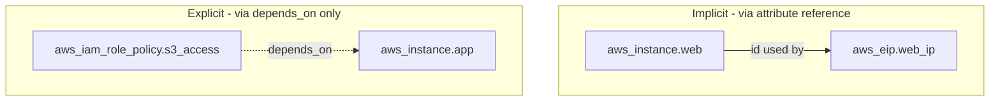
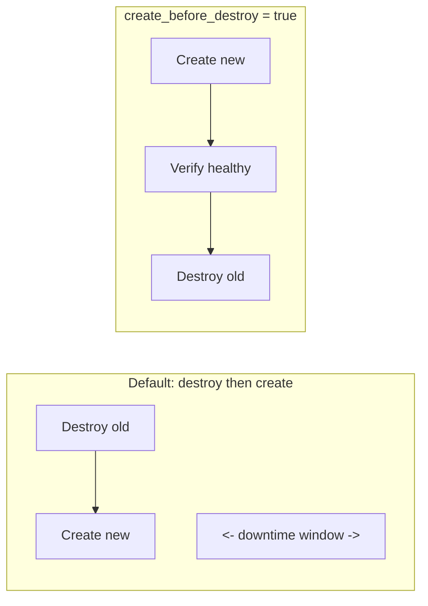

# Domain 4C — Dependencies, Lifecycle, Validation & Secrets

## What this domain covers

This domain covers four major areas:

1. **Resource dependencies**

   * Implicit dependencies
   * Explicit dependencies using `depends_on`

2. **Lifecycle behavior**

   * `create_before_destroy`
   * `prevent_destroy`
   * `ignore_changes`

3. **Configuration validation**

   * Variable validation
   * Preconditions
   * Postconditions
   * `check` blocks

4. **Resource refactoring and secrets**

   * `moved` blocks
   * `sensitive`
   * HashiCorp Vault
   * Ephemeral values
   * Write-only arguments

---

# 1. Resource Dependencies

## Why do dependencies matter?

Terraform doesn't simply execute your `.tf` files from top to bottom.

Instead, Terraform builds a **dependency graph**.

The graph tells Terraform:

> "Resource B depends on Resource A, so A must be available before B can be created."

For example:

```hcl id="b8xk5f"
resource "aws_instance" "web" {
  ami = var.ami_id
}

resource "aws_eip" "web_ip" {
  instance = aws_instance.web.id
  domain   = "vpc"
}
```

The EIP uses:

```hcl id="w9jv0e"
aws_instance.web.id
```

Therefore Terraform understands:

```text id="n0h2w9"
EC2 instance
     ↓
EIP
```

The EC2 instance has to exist first because Terraform needs its ID.

There are two ways Terraform knows about dependencies:

```text id="t2z6d0"
1. Implicit dependency
2. Explicit dependency
```

---

# 2. Implicit Dependencies

## What is an implicit dependency?

An implicit dependency is created automatically when one resource references an attribute of another resource.

Example:

```hcl id="d8t7fs"
resource "aws_instance" "web" {
  ami           = var.ami_id
  instance_type = "t3.micro"
}

resource "aws_eip" "web_ip" {
  instance = aws_instance.web.id
  domain   = "vpc"
}
```

The important line is:

```hcl id="9kq3c1"
instance = aws_instance.web.id
```

Terraform sees the reference and automatically creates the dependency:

```text id="5ghpab"
aws_instance.web
       ↓
aws_eip.web_ip
```

So Terraform creates the instance first and then the EIP.

### You don't need:

```hcl id="y3qk4u"
depends_on = [aws_instance.web]
```

because the reference already tells Terraform about the dependency.

---

## Why is this called "implicit"?

Because **you never explicitly told Terraform about the dependency**.

You simply wrote the value that one resource needs:

```hcl id="r4b4zh"
aws_instance.web.id
```

Terraform inferred the dependency from that reference.

---

## Exam rule

If Terraform can determine the dependency from a resource attribute reference:

> **Prefer the implicit dependency.**

It is clearer because the relationship is visible directly in the configuration.

---

# 3. Explicit Dependencies — `depends_on`

Sometimes there is a dependency that Terraform **cannot discover from resource arguments**.

This happens when the dependency exists because of some external/runtime behavior rather than a direct attribute reference.

In that situation, use:

```hcl id="kqyt7c"
depends_on = [...]
```

---

## Example

Suppose an EC2 instance has an IAM role.

An IAM policy must be attached to that role before the application starts.

```hcl id="k3nq1v"
resource "aws_iam_role_policy" "s3_access" {
  role   = aws_iam_role.app.id
  policy = data.aws_iam_policy_document.s3_read.json
}

resource "aws_instance" "app" {
  ami           = var.ami_id
  instance_type = "t3.micro"

  depends_on = [
    aws_iam_role_policy.s3_access
  ]
}
```

The EC2 configuration itself might not contain an attribute such as:

```hcl id="s3x7dr"
policy = aws_iam_role_policy.s3_access.something
```

But there is still a real operational requirement:

```text id="8o9f8p"
IAM policy attached
       ↓
EC2 application starts
```

Terraform cannot infer that requirement simply from the arguments.

So we explicitly tell Terraform:

```hcl id="pjw6t5"
depends_on = [aws_iam_role_policy.s3_access]
```

---

# Implicit vs Explicit



### Simple distinction

**Implicit:**

```hcl id="q1h7vb"
instance = aws_instance.web.id
```

Terraform automatically understands the dependency.

**Explicit:**

```hcl id="2h1s8x"
depends_on = [aws_iam_role_policy.s3_access]
```

You explicitly tell Terraform about a dependency that isn't visible through an attribute reference.

---

# Which one should you prefer?

### Prefer implicit dependencies

When possible:

```hcl id="7od5g0"
subnet_id = aws_subnet.public.id
```

is better than:

```hcl id="r0qj3z"
subnet_id = "subnet-123456"
depends_on = [aws_subnet.public]
```

The reference itself tells Terraform exactly what value is needed and therefore why the dependency exists.

### Use `depends_on` when the dependency is hidden

For example:

```text id="j6a9st"
Application startup
       ↓
assumes IAM policy already attached
```

but there is no direct attribute reference connecting the two.

---

## Exam trap: don't add `depends_on` everywhere

You might think:

> "I'll just add `depends_on` to everything to be safe."

Don't.

If Terraform can already infer the dependency, adding `depends_on` is usually unnecessary.

The configuration becomes harder to understand because someone reading the code has to search through `depends_on` declarations to figure out why resources are ordered that way.

### Mental model

> **Reference when you can. `depends_on` when you must.**

---

# 4. Lifecycle Meta-Arguments

Terraform normally decides how a resource should be changed.

Sometimes, however, you need to control **how Terraform performs the change**.

That's what the `lifecycle` block is for.

Example:

```hcl id="r6h7np"
resource "aws_instance" "web" {

  lifecycle {
    # lifecycle settings
  }
}
```

The important lifecycle arguments in this domain are:

```text id="i2s3jg"
create_before_destroy
prevent_destroy
ignore_changes
```

---

# 5. `create_before_destroy`

## The problem

Sometimes a change cannot be made in place.

Terraform must:

```text id="7x2v9q"
destroy old resource
create new resource
```

By default, replacement is generally:

```text id="f4e9ce"
Destroy old
     ↓
Create new
```

That can create a period of downtime.

---

## `create_before_destroy = true`

This reverses the replacement order:

```hcl id="t2h5qf"
resource "aws_launch_template" "app" {
  name_prefix   = "app-"
  image_id      = var.ami_id
  instance_type = "t3.micro"

  lifecycle {
    create_before_destroy = true
  }
}
```

Terraform tries to:

```text id="u9m6as"
Create new
     ↓
Verify/complete new resource
     ↓
Destroy old
```



---

## When is this useful?

Use it when the old resource needs to remain available until the replacement is ready.

For example:

```text id="w8n5eg"
Old launch template
        ↓
ASG depends on it
```

If you destroy the old template first, there may temporarily be no valid template available.

With:

```hcl id="2x4zpf"
create_before_destroy = true
```

Terraform creates the replacement first.

---

## Important limitation

`create_before_destroy` does **not magically guarantee zero downtime** for every resource.

It changes the replacement order.

Whether zero downtime is actually possible depends on the resource and its dependencies.

For the exam, remember:

> **`create_before_destroy` = create replacement first, then destroy old resource.**

---

# 6. `prevent_destroy`

## What does it do?

`prevent_destroy` tells Terraform:

> **"Do not allow this resource to be destroyed."**

Example:

```hcl id="qz1u9k"
resource "aws_db_instance" "prod" {

  lifecycle {
    prevent_destroy = true
  }
}
```

If a Terraform operation would destroy this database, Terraform produces an error instead of performing the destruction.

This also protects against:

```text id="a6f0s1"
terraform destroy
```

for that resource.

---

## Why is this useful?

Production databases are a classic example.

You may want Terraform to manage the database but make accidental destruction much harder.

```text id="c7b2q4"
Production DB
     ↓
prevent_destroy = true
     ↓
Terraform refuses destructive operation
```

---

## Important exam point

`prevent_destroy` is not:

> "Terraform will never destroy this resource under any circumstances."

It means:

> Terraform will refuse a plan that requires destruction **while that lifecycle rule exists**.

If you deliberately remove the lifecycle rule from the configuration, you can then allow the resource to be destroyed.

---

## Exam memory

```hcl id="6r9p1x"
lifecycle {
  prevent_destroy = true
}
```

means:

> **Protect this resource from Terraform destruction.**

---

# 7. `ignore_changes`

Sometimes another system intentionally changes an attribute that Terraform manages.

That creates a problem.

Suppose Terraform says:

```hcl id="u6p1ya"
desired_capacity = 3
```

but an external autoscaling mechanism changes it to:

```text id="v6a8qt"
desired_capacity = 10
```

Terraform sees the difference during the next plan:

```text id="m4s1fv"
Terraform configuration: 3
Real infrastructure:      10
```

Terraform may propose changing it back to 3.

But perhaps the external autoscaling system is **supposed** to control this value.

---

## `ignore_changes`

You can tell Terraform to ignore changes to a specific attribute:

```hcl id="a8r2qk"
resource "aws_autoscaling_group" "app" {

  lifecycle {
    ignore_changes = [
      desired_capacity
    ]
  }
}
```

Now Terraform doesn't try to revert external changes to `desired_capacity`.

---

# Why should you scope `ignore_changes`?

Avoid:

```hcl id="f6k1rp"
lifecycle {
  ignore_changes = all
}
```

unless there is a very specific reason.

That effectively tells Terraform:

> "Don't care about changes to this resource."

You may then miss legitimate drift.

For example, if another attribute changes unexpectedly, Terraform won't report it.

### Better:

```hcl id="4v7m3s"
ignore_changes = [desired_capacity]
```

Only ignore the attribute that another system is intentionally managing.

---

# Lifecycle Cheat Sheet

| Argument                | Meaning                                           |
| ----------------------- | ------------------------------------------------- |
| `create_before_destroy` | Create replacement before destroying old resource |
| `prevent_destroy`       | Refuse to destroy the resource                    |
| `ignore_changes`        | Ignore changes to specified attributes            |

### Memory trick

```text id="8j4p0m"
create_before_destroy → ORDER
prevent_destroy        → PROTECTION
ignore_changes         → IGNORE DRIFT
```

---

# 8. Custom Configuration Validation

Terraform has multiple ways to validate configuration.

The important ones are:

```text id="f1u8ws"
1. Variable validation
2. Preconditions
3. Postconditions
4. Check blocks
```

They look similar, but they operate at different stages and have different purposes.

---

# 9. Variable Validation

Variable validation checks whether an **input value** is acceptable.

Example:

```hcl id="0xq2rj"
variable "instance_type" {
  type = string

  validation {
    condition = contains(
      ["t3.micro", "t3.small", "t3.medium"],
      var.instance_type
    )

    error_message = "instance_type must be t3.micro, t3.small, or t3.medium."
  }
}
```

Now:

```text id="u0e4s5"
instance_type = "t3.micro"
```

is valid.

But:

```text id="8q2n9c"
instance_type = "t3.mico"
```

is invalid.

Terraform stops with the custom error message.

---

## Why use variable validation?

Suppose you know your module only supports:

```text id="u8x1b4"
dev
staging
prod
```

You can enforce that:

```hcl id="q8q5c3"
variable "environment" {
  type = string

  validation {
    condition = contains(
      ["dev", "staging", "prod"],
      var.environment
    )

    error_message = "environment must be dev, staging, or prod."
  }
}
```

This catches bad input before Terraform tries to create infrastructure.

---

# `can()` for validation

Sometimes an expression itself might produce an error.

For example, validating whether something is a valid CIDR.

```hcl id="w0m7ty"
variable "vpc_cidr" {
  type = string

  validation {
    condition     = can(cidrhost(var.vpc_cidr, 0))
    error_message = "vpc_cidr must be a valid CIDR block."
  }
}
```

`can()` essentially asks:

> "Can Terraform successfully evaluate this expression?"

If yes:

```text id="j7h5j3"
true
```

If evaluating it would produce an error:

```text id="v5r8k2"
false
```

This makes `can()` useful for validation.

---

# What does variable validation know?

It knows about:

```text id="s9g3e1"
INPUT
```

It does **not** know the final generated attributes of a resource.

For example, variable validation cannot check:

```hcl id="5c8k3d"
self.public_ip != ""
```

because the resource doesn't exist yet.

That's where preconditions/postconditions come in.

---

# 10. Preconditions

A **precondition** checks an assumption **before a resource action occurs**.

Example:

```hcl id="w6z0hf"
resource "aws_instance" "web" {
  ami           = data.aws_ami.selected.id
  instance_type = var.instance_type

  lifecycle {
    precondition {
      condition = data.aws_ami.selected.architecture == "x86_64"

      error_message = "Selected AMI must be x86_64."
    }
  }
}
```

Terraform checks:

```text id="q7b5q1"
Is the selected AMI x86_64?
       |
    YES → continue
       |
     NO → fail
```

The resource should not proceed if the assumption isn't satisfied.

---

## When do you use a precondition?

Use it when you need to say:

> "Before Terraform performs this resource action, this condition must be true."

For example:

```text id="k6v8g9"
AMI architecture must be x86_64
Subnet must belong to expected environment
Input/data source must satisfy some requirement
```

---

# 11. Postconditions

A **postcondition** is checked **after the resource action**.

This is important because now you can inspect the resource's resulting attributes.

Example:

```hcl id="0s8n4v"
resource "aws_instance" "web" {
  ami           = data.aws_ami.selected.id
  instance_type = var.instance_type

  lifecycle {
    postcondition {
      condition = self.public_ip != ""

      error_message = "Instance did not receive a public IP."
    }
  }
}
```

Here:

```hcl id="1q5d7a"
self.public_ip
```

refers to the resource's actual resulting attribute.

Terraform can therefore check:

> "Did the resource actually end up with a public IP?"

---

## Why can't variable validation do this?

Variable validation happens before the resource exists.

At that time:

```text id="x7p8n5"
aws_instance.web
```

doesn't have a generated public IP yet.

A postcondition runs after the resource action, so:

```hcl id="kw6v5m"
self.public_ip
```

is available.

### Key distinction

```text id="q6n4w3"
Variable validation
    ↓
Check INPUT

Precondition
    ↓
Check ASSUMPTION before resource action

Postcondition
    ↓
Check RESULT after resource action
```

---

# 12. `check` Blocks

A `check` block is a standalone assertion.

Example:

```hcl id="h7v2p1"
check "web_is_reachable" {

  data "http" "web_health" {
    url = "https://${aws_lb.web.dns_name}/healthz"
  }

  assert {
    condition     = data.http.web_health.status_code == 200
    error_message = "Health check endpoint did not return 200."
  }
}
```

The check asks:

```text id="y1q5a8"
Does the health endpoint return HTTP 200?
```

---

## The important difference: `check` does not block the operation

A failed `check` produces a **warning** rather than a hard failure that prevents the plan/apply from proceeding.

This makes `check` useful for things like:

* ongoing health checks
* compliance checks
* monitoring existing infrastructure

rather than enforcing a strict prerequisite for creating one particular resource.

---

# Validation mechanisms compared

| Mechanism           | When checked           | What can it inspect?            | Failure          |
| ------------------- | ---------------------- | ------------------------------- | ---------------- |
| Variable validation | Before resource action | Input variables                 | **Hard failure** |
| `precondition`      | Before resource action | Inputs/data/other resources     | **Hard failure** |
| `postcondition`     | After resource action  | Resource result via `self`      | **Hard failure** |
| `check`             | Plan/apply             | Broad infrastructure assertions | **Warning**      |

### Exam memory

```text id="k9n4q8"
Variable validation → Is my INPUT valid?
Precondition        → Is my ASSUMPTION valid before action?
Postcondition       → Is my RESULT valid after action?
Check               → Is my infrastructure CONDITION healthy?
```

---

# 13. Moved Blocks

This is an important topic when refactoring Terraform code.

## The problem

Terraform identifies resources using **resource addresses**.

For example:

```hcl id="6j5p3m"
resource "aws_instance" "web" {
}
```

has the address:

```text id="f1j7s9"
aws_instance.web
```

Terraform uses this address when tracking the resource in state.

Now suppose you rename it:

```hcl id="m3c7x1"
resource "aws_instance" "app_server" {
}
```

The address has changed:

```text id="3j8w5v"
aws_instance.web
        ↓
aws_instance.app_server
```

But the actual EC2 instance in AWS hasn't changed.

Terraform doesn't automatically know that:

> "This is the same EC2 instance with a new Terraform address."

Without additional information, Terraform may interpret this as:

```text id="4q7n1x"
old resource → destroy
new resource → create
```

That is obviously bad.

---

# `moved` block

A `moved` block tells Terraform:

> "The resource previously known by this address is now known by this new address. Update the state address without recreating the infrastructure."

Example:

```hcl id="9z2h6r"
# Old:
# resource "aws_instance" "web" { ... }

# New:
resource "aws_instance" "app_server" {
  ami           = var.ami_id
  instance_type = var.instance_type
}

moved {
  from = aws_instance.web
  to   = aws_instance.app_server
}
```

Terraform now understands:

```text id="4u1r5v"
aws_instance.web
       ↓
same real EC2 instance
       ↓
aws_instance.app_server
```

---

## What does `terraform plan` show?

Instead of:

```text id="w5x2q0"
- destroy aws_instance.web
+ create aws_instance.app_server
```

Terraform recognizes the move.

There is **no real infrastructure replacement**.

The state address changes.

---

# Moving a resource into a module

`moved` is also useful when reorganizing your configuration.

Suppose you originally have:

```text id="1g9c3q"
aws_instance.web
```

Then you move the resource into:

```text id="7f2k5m"
module.web_tier.aws_instance.web
```

Use:

```hcl id="3v6s1d"
moved {
  from = aws_instance.web
  to   = module.web_tier.aws_instance.web
}
```

Terraform understands that the existing resource has simply moved into the module.

---

# What happens without `moved`?

Terraform can see:

```text id="4g8v2j"
old address exists in state
new address exists in configuration
```

and may propose:

```text id="7m2k9x"
1 to add
1 to destroy
```

Even though the actual infrastructure doesn't need to change.

This is particularly dangerous for:

* databases
* EBS volumes
* production servers
* resources containing persistent data

A simple code refactor should not cause infrastructure destruction.

---

# `moved` vs `terraform state mv`

There are two ways to move a resource in Terraform state.

|                                     | `moved` block      | `terraform state mv`         |
| ----------------------------------- | ------------------ | ---------------------------- |
| Method                              | Declarative code   | CLI command                  |
| Stored in Git                       | Yes                | No                           |
| Reviewable                          | Yes                | No                           |
| Automatically applies for teammates | Yes                | No                           |
| Good for                            | Normal refactoring | One-off/manual state surgery |

### Exam-friendly answer

If the question asks how to safely rename or reorganize a resource **as part of configuration code**, think:

```text id="u8x4p0"
moved
```

---

# 14. Sensitive Data

Terraform often needs to handle secrets such as:

```text id="f3v9x2"
Database passwords
API tokens
Private keys
Credentials
```

Terraform provides:

```hcl id="g8y1r5"
sensitive = true
```

---

# `sensitive = true`

Example:

```hcl id="j4s7k0"
variable "db_password" {
  type      = string
  sensitive = true
}
```

You can also mark outputs:

```hcl id="p8c2v6"
output "db_password" {
  value     = aws_db_instance.main.password
  sensitive = true
}
```

---

# What does `sensitive = true` actually do?

It tells Terraform:

> **Don't display this value normally in CLI output.**

For example, instead of displaying the actual password during plan/apply, Terraform redacts it.

This protects against accidentally exposing the secret through:

```text id="c9m1q7"
terraform plan
terraform apply
logs
```

---

# What `sensitive` DOES NOT do

This is one of the most important exam traps.

`sensitive = true` **does not encrypt the value in the state file**.

The secret can still be stored in:

```text id="n2v6p1"
terraform.tfstate
```

So:

```text id="h4x9q3"
sensitive = true
       ↓
Hidden from normal CLI output
       ↓
NOT automatically removed from state
```

---

## Why is this important?

Suppose the state file contains:

```json id="m3x8q1"
{
  "password": "ActualSecret123"
}
```

Even if the Terraform variable was:

```hcl id="q7w2k5"
sensitive = true
```

someone who has access to the state file may still be able to retrieve the real value.

Therefore:

> **Protecting Terraform state is extremely important.**

---

# 15. HashiCorp Vault

Vault is a HashiCorp product designed specifically for **secrets management**.

It can store or generate:

* passwords
* API credentials
* certificates
* dynamic credentials
* other sensitive information

Vault provides features such as:

```text id="p7n2d5"
Centralized secret storage
Access policies
Secret rotation
Audit logging
Dynamic/short-lived credentials
```

---

## Reading a secret from Vault

Terraform can use a Vault data source:

```hcl id="r5q1z7"
data "vault_generic_secret" "db_creds" {
  path = "secret/data/myapp/db"
}
```

Then use it:

```hcl id="w9k3s2"
resource "aws_db_instance" "main" {
  username = data.vault_generic_secret.db_creds.data["username"]
  password = data.vault_generic_secret.db_creds.data["password"]
}
```

The flow is:

```text id="f7p3m8"
Vault
  ↓
Terraform reads secret
  ↓
Terraform uses secret
  ↓
AWS database
```

---

# Important Vault limitation

Vault improves **secret management**, but simply reading a secret from Vault does **not automatically solve Terraform state exposure**.

If Terraform receives the secret and stores it as a normal resource argument, it may still end up in state.

So:

```text id="e8s4q1"
Vault
   ↓
better storage / rotation / access control
   ↓
BUT
   ↓
secret may still appear in Terraform state
```

Vault and Terraform state protection solve different problems.

---

# 16. Ephemeral Values

Newer Terraform versions provide **ephemeral values** for information that should exist only during a Terraform operation.

Example:

```hcl id="z3w7p5"
variable "db_password" {
  type      = string
  ephemeral = true
}
```

The idea is:

> The value exists while Terraform needs it, but Terraform doesn't persist it in state.

This is fundamentally different from:

```hcl id="j5q8r2"
sensitive = true
```

because `sensitive` only controls display.

---

# `sensitive` vs `ephemeral`

### `sensitive`

```hcl id="s1d7q4"
sensitive = true
```

means:

```text id="r8m3k2"
Hide from CLI
       ↓
Still may be stored in state
```

### `ephemeral`

```hcl id="c5n9v1"
ephemeral = true
```

means:

```text id="k7q2m6"
Use during run
       ↓
Don't persist in state
```

This makes ephemeral values much stronger for avoiding state-file exposure.

---

# 17. Write-Only Arguments

Some resources support **write-only arguments** for secrets.

A write-only argument allows Terraform to send a value to the provider/resource without storing that actual value in Terraform state.

Example:

```hcl id="v6p2q9"
variable "db_password" {
  type      = string
  ephemeral = true
}

resource "aws_db_instance" "main" {
  password_wo         = var.db_password
  password_wo_version = 1
}
```

The important argument is:

```hcl id="d9x4s7"
password_wo
```

The `_wo` means the value is treated as **write-only**.

Terraform can use it to configure the resource but doesn't retain the actual secret value in state.

---

# Why is `_wo_version` needed?

This is a subtle but important concept.

Normally Terraform compares:

```text id="f1q7m3"
old value
vs
new value
```

to determine whether something changed.

But with a write-only secret:

```text id="a8s2k6"
Terraform does NOT store the old secret.
```

So how can Terraform know that you want to update it?

You provide a version:

```hcl id="w4n9c3"
password_wo_version = 1
```

Later, when the password rotates:

```hcl id="p6r1t8"
password_wo_version = 2
```

Terraform sees:

```text id="h3v7q5"
version 1
   ↓
version 2
```

and knows:

> "The write-only secret needs to be sent again."

It doesn't need to know the actual secret value.

---

# Secret Protection Comparison

| Method                            |                  Hidden from CLI? | Stored in plaintext state? | Main benefit                      |
| --------------------------------- | --------------------------------: | -------------------------: | --------------------------------- |
| Normal variable                   |                                 ❌ |                        Yes | None                              |
| `sensitive = true`                |                                 ✅ |                    **Yes** | Hides CLI output                  |
| Vault static secret               | Usually with sensitivity controls |           **May still be** | Centralized secret management     |
| Vault dynamic secret              |      Yes when handled sensitively |           **May still be** | Short-lived credentials           |
| `ephemeral` + write-only argument |                                 ✅ |                     **No** | Avoids persisting secret in state |

### Most important distinction

```text id="z5p3w8"
sensitive
   ↓
Hides the SECRET

ephemeral + write-only
   ↓
Avoids PERSISTING the SECRET
```

---

# Complete Mental Model

```text id="j8m4q2"
DEPENDENCIES
────────────────────────────

Attribute reference
        ↓
Implicit dependency

No attribute reference but real ordering requirement
        ↓
depends_on


LIFECYCLE
────────────────────────────

create_before_destroy
        ↓
Create NEW → Destroy OLD

prevent_destroy
        ↓
DO NOT destroy

ignore_changes
        ↓
Ignore selected external changes


VALIDATION
────────────────────────────

variable validation
        ↓
Check INPUT

precondition
        ↓
Check BEFORE resource action

postcondition
        ↓
Check AFTER resource action

check
        ↓
Ongoing assertion / warning


REFACTORING
────────────────────────────

Rename / move resource
        ↓
moved block
        ↓
Change Terraform address
without recreating infrastructure


SECRETS
────────────────────────────

sensitive
        ↓
Hide from CLI
BUT state may contain value

Vault
        ↓
Centralized secret management

ephemeral + write-only
        ↓
Secret can be used
without persisting it in state
```

---

# Exam Cheat Sheet

### Dependencies

```hcl id="0h4p8r"
subnet_id = aws_subnet.public.id
```

→ **Implicit dependency**

```hcl id="6n3q1w"
depends_on = [aws_iam_role_policy.app]
```

→ **Explicit dependency**

**Remember:**

> Attribute reference if possible; `depends_on` when the dependency is otherwise hidden.

---

### Lifecycle

```hcl id="8k5v2m"
lifecycle {
  create_before_destroy = true
}
```

→ New first, old second.

```hcl id="q7s1x4"
lifecycle {
  prevent_destroy = true
}
```

→ Refuse destruction.

```hcl id="m9c3j6"
lifecycle {
  ignore_changes = [desired_capacity]
}
```

→ Ignore changes to that specific attribute.

---

### Validation

```text id="4f7p2q"
variable validation
        ↓
Input

precondition
        ↓
Before resource

postcondition
        ↓
After resource

check
        ↓
Warning / ongoing assertion
```

### Critical difference

> **Postcondition can inspect `self.*` because the resource has already been created/updated.**

---

### `moved`

```hcl id="r2v8k5"
moved {
  from = aws_instance.web
  to   = aws_instance.app_server
}
```

→ Terraform understands it's the **same real resource with a new address**.

Without it:

```text id="n6q1s3"
old address → destroy
new address → create
```

With it:

```text id="x4m7p2"
state address changes
real infrastructure → unchanged
```

---

### Secrets

```hcl id="a9k3w6"
sensitive = true
```

→ Hide from CLI.

**Does NOT mean encrypted or removed from state.**

```hcl id="p5r1v8"
ephemeral = true
```

→ Don't persist the value.

```hcl id="c7n2q4"
password_wo = var.db_password
```

→ Write-only secret argument.

```hcl id="h8s3m1"
password_wo_version = 2
```

→ Tell Terraform the write-only value changed.

---

# High-Value Exam Questions to Practice

### 1. Dependency

If:

```hcl
instance = aws_instance.web.id
```

what type of dependency is this?

**Answer:** Implicit.

---

### 2. Hidden dependency

An EC2 startup script requires an IAM policy to be attached first, but there is no resource attribute reference connecting them.

What should you use?

**Answer:**

```hcl id="k2w7p9"
depends_on = [aws_iam_role_policy.app]
```

---

### 3. Replacement order

You want Terraform to create a replacement before destroying the old resource.

**Answer:**

```hcl id="m4q8s1"
create_before_destroy = true
```

---

### 4. Protect a database

You never want Terraform to destroy a production database accidentally.

**Answer:**

```hcl id="v6n3r7"
prevent_destroy = true
```

---

### 5. External system controls one attribute

An external scheduler controls ASG `desired_capacity`, and Terraform shouldn't constantly revert it.

**Answer:**

```hcl id="x8p2k5"
ignore_changes = [desired_capacity]
```

Not:

```hcl id="q4m7s9"
ignore_changes = all
```

unless you intentionally want Terraform to ignore everything.

---

### 6. Validate input

You only allow:

```text
dev
staging
prod
```

Use:

```hcl id="f1w5c8"
validation {
  condition = contains(
    ["dev", "staging", "prod"],
    var.environment
  )

  error_message = "Must be dev, staging, or prod."
}
```

---

### 7. Validate resource result

You need to verify that an EC2 instance actually received a public IP.

Use a:

**postcondition**

because:

```hcl id="s9v3n6"
self.public_ip
```

is a result of the resource.

---

### 8. Rename without recreation

You renamed:

```text id="z7q1m4"
aws_instance.web
```

to:

```text id="b3p8k5"
aws_instance.app_server
```

How do you prevent destroy/recreate?

**Answer:**

```hcl id="r6x2v9"
moved {
  from = aws_instance.web
  to   = aws_instance.app_server
}
```

---

### 9. Sensitive data

True or False:

> `sensitive = true` encrypts the secret in `terraform.tfstate`.

**Answer: FALSE.**

It primarily prevents the value from being displayed normally in Terraform CLI output.

---

### 10. Stronger secret protection

You need to use a secret without persisting its value in Terraform state.

Think:

```text id="k4n7q2"
ephemeral
+
write-only argument
```

---

# Final Memory Trick

If you remember only this before the exam:

> **Implicit = Terraform sees the reference.**
> **`depends_on` = Terraform needs you to tell it.**
>
> **create_before_destroy = NEW first.**
> **prevent_destroy = DON'T delete.**
> **ignore_changes = DON'T manage this attribute.**
>
> **Variable validation = check input.**
> **Precondition = check before.**
> **Postcondition = check after.**
> **Check block = warning/ongoing assertion.**
>
> **`moved` = same infrastructure, new Terraform address.**
>
> **`sensitive` = hide the secret from CLI.**
> **Vault = manage secrets centrally.**
> **`ephemeral` + write-only = don't persist the secret in state.**
