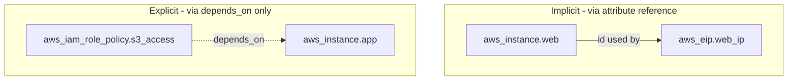
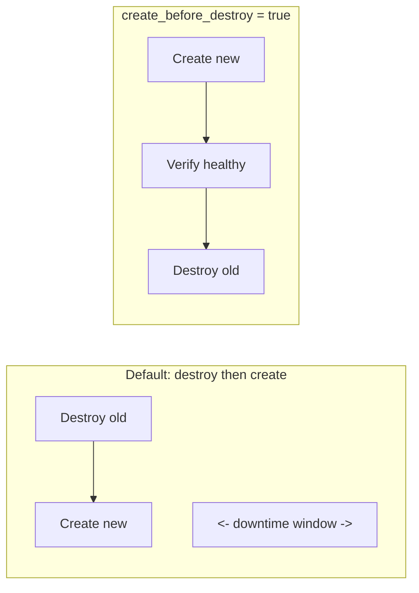

# Domain 4 (Part C) — Dependencies, Lifecycle Meta-Arguments, Custom Validation, Sensitive Data & Vault

*Official exam objectives covered: 4f (Define resource dependencies), 4g (Validate configuration using custom conditions), 4h (Sensitive data best practices, including Vault)*
*Course lectures folded in: Resource Behavior and Meta Arguments, Meta-Argument LifeCycle (Create Before Destroy, Prevent Destroy, Ignore Changes), Challenges with Count, Resource Dependency, Implicit vs Explicit Dependencies, Overview of Input Variable Validation, Preconditions and Postconditions, Check Blocks, Moved Blocks, Sensitive Parameter, HashiCorp Vault Overview & Integration, Ephemeral Values and Write-Only Arguments*

---

## 1. Resource Dependencies (Objective 4f)

### The core idea
Terraform builds a **dependency graph** before doing anything — this graph determines the order resources are created, updated, and destroyed in. Every resource has dependencies whether you wrote them explicitly or not; there are exactly two ways that graph gets built.

### Implicit Dependencies (the default, preferred mechanism)
Created automatically whenever one resource's argument references another resource's attribute.
```hcl
resource "aws_instance" "web" {
  ami = var.ami_id
}

resource "aws_eip" "web_ip" {
  instance = aws_instance.web.id   # implicit dependency
  domain   = "vpc"
}
```
Terraform infers: "create `aws_instance.web` first, because `aws_eip.web_ip` needs its `id`." No ordering instruction was ever written explicitly — the reference *is* the dependency declaration, and it's automatically kept correct if the code is refactored (rename the resource, and every reference to it updates together, or fails loudly if you miss one).

### Explicit Dependencies (`depends_on`) — for the cases implicit references can't cover
```hcl
resource "aws_iam_role_policy" "s3_access" {
  role   = aws_iam_role.app.id
  policy = data.aws_iam_policy_document.s3_read.json
}

resource "aws_instance" "app" {
  ami           = var.ami_id
  instance_type = "t3.micro"

  # Nothing in THIS resource's arguments references the IAM policy attributes —
  # but the app's boot script (user_data) assumes the IAM policy is already
  # attached to the instance's role before it starts, and there's no
  # attribute of the policy this resource could reference to create that link.
  depends_on = [aws_iam_role_policy.s3_access]
}
```



### The rule of thumb, and what happens if you get it backwards
**Prefer implicit dependencies whenever a real attribute reference is possible** — they're self-documenting (anyone reading the code sees the relationship) and Terraform maintains them automatically through refactors. Reserve `depends_on` for genuine hidden ordering requirements where **no** attribute reference exists to express the relationship.

**What if you overuse `depends_on`** (adding it defensively "just in case," even where an attribute reference would work)? The dependency becomes invisible in the actual data flow — a future reader has to go hunting through `depends_on` lists scattered across the codebase to understand why two resources are ordered the way they are, instead of seeing it directly in an argument. Overuse also risks creating dependency cycles that are harder to diagnose than reference-based ones, since `terraform graph` (Domain 3) visualizes reference-based edges more intuitively than a list of resource addresses.

**What if you skip a genuinely-needed `depends_on`** (assuming Terraform will "figure it out")? Terraform has no way to know about a runtime assumption baked into a boot script — it will happily create the EC2 instance and the IAM policy in parallel (or in an arbitrary order), and if the instance boots before the policy attaches, the application fails at startup with permission errors that look like an application bug, not an infrastructure ordering bug.

### Real-World Scenario 1 — Application Boot Order
A company's EC2 instances run a startup script that immediately tries to read a config file from S3, requiring the instance's IAM role to already have `s3:GetObject` permission. Without an explicit `depends_on` linking the instance to the IAM role policy attachment, Terraform sometimes (depending on API timing, not code logic) creates the instance and grants the policy in parallel — occasionally the instance boots first, the app fails to read its config, and it crash-loops until someone manually restarts it after the policy actually takes effect. Adding `depends_on = [aws_iam_role_policy.app]` makes the ordering deterministic every single time.

### Real-World Scenario 2 — Refactoring Safety via Implicit Dependencies
A team renames `aws_instance.web` to `aws_instance.app_server` as part of a larger refactor. Because every other resource that needed to reference it used **implicit** references (`aws_instance.app_server.id`, after the rename), Terraform's `plan` correctly shows the updated dependency graph automatically — the *only* manual work is the rename itself, not re-wiring a scattered set of `depends_on` lists that would have needed the exact same rename applied in multiple places, easy to miss one.

---

## 2. Meta-Arguments and the `lifecycle` Block

### What meta-arguments are
`count`, `for_each`, `provider`, `depends_on`, and `lifecycle` are understood by **Terraform Core itself**, regardless of resource type — that's why they behave identically whether you're configuring `aws_instance` or `aws_s3_bucket`. Core applies them before ever handing control to the provider plugin.

### `create_before_destroy`
**What it changes:** Terraform's default behavior when a change forces replacement is destroy-then-create — meaning a window of downtime. This flips the order.
```hcl
resource "aws_launch_template" "app" {
  name_prefix   = "app-"
  image_id      = var.ami_id
  instance_type = "t3.micro"

  lifecycle {
    create_before_destroy = true
  }
}
```

**Use it when:** the resource is a dependency other things rely on staying continuously available — a launch template feeding an autoscaling group, an EIP a DNS record points to.
**What if you don't use it on a resource that genuinely needs it?** An AMI update on a launch template referenced by a live ASG (without `create_before_destroy`) destroys the old template *before* the new one exists — if the ASG tries to scale during that window, it has no valid template to launch from, a real availability gap during what should have been a routine update.

### `prevent_destroy`
```hcl
resource "aws_db_instance" "prod" {
  # ...
  lifecycle {
    prevent_destroy = true
  }
}
```
Terraform **refuses**, with a hard error, to run any plan/apply that would destroy this resource — including a full `terraform destroy` on the whole config.
**What if you don't set this on a production database?** A single mistaken `terraform destroy` (run against the wrong workspace, or by someone unfamiliar with the project) permanently deletes production data with no built-in safety net beyond "hopefully someone notices the plan output before confirming." `prevent_destroy` makes that mistake structurally impossible without a deliberate, separate code change first.
**What if you set it on everything by default, including resources you'll legitimately decommission?** Removing a genuinely obsolete resource now requires first deleting the `lifecycle` block, applying that no-op change, and *then* deleting the resource — an extra deliberate step every time, which is the point for critical resources, but needless friction for disposable ones.

### `ignore_changes`
```hcl
resource "aws_autoscaling_group" "app" {
  # ...
  lifecycle {
    ignore_changes = [desired_capacity]
  }
}
```
**What it solves:** an external autoscaling policy (or a Lambda-based scheduler) actively changes `desired_capacity` outside Terraform. Without `ignore_changes`, every single `terraform plan` proposes reverting it back to whatever's hardcoded in `.tf` — noisy, and actively dangerous if someone approves that "revert" during a legitimate high-traffic scaling event.
**What if you set `ignore_changes = all` instead of scoping it to just `desired_capacity`?** Terraform becomes blind to *every* attribute's drift on that resource — including a security-relevant change (someone manually loosening a security group attached to it) that you'd actually want Terraform to catch and flag. Scope `ignore_changes` to exactly the attribute that's legitimately managed elsewhere, never broader.

### Real-World Scenario 1 — Zero-Downtime AMI Rollout
A platform team updates a launch template's AMI monthly. Because `create_before_destroy = true` is set, each monthly update creates the new launch template version, confirms it's valid, and only then removes the old one — the ASG never has a moment with zero valid template to scale from, even if a scale-out event happens to fire during the exact minute of the Terraform apply.

### Real-World Scenario 2 — Autoscaling Fighting Terraform
A team's ASG has its `desired_capacity` actively managed by a scheduled Lambda that scales up for business hours and down overnight. Without `ignore_changes = [desired_capacity]`, every daytime `terraform plan` (run as part of an unrelated change, like a tag update) proposes scaling the ASG back down to the value hardcoded in `.tf` — and if someone reflexively approves it during business hours, they've just manually undone the Lambda's scale-up, causing a real capacity incident.

---

## 3. Validate Configuration Using Custom Conditions (Objective 4g)

This objective covers three distinct mechanisms, each solving a different part of "make sure this config is actually correct, not just syntactically valid."

### 3.1 Input Variable Validation — checked before any resource action
```hcl
variable "instance_type" {
  type = string
  validation {
    condition     = contains(["t3.micro", "t3.small", "t3.medium"], var.instance_type)
    error_message = "instance_type must be one of: t3.micro, t3.small, t3.medium."
  }
}

variable "vpc_cidr" {
  type = string
  validation {
    condition     = can(cidrhost(var.vpc_cidr, 0))
    error_message = "vpc_cidr must be a valid CIDR block, e.g. 10.0.0.0/16."
  }
}
```
`can()` wraps an expression that might error and converts the result to a clean `true`/`false` — the standard idiom for "is this even a syntactically valid CIDR/ARN/etc."

**What if you skip variable validation?** A typo'd instance type (`"t3.mico"`) or a malformed CIDR isn't caught until AWS itself rejects the API call during `apply` — a less friendly error, discovered later in the workflow, potentially after other resources in the same `apply` have already been created.

### 3.2 Preconditions and Postconditions — checked at the resource/data-source level
```hcl
resource "aws_instance" "web" {
  ami           = data.aws_ami.selected.id
  instance_type = var.instance_type

  lifecycle {
    precondition {
      condition     = data.aws_ami.selected.architecture == "x86_64"
      error_message = "Selected AMI must be x86_64, got ${data.aws_ami.selected.architecture}."
    }
    postcondition {
      condition     = self.public_ip != ""
      error_message = "Instance did not get a public IP - check subnet's map_public_ip_on_launch."
    }
  }
}
```
- **Precondition:** checked *before* the resource action — validates an assumption about an input or a data source's result.
- **Postcondition:** checked *after* the resource is created/updated, using `self.<attribute>` — validates the **actual result**, catching a technically-successful apply that still didn't produce what you needed.

**What can a postcondition check that a `variable { validation {} }` fundamentally cannot?** Variable validation only ever sees the *input* — it has no way to inspect a resource's own generated attributes, because those don't exist until the resource is actually created. `self.public_ip != ""` is only checkable *after* the instance exists — there is no equivalent check possible at the variable-declaration stage.

### 3.3 Check Blocks — standalone, ongoing assertions
```hcl
check "web_is_reachable" {
  data "http" "web_health" {
    url = "https://${aws_lb.web.dns_name}/healthz"
  }

  assert {
    condition     = data.http.web_health.status_code == 200
    error_message = "Health check endpoint did not return 200."
  }
}
```
Unlike pre/postconditions (tied to one resource's own lifecycle), `check` blocks run on **every** `plan`/`apply`, independent of any single resource — and critically, a **failed check produces a warning, not a hard failure** that blocks the apply. Built for ongoing health/compliance monitoring of infrastructure that already exists, not for gating creation.

### Comparison table — when to reach for which
| Mechanism | Checked when | Can inspect resource's own generated attributes? | Failure behavior |
|---|---|---|---|
| `variable { validation {} }` | Before any resource action, at plan time | No — inputs only | Hard failure, blocks plan |
| `precondition` | Before this specific resource's action | Data sources, other resources — not this resource's own result yet | Hard failure, blocks apply |
| `postcondition` | After this specific resource's action | Yes, via `self.*` | Hard failure, blocks apply |
| `check` block | Every plan/apply, standalone | Yes, any resource/data source | **Warning only**, never blocks |

### Real-World Scenario 1 — Catching a Misconfigured Subnet Before It Causes an Outage
A postcondition (`self.public_ip != ""`) on a public-facing EC2 instance catches, at apply-time, that someone forgot to enable `map_public_ip_on_launch` on the subnet it landed in — instead of the team discovering "the server has no public IP" only after deploying and then trying (and failing) to reach it externally.

### Real-World Scenario 2 — Ongoing Compliance Monitoring via Check Blocks
A compliance team adds a `check` block asserting every ACM certificate in a config has `status == "ISSUED"`. If a certificate silently expires or fails DNS validation renewal, the very next `terraform plan` (run for an unrelated change) surfaces a clear warning — proactive discovery, instead of finding out only when customers start seeing browser TLS warnings.

---

## 4. Moved Blocks — Refactoring Without Destroy/Recreate

### What role a `moved` block plays
Terraform identifies every resource by its **address** — the combination of resource type and local name (`aws_instance.web`), or its position inside a module (`module.vpc.aws_subnet.public`). That address is exactly what's used as the *key* in the state file. The moment you rename a resource, move it into a module, or restructure how a module is called, its address changes — and by default, Terraform has no way to know "this is the same real infrastructure, just renamed in code." It sees a brand-new address with no matching state entry, and a state entry with no matching config — which it interprets as **destroy the old one, create a new one with the new name**, even though nothing about the underlying AWS resource needed to change at all.

A `moved` block is the declarative fix: it tells Terraform "the thing at this old address is the same thing now living at this new address — update your bookkeeping, don't touch real infrastructure."

### Example 1 — A Simple Rename
```hcl
# Before the refactor, this existed:
# resource "aws_instance" "web" { ... }

# After renaming it in code:
resource "aws_instance" "app_server" {
  ami           = var.ami_id
  instance_type = var.instance_type
}

moved {
  from = aws_instance.web
  to   = aws_instance.app_server
}
```
Run `terraform plan` after this change: instead of a `-` (destroy) and a `+` (create), the plan shows the resource being **moved** in state, with **zero** actual infrastructure changes — the same real EC2 instance, now tracked under its new address.

### Example 2 — Moving a Resource Into a Module
```hcl
moved {
  from = aws_instance.web
  to   = module.web_tier.aws_instance.web
}
```
This is the exact scenario for "I started with a flat root module and I'm now organizing things into a proper module structure" (Domain 5) — without a `moved` block, promoting existing resources into a new module structure would destroy and recreate every single one of them.

### What if you rename or restructure a resource *without* a `moved` block?
```
Plan: 1 to add, 0 to change, 1 to destroy.

  # aws_instance.web will be destroyed
  - resource "aws_instance" "web" { ... }

  # aws_instance.app_server will be created
  + resource "aws_instance" "app_server" { ... }
```
For a stateless resource, this might just be wasteful (a few minutes of downtime, a new instance ID). For something with real, hard-to-recreate state of its own — an RDS database, an EBS volume with data on it, an EIP other systems point at by address — this is a genuine, avoidable outage or data-loss risk caused purely by a cosmetic code rename, not by any actual infrastructure requirement.

### `moved` blocks vs. `terraform state mv` — the same outcome, two very different processes
| | `moved` block | `terraform state mv` |
|---|---|---|
| Where it lives | Committed in `.tf` code | A one-time CLI command, run manually |
| Reviewable in a pull request? | Yes | No — it's an action, not code |
| Runs automatically for every teammate | Yes, on their next `plan` | No — everyone with a copy of that state must run the command themselves |
| Leaves a record of *why* the move happened | Yes (it's in Git history, can have a comment) | Only if someone separately documents it |

**Recommendation:** prefer `moved` blocks for anything going into version control (the standard case). Reserve manual `terraform state mv` for one-off, immediate fixes to a state file that isn't (yet) reflected by a corresponding code change — e.g., emergency state surgery during an incident.

### Real-World Scenario 1 — A Module Refactor Across a Team
A platform team decides to reorganize a large, flat root module into three sub-modules (`network`, `compute`, `database`) for clarity, without wanting to actually recreate any of dozens of existing production resources. They add a `moved` block for every resource that's relocating into a module. When each team member next runs `terraform plan` on their own checkout, Terraform automatically reconciles their local understanding of state with the new module structure — no one has to manually run `state mv` themselves, and no one accidentally skips a resource and triggers a surprise destroy/recreate.

### Real-World Scenario 2 — Renaming a Resource to Match a New Naming Convention
A company adopts a new resource-naming standard company-wide (e.g., `<tier>_<app>` instead of ad hoc names). Renaming `aws_db_instance.db` to `aws_db_instance.app_primary_db` across dozens of Terraform projects, with a `moved` block accompanying each rename, means the migration produces a `plan` showing zero real infrastructure changes across the entire fleet — purely a bookkeeping update — instead of every single renamed database resource being flagged for destroy-and-recreate, which for an RDS instance would mean real, unacceptable data loss.

---

## 5. Managing Sensitive Data (Objective 4h)

### The `sensitive` flag — on both variables and outputs
```hcl
variable "db_password" {
  type      = string
  sensitive = true
}

output "db_password" {
  value     = aws_db_instance.main.password
  sensitive = true
}
```
**What this actually does:** redacts the value from CLI output during `plan`/`apply`, and from log output. **What it does NOT do:** encrypt anything. The real value is still written, in **plaintext**, into `terraform.tfstate` — `sensitive` is a display-layer protection only.

**What if you rely on `sensitive = true` as your *only* protection for a database password?** Anyone with read access to the state file (an S3 bucket with loose IAM permissions, a laptop with a local `terraform.tfstate` file, a backup that leaked) can read the real password directly — `sensitive` never crossed their path at all, since it only affects the CLI's own display logic, not the file Terraform writes to disk.

### The real fix, part 1 — HashiCorp Vault
Vault is a **separate HashiCorp product** dedicated to storing/generating secrets (static secrets, dynamic short-lived database credentials, PKI certificates) with fine-grained access policies and full audit logging.
```hcl
data "vault_generic_secret" "db_creds" {
  path = "secret/data/myapp/db"
}

resource "aws_db_instance" "main" {
  username = data.vault_generic_secret.db_creds.data["username"]
  password = data.vault_generic_secret.db_creds.data["password"]
}
```
**Important nuance:** even reading a secret from Vault this way, the value still ends up in Terraform state — Vault changes **where the secret is authored, rotated, and audited**, and can issue **dynamic**, short-lived credentials that limit the damage of any single leak, but it does not, by itself, erase the state-file exposure problem.

### The real fix, part 2 — Ephemeral Values and Write-Only Arguments (Terraform 1.10+)
This is the mechanism that actually closes the state-file gap:
```hcl
variable "db_password" {
  type      = string
  ephemeral = true   # exists only for this run - never written to state
}

resource "aws_db_instance" "main" {
  password_wo         = var.db_password   # write-only argument - never stored in state either
  password_wo_version = 1                 # bump this to signal "the value changed, please apply"
}
```
- **Ephemeral** variables/outputs exist only for the duration of a single `plan`/`apply` run and are never persisted to state at all.
- **Write-only arguments** (suffixed `_wo`, must be specifically supported by the resource/provider) let a resource *consume* a secret to configure something without that value ever being written into state — paired with a `_wo_version` counter, since Terraform can't diff a value it never stores.

### The full comparison, in order of actual protection strength
| Approach | Hides from CLI output? | Removed from plaintext state? | Rotation support |
|---|---|---|---|
| Plain variable, no `sensitive` | No | No | Manual |
| `sensitive = true` | Yes | **No** | Manual |
| Vault-sourced secret (static) | Yes (if also `sensitive`) | No — still lands in state | Centralized, auditable |
| Vault-sourced **dynamic** credential | Yes | No — still lands in state | Automatic, short-lived |
| `ephemeral` variable + write-only argument | Yes | **Yes** | N/A — never persisted at all |

### Real-World Scenario 1 — A Leaked State File, Two Different Outcomes
Company A stores a database password as a plain `sensitive` variable; their state file (accidentally made world-readable in an S3 misconfiguration) is discovered by a security researcher, who extracts the real plaintext password directly from the JSON. Company B used `ephemeral` + `password_wo` for the same secret; the same S3 misconfiguration exposes their state file too — but the password was **never written into it in the first place**, so there's nothing to extract. Identical infrastructure mistake (a public state bucket), completely different real-world consequence, purely because of which secret-handling mechanism was used.

### Real-World Scenario 2 — Rotating a Database Password Without a Terraform Diff Nightmare
A security policy requires database passwords to rotate every 90 days. With a plain `sensitive` variable, rotating means changing the variable's value, which Terraform diffs as "changing this attribute" — and if any other resource happens to depend on that same value, a cascading, sometimes destructive plan can result. With `password_wo` + `password_wo_version`, rotation is: supply the new password, bump `password_wo_version` from `1` to `2`. Terraform applies the new secret because the version counter changed, without ever being able to diff (and therefore never risking mishandling) the actual secret content itself.

---

## 6. Practice Questions

### Easy
1. What's the practical difference between an implicit and an explicit dependency?
2. Which `lifecycle` argument would you use to stop Terraform from ever destroying a specific resource, even via `terraform destroy`?
3. True/False: `sensitive = true` on a variable encrypts its value in the state file.
4. What does a `moved` block prevent Terraform from doing to a renamed resource, that would otherwise happen by default?

### Medium
5. Write a `variable "environment"` block that only accepts `"dev"`, `"staging"`, or `"prod"`, with a clear error message for anything else.
6. An ASG's `desired_capacity` is actively managed by a scheduled Lambda outside Terraform. Write the `lifecycle` block that stops every `plan` from fighting that, without blinding Terraform to every other attribute's drift on that resource.
7. Explain, with an example, when you'd need a `postcondition` instead of a `variable { validation {} }` block — specifically, what can a postcondition check that variable validation cannot.
8. Compare a `moved` block to `terraform state mv` for the same rename — which one automatically takes effect for every teammate's next `plan`, and why does that matter for a team of five engineers sharing one remote state file?

### Hard
9. Explain precisely why marking a `variable` as `sensitive = true` does not protect its value if an attacker gains read access to your state-file storage, and how `ephemeral` variables plus write-only arguments close that specific gap differently than `sensitive` does.
10. A team removes one contractor's name from the middle of a `count`-based `aws_iam_user` list. Trace exactly what happens to IAM users positioned after the removed one, explain why this endangers their already-issued access keys, and show the `for_each`-based fix.
11. A team is migrating a production `aws_db_instance` from a flat root module into `module.database`. Write the `moved` block that makes this a zero-downtime, no-op-on-real-infrastructure change, and explain exactly what the `plan` output would show if they forgot it.

---
**Next:** [07-domain5-modules.md](07-domain5-modules.md)
