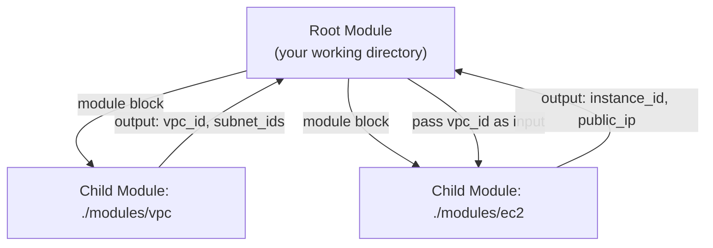
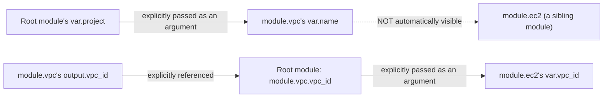
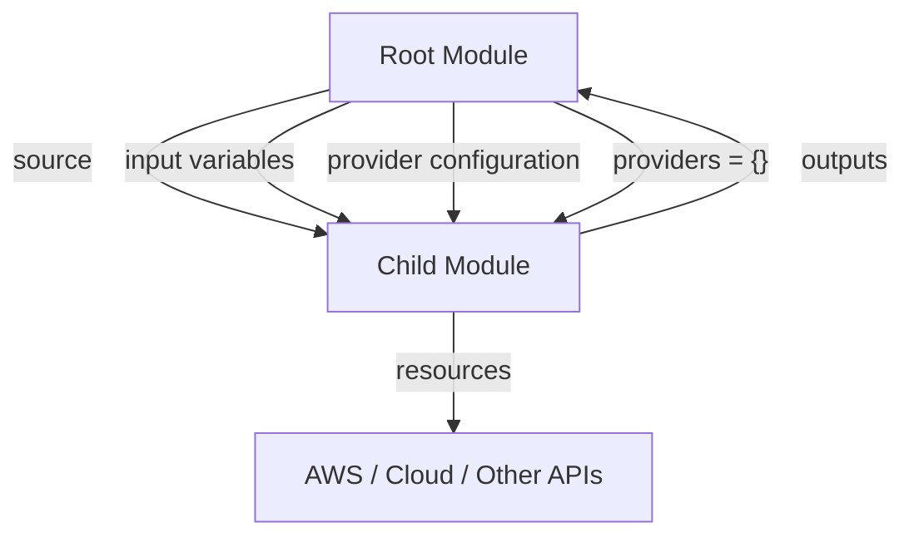
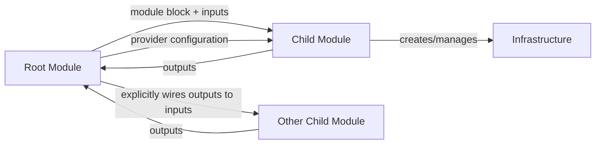

# Domain 5 — Terraform Modules

## What this domain covers

Terraform modules are mainly about **reusing Terraform configuration**.

The official exam objectives here are:

* **5a** — How Terraform sources modules
* **5b** — Variable scope within modules
* **5c** — Use modules in configuration
* **5d** — Manage module versions

---

# 1. What Is a Terraform Module?

A Terraform **module is simply a directory containing Terraform `.tf` files**.

This is an important definition.

You have already been using a module even if you didn't explicitly call it one.

The directory where you run:

```bash
terraform init
terraform plan
terraform apply
```

is called the **root module**.

A reusable module called from that root module is called a **child module**.

### Basic structure

```text
project/
├── main.tf
├── variables.tf
├── outputs.tf
└── modules/
    ├── vpc/
    └── ec2/
```

Here:

```text
project/
    ↓
Root Module

modules/vpc/
    ↓
Child Module

modules/ec2/
    ↓
Child Module
```

---

## Root module vs child module

### Root module

The directory from which you execute Terraform commands.

Example:

```bash
cd my-project
terraform apply
```

`my-project` is the root module.

### Child module

A module called by another module using a `module` block.

Example:

```hcl
module "vpc" {
  source = "./modules/vpc"
}
```

`./modules/vpc` is a child module.

---

## How modules communicate

A child module can:

* Receive values through **input variables**
* Return values through **outputs**

For example:

```text
Root
  |
  | pass input
  ↓
VPC Module
  |
  | output vpc_id
  ↓
Root
  |
  | pass vpc_id
  ↓
EC2 Module
```

The source's core module relationship is:



### Why modules are useful

Without modules, you may repeatedly write almost identical resources:

```text
Dev → VPC resources
Staging → VPC resources
Prod → VPC resources
```

With a module:

```text
             ┌→ Dev
VPC Module ──┼→ Staging
             └→ Prod
```

You write the infrastructure pattern once and reuse it.

### Key idea

> **Module = reusable Terraform configuration.**

---

# 2. Using an Existing Public Module

Terraform has a public module registry containing reusable modules.

For example:

```hcl
module "vpc" {
  source  = "terraform-aws-modules/vpc/aws"
  version = "5.8.1"

  name = "my-vpc"
  cidr = "10.0.0.0/16"

  azs             = ["ap-south-1a", "ap-south-1b"]
  public_subnets  = ["10.0.1.0/24", "10.0.2.0/24"]
  private_subnets = ["10.0.101.0/24", "10.0.102.0/24"]

  enable_nat_gateway = true
}
```

Instead of manually writing resources for:

* VPC
* Subnets
* Route tables
* Internet Gateway
* NAT Gateway
* Route associations

the module encapsulates those resources for you.

---

# 3. How to Choose a Module

Don't blindly select the first module you find.

Check:

### 1. Trust / usage

Look for:

* Verified/Partner status
* High download count
* Active repository/community

### 2. Maintenance

Check:

* Recent commits
* Open issues
* Whether maintainers respond
* Compatibility with current provider versions

### 3. Inputs and outputs

Ask:

> Does this module actually fit my use case?

A module with dozens of unnecessary variables can make your configuration harder to understand.

### 4. Version

Prefer a version constraint.

Example:

```hcl
version = "~> 5.0"
```

This prevents an unexpected major-version upgrade from suddenly changing the module's behavior.

---

# 4. Why Versioning Matters for Modules

Suppose you use:

```hcl
version = "~> 4.0"
```

and the module maintainer releases:

```text
v4.1.0
v4.2.0
v4.3.0
v5.0.0
```

Your constraint allows compatible `4.x` versions but not the `5.x` major release.

So you don't unexpectedly jump to v5.

This gives you control over when to perform a potentially breaking upgrade.

### Exam memory

> **Pin module versions just like provider versions.**

---

# 5. Creating Your Own Custom Module

Suppose you repeatedly create EC2 instances.

Instead of writing the same resource configuration everywhere, create:

```text
modules/
└── ec2-instance/
```

A standard structure is:

```text
modules/
└── ec2-instance/
    ├── main.tf
    ├── variables.tf
    ├── outputs.tf
    └── README.md
```

### Purpose of each file

| File           | Purpose                   |
| -------------- | ------------------------- |
| `main.tf`      | Resources                 |
| `variables.tf` | Inputs                    |
| `outputs.tf`   | Values returned by module |
| `README.md`    | Documentation             |

The source notes also identify this structure as the standard structure expected for publishing a module.

---

# 6. First Version — Hardcoded Module

Imagine:

```hcl
resource "aws_instance" "this" {
  ami           = "ami-0e35ddab05955cf57"
  instance_type = "t3.micro"
  subnet_id     = "subnet-0abc123456"
}
```

This technically works.

But it isn't very reusable.

Every caller gets:

```text
AMI       → same
Instance  → t3.micro
Subnet    → same
```

You can't easily use the same module for:

```text
web server
worker server
database server
```

with different inputs.

### Problem

The module has hardcoded **values** instead of accepting **inputs**.

---

# 7. Make the Module Reusable with Variables

Move the configurable values into variables.

### `variables.tf`

```hcl
variable "ami_id" {
  type        = string
  description = "AMI to launch"
}

variable "instance_type" {
  type    = string
  default = "t3.micro"
}

variable "subnet_id" {
  type = string
}

variable "tags" {
  type    = map(string)
  default = {}
}
```

Now `main.tf` becomes:

```hcl
resource "aws_instance" "this" {
  ami           = var.ami_id
  instance_type = var.instance_type
  subnet_id     = var.subnet_id
  tags          = var.tags
}
```

The module now defines the **shape** of the infrastructure, while the caller supplies the specific values.

---

# 8. Calling the Custom Module

From the root module:

```hcl
module "web_server" {
  source        = "./modules/ec2-instance"
  ami_id        = data.aws_ami.amazon_linux.id
  instance_type = "t3.small"
  subnet_id     = module.vpc.public_subnet_ids[0]

  tags = {
    Name = "web-server"
  }
}
```

You can call the same module again:

```hcl
module "worker_server" {
  source        = "./modules/ec2-instance"
  ami_id        = data.aws_ami.amazon_linux.id
  instance_type = "t3.large"
  subnet_id     = module.vpc.private_subnet_ids[0]

  tags = {
    Name = "worker"
  }
}
```

Notice:

```text
Same module
    |
    ├── web_server
    │     ├── t3.small
    │     └── public subnet
    │
    └── worker_server
          ├── t3.large
          └── private subnet
```

### This is the main benefit of modules

> **One module implementation → many different configurations.**

---

# 9. Provider Configuration Inside a Module

This is an important exam concept.

### Avoid this inside a reusable child module:

```hcl
provider "aws" {
  region = "us-east-1"
}
```

Why?

Because now the module is effectively saying:

> "Every caller must use `us-east-1`."

Suppose another caller needs:

```text
ap-south-1
```

The module prevents that unless you modify the module.

---

# 10. Correct Provider Design

The **caller/root module** should normally configure the provider.

The child module should simply use the provider supplied to it.

Conceptually:

```text
Root Module
   |
   | configures AWS provider
   ↓
Child Module
   |
   | uses provider
   ↓
AWS
```

This makes the module reusable across:

* Regions
* Accounts
* Environments

### Important mental model

> **Child module defines infrastructure.**
> **Caller decides provider configuration.**

---

# 11. Module Sources — Objective 5a

The `source` argument tells Terraform:

> **"Where should I get this module's code from?"**

There are several source types.

| Source           | Example                                                         | Typical use            |
| ---------------- | --------------------------------------------------------------- | ---------------------- |
| Local path       | `./modules/ec2-instance`                                        | Local/custom module    |
| Public Registry  | `terraform-aws-modules/vpc/aws`                                 | Public reusable module |
| Private Registry | `app.terraform.io/my-org/vpc/aws`                               | Organization modules   |
| Git              | `git::https://github.com/my-org/tf-modules.git//vpc?ref=v1.0.0` | Git-hosted modules     |
| S3/GCS           | `s3::https://s3.amazonaws.com/my-bucket/module.zip`             | Bucket-hosted module   |

These source types are explicitly covered in the uploaded notes.

---

# 12. Local Module Sources

Example:

```hcl
module "ec2" {
  source = "./modules/ec2-instance"
}
```

This means:

```text
current directory
     |
     └── modules/
           └── ec2-instance/
```

### Important

Use a **relative path**:

```hcl
source = "./modules/ec2-instance"
```

Avoid:

```hcl
source = "/home/deepak/modules/ec2-instance"
```

Why?

Because your path may exist only on your machine.

Another engineer might clone the project into:

```text
/home/rahul/project
```

and Terraform would fail to find:

```text
/home/deepak/modules/ec2-instance
```

### Exam memory

> **Local modules → use relative paths.**

---

# 13. Git Module Sources

A module can come directly from Git.

Example:

```hcl
module "vpc" {
  source = "git::https://github.com/my-org/tf-modules.git//vpc?ref=v1.0.0"
}
```

Important pieces:

```text
git::
  ↓
Git repository

//vpc
  ↓
subdirectory inside repository

?ref=v1.0.0
  ↓
Git reference/tag/branch/commit
```

Using a version/tag reference makes the source reproducible.

---

# 14. Private Registry

Organizations can maintain private modules.

Example:

```hcl
module "vpc" {
  source = "app.terraform.io/my-org/vpc/aws"
}
```

This is useful when the module is intended for internal organizational use rather than public consumption.

---

# 15. Module Outputs

A child module can expose values through `outputs.tf`.

Example:

```hcl
# modules/ec2-instance/outputs.tf

output "instance_id" {
  value = aws_instance.this.id
}

output "public_ip" {
  value = aws_instance.this.public_ip
}
```

The root module can then access:

```hcl
module.web_server.public_ip
```

For example:

```hcl
output "web_ip" {
  value = module.web_server.public_ip
}
```

### Important syntax

Resource attribute:

```hcl
aws_instance.this.id
```

Module output:

```hcl
module.web_server.public_ip
```

Don't confuse these.

---

# 16. Module Variable Scope — VERY IMPORTANT

This is one of the explicit exam objectives.

Variables are **not global** across modules.

Suppose the root module has:

```hcl
variable "environment" {
  type = string
}
```

That does **not** automatically make:

```hcl
var.environment
```

available inside every child module.

Each module has its own scope.

---

## The correct flow

```text
Root variable
     |
     | explicitly pass
     ↓
Child module variable
     |
     | module does its work
     ↓
Child module output
     |
     | explicitly reference
     ↓
Root
```

The source's module-scope diagram:



---

# 17. Connecting Two Modules

Suppose we have:

```text
VPC module
    ↓
creates VPC/subnets
    ↓
outputs subnet IDs
```

Then EC2 module needs a subnet ID.

Root module connects them:

```hcl
module "vpc" {
  source = "./modules/vpc"

  cidr = "10.0.0.0/16"
}
```

Then:

```hcl
module "ec2" {
  source = "./modules/ec2-instance"

  subnet_id = module.vpc.public_subnet_ids[0]
}
```

Notice the flow:

```text
module.vpc
     |
     | output
     ↓
public_subnet_ids[0]
     |
     | passed as argument
     ↓
module.ec2
     |
     ↓
var.subnet_id
```

---

# 18. Sibling Modules Cannot Directly See Each Other's Variables

Suppose:

```text
module.vpc
module.ec2
```

`module.ec2` cannot simply do:

```hcl
var.vpc_cidr
```

and expect that variable to come from `module.vpc`.

Why?

Because each module has its own variable scope.

### Wrong mental model

```text
Root
 |
 ├── VPC
 |    └── variables
 |
 └── EC2
      └── automatically sees VPC variables ❌
```

### Correct model

```text
Root
 |
 ├── VPC
 |    └── outputs
 |
 └── EC2
      ↑
      |
      Root passes VPC output as input
```

---

# 19. Example of the Scope Problem

Suppose the VPC module contains:

```hcl
variable "environment" {
  type = string
}
```

Then inside the EC2 module this is **not valid**:

```hcl
resource "aws_instance" "this" {
  tags = {
    Environment = var.environment
  }
}
```

unless the EC2 module itself declares:

```hcl
variable "environment" {
  type = string
}
```

and the root module passes the value:

```hcl
module "ec2" {
  source = "./modules/ec2"

  environment = var.environment
}
```

### Exam rule

> **Variables belong to the module where they are declared.**

---

# 20. Root Module vs Child Module State

This is a **very important exam fact**.

You might think:

```text
Root Module
    ↓
State file

Child Module
    ↓
Another state file
```

That is **NOT the default behavior**.

Instead:

```text
              Root Module
                   |
        ┌──────────┼──────────┐
        ↓          ↓          ↓
     Module A   Module B   Module C
        |
        ↓
   ONE shared state
```

The root module and its child modules use **one state file for the configuration tree**.

Resources simply receive module-qualified addresses.

For example:

```text
module.vpc.aws_vpc.main
module.ec2.aws_instance.web
```

---

# 21. Why Module State Ownership Matters

Suppose:

```hcl
module "ec2" {
  source = "./modules/ec2"
}
```

creates:

```text
module.ec2.aws_instance.web
```

If you remove the module block:

```hcl
module "ec2" {
  ...
}
```

Terraform doesn't think:

> "The module disappeared, but its resources have their own state somewhere."

Instead, those resources are no longer represented in the configuration.

Terraform can therefore propose destroying them.

### Exam memory

> **Modules do NOT automatically have separate state files.**

---

# 22. Multiple Provider Configurations with Modules

Sometimes you want the same module deployed using different provider configurations.

For example:

```text
Provider A → us-east-1
Provider B → ap-south-1
```

Configure both in the root module:

```hcl
provider "aws" {
  alias  = "us"
  region = "us-east-1"
}

provider "aws" {
  alias  = "ap"
  region = "ap-south-1"
}
```

Then pass the desired provider to each module.

---

# 23. Passing an Aliased Provider to a Module

Example:

```hcl
module "ec2_us" {
  source = "./modules/ec2-instance"

  providers = {
    aws = aws.us
  }

  ami_id = "ami-xxxx-us"
}
```

Another call:

```hcl
module "ec2_ap" {
  source = "./modules/ec2-instance"

  providers = {
    aws = aws.ap
  }

  ami_id = "ami-xxxx-ap"
}
```

So:

```text
                 Root
                  |
        ┌─────────┴─────────┐
        ↓                   ↓
    aws.us                aws.ap
 us-east-1              ap-south-1
        ↓                   ↓
   ec2_us module        ec2_ap module
```

### Key point

The module code itself remains the same.

Only the provider passed to each module call changes.

---

# 24. `providers = {}` in a Module Block

This:

```hcl
providers = {
  aws = aws.ap
}
```

means:

> "Inside this module call, use the `aws.ap` provider configuration for the module's `aws` provider."

The left side:

```text
aws
```

is the provider name expected by the child module.

The right side:

```text
aws.ap
```

is the specific provider configuration from the root module.

### Exam mental model

> **Root configures providers → module call selects which provider instance the module receives.**

---

# 25. Managing Module Versions — Objective 5d

For Registry modules:

```hcl
module "vpc" {
  source  = "terraform-aws-modules/vpc/aws"
  version = "~> 5.0"
}
```

The same style of version constraints used for providers can be used for modules.

Examples:

```hcl
version = "= 5.8.1"
```

Exact version.

```hcl
version = ">= 5.0"
```

5.0 or newer.

```hcl
version = "~> 5.0"
```

Compatible 5.x releases according to Terraform's pessimistic constraint semantics.

---

# 26. Registry/Git Modules vs Local Modules

### Registry/Git module

Can have an independently selected version/reference.

For example:

```hcl
version = "~> 5.0"
```

for a Registry module.

Or a Git reference:

```text
?ref=v1.0.0
```

### Local module

```hcl
source = "./modules/ec2"
```

doesn't have an independently downloaded Registry version.

Its version effectively follows the version of the repository/working tree containing it.

### Important

> **Local module → source is a path.**
> **Registry module → source + version constraint.**
> **Git module → source + Git reference can pin the code.**

---

# 27. What Happens If You Don't Pin a Module?

Suppose:

```hcl
module "vpc" {
  source = "terraform-aws-modules/vpc/aws"
}
```

There is no version constraint.

Terraform may resolve the latest available compatible module version when initializing.

That creates reproducibility concerns.

A new version could introduce:

* Changed inputs
* Changed outputs
* Changed behavior
* Breaking changes

### Better

```hcl
module "vpc" {
  source  = "terraform-aws-modules/vpc/aws"
  version = "~> 5.0"
}
```

Now upgrades are controlled.

---

# 28. Publishing a Module to the Public Terraform Registry

If you want to publish a public module to the Terraform Registry, the source notes identify these requirements:

### 1. Own GitHub repository

The repository follows:

```text
terraform-<PROVIDER>-<NAME>
```

For example:

```text
terraform-aws-ec2-instance
```

### 2. Public repository

The repository must be public.

### 3. Standard module structure

At the repository root:

```text
main.tf
variables.tf
outputs.tf
```

### 4. Semantic version tags

Example:

```text
v1.0.0
v1.1.0
v2.0.0
```

The Registry uses these releases as module versions.

### 5. Documentation

A useful:

```text
README.md
```

and repository description should explain how the module works.

The source lists these Registry publishing requirements directly.

---

# 29. Module Versioning — Exam Trap

Don't confuse:

```text
Provider version
```

with:

```text
Module version
```

They are separate.

Example:

```hcl
terraform {
  required_providers {
    aws = {
      source  = "hashicorp/aws"
      version = "~> 6.0"
    }
  }
}

module "vpc" {
  source  = "terraform-aws-modules/vpc/aws"
  version = "~> 5.0"
}
```

The AWS provider and VPC module have independent versions.

---

# 30. Complete Module Mental Model



Think of a module like a **function**:

```text
Input
  ↓
Module
  ↓
Infrastructure
  ↓
Output
```

For example:

```text
Inputs:
ami_id
instance_type
subnet_id
tags

       ↓

EC2 Module

       ↓

AWS EC2 Instance

       ↓

Outputs:
instance_id
public_ip
```

---

# 31. The Most Important Module Rules

### Rule 1

A module is a directory containing `.tf` files.

### Rule 2

The directory where you run Terraform is the **root module**.

### Rule 3

A module called using:

```hcl
module "x" {
  source = ...
}
```

is a **child module**.

### Rule 4

Child module variables are **not global**.

### Rule 5

The root module must explicitly pass values into child modules.

### Rule 6

Child modules return values through outputs.

### Rule 7

A child module should normally **not hardcode provider configuration**.

### Rule 8

The root/caller controls which provider configuration a module uses.

### Rule 9

Modules share the root configuration's state by default; child modules don't automatically get separate state files.

### Rule 10

Pin Registry module versions.

### Rule 11

Use relative paths for local modules.

### Rule 12

A reusable module should expose configurable behavior through variables instead of hardcoded values.

---

# 32. Exam Traps

## Trap 1 — Every module has its own state

❌ False.

By default:

```text
Root + child modules
       ↓
one state file
```

---

## Trap 2 — Variables are global

❌ False.

This:

```hcl
# module A
variable "region" {}
```

does not automatically create:

```hcl
var.region
```

inside module B.

Each module has its own scope.

---

## Trap 3 — Child module decides the AWS region

Generally ❌ not the desired reusable design.

Prefer:

```text
Root → provider configuration
Root → passes provider
Child → uses provider
```

---

## Trap 4 — Module outputs are automatically visible everywhere

❌ No.

You explicitly reference:

```hcl
module.vpc.vpc_id
```

and then pass that value wherever needed.

---

## Trap 5 — Sibling modules can directly access each other's variables

❌ No.

The root module should wire them together:

```text
Module A output
      ↓
Root
      ↓
Module B input
```

---

## Trap 6 — Local module source should use an absolute path

❌ No.

Prefer:

```hcl
source = "./modules/ec2"
```

not:

```hcl
source = "/home/deepak/modules/ec2"
```

---

## Trap 7 — Module version and provider version are the same thing

❌ No.

They are independently versioned.

---

## Trap 8 — Modules are only useful for public Registry modules

❌ No.

You can create:

* Local modules
* Git modules
* Private Registry modules
* Public Registry modules
* Bucket-hosted modules

---

# 33. Practice Questions

## Easy

### 1.

Where do resources created inside a child module live?

Do they get their own state file, or are they tracked in the root configuration's state?

### 2.

What naming convention is expected for a GitHub repository intended for a publishable Terraform module?

### 3.

Write a module block that calls:

```text
./modules/s3-bucket
```

and passes:

```text
bucket_name = "my-app-logs"
```

---

## Medium

### 4.

You call the same EC2 module twice:

```text
web
worker
```

The web server needs:

```text
t3.small
public subnet
```

The worker needs:

```text
t3.large
private subnet
```

Write the two module blocks.

Also explain what must exist in the module's `variables.tf` for this to work.

---

### 5.

A custom module contains:

```hcl
provider "aws" {
  region = "us-east-1"
}
```

What happens when a second caller needs:

```text
ap-south-1
```

Why is this poor module design?

---

### 6.

A new engineer thinks:

```text
var.environment
```

declared inside the VPC module is automatically available inside the EC2 module.

Why does this fail?

What is the correct way to pass the value?

---

## Hard

### 7.

Design:

```text
Root
 ├── Network module
 └── Compute module
```

The Network module creates:

```text
VPC
Subnets
```

and outputs subnet IDs.

The Compute module creates EC2 instances using those subnet IDs.

Now configure two aliased AWS providers so that different module calls can use different regions.

Be able to explain:

```hcl
providers = {
  aws = aws.some_alias
}
```

---

### 8.

A custom module is used by 12 teams.

A bug is discovered in that module.

What is the difference in blast radius between:

```text
one hand-written resource
```

and:

```text
shared module used by 12 teams
```

What practices from this domain reduce the risk?

Think:

* Versioning
* Testing/vetting
* Controlled upgrades
* Clear inputs/outputs
* Documentation

---

# Final Cheat Sheet

## Module

> **Reusable directory of Terraform configuration.**

---

## Root module

```text
Directory where you run Terraform commands.
```

---

## Child module

```hcl
module "x" {
  source = "..."
}
```

---

## Module inputs

```hcl
module "ec2" {
  source        = "./modules/ec2"
  instance_type = "t3.small"
}
```

Inside module:

```hcl
var.instance_type
```

---

## Module outputs

Inside child:

```hcl
output "instance_id" {
  value = aws_instance.this.id
}
```

Root:

```hcl
module.ec2.instance_id
```

---

## Module scope

```text
Root variables
      ↓ explicit
Child variables

Child variables
      ✕
Sibling modules
```

---

## Module communication

```text
Module A output
       ↓
      Root
       ↓
Module B input
```

---

## Module state

```text
Root + Child Modules
        ↓
One shared state
```

Not:

```text
Root → state A
Child → state B ❌
```

---

## Module sources

```text
./modules/x              → Local
terraform-aws-modules/... → Public Registry
app.terraform.io/...     → Private Registry
git::https://...         → Git
s3::https://...          → S3
```

---

## Local source

Prefer:

```hcl
source = "./modules/ec2"
```

Not:

```hcl
source = "/home/user/modules/ec2"
```

---

## Provider configuration

Prefer:

```text
Root configures provider
        ↓
Root passes provider
        ↓
Child module uses it
```

For multiple provider instances:

```hcl
providers = {
  aws = aws.ap
}
```

---

## Module versioning

```hcl
module "vpc" {
  source  = "terraform-aws-modules/vpc/aws"
  version = "~> 5.0"
}
```

> **Pin module versions to make deployments predictable.**

---

# 🧠 Final Mental Model

If you remember only one diagram for Domain 5, remember this:



And remember:

> **Module = reusable Terraform code**
> **Root = where Terraform is run**
> **Child = reusable module called by another module**
> **Variables = module inputs**
> **Outputs = module outputs**
> **Scope = local to each module**
> **Root wires modules together**
> **Provider configuration belongs with the caller**
> **Child modules share the root's state by default**
> **`source` tells Terraform where the module comes from**
> **`version` controls Registry module versions**
