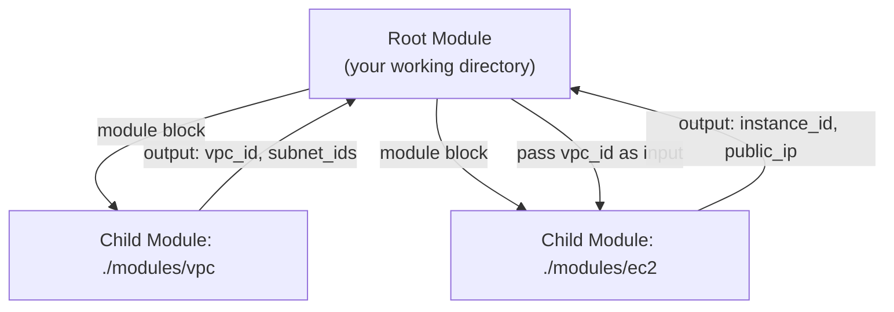
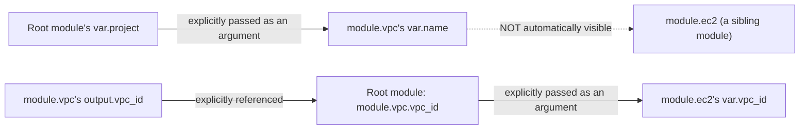

# Domain 5 — Terraform Modules

*Official exam objectives covered: 5a (How Terraform sources modules), 5b (Variable scope within modules), 5c (Use modules in configuration), 5d (Manage module versions)*
*Course lectures folded in: Basics of Modules, Creating EC2 via Module, Choosing the Right Module, Base Module Structure, Custom Module for EC2, Module Sources, Local Paths, Improvements in Custom Module Code, Variables in Modules, Converting Hardcoded Values, Provider Config Improvements, Module Outputs, Root vs Child Module, Standard Module Structure, Multiple Provider Configuration in Modules, Registry Publishing Requirements*

---

## 1. What a Module Actually Is

### Definition
A module is simply **a directory containing `.tf` files**. Every config you've written in this course so far *is already a module* — the "root module" (the directory you run `terraform apply` from). A module in the reusable sense is a **child** directory called from the root (or from another module) specifically to avoid repeating the same resource structure across multiple places.



### What if modules didn't exist at all?
Every environment (dev, staging, prod) and every similar resource pattern (three near-identical microservice deployments, for example) would need its resource blocks **fully retyped** in each location. A bug fix or a security improvement discovered in one place would need to be manually re-applied, correctly, in every other copy — with no guarantee anyone remembers to do it everywhere. Modules turn "copy-paste and hope you remember to update every copy" into "change it once, every caller picks it up on their next apply."

---

## 2. Using an Existing (Public) Module

```hcl
module "vpc" {
  source  = "terraform-aws-modules/vpc/aws"
  version = "5.8.1"

  name = "my-vpc"
  cidr = "10.0.0.0/16"

  azs             = ["ap-south-1a", "ap-south-1b"]
  public_subnets  = ["10.0.1.0/24", "10.0.2.0/24"]
  private_subnets = ["10.0.101.0/24", "10.0.102.0/24"]

  enable_nat_gateway = true
}
```
One `module` block here replaces what would otherwise be dozens of hand-written `resource` blocks (VPC, subnets, route tables, an internet gateway, NAT gateways, route table associations) — all encapsulated, tested, and maintained by a widely-used community module.

### Choosing the Right Module — a real checklist, not a formality
- **Verified/Partner badge** on the Registry, or at minimum a high download count and active GitHub stars — signals real-world usage and scrutiny.
- **Recent maintenance activity** — check the last commit date and whether open issues get responses; an abandoned module is a liability the moment it stops matching the current provider's schema.
- **Does its input/output surface genuinely fit your need**, or would you be fighting its abstractions to bend it toward something it wasn't designed for?
- **Pin an exact `version`** — registry modules can introduce breaking changes across major versions exactly like providers do.

### What if you skip vetting and adopt an unmaintained or overly-generic module?
You inherit its bugs, its slow (or nonexistent) response to new AWS features, and potentially security issues nobody's patching. Worse, an overly generic "one module to rule everything" often has 40+ input variables, most irrelevant to your use case — harder to reason about than three focused, purpose-built resource blocks would have been.

### Real-World Scenario 1 — Standardizing VPC Creation Across 15 Teams
A large company has 15 different application teams, each historically hand-writing their own VPC/subnet Terraform code with subtly different (and sometimes insecure) configurations. Standardizing on one vetted, versioned module (`terraform-aws-modules/vpc/aws`) means every team's network layer follows the same audited pattern — and a security fix discovered in the module (say, a missing flow-log configuration) is fixed once, in one place, and rolled out to all 15 teams simply by bumping their `version` constraint.

### Real-World Scenario 2 — A Breaking Public Module Update
A team pins `version = "~> 4.0"` for a public module. The module's maintainers release `v5.0.0` with renamed input variables. Because of the `~>` constraint, `terraform init` continues resolving `4.x` versions indefinitely — the team upgrades deliberately, on their own schedule, reading the module's changelog first, instead of being blindsided by a breaking change picked up silently on a random `init`.

---

## 3. Building a Custom Module — The Full Story, Step by Step

### 3.1 Standard Module Structure (build this shape from day one)
```
modules/
└── ec2-instance/
    ├── main.tf         # resources
    ├── variables.tf    # input variables (the module's "parameters")
    ├── outputs.tf      # output values (the module's "return values")
    └── README.md        # optional, but expected for anything meant to be shared
```
This is also a **hard requirement** for publishing to the public Registry (Section 6).

### 3.2 First Pass — Deliberately Hardcoded (the anti-pattern, shown so you can see exactly what's wrong)
```hcl
# modules/ec2-instance/main.tf
resource "aws_instance" "this" {
  ami           = "ami-0e35ddab05955cf57"
  instance_type = "t3.micro"
  subnet_id     = "subnet-0abc123456"
}
```
This technically "works" — but only ever for one specific AMI, one size, one subnet, forever. It isn't a *reusable* module yet; it's a resource block that happens to live in a different folder.

### 3.3 Adding Variables — Converting Hardcoded Values
```hcl
# modules/ec2-instance/variables.tf
variable "ami_id" {
  type        = string
  description = "AMI to launch"
}
variable "instance_type" {
  type    = string
  default = "t3.micro"
}
variable "subnet_id" {
  type = string
}
variable "tags" {
  type    = map(string)
  default = {}
}
```
```hcl
# modules/ec2-instance/main.tf (AFTER)
resource "aws_instance" "this" {
  ami           = var.ami_id
  instance_type = var.instance_type
  subnet_id     = var.subnet_id
  tags          = var.tags
}
```
Now the *shape* (an EC2 instance with sensible defaults) is fixed by the module, but the *specifics* are supplied per call site:
```hcl
module "web_server" {
  source        = "./modules/ec2-instance"
  ami_id        = data.aws_ami.amazon_linux.id
  instance_type = "t3.small"
  subnet_id     = module.vpc.public_subnet_ids[0]
  tags          = { Name = "web-server" }
}

module "worker_server" {
  source        = "./modules/ec2-instance"
  ami_id        = data.aws_ami.amazon_linux.id
  instance_type = "t3.large"          # different size
  subnet_id     = module.vpc.private_subnet_ids[0]   # different subnet
  tags          = { Name = "worker" }
}
```
**Two callers, same module code, two entirely different resulting instances** — this is the entire payoff of the refactor from Section 3.2.

### 3.4 Provider Configuration — the mistake that silently breaks reusability
**Don't:**
```hcl
# modules/ec2-instance/main.tf - ANTI-PATTERN
provider "aws" {
  region = "us-east-1"   # every single caller is now stuck with this region
}
```
**What actually breaks:** the moment a second caller needs `ap-south-1`, they can't — this module hardcodes the region for everyone, forever, unless they fork it. Worse, having a `provider` block inside a *child* module used to be outright disallowed by Terraform in many versions, and is still strongly discouraged even where technically possible.

**Do:** let the module stay completely silent on provider configuration — the **caller** (root module) configures the provider, and the module simply uses whatever provider is implicitly passed down, or explicitly via `providers = {}` for multi-provider setups (Section 5).

### Real-World Scenario 1 — A Multi-Region Company Discovers a Hardcoded Region
A company's custom EC2 module hardcoded `region = "us-east-1"` inside its own provider block, written by an engineer who, at the time, only worked with US infrastructure. Eight months later, the company expands into the Indian market and needs `ap-south-1` infrastructure — and discovers every team using this module is stuck, requiring an emergency refactor (removing the internal provider block) across a module now used by a dozen different call sites, each of which needs to be re-tested.

### Real-World Scenario 2 — One Module, Two Instance Sizes, Zero Duplication
A platform team's `ec2-instance` module is called twice in the same root config: once for a lightweight "web" tier (`t3.small`, public subnet) and once for a heavier "worker" tier (`t3.large`, private subnet), exactly as shown in Section 3.3. When AWS deprecates the module's default AMI filter pattern eight months later, the fix is a **single-line change** inside the module — both the web and worker tiers pick it up automatically on their next `apply`, with zero changes needed at either call site.

---

## 4. Module Sources — How Terraform Sources Modules (Objective 5a)

`source` tells Terraform *where* to find a module's code, and accepts several distinct location types:

| Source type | Example | When to use |
|---|---|---|
| Local path | `source = "./modules/ec2-instance"` | Developing/testing a module before deciding whether to publish it |
| Public Registry | `source = "terraform-aws-modules/vpc/aws"` | A well-vetted, widely-used public module |
| Private Registry | `source = "app.terraform.io/my-org/vpc/aws"` | An org-internal module (HCP Terraform, Domain 8) |
| Git URL | `source = "git::https://github.com/my-org/tf-modules.git//vpc?ref=v1.0.0"` | Internal modules not published to any registry, version-pinned via a Git tag |
| S3/GCS bucket | `source = "s3::https://s3.amazonaws.com/my-bucket/module.zip"` | Air-gapped or highly locked-down environments |

**Local path rule:** always use a *relative* path (`./modules/x`), never an absolute one (`/home/deepak/modules/x`) — an absolute path breaks the instant anyone else clones the repo to a different location on their own machine.

### What if you use an absolute local path?
The module works perfectly on the original author's machine and fails with "module not found" for literally every other teammate, and in CI — a completely avoidable, and surprisingly common, first-week mistake.

---

## 5. Module Outputs and Variable Scope (Objectives 5b, 5c)

### Module Outputs — how values flow back out
```hcl
# modules/ec2-instance/outputs.tf
output "instance_id" {
  value = aws_instance.this.id
}
output "public_ip" {
  value = aws_instance.this.public_ip
}
```
```hcl
# root main.tf
output "web_ip" {
  value = module.web_server.public_ip
}
```

### Variable Scope Within Modules — the concept the exam specifically names
A module's `variable` declarations are **local to that module** — they are not automatically visible to the root module or to sibling modules, and the root module's variables are not automatically visible inside a child module either. Values only cross this boundary through **explicit** wiring: the caller passes arguments into the module block, and the module passes values back out through its own `output` blocks.



### Example — wiring two modules together via the root module
```hcl
module "vpc" {
  source = "./modules/vpc"
  cidr   = "10.0.0.0/16"
}

module "ec2" {
  source    = "./modules/ec2-instance"
  subnet_id = module.vpc.public_subnet_ids[0]   # module A's output -> module B's input
}
```
`module.ec2` has **no automatic knowledge** of `module.vpc` — the root module is the one place that knows how they connect, and that connection must be written explicitly. This is a deliberate design choice: it keeps each module's scope small and independently reasoned-about, at the cost of requiring the root module to do the wiring.

### What if you assumed variable scope was global across modules (a common beginner mistake)?
```hcl
# modules/vpc/variables.tf
variable "environment" { type = string }

# modules/ec2/main.tf - WRONG ASSUMPTION
resource "aws_instance" "this" {
  tags = { Environment = var.environment }   # ERROR: var.environment doesn't exist in THIS module's scope
}
```
This fails immediately with "Reference to undeclared input variable" — `ec2`'s module has its own, entirely separate `variables.tf`; it has no visibility into `vpc`'s variables just because they're both called from the same root. Each module must declare its **own** `variable "environment"` and have the root module explicitly pass the value into both.

### Real-World Scenario 1 — Debugging a "Variable Not Found" Error for a New Hire
A new engineer, used to thinking of variables as globally accessible (like environment variables in a shell script), tries to reference `var.vpc_cidr` inside the `ec2` module, assuming it's "the same variable" declared in the `vpc` module. They hit an immediate, clear error — and the fix teaches the core lesson of module scoping: declare the variable locally in `ec2`'s own `variables.tf`, and have the root module pass `module.vpc.cidr_block` (an *output*, not the original variable) into it.

### Real-World Scenario 2 — Output Propagation Across Three Modules (Network → Compute → Monitoring)
A `network` module outputs `vpc_id`. A `compute` module takes `vpc_id` as an input and outputs `instance_id`. A `monitoring` module takes `instance_id` as an input to set up a CloudWatch alarm. None of these three modules know about each other directly — the **root module** is the only place all three connect, explicitly passing each module's outputs as the next module's inputs. This is exactly how real multi-tier architectures (Domain 5's practical endpoint) are composed.

---

## 6. Root Module vs. Child Module, and State Ownership

| | Root Module | Child Module |
|---|---|---|
| What it is | The directory you run `terraform init/plan/apply` in | Any module called via a `module {}` block |
| Owns its own state file? | Yes — **one** state file for the whole tree (root + all children) | **No** — no separate state; resources just get a `module.<name>.` prefix in the shared state's resource addresses |

**Exam-critical fact:** modules do **not** get their own state file by default. A root module and every child module it calls — no matter how deeply nested — all share exactly one state file.

**What if you assumed each module had isolated state?** You might expect deleting a module's *code* (the `module` block) to leave its resources untouched in some "separate" state — it does not. Removing a `module` block and running `apply` proposes destroying every resource that module created, because they were always part of the *same* state tree, just namespaced by address.

---

## 7. Multiple Provider Configuration in Modules

```hcl
# root main.tf
provider "aws" {
  alias  = "us"
  region = "us-east-1"
}
provider "aws" {
  alias  = "ap"
  region = "ap-south-1"
}

module "ec2_us" {
  source    = "./modules/ec2-instance"
  providers = { aws = aws.us }
  ami_id    = "ami-xxxx-us"
}
module "ec2_ap" {
  source    = "./modules/ec2-instance"
  providers = { aws = aws.ap }
  ami_id    = "ami-xxxx-ap"
}
```
The module itself declares **no** provider configuration (Section 3.4) — the **caller** decides which configured provider instance a given module call should use, via the `providers` map. This is the exact mechanism behind deploying the same module's resource shape across multiple regions or AWS accounts.

### Real-World Scenario — Disaster Recovery, Same Module, Two Regions
A company's `ec2-instance` module is called twice from the root: once with `providers = { aws = aws.primary }` targeting `ap-south-1`, and once with `providers = { aws = aws.dr }` targeting `us-east-1`. Both call sites use the **exact same module code** — the only difference is which aliased provider each is wired to. A bug fix in the module benefits both regions' deployments simultaneously.

---

## 8. Managing Module Versions (Objective 5d)

```hcl
module "vpc" {
  source  = "terraform-aws-modules/vpc/aws"
  version = "~> 5.0"   # same constraint syntax as provider versions
}
```
Registry and Git-sourced modules should **always** be version-pinned, using the same `~>`/`=`/`>=` syntax covered for providers (Domain 2). Local-path modules (`./modules/x`) have no independent version — they version along with whatever commit of the parent repo they're checked out at.

**What if you don't pin a Registry module's version?** `terraform init` resolves the latest version available *at that moment* — different teammates initializing on different days can silently get different module versions, and a breaking change released by the module's maintainers propagates into your infrastructure the next time anyone runs `init` fresh, with zero warning.

---

## 9. Publishing a Module to the Terraform Registry

To publish publicly on registry.terraform.io:
1. Hosted in its **own** GitHub repo, named `terraform-<PROVIDER>-<NAME>` (e.g., `terraform-aws-ec2-instance`).
2. Repo must be **public**.
3. Must follow the **standard module structure** (Section 3.1): `main.tf`, `variables.tf`, `outputs.tf` at the repo root.
4. Releases tagged using **semantic versioning** (`v1.0.0`) — the Registry ingests these tags directly as module versions.
5. A description (pulled from the GitHub repo's own metadata) and ideally a `README.md`.

---

## 10. Practice Questions

### Easy
1. Where does a resource created inside a child module live — its own state file, or the root module's?
2. What's the required naming convention for a GitHub repo hosting a publishable Terraform module?
3. Write a `module` block calling a local module at `./modules/s3-bucket`, passing `bucket_name = "my-app-logs"`.

### Medium
4. You call the same custom EC2 module twice — once for a "web" tier and once for a "worker" tier — each needing a different `instance_type` and `subnet_id`. Show the two `module` blocks, and explain what must be true about the module's `variables.tf` for this to work.
5. A module's `main.tf` hardcodes `region = "us-east-1"` inside its own `provider "aws" {}` block. Explain the concrete failure this causes the first time a second caller needs a different region.
6. A new engineer assumes `var.environment`, declared in the `vpc` module, is automatically visible inside the `ec2` module because both are called from the same root. Explain why this fails, and the correct fix.

### Hard
7. Design a two-module root configuration — a `network` module (VPC + subnets) and a `compute` module (EC2 in the private subnet) — wired together via module outputs/inputs, using **two aliased AWS providers** so `compute` deploys into `ap-south-1` while a `network`-owned logging bucket resource lives in `us-east-1`. Sketch the `providers = {}` mapping for both module calls.
8. Explain the practical difference in blast radius between "a bug in a hand-written resource block used once" versus "a bug in a custom module called across 12 different teams' configs." What two concrete practices (from this section) mitigate that risk once a module is shared this widely?

---
**Next:** [08-domain6-state-management.md](08-domain6-state-management.md)
