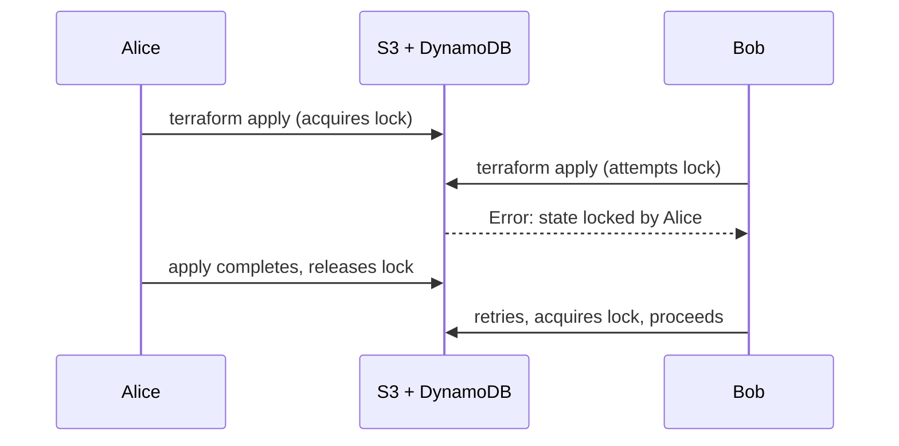
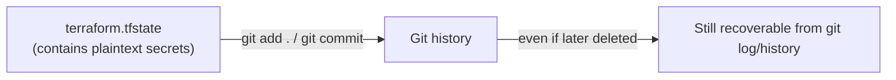
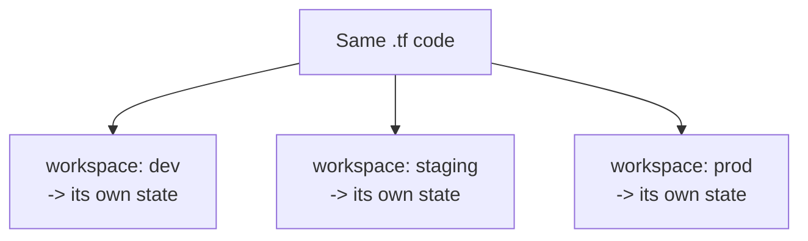
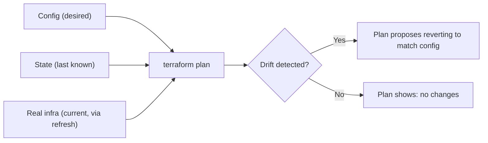

# Domain 6 — Terraform State Management

*Official exam objectives covered: 6a (Local backend), 6b (State locking), 6c (Remote state via the backend block), 6d (Manage resource drift and state)*
*Course lectures folded in: Terraform Workspaces (overview + practical), Git for Team Collaboration, Security Risks of Storing State in Git, .gitignore, Terraform Backend, State Locking, S3 Backend, Desired State vs Current State (drift management, deep dive), Removed Blocks*

---

## 1. The Local Backend (Objective 6a)

### What it is
When no `backend` block is configured, Terraform defaults to the **local backend** — `terraform.tfstate` sitting as a plain file in your working directory, read and written directly by the Terraform CLI on your own machine.

```hcl
# No backend block at all = local backend, implicitly
resource "aws_instance" "web" {
  ami = var.ami_id
}
```

### What role it plays, and its real limits
The local backend is genuinely fine for solo learning, a personal project, or a quick proof-of-concept — zero setup, works immediately. Its limits appear the instant more than one person touches the same infrastructure:
- **No shared source of truth.** If two people each have their own local `terraform.tfstate`, neither knows what the other created — leading directly to the "duplicate resource" problem from Domain 2.
- **No locking.** Nothing stops two people running `apply` at the exact same moment, corrupting the file.
- **Easy to lose.** A laptop dies, a disk fills up, someone `rm -rf`'s the wrong folder — and with it, the only record of what real infrastructure exists.
- **Easy to accidentally commit.** Section 4 covers exactly why this is dangerous.

### What if a team keeps using the local backend anyway, as they grow?
This is a very common real progression: a solo project works fine locally, a second engineer joins, and suddenly nobody's `terraform plan` reflects what the other person's `apply` actually created — because each has a *different*, un-synced local state file. The team either starts manually emailing/Slacking `terraform.tfstate` back and forth (genuinely happens, and is exactly as fragile as it sounds) or migrates to a remote backend (Section 3) — there's no good way to make the local backend work safely for more than one person.

### Real-World Scenario — A Solo Developer's Project Grows a Second Contributor
An indie developer manages their side project's AWS infrastructure with the local backend for a year, no issues. They bring on a co-founder who needs to make infrastructure changes too. Within the first week, the co-founder's `terraform apply` (using their own, never-before-run local state) tries to create a VPC that already exists — because their local state file has never seen any of the original developer's applies. The fix is migrating to a remote backend (Section 3) *before* a second person ever touches the project, not after the first collision.

---

## 2. State Locking (Objective 6b)

### What it is and why it exists
When someone runs `apply`, Terraform acquires a **lock** on the state so that a second, simultaneous `apply` can't write to the same file at the same time and corrupt it.



### How it's implemented with the S3 backend
S3 itself has no native locking mechanism — the classic pattern pairs it with a **DynamoDB table**, which holds a lock record (a row) for the duration of each operation.
```hcl
terraform {
  backend "s3" {
    bucket         = "my-org-tfstate"
    key            = "prod/terraform.tfstate"
    region         = "ap-south-1"
    dynamodb_table = "terraform-locks"
    encrypt        = true
  }
}
```
> Newer Terraform/AWS-provider versions have introduced S3-native locking via conditional writes, reducing the strict DynamoDB requirement — but "S3 + DynamoDB" is still the classic, most commonly tested pattern; know it as the default mental model even as the tooling evolves.

### What if you run a team's S3 backend *without* the DynamoDB locking table?
Nothing stops two people from running `apply` at literally the same second. The most likely outcome is a corrupted or overwritten state file — one person's changes silently vanish from state (even though the real AWS resources they created still exist), leading to Terraform believing resources need to be recreated that are actually already running, or vice versa. This is one of the most avoidable, and most damaging, real-world Terraform incidents — entirely prevented by a locking table that costs a few cents a month.

### Real-World Scenario — Two Engineers Racing an Apply During an Incident
During a production incident, two on-call engineers, unaware of each other, both start `terraform apply` within seconds of each other to fix the same issue. With DynamoDB locking configured, the second engineer's `apply` fails immediately with a clear "state locked by [Alice], created at [timestamp]" error — annoying, but safe; they coordinate over Slack and retry once the first apply finishes. Without locking, both applies proceed simultaneously, and the state file that results depends on whichever process happened to write last — a real risk of losing track of infrastructure changes during the exact moment safety matters most.

---

## 3. Configuring Remote State via the Backend Block (Objective 6c)

### The S3 backend, in full
```hcl
terraform {
  backend "s3" {
    bucket         = "my-org-tfstate"
    key            = "prod/terraform.tfstate"    # path within the bucket
    region         = "ap-south-1"
    dynamodb_table = "terraform-locks"
    encrypt        = true
  }
}
```
- **Bucket versioning** should be enabled on the S3 bucket — gives you a rollback path if state ever gets corrupted or a bad apply needs its prior state restored.
- **`key`** is how multiple projects/environments share one bucket without colliding — each gets its own object path (`prod/terraform.tfstate`, `staging/terraform.tfstate`, `network/prod/terraform.tfstate`, etc.).
- **`encrypt = true`** enables server-side encryption at rest for the state object — important given the plaintext-secrets caveat covered in Domain 4c.

### The single most exam-tested gotcha about backend blocks
**Backend blocks cannot use variables.** This is different from every other block in Terraform:
```hcl
# THIS DOES NOT WORK
terraform {
  backend "s3" {
    bucket = var.state_bucket_name   # ERROR - variables are not allowed here
  }
}
```
**Why:** backend configuration is resolved *before* Terraform has even parsed your variable definitions — it needs to know where to fetch/write state before it can do anything else, including reading `.tfvars`. The workaround is `-backend-config`:
```bash
terraform init -backend-config="bucket=my-org-tfstate" -backend-config="key=prod/terraform.tfstate"
# or, more commonly, a separate backend config file:
terraform init -backend-config="backend-prod.hcl"
```

### What if you don't realize this rule and try to parameterize the backend anyway?
You get a confusing error the first time you try it, at exactly the point where you're trying to make your config more flexible across environments — a well-known first real "gotcha" moment for people moving from single-environment to multi-environment Terraform. The correct pattern (partial backend config + `-backend-config` files, one per environment) is the standard fix.

### Real-World Scenario 1 — Migrating from Local to Remote State
A team starts with the local backend, then adds an S3 `backend` block to their config and runs `terraform init` again. Terraform detects the backend configuration changed and **interactively prompts**: "Do you want to copy existing state to the new backend?" — confirming "yes" copies the entire state history into S3 in one step, with the local `terraform.tfstate` now safely superseded (and which should then be deleted/ignored, never left lying around as a stale duplicate).

### Real-World Scenario 2 — One Bucket, Many Projects, Zero Collisions
A platform team uses one S3 bucket (`my-org-tfstate`) for every project company-wide, distinguishing them purely by `key`: `network/prod/terraform.tfstate`, `app-frontend/prod/terraform.tfstate`, `app-backend/staging/terraform.tfstate`, and so on. One bucket, one DynamoDB locking table, dozens of independently-applied projects, no state file ever collides with another because the `key` path is always unique per project+environment.

---

## 4. Git Collaboration & State File Security

### Why the state file must never touch Git
The state file contains **every attribute of every resource**, often including secrets, **in plaintext** — regardless of whether a corresponding output was marked `sensitive` (Domain 4c).

**What if it's committed anyway, even to a "private" repo?** Treat every secret inside it as immediately compromised — rotate all of them — because Git history retains old commits indefinitely by default; deleting the file in a later commit does *not* remove it from history, and anyone with repo access (including former employees whose access wasn't fully revoked, or a future accidental repo-visibility change to public) can retrieve it.

### The `.gitignore` fix
```
*.tfstate
*.tfstate.*
.terraform/
*.tfvars          # ONLY if it contains secrets - see caveat below
crash.log
override.tf
override.tf.json
```
**Caveat on `.tfvars`:** ignore it *if* it contains secrets. If a project's `.tfvars` is just non-sensitive sizing (`instance_type = "t3.micro"`), committing it is fine, and often desirable for team consistency — don't blanket-ignore it out of habit if there's nothing sensitive in it.

### Real-World Scenario — A Public Repo Accident
A contractor working on a client's infrastructure accidentally sets a previously-private GitHub repository to public while reorganizing their personal account's repos, forgetting that `terraform.tfstate` had been committed to it eight months earlier (before the client's engagement even started using this codebase). Within the same day, automated GitHub-scraping bots that specifically search public repos for `tfstate` files (this is a well-known, real attack pattern) flag the exposed database credentials embedded in it. The client's incident response is: rotate every credential that ever appeared in that file's history, not just the current version — because Git history means "current version" was never actually the only exposure.

---

## 5. Terraform Workspaces (an isolation mechanism, with an important caveat)

### What they are
```bash
terraform workspace new dev
terraform workspace new prod
terraform workspace select dev
terraform workspace show
```
A workspace gives each named environment its **own state file**, while reusing the exact same `.tf` code:
```hcl
resource "aws_instance" "web" {
  instance_type = terraform.workspace == "prod" ? "t3.large" : "t3.micro"
  tags = { Environment = terraform.workspace }
}
```
Under a local backend, workspaces live at `terraform.tfstate.d/<workspace>/terraform.tfstate` — with a remote S3 backend, they're stored under a workspace-specific key prefix automatically.



### The exam-relevant caveat: workspaces are NOT full environment isolation
All workspaces of one config share the **same backend configuration and the same provider credentials** — a `dev` workspace mistake is not isolated from `prod` by IAM alone, because both are reachable by whoever can run Terraform in that directory with those credentials. There's no built-in guard against `terraform workspace select prod && terraform apply` by accident.

**What if you rely on workspaces as your only dev/staging/prod isolation strategy?** A single typo (`terraform workspace select prod` instead of `dev`, easy to do when tab-completing similar names) applies a change intended for `dev` directly to `prod` — using the exact same credentials, since workspaces don't change *who* you're authenticated as. HashiCorp's own recommendation for **real** environment isolation is separate root module directories (`env/dev/`, `env/staging/`, `env/prod/`), each with its own backend config and, ideally, separate AWS accounts/credentials — full isolation, not just a naming convention on top of shared access.

### Real-World Scenario 1 — A Safe Use of Workspaces: Feature-Branch Sandboxes
A team uses workspaces specifically for short-lived, low-stakes feature-branch sandboxes (`terraform workspace new feature-123`) that get destroyed when the branch is merged or abandoned — a genuinely good fit, since the risk of a mistake here is low and the convenience of "same code, instantly isolated state" is high.

### Real-World Scenario 2 — A Dangerous Misuse of Workspaces
A company uses `dev`/`staging`/`prod` workspaces (all sharing one AWS account and one set of credentials) as their *entire* environment isolation strategy. An engineer, intending to test a change in `dev`, forgets to switch workspaces after their last session ended in `prod` — `terraform workspace show` would have warned them, but they skip that check — and applies a destructive change directly to production. This is precisely the scenario that motivates the "separate directories + separate accounts" recommendation instead.

---

## 6. Managing Resource Drift and State (Objective 6d)

### Desired State vs. Current State, revisited with the operational workflow
Recall from Domain 2: `terraform plan` performs a three-way comparison (config vs. last-known state vs. real infrastructure, via an automatic refresh). **Drift** is what happens when the real infrastructure diverges from state because something changed it outside Terraform — a console click, another tool, an auto-scaling event.



### Detecting and handling drift, in practice
```bash
terraform plan   # refreshes by default, surfaces any drift as a proposed change
terraform refresh   # reconciles STATE ONLY with reality, without a full plan/apply
```
When drift is found, you have exactly two honest choices: (1) let `apply` revert the real infrastructure back to match your `.tf` config (the "config is the source of truth" default), or (2) update your `.tf` config to match the new reality, if the manual change was actually correct and should be kept going forward. **There is no third option where Terraform silently adopts the drifted value as the new desired state without you updating the code** — this is a deliberately enforced design decision, not a limitation.

Let's make this concrete with a real-world scenario.

Imagine you have a Terraform configuration file named `main.tf` that deploys an RDS database. Currently, your code, your S3 state file, and the actual AWS console are all perfectly in sync on **`m6gd`**.

```hcl
# main.tf
resource "aws_db_instance" "my_db" {
  allocated_storage = 20
  engine            = "postgres"
  instance_class    = "db.m6gd.large" # <--- Your local code says this
}

```

Then, **Scenario occurs:** An engineer logs into the AWS Web Console and manually modifies the instance type to **`db.m7gd.large`** to handle a traffic spike.

Here is exactly what happens on your terminal and in your S3 state bucket under each scenario.

---

## Scenario 1: You run `terraform plan`

Terraform reads the configuration, fetches the real-world state from AWS, and compares them.

### What you see on your screen:

```diff
# aws_db_instance.my_db has been changed outside of Terraform.
# (This is the implicit refresh recognizing the console change)

Note: Objects have changed outside of Terraform or its state.

Terraform will perform the following actions:

  # aws_db_instance.my_db will be updated in-place
~ resource "aws_db_instance" "my_db" {
      id             = "mydb-id"
~     instance_class = "db.m7gd.large" -> "db.m6gd.large"
  }

Plan: 0 to add, 1 to change, 0 to destroy.

```

### The State:

* **Local `.tf` Code:** `db.m6gd.large`
* **AWS Reality:** `db.m7gd.large`
* **S3 State File:** **Still `db.m6gd.large**` (S3 was not updated because `plan` is a read-only command).

---

## Scenario 2: You run `terraform apply` (Plan + Apply)

You decide to go ahead and run the apply command to enforce your configuration.

### What you see on your screen:

```diff
# (First, it shows you the same plan as Scenario 1)
~ resource "aws_db_instance" "my_db" {
~     instance_class = "db.m7gd.large" -> "db.m6gd.large"
  }

Do you want to perform these actions?
  Enter a value: yes

aws_db_instance.my_db: Modifying... [id=mydb-id]
aws_db_instance.my_db: Modifications complete after 2m30s

Apply complete! Resources: 0 added, 1 changed, 0 destroyed.

```

### The State:

* **AWS Reality:** **Changed back to `db.m6gd.large**` (Terraform actively overrode the manual change).
* **S3 State File:** **Updated to `db.m6gd.large**` (reflecting the successful apply).
* **Local `.tf` Code:** `db.m6gd.large`

---

## Scenario 3: You run `terraform refresh`

*(Or the modern equivalent: `terraform apply -refresh-only` with a `yes` approval)*

You want your S3 state file to align with the new AWS reality, but you do not want to modify any AWS infrastructure.

### What happens:

Terraform queries AWS, sees the database is actually `db.m7gd.large`, and immediately updates the S3 state file to match it.

### The State:

* **AWS Reality:** `db.m7gd.large`
* **S3 State File:** **Updated to `db.m7gd.large**`
* **Local `.tf` Code:** **Still `db.m6gd.large**`

> ⚠️ **The catch:** Because your S3 state file and AWS now agree (`db.m7gd.large`), but your `main.tf` code still says `db.m6gd.large`, your very next standard `terraform plan` will immediately try to change the AWS database back to `db.m6gd.large`.
> To fix this, you must manually update your code in `main.tf` to `db.m7gd.large`.

---

## Scenario 4: You run `terraform plan -refresh-only`

You want to see *if* there is any drift out there, but you don't want to change any infrastructure or touch your S3 state file yet.

### What you see on your screen:

```diff
# aws_db_instance.my_db has been changed outside of Terraform.

Note: Objects have changed outside of Terraform or its state.

This is a preview of the state changes only. No real infrastructure 
will be created, modified, or destroyed.

  # aws_db_instance.my_db will be updated in-state
~ resource "aws_db_instance" "my_db" {
      id             = "mydb-id"
~     instance_class = "db.m6gd.large" -> "db.m7gd.large"
  }

Would you like to update the state file? (This plan cannot be applied)

```

*(Since you only ran `plan`, nothing is committed).*

### The State:

* **AWS Reality:** `db.m7gd.large`
* **S3 State File:** **Still `db.m6gd.large**` (S3 was not updated because this was just a `plan` preview).
* **Local `.tf` Code:** `db.m6gd.large`

### `removed` blocks — the declarative way to stop managing a resource without destroying it
```hcl
removed {
  from = aws_instance.legacy

  lifecycle {
    destroy = false   # stop managing it, but do NOT delete the real resource
  }
}
```
This expresses "hand this resource off, unmanaged, going forward" as reviewable, version-controlled code — instead of a manual, undocumented `terraform state rm` someone runs once from their own laptop with no record of why.

### What if drift goes undetected for a long time (e.g., refresh is disabled in CI for speed)?
State and reality can diverge for months. The eventual `plan` that *does* refresh (perhaps run manually during an incident) can surface a large, confusing batch of "unexpected" changes all at once — several unrelated manual fixes made over time, now all proposed for reversion simultaneously, with nobody remembering the original reasoning behind each one.

### Real-World Scenario 1 — An Auto-Scaling Group's Drift Is Expected, Not a Bug
An ASG's `desired_capacity` is actively managed by a scheduled Lambda (scaling up for business hours, down overnight) — this is **expected, intentional drift** from Terraform's perspective. Using `ignore_changes = [desired_capacity]` (Domain 4c) tells Terraform to stop flagging this specific, known, intentional drift as something to revert — while still catching *unexpected* drift on every other attribute of the same resource.

### Real-World Scenario 2 — A Security Group Rule Changed During an Incident, Never Reverted
During a production incident, an engineer manually opens an additional inbound port on a security group via the console to enable emergency debugging access, intending to close it again afterward — and forgets. Weeks later, a routine `terraform plan` (refreshing by default) surfaces this as unexpected drift: "this ingress rule will be destroyed" (because it's not in the `.tf` config). This is drift detection doing exactly its job — surfacing a forgotten, unintended, and potentially insecure manual change that had gone unnoticed for weeks, giving the team a clear choice to either close it (apply the proposed revert) or formally add it to the config if it turns out to be needed after all.

---

## 7. Practice Questions

### Easy
1. What is the default backend when no `backend` block is configured?
2. Which two AWS services together provide the classic "S3 backend with locking" pattern?
3. True/False: a `backend "s3" {}` block can read its `bucket` value from a `variable`.

### Medium
4. Explain why CLI-native Terraform Workspaces are not HashiCorp's recommended solution for hard dev/staging/prod isolation, and name the structural alternative.
5. A team's S3 backend has no DynamoDB table configured. Describe a concrete scenario where this causes a real, damaging outcome (not just a theoretical risk).
6. Write a `removed` block that stops Terraform from managing `aws_instance.legacy` without destroying the real instance.

### Hard
7. A company's `terraform.tfstate` was committed to a repository that later became public. Explain precisely why deleting the file in a subsequent commit does not resolve the exposure, and what the correct incident-response action is.
8. An ASG's `desired_capacity` is managed by an external Lambda scheduler. Design the `lifecycle` configuration that lets Terraform ignore that specific, expected drift while still catching unexpected drift (e.g., a manually-changed security group) on the same resource.

---
**Next:** [09-domain7-maintain-infrastructure.md](09-domain7-maintain-infrastructure.md)
