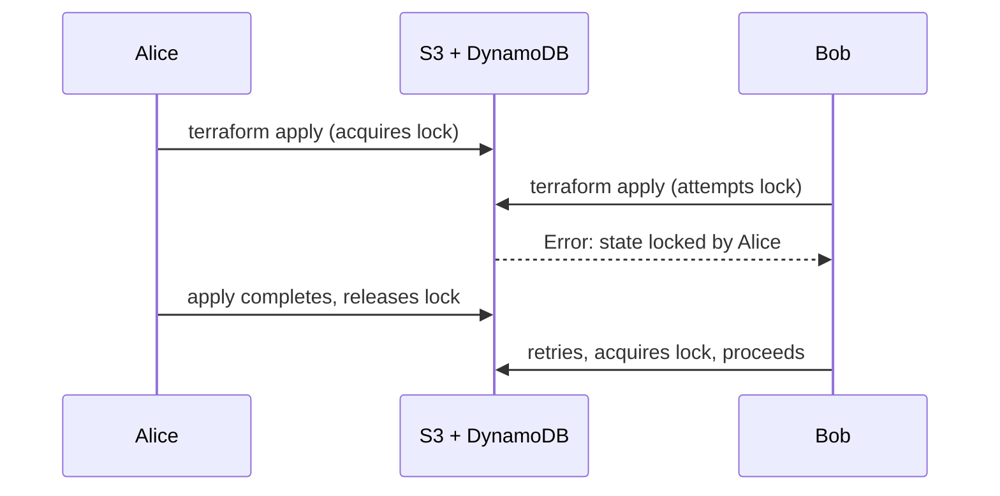
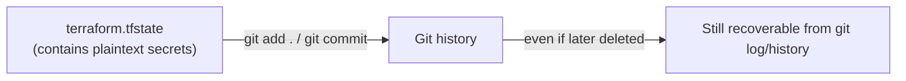
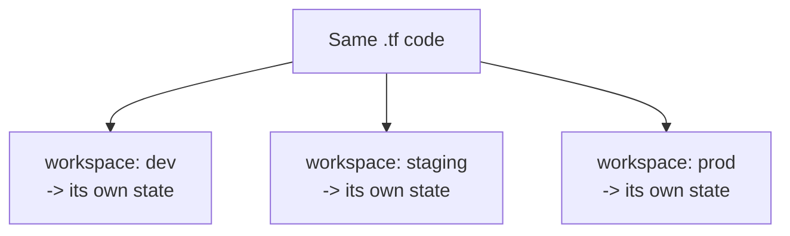
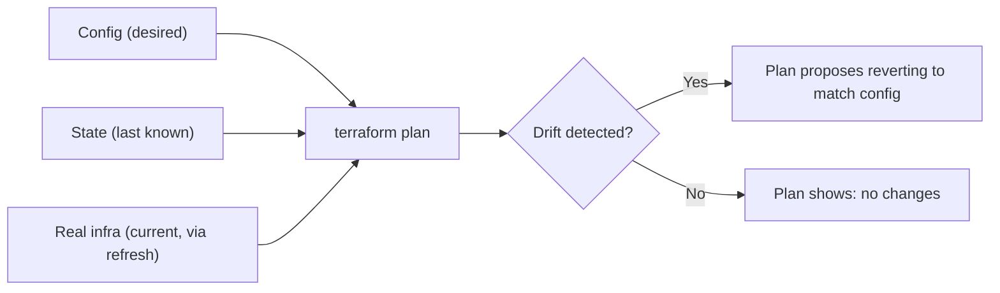
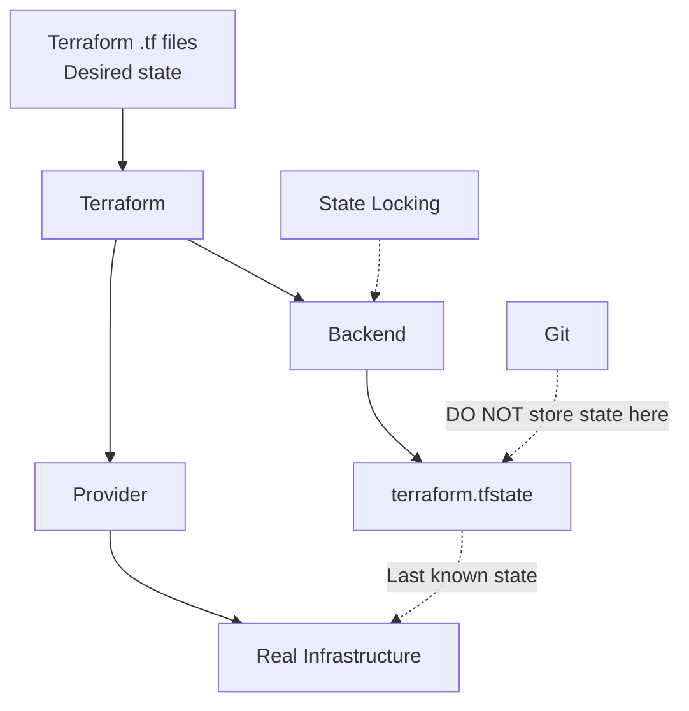

# Domain 6 — Terraform State Management

## What this domain covers

Terraform State Management is about **where Terraform stores state, how teams safely share it, and how Terraform detects and handles differences between your configuration and real infrastructure**.

The official exam objectives are:

* **6a — Local backend**
* **6b — State locking**
* **6c — Remote state via the backend block**
* **6d — Manage resource drift and state**


---

# 1. The Local Backend

## What is a backend?

A **backend** determines where Terraform stores its state.

If you don't configure any backend, Terraform automatically uses the **local backend**.

The state is stored as:

```text
terraform.tfstate
```

in your working directory.

### Example

```hcl
# No backend block
# Therefore Terraform uses the local backend

resource "aws_instance" "web" {
  ami = var.ami_id
}
```


### Simple mental model

```text
              Your Laptop
                  │
                  ▼
             Terraform CLI
                  │
                  ▼
          terraform.tfstate
```

The state file is therefore **local to that machine**.

---

## Is the local backend bad?

**No.**

It is perfectly fine when:

* You're learning Terraform
* You're working on a personal project
* You're experimenting
* You're creating a proof-of-concept
* You're the only person managing the infrastructure

The problem starts when **multiple people need to manage the same infrastructure**.

---

## Problems with the local backend

### 1. No shared source of truth

Imagine:

```text
Alice's laptop
└── terraform.tfstate

Bob's laptop
└── terraform.tfstate
```

These are two separate state files.

Alice may have created:

```text
VPC
EC2
RDS
```

but Bob's state may know nothing about them.

Bob could therefore run:

```bash
terraform apply
```

and Terraform may think those resources need to be created.

This can lead to duplicate resources or conflicts.

---

### 2. No shared locking

Two engineers could potentially run:

```text
Alice → terraform apply
Bob   → terraform apply
```

at the same time.

There is no central mechanism in the local backend coordinating their state operations.

---

### 3. Easy to lose

The state exists on your machine.

If:

* your laptop dies
* the disk is lost
* the Terraform directory is deleted
* the file becomes corrupted

you may lose the state that Terraform relies on to track your infrastructure.

---

### 4. Easy to accidentally commit to Git

This is particularly dangerous because state can contain sensitive information.

We'll cover this in detail later.


---

# 2. State Locking

## What is state locking?

**State locking prevents multiple Terraform operations from modifying the same state simultaneously.**

Think about two engineers:

```text
Alice                         Bob
  │                            │
  │ terraform apply            │
  ▼                            │
[STATE LOCKED]                 │
                               │
                               │ terraform apply
                               ▼
                         ❌ Cannot acquire lock
```

Bob must wait until Alice's operation completes and the lock is released.

---

## Why do we need locking?

Without locking:

```text
Alice ────────────────┐
                      ├──> Same state
Bob   ────────────────┘
```

Both Terraform processes could try to modify the same state simultaneously.

This can result in:

* conflicting changes
* overwritten state
* corrupted state
* Terraform losing track of resources

The important point for the exam:

> **State locking protects the state from concurrent Terraform operations.**

---

## Classic S3 + DynamoDB locking model

The traditional AWS setup is:

```text
                 Terraform
                    │
                    ▼
              ┌───────────┐
              │    S3     │
              │   State   │
              └─────┬─────┘
                    │
                    │ locking
                    ▼
              ┌───────────┐
              │ DynamoDB  │
              │   Lock    │
              └───────────┘
```

The S3 bucket stores the state.

The DynamoDB table provides the locking mechanism in the classic configuration.


### Example

```hcl
terraform {
  backend "s3" {
    bucket         = "my-org-tfstate"
    key            = "prod/terraform.tfstate"
    region         = "ap-south-1"
    dynamodb_table = "terraform-locks"
    encrypt        = true
  }
}
```

Here:

| Setting          | Meaning                                      |
| ---------------- | -------------------------------------------- |
| `bucket`         | S3 bucket storing state                      |
| `key`            | Location/path of the state inside the bucket |
| `region`         | AWS region                                   |
| `dynamodb_table` | Locking table in the classic setup           |
| `encrypt`        | Encrypt state at rest                        |

---

## Locking sequence



### Exam mental model

> **S3 = stores state**
> **DynamoDB = classic locking mechanism**

The source also notes that newer Terraform/AWS setups support S3-native locking, so don't treat DynamoDB as an absolute requirement for every current S3 configuration. But for the **Terraform Associate exam mental model**, understand the classic **S3 + DynamoDB** pattern. 

---

# 3. Remote State with the Backend Block

## Why use remote state?

Instead of:

```text
Developer laptop
└── terraform.tfstate
```

a team can have:

```text
                 Terraform
                     │
                     ▼
                Remote Backend
                     │
                     ▼
                S3 State File
```

Now all engineers access the **same state**.

This provides a shared source of truth.

---

# S3 Backend

A typical configuration:

```hcl
terraform {
  backend "s3" {
    bucket         = "my-org-tfstate"
    key            = "prod/terraform.tfstate"
    region         = "ap-south-1"
    dynamodb_table = "terraform-locks"
    encrypt        = true
  }
}
```


---

## Understanding `bucket`

```hcl
bucket = "my-org-tfstate"
```

This is the S3 bucket where Terraform stores the state.

Example:

```text
S3 bucket:
my-org-tfstate
```

---

## Understanding `key`

```hcl
key = "prod/terraform.tfstate"
```

The `key` is essentially the **path/name of the state object inside the bucket**.

For example:

```text
my-org-tfstate/
│
├── prod/terraform.tfstate
├── staging/terraform.tfstate
├── network/prod/terraform.tfstate
└── app/prod/terraform.tfstate
```

This allows multiple projects/environments to use the same bucket without sharing the same state object.


### Important distinction

```text
bucket = WHERE
key    = WHICH STATE FILE / PATH
```

---

## Why enable S3 versioning?

State is extremely important.

If the state becomes corrupted or is accidentally changed, S3 versioning gives you historical versions of the object.

So:

```text
S3
│
├── state version 1
├── state version 2
├── state version 3
└── state version 4  ← current
```

This provides a recovery path.

---

## What does `encrypt = true` do?

```hcl
encrypt = true
```

enables encryption of the state object at rest.

This is important because Terraform state can contain sensitive information.

**But remember:**

> Encryption at rest does not mean state is harmless to expose.

You still need to protect access to the bucket and avoid putting state in Git.

---

# 4. VERY IMPORTANT: Backend Blocks Cannot Use Variables

This is one of the biggest exam traps in this domain.

You **cannot** do this:

```hcl
terraform {
  backend "s3" {
    bucket = var.state_bucket_name
  }
}
```

❌ Invalid.


---

## Why can't backend blocks use variables?

Terraform needs to know:

> **Where is my state?**

before it can fully initialize and work with that state.

So the backend configuration is processed very early.

It cannot first load a variable such as:

```hcl
variable "state_bucket_name" {}
```

and then use it to discover the backend.

### Think of it like this

```text
Terraform starts
      │
      ▼
"Where is my state?"
      │
      ▼
Backend configuration
      │
      ▼
Load/access state
      │
      ▼
Continue Terraform processing
```

Therefore:

```hcl
bucket = var.bucket
```

doesn't work.

---

# How do we customize backend configuration?

Use `-backend-config`.

### CLI example

```bash
terraform init \
  -backend-config="bucket=my-org-tfstate" \
  -backend-config="key=prod/terraform.tfstate"
```

Or use a separate configuration file:

```bash
terraform init -backend-config="backend-prod.hcl"
```


### Exam question

**Can a backend block reference a Terraform variable?**

Answer:

> ❌ No.

**How can backend configuration be supplied dynamically?**

Answer:

> Use `terraform init -backend-config=...`.

---

# 5. Migrating Local State to Remote State

Suppose you started with:

```text
Local backend
    ↓
terraform.tfstate
```

Later you decide to move to S3.

You add:

```hcl
terraform {
  backend "s3" {
    bucket = "my-org-tfstate"
    key    = "prod/terraform.tfstate"
  }
}
```

Then run:

```bash
terraform init
```

Terraform detects that the backend configuration has changed.

It can ask whether you want to migrate/copy the existing state to the new backend.

The important concept:

```text
OLD
Local terraform.tfstate
        │
        │ migration
        ▼
NEW
S3 remote state
```


### Exam trap

`terraform init` is not only for downloading providers.

It is also responsible for **initializing/configuring the backend**, including handling backend changes.

---

# 6. One S3 Bucket Can Store Many State Files

Suppose a company has:

```text
my-org-tfstate
```

They can use different keys:

```text
network/prod/terraform.tfstate
app-frontend/prod/terraform.tfstate
app-backend/prod/terraform.tfstate
app-backend/staging/terraform.tfstate
```

So:

```text
ONE S3 BUCKET
      │
      ├── network/prod/terraform.tfstate
      ├── app-frontend/prod/terraform.tfstate
      ├── app-backend/prod/terraform.tfstate
      └── app-backend/staging/terraform.tfstate
```

The `key` keeps them separate.


---

# 7. Never Store Terraform State in Git

This is extremely important.

You should generally **never commit**:

```text
terraform.tfstate
```

to Git.

Why?

Because Terraform state can contain resource attributes and potentially sensitive values in plaintext.

For example, state might contain information such as:

```text
database username
database password
API credentials
resource IDs
connection information
other sensitive attributes
```

Marking an output as:

```hcl
sensitive = true
```

does **not** mean the underlying state becomes magically encrypted.

---

## What happens if state gets committed?

Imagine:



The important problem is **Git history**.

Suppose:

### Commit 1

```text
terraform.tfstate
```

contains:

```text
password = "Secret123"
```

### Commit 2

You delete:

```text
terraform.tfstate
```

Someone might think:

> "It's deleted now, so we're safe."

❌ No.

The old commit still contains the file.

```text
Commit 1
└── terraform.tfstate
       │
       │ deleted
       ▼
Commit 2
└── file removed

BUT

Git history
└── Commit 1 still contains it
```


---

# What if the repository is private?

Still treat exposed secrets seriously.

If sensitive credentials have entered Git history, the safe incident-response assumption is:

> **Those credentials are compromised.**

Rotate/revoke the affected credentials.

Deleting the file from the latest commit does not erase its historical copies.

---

# 8. `.gitignore` for Terraform

A common `.gitignore` contains:

```gitignore
*.tfstate
*.tfstate.*
.terraform/
*.tfvars
crash.log
override.tf
override.tf.json
```


### Important `.tfvars` caveat

Don't blindly assume every `.tfvars` file must be ignored.

If it contains secrets:

```hcl
db_password = "super-secret"
```

➡️ Don't commit it.

But if it contains only harmless configuration:

```hcl
instance_type = "t3.micro"
```

it may be perfectly reasonable to commit it.

The important rule is:

> **Protect sensitive values, not simply every file with a particular extension.**

---

# 9. Terraform Workspaces

Terraform Workspaces allow you to use:

> **The same Terraform configuration with different state files.**

Commands:

```bash
terraform workspace new dev
terraform workspace new prod

terraform workspace select dev

terraform workspace show
```


---

## Simple example

```hcl
resource "aws_instance" "web" {
  instance_type = terraform.workspace == "prod"
    ? "t3.large"
    : "t3.micro"

  tags = {
    Environment = terraform.workspace
  }
}
```

Now:

```text
workspace = dev
       ↓
t3.micro

workspace = prod
       ↓
t3.large
```

Same `.tf` code, different workspace/state.

---

## Workspace mental model



So:

```text
Same configuration
       │
       ├── dev      → State A
       ├── staging  → State B
       └── prod     → State C
```


---

# 10. Workspaces Are NOT Complete Environment Isolation

This is a **very important exam concept**.

A common misconception is:

> "I'll create dev, staging and prod workspaces, therefore my environments are completely isolated."

Not necessarily.

All workspaces in that configuration share the same overall backend configuration and provider setup/credentials.

So you could accidentally do:

```bash
terraform workspace select prod
terraform apply
```

when you thought you were working on `dev`.

---

## Why is that dangerous?

Imagine:

```text
             Same Terraform configuration
                       │
             ┌─────────┼─────────┐
             ▼         ▼         ▼
            dev     staging     prod
             │         │         │
             └─────────┼─────────┘
                       │
                Same access path
```

A workspace changes **which state** you're working with.

It does not automatically give you:

* a separate AWS account
* separate IAM permissions
* separate credentials
* a completely separate root configuration

---

## Better isolation for real environments

For strong environment separation, use separate root configurations such as:

```text
env/
├── dev/
├── staging/
└── prod/
```

Ideally combined with separate AWS accounts/credentials where appropriate.

The key exam distinction:

> **Workspace = separate state, same configuration.**

> **Separate root modules/directories = stronger environment separation.**


---

## When are workspaces useful?

A good example is temporary feature environments:

```bash
terraform workspace new feature-123
```

You can use the same configuration while giving that environment its own state.

This can be convenient for:

* Feature branches
* Temporary testing
* Short-lived sandboxes

But be careful about using workspaces as your **only** dev/staging/prod security boundary.

---

# 11. Drift — Desired State vs Current State

Now we reach one of the most important concepts in Terraform.

## What is drift?

**Drift occurs when real infrastructure changes outside Terraform and therefore no longer matches what Terraform expects.**

For example, Terraform configuration says:

```hcl
instance_class = "db.m6gd.large"
```

But someone goes into the AWS console and changes it to:

```text
db.m7gd.large
```

Now:

```text
Terraform configuration
        │
        ▼
db.m6gd.large

AWS reality
        │
        ▼
db.m7gd.large
```

That's **drift**.

Common causes:

* Someone changes something manually in AWS Console
* Another automation tool changes infrastructure
* An external script changes resources
* An autoscaling process changes an attribute


---

# 12. How Terraform Detects Drift

A normal:

```bash
terraform plan
```

refreshes information from the provider and compares the configuration/state with real infrastructure.

Conceptually:




---

# 13. Very Important: What Does Terraform Do With Drift?

Suppose:

### Configuration

```text
m6gd
```

### State

```text
m6gd
```

### AWS

Someone manually changes it:

```text
m7gd
```

Now:

```text
.tf configuration → m6gd
state              → m6gd
AWS                → m7gd
```

You run:

```bash
terraform plan
```

Terraform detects the difference.

The plan may effectively say:

```diff
~ instance_class = "db.m7gd.large" -> "db.m6gd.large"
```

Terraform is saying:

> "AWS is currently different from what your configuration declares. I will change it back."

---

# 14. Drift Management — Two Choices

Once you discover drift, you need to decide whether the manual change was:

### Option 1 — Wrong/unwanted

You want Terraform configuration to remain the source of truth.

Run:

```bash
terraform apply
```

Terraform changes AWS back to what your configuration specifies.

```text
AWS: m7gd
       │
       │ terraform apply
       ▼
AWS: m6gd
```

---

### Option 2 — The manual change was actually correct

Maybe the engineer changed:

```text
m6gd → m7gd
```

because the application genuinely needs the larger database.

Then update your Terraform code:

```hcl
instance_class = "db.m7gd.large"
```

Now your desired state becomes the new reality.

### Important exam concept

Terraform does **not** automatically decide:

> "Someone changed AWS, so I'll permanently adopt that value as my desired configuration."

You must update the configuration if you want to keep the change.


---

# 15. `terraform plan` vs `terraform apply` vs Refresh-Only

This is an important area where exam questions can become tricky.

Let's use:

```text
Configuration = m6gd
State         = m6gd
AWS           = m7gd
```

---

## Scenario 1 — `terraform plan`

```bash
terraform plan
```

Terraform detects the drift and shows the proposed infrastructure change.

But:

> **`plan` does not apply the change.**

So after the plan:

```text
.tf Code  = m6gd
AWS       = m7gd
State     = m6gd
```

The source specifically highlights that the S3 state is not updated merely because you ran a normal plan. 

---

# 16. `terraform apply`

Run:

```bash
terraform apply
```

Terraform first creates/shows the plan and then, after approval, executes it.

In our example:

```text
Before:

Code  → m6gd
State → m6gd
AWS   → m7gd

        terraform apply
              │
              ▼

After:

Code  → m6gd
State → m6gd
AWS   → m6gd
```

Terraform has reverted AWS to the configuration.


---

# 17. Refresh-Only

Sometimes you don't want Terraform to modify infrastructure.

Instead, you want:

> **State to reflect what actually exists in the infrastructure.**

Conceptually:

```text
AWS reality
    │
    ▼
Refresh
    │
    ▼
Terraform state
```

The source gives:

```bash
terraform refresh
```

and the modern equivalent:

```bash
terraform apply -refresh-only
```

The important idea is:

> **Refresh-only updates state to reflect reality without intentionally changing the real infrastructure.**


---

## The BIG catch

Suppose:

```text
Code  = m6gd
State = m6gd
AWS   = m7gd
```

You run:

```bash
terraform apply -refresh-only
```

Now:

```text
Code  = m6gd
State = m7gd
AWS   = m7gd
```

State and AWS now agree.

But configuration still says:

```text
m6gd
```

Therefore the next normal:

```bash
terraform plan
```

will detect:

```text
Code  → m6gd
State → m7gd
```

and propose changing AWS back to:

```text
m6gd
```

So if the manual change is supposed to stay, **update the Terraform configuration too**.


---

# 18. `terraform plan -refresh-only`

There is another subtle distinction.

```bash
terraform plan -refresh-only
```

is useful when you want to **preview state changes caused by drift** without modifying infrastructure or immediately committing those state changes.

Conceptually:

```text
AWS reality
     │
     ▼
refresh
     │
     ▼
"What would state change to?"
     │
     ▼
PLAN ONLY
```

It is a preview.

The source example shows that the state remains unchanged because this is still a `plan`.


---

# 19. The Four Commands — Extremely Important

Memorize this table:

| Command                         | Infrastructure                       | State                    |
| ------------------------------- | ------------------------------------ | ------------------------ |
| `terraform plan`                | ❌ Doesn't change it                  | ❌ Doesn't commit changes |
| `terraform apply`               | ✅ Can change it                      | ✅ Updates state          |
| `terraform apply -refresh-only` | ❌ Doesn't intentionally change infra | ✅ Can update state       |
| `terraform plan -refresh-only`  | ❌ Doesn't change it                  | ❌ Preview only           |

### Mental model

```text
plan
= "What would happen?"

apply
= "Do it."

apply -refresh-only
= "Make state reflect reality, don't change infrastructure."

plan -refresh-only
= "Show me what state would change to."
```

---

# 20. `removed` Blocks

Another important state-management feature is the `removed` block.

Suppose Terraform currently manages:

```hcl
resource "aws_instance" "legacy" {
  ...
}
```

But you want to:

> Stop Terraform from managing this resource **without destroying the actual AWS instance**.

You can use:

```hcl
removed {
  from = aws_instance.legacy

  lifecycle {
    destroy = false
  }
}
```


---

## What does this mean?

```text
Terraform state
       │
       │ remove management
       ▼
Resource no longer managed

BUT

AWS instance
       │
       ▼
Still exists
```

So:

```text
removed + destroy = false
```

means:

> "Terraform should stop managing this resource, but leave the real resource alone."

---

## Why is this better than manually running `terraform state rm`?

You could manually remove something from state with:

```bash
terraform state rm ...
```

But that's a one-time manual action.

A `removed` block is:

* visible in code
* reviewable
* version-controlled
* understandable by teammates
* part of the Terraform configuration/workflow

So the intent is documented.


---

# 21. Intentional vs Unintentional Drift

Not every difference between Terraform and reality is necessarily a problem.

Consider an Auto Scaling Group.

Terraform might define:

```text
desired_capacity = 5
```

But an external scheduler intentionally changes it:

```text
Business hours → 10
Night → 3
```

Terraform would see those differences as drift.

But this drift is **intentional**.

In such a situation, you can use the lifecycle feature from Domain 4:

```hcl
lifecycle {
  ignore_changes = [
    desired_capacity
  ]
}
```

Now Terraform ignores changes to that specific attribute while still managing the rest of the resource.


---

# 22. Don't Ignore Everything

You might see:

```hcl
lifecycle {
  ignore_changes = all
}
```

Be very careful with this.

If you ignore everything, Terraform becomes much less useful at detecting unexpected changes.

Better:

```hcl
lifecycle {
  ignore_changes = [
    desired_capacity
  ]
}
```

This says:

> "I intentionally don't want Terraform to fight with the external system over this one attribute."

But Terraform can still detect other changes.

---

# 23. Example: Security Group Drift

Suppose Terraform manages:

```text
Security group
└── Port 443 allowed
```

During an emergency, someone manually opens:

```text
Port 22
```

in the AWS console.

Terraform configuration doesn't contain that rule.

A later:

```bash
terraform plan
```

can detect the difference and propose removing the manually added rule.

This is **useful drift detection** because the change may have been forgotten and could represent a security problem.


---

# 24. Complete Domain 6 Mental Model

Think about Terraform state like this:



### The flow

```text
.tf files
   │
   │ "What I want"
   ▼
Terraform
   │
   ├──────────────► Provider ─────► AWS
   │
   └──────────────► Backend ──────► State
```

Terraform compares:

```text
Desired configuration
        +
Last-known state
        +
Current infrastructure
        │
        ▼
      PLAN
        │
        ▼
Determine changes
```

---

# Domain 6 — Exam Cheat Sheet

## Backend

| Concept                | Remember                             |
| ---------------------- | ------------------------------------ |
| No backend block       | **Local backend**                    |
| Local state            | `terraform.tfstate`                  |
| Remote state           | Stored in backend such as S3         |
| S3 `bucket`            | Where state is stored                |
| S3 `key`               | State object's path/name             |
| `encrypt = true`       | Encryption at rest                   |
| S3 versioning          | Helps recover previous state         |
| Backend variables      | ❌ Not allowed                        |
| Dynamic backend config | `terraform init -backend-config=...` |

---

## State locking

```text
State locking
     ↓
Prevents concurrent state modification
```

Classic AWS mental model:

```text
S3       → State storage
DynamoDB → Classic locking mechanism
```


---

## Git security

```text
terraform.tfstate
        ↓
Contains potentially sensitive data
        ↓
DO NOT commit to Git
```

If state was committed:

```text
Delete file
    ≠
Erase Git history
```

If secrets were exposed:

```text
Rotate/revoke credentials
```

---

## Workspaces

```text
Same .tf code
      │
      ├── dev      → State A
      ├── staging  → State B
      └── prod     → State C
```

Remember:

> **Workspace = separate state, NOT complete security/environment isolation.**

---

## Drift

```text
Terraform config ≠ Real infrastructure
                ↓
              Drift
```

Typical cause:

```text
Someone manually changes AWS
```

Normal:

```bash
terraform plan
```

detects the difference.

---

## Drift decisions

If manual change is **wrong**:

```text
terraform apply
        ↓
Revert AWS to .tf configuration
```

If manual change is **correct**:

```text
Update .tf configuration
```

Don't simply rely on refresh to permanently make the drift your desired configuration.

---

# ⭐ Most Important Exam Traps

### Trap 1

**Q:** No backend block?

**A:** Local backend.

---

### Trap 2

**Q:** Can this work?

```hcl
backend "s3" {
  bucket = var.bucket_name
}
```

**A:** ❌ No. Backend configuration cannot use Terraform variables.

---

### Trap 3

**Q:** What does the S3 `key` represent?

**A:** The path/name of the state object inside the bucket.

---

### Trap 4

**Q:** Why state locking?

**A:** Prevent concurrent operations from modifying the same state simultaneously.

---

### Trap 5

**Q:** Can Terraform state be committed to Git?

**A:** ❌ No. It can contain sensitive information.

---

### Trap 6

**Q:** If I delete `terraform.tfstate` from the latest Git commit, is the secret gone?

**A:** ❌ No. It can remain in Git history.

---

### Trap 7

**Q:** Does a Terraform workspace provide complete dev/prod isolation?

**A:** ❌ No.

It separates state but doesn't automatically provide separate credentials/accounts/security boundaries.

---

### Trap 8

**Q:** Someone changes AWS manually. What is that called?

**A:** **Drift.**

---

### Trap 9

**Q:** What does normal `terraform plan` do when drift exists?

**A:** Refreshes/reads current infrastructure and can show a proposed change to bring infrastructure back toward the configuration.

---

### Trap 10

**Q:** What does `terraform apply -refresh-only` do?

**A:** Updates state to reflect real infrastructure **without intentionally changing the infrastructure**.

---

### Trap 11

**Q:** What does `terraform plan -refresh-only` do?

**A:** Shows a preview of state changes only; it does not commit them.

---

### Trap 12

**Q:** How do you stop managing a resource without destroying it?

```hcl
removed {
  from = aws_instance.legacy

  lifecycle {
    destroy = false
  }
}
```

---

# 🧠 Final Mental Model

Remember these **10 lines** for Domain 6:

```text
1. No backend = local state.

2. Local state is okay for solo work, not ideal for teams.

3. Remote backend = shared state.

4. S3 stores the state; classic AWS locking uses DynamoDB.

5. Backend blocks CANNOT use variables.

6. Never commit terraform.tfstate to Git.

7. Workspaces = same code + separate state.

8. Workspaces are NOT complete dev/prod isolation.

9. Drift = real infrastructure differs from Terraform configuration/state.

10. removed + destroy=false = stop managing resource, DON'T destroy it.
```

And the most useful command mental model:

```text
terraform plan
        ↓
"What will change?"

terraform apply
        ↓
"Make the changes."

terraform plan -refresh-only
        ↓
"What state changes would happen?"

terraform apply -refresh-only
        ↓
"Update state to match reality,
 but don't intentionally change infrastructure."
```

