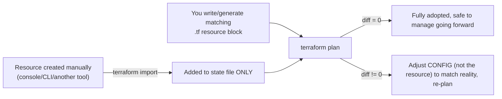
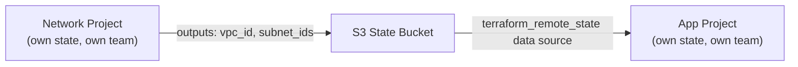

# Domain 7 — Maintain Infrastructure with Terraform

*Official exam objectives covered: 7a (Import existing infrastructure), 7b (Use the CLI to inspect state), 7c (When and how to use verbose logging)*
*Course lectures folded in: Overview of Terraform Import, Terraform Import Practical, Terraform State Management (state list/show/mv/rm/pull), Cross-Project Collaboration using Remote State Data Source, Remote State Data Source Practical, Overview of Debugging in Terraform, Debugging Terraform Practical*

---

## 1. Importing Existing Infrastructure (Objective 7a)

### What it is and why it's needed
Not every real resource starts life inside Terraform. Companies adopting Terraform mid-flight, resources created by another tool, or infrastructure clicked into place years ago by someone who's since left — all of this genuinely exists in AWS but is completely invisible to Terraform until it's **imported**.

```bash
terraform import aws_s3_bucket.existing my-existing-bucket-name
```

### What this command actually does — and critically, what it does NOT do
`terraform import` only updates the **state file** — it adds a mapping from `aws_s3_bucket.existing` to the real bucket's ID. It does **not** generate the matching `.tf` configuration for you (in older Terraform versions) — you must hand-write a `resource "aws_s3_bucket" "existing" {}` block yourself, or use the newer generation feature:
```bash
terraform plan -generate-config-out=generated.tf
```
which scaffolds a starting `.tf` file from the real resource's current attributes (Terraform 1.5+).

### The essential step people skip: verifying with `plan` afterward

After import, run `terraform plan`. If your written config doesn't **exactly** match the real resource's actual settings, Terraform proposes changes to reconcile them — your job is to adjust the *configuration* until the diff disappears, not to assume import alone means the resource is safely managed.

### What if you stop after the `import` command succeeds, without checking `plan`?
This is the single most common import mistake. Suppose the real S3 bucket has versioning enabled, but your hand-written config omits the `versioning` block entirely (assuming it defaults to "off," which isn't what's actually configured). The **very next** `terraform apply` — for a completely unrelated change, weeks later — silently disables versioning on that bucket, because Terraform now believes "no versioning block" means "versioning should be off," and there's nothing in your config contradicting that. The bug was introduced at import time but only surfaces later, disguised as an unrelated change's side effect.

### Real-World Scenario 1 — Migrating a Company's Manually-Created Infrastructure
A company that spent three years manually managing AWS via the console decides to adopt Terraform. Rather than recreating everything from scratch (which would mean destroying and rebuilding production infrastructure — unacceptable), they import each existing resource one at a time: VPC, subnets, security groups, EC2 instances, RDS databases. For each one: import, write matching config, run `plan`, adjust config until the diff is zero, then move to the next resource. This is slow and methodical by design — a rushed import (skip the `plan` verification step) risks the exact drift-reintroduction bug described above, at company-wide scale.

### Real-World Scenario 2 — Adopting a Resource Created by a Different Team's Script
A legacy Python deployment script created an SNS topic years ago; nobody remembers its exact configuration details. The team imports it, then uses `terraform plan -generate-config-out=generated.tf` to scaffold the starting configuration directly from AWS's own record of the resource's current settings — far more reliable than trying to reverse-engineer the original script's intent from old, possibly-outdated internal documentation.

---

## 2. Using the CLI to Inspect State (Objective 7b)

### The core commands
```bash
terraform state list                                  # every resource address currently in state
terraform state show aws_instance.web                  # one resource's full attribute set
terraform state mv aws_instance.web aws_instance.app    # rename in state WITHOUT destroy/recreate
terraform state rm aws_instance.web                     # stop tracking it (does NOT destroy the real resource)
terraform state pull > backup.tfstate                   # download the current state to a local file
```

### Example 1 — diagnosing "why does Terraform want to recreate this?"
```bash
terraform state show aws_instance.web
```
```
# aws_instance.web:
resource "aws_instance" "web" {
    id            = "i-0abc123"
    ami           = "ami-0e35ddab05955cf57"
    instance_type = "t3.micro"
    subnet_id     = "subnet-0xyz789"
    ...
}
```
Comparing this real, current-in-state output against your `.tf` config line by line is often the fastest way to spot exactly which attribute is causing an unexpected diff in `plan` — faster than guessing from the plan output's summary alone.

### Example 2 — `state mv`, the CLI equivalent of a `moved` block
```bash
terraform state mv aws_instance.web aws_instance.app_server
```
Renaming a resource in your `.tf` code, without a corresponding state update, reads to Terraform as "the old one vanished, a new one appeared" — triggering a destroy-then-create. `state mv` (or the declarative `moved` block from Domain 4c) updates the state file's internal mapping instead, so the real infrastructure is never touched, just re-labeled.

### Example 3 — `state rm`, precisely understood
```bash
terraform state rm aws_instance.legacy
```
**What if you assume this destroys the real resource?** It does not, and this misunderstanding is dangerous in the opposite direction from what people usually fear: `state rm` only edits Terraform's own bookkeeping. The real AWS resource keeps running, completely untouched — this is exactly how you "hand off" a resource from Terraform's management to a different tool or team without deleting it. (The declarative, version-controlled equivalent is a `removed` block, Domain 6.)

### What if you skip using `state` commands and instead try to fix a state/config mismatch by editing the raw JSON state file directly?
`terraform.tfstate` is technically just JSON, so it's *possible* to hand-edit it — but doing so bypasses Terraform's internal consistency checks entirely. A single malformed edit (a missing comma, a wrong resource address format) can corrupt the whole file, and there's no built-in recovery beyond restoring from a backup (which is exactly why S3 bucket versioning, Domain 6, matters). The `terraform state` subcommands exist specifically so you never have to hand-edit the file directly.

### Real-World Scenario 1 — Refactoring a Module Without Destroying Production Resources
A team moves an `aws_instance` resource from the root module into a newly-created child module, as part of a larger reorganization. Without state surgery, this move alone would make Terraform believe the original resource vanished (root module no longer has it) and a *new* one appeared (inside the child module) — destroy-then-create on a production instance, purely from a code reorganization. `terraform state mv aws_instance.web module.compute.aws_instance.web` (or the equivalent `moved` block) tells Terraform this is the same real object, just re-addressed.

### Real-World Scenario 2 — Handing a Resource Off to a Different Team's Tooling
A security team takes over management of a specific IAM role, planning to manage it going forward via a dedicated compliance tool instead of the application team's Terraform project. `terraform state rm aws_iam_role.app_role` removes it from the application team's state — the role itself is untouched in AWS, and the security team's tooling can now adopt it independently, without any overlap or conflict between the two teams' management.

---

## 3. Cross-Project Collaboration via Remote State Data Source

### The mechanism
```hcl
data "terraform_remote_state" "network" {
  backend = "s3"
  config = {
    bucket = "my-org-tfstate"
    key    = "prod/network/terraform.tfstate"
    region = "ap-south-1"
  }
}

resource "aws_instance" "app" {
  subnet_id = data.terraform_remote_state.network.outputs.private_subnet_id
}
```
This lets separate Terraform projects — owned by separate teams, applied on entirely separate schedules — share information without merging their code or state into one unwieldy monolith.



### What if a team instead tries to share infrastructure by merging everything into one giant root module?
This is a very real, very common anti-pattern at scale: one enormous config, owned by no single team, that every team is afraid to touch because a mistake anywhere can affect everyone. `terraform_remote_state` is the deliberate alternative — keep ownership separate and explicit, sharing only the specific, deliberately-published outputs each side actually needs.

### Real-World Scenario 1 — Read-Only Cross-Team Dependency Without Shared Access
An application team needs their EC2 instances placed in the correct subnets, but should never have write access to the networking team's Terraform state (a real security/compliance boundary in many organizations — least privilege applies to infrastructure-as-code just as much as to application permissions). `terraform_remote_state` gives the app team **read-only** access to specific published outputs (`vpc_id`, `private_subnet_ids`) without ever needing IAM permissions to modify the networking team's actual state file.

### Real-World Scenario 2 — A Breaking Change on the Other Side of the Boundary
The networking team renames an output from `subnet_id` to `private_subnet_id` as part of an internal cleanup. Every downstream team's `terraform_remote_state` reference to the old name (`data.terraform_remote_state.network.outputs.subnet_id`) now returns `null` instead of a helpful error — a subtle, delayed failure mode that's a well-known real risk of this pattern. The practical mitigation: treat published outputs as a stable **public API** with the same rename-carefully discipline you'd apply to a REST API's response fields, and communicate output renames to consuming teams in advance.

---

## 4. Verbose Logging — When and How to Use It (Objective 7c)

### The mechanism
```bash
export TF_LOG=DEBUG          # TRACE > DEBUG > INFO > WARN > ERROR (TRACE = most verbose)
export TF_LOG_PATH=./tf.log  # write logs to a file instead of flooding your terminal
terraform apply
# ...investigate tf.log...
unset TF_LOG                 # turn it back off - very noisy for normal use
```

### When to actually reach for it (not just "when something's wrong")
`TF_LOG` is specifically useful when the normal `plan`/`apply` error message is **too vague to act on** — a generic API error, an intermittent failure, or Terraform appearing to "hang." It's the wrong first step for anything `terraform validate` (Domain 3) would already catch — reserve it for problems that survive past syntax/type validation.

### Example — using `TRACE` to catch exactly which API call AWS is rejecting
```bash
export TF_LOG=TRACE
export TF_LOG_PATH=./trace.log
terraform apply
```
```
# inside trace.log, buried among thousands of lines:
[DEBUG] provider.terraform-provider-aws: 2024/01/15 10:23:44 [DEBUG] [aws-sdk-go] DEBUG: Request ec2/RunInstances Details:
---[ REQUEST POST-SIGN ]-----------------------------
POST / HTTP/1.1
...
2024/01/15 10:23:45 [ERROR] AWS Error: InvalidParameterValue: Invalid availability zone: [ap-south-1z]
```
`TRACE` shows the *exact* outbound API request and AWS's exact rejection reason — often the fastest way to find a genuinely obscure bug, at the cost of enormous log volume.

### What if you leave `TF_LOG` set permanently in your shell profile?
Every future Terraform command — even ones that work fine — now produces enormous, slow-to-scroll log output, burying the actually-useful plan/apply summary you normally rely on. Treat `TF_LOG` as a scalpel you pick up for one specific debugging session and immediately `unset` afterward, never a permanent setting.

### Real-World Scenario 1 — Diagnosing an Intermittent Provisioning Failure
A team's `terraform apply` fails roughly one time in ten with a generic "Error creating EC2 Instance" message, with no further detail — a classic case for reaching for verbose logging. Turning on `TF_LOG=DEBUG` for a few reproduction attempts eventually surfaces `RequestLimitExceeded` in the underlying AWS API response — the real cause was API throttling, not a code bug — leading directly to the fix (Terraform's built-in retry behavior, or in Terragrunt's case, `retryable_errors`) rather than hours spent scrutinizing `.tf` code that was never actually wrong.

### Real-World Scenario 2 — Confirming a Suspected Provider Bug Before Filing a Report
An engineer suspects a specific provider version is silently sending a malformed API request for a particular resource type. Reproducing the issue with `TF_LOG=TRACE` captures the *exact* request payload sent to AWS, which becomes the concrete evidence attached to a GitHub issue filed against the provider's repository (Domain 3's "Reporting Terraform Bugs") — turning a vague "it doesn't work" report into a reproducible, actionable bug report maintainers can act on quickly.

---

## 5. Practice Questions

### Easy
1. Does `terraform import` generate the matching `.tf` configuration for you automatically in every Terraform version?
2. Does `terraform state rm` delete the real cloud resource?
3. Which environment variable enables Terraform's most verbose internal logging, and what's its most detailed level called?

### Medium
4. You need to import an existing (manually-created) AWS security group `sg-0123456789abcdef0` as `aws_security_group.legacy`. Write the import command, and describe the essential next step before trusting this resource is safely under Terraform's management.
5. A team reorganizes their code, moving `aws_instance.web` from the root module into a new `module.compute`. Without any state operation, what would `terraform plan` propose, and which command (or block) prevents it?
6. Write a `terraform_remote_state` data source reading a `private_subnet_id` output from `s3://acme-tfstate/network/prod/terraform.tfstate` in `us-east-1`, and show how you'd reference the value.

### Hard
7. A team imports an S3 bucket but writes a config that omits an actually-enabled `versioning` block, assuming it wasn't configured. Explain, step by step, how this mistake surfaces later as an unrelated-looking side effect of a completely different change.
8. The networking team renames a published output from `subnet_id` to `private_subnet_id`. Explain exactly what happens to a downstream team's `terraform_remote_state` reference to the old name, why the failure mode is more dangerous than a hard error would be, and what process would have prevented the surprise.

---
**Next:** [10-domain8-hcp-terraform.md](10-domain8-hcp-terraform.md)
