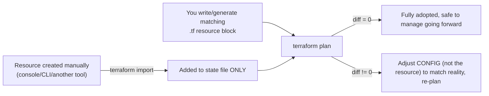
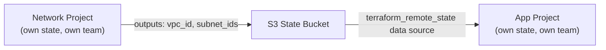
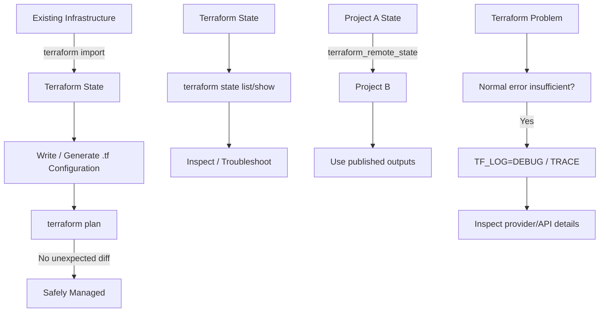

# Domain 7 — Maintain Infrastructure with Terraform

## What this domain covers

This domain is about maintaining infrastructure that may already exist, inspecting Terraform state, sharing information between Terraform projects, and troubleshooting Terraform when normal error messages aren't enough.

The official exam objectives are:

* **7a — Import existing infrastructure**
* **7b — Use the CLI to inspect state**
* **7c — Know when and how to use verbose logging**

The source also covers:

* Terraform import
* `terraform state` commands
* `terraform_remote_state`
* Terraform debugging
* `TF_LOG` and `TF_LOG_PATH` 

---

# 1. Importing Existing Infrastructure

## Why do we need `terraform import`?

Not all infrastructure is originally created by Terraform.

For example, imagine an AWS S3 bucket was created manually:

```text
AWS Console
     │
     ▼
S3 bucket
my-existing-bucket
```

Now your team wants Terraform to manage it.

Terraform currently doesn't know about this bucket.

Its state might look like:

```text
terraform.tfstate
└── No aws_s3_bucket.existing
```

You can use **`terraform import`** to tell Terraform:

> "This existing real-world resource corresponds to this Terraform resource address."

---

## Basic syntax

```bash
terraform import <terraform-resource-address> <real-resource-id>
```

Example:

```bash
terraform import aws_s3_bucket.existing my-existing-bucket-name
```


Here:

```text
aws_s3_bucket.existing
        │
        │ maps to
        ▼
my-existing-bucket-name
```

---

# 2. VERY IMPORTANT: What `terraform import` Does NOT Do

This is a major exam concept.

When you run:

```bash
terraform import aws_s3_bucket.existing my-existing-bucket-name
```

Terraform adds the resource to **state**.

It does **not traditionally mean**:

> "Terraform will automatically write the complete `.tf` configuration for me."

Think:

```text
Existing AWS resource
        │
        │ terraform import
        ▼
Terraform state
```

But you still need appropriate Terraform configuration:

```text
Existing AWS resource
        │
        ▼
terraform.tfstate
        +
matching .tf configuration
        │
        ▼
Terraform manages it correctly
```


---

# 3. Generating Configuration

The source also covers the newer configuration-generation capability:

```bash
terraform plan -generate-config-out=generated.tf
```

This can generate a starting `.tf` configuration based on the imported resource's current attributes.

So you can think of the process as:

```text
Existing infrastructure
        │
        ▼
terraform import
        │
        ▼
Resource added to state
        │
        ▼
Write/generate .tf configuration
        │
        ▼
terraform plan
```

The generated configuration is a **starting point**. You still need to review it.

---

# 4. The Most Important Step After Import: `terraform plan`

A successful import does **not** mean you're finished.

After importing:

```bash
terraform import aws_s3_bucket.existing my-existing-bucket-name
```

you should run:

```bash
terraform plan
```

Why?

Because Terraform needs to determine whether your `.tf` configuration actually represents the resource's current reality.

---

## Complete import workflow



The ideal result is:

```text
terraform import
       ↓
terraform plan
       ↓
No unexpected changes
```


---

# 5. Why Is `plan` After Import So Important?

Suppose an existing S3 bucket has:

```text
Versioning = ENABLED
```

You import it.

But your Terraform configuration doesn't describe the existing versioning configuration correctly.

Terraform may later interpret your configuration as saying:

> "Versioning should not be enabled."

Then a future:

```bash
terraform apply
```

could potentially make an unwanted change.

The important lesson is:

> **Import brings the resource into state. `plan` verifies whether your configuration correctly represents that resource.**

Don't assume:

```text
import successful
      =
Terraform configuration is correct
```

They are not the same thing.


---

# 6. Importing Infrastructure During Terraform Adoption

Imagine a company has managed AWS manually for years:

```text
AWS Console
   │
   ├── VPC
   ├── Subnets
   ├── Security Groups
   ├── EC2
   └── RDS
```

Now the company wants Terraform.

You generally don't want to destroy production and recreate everything.

Instead, you can progressively adopt the infrastructure:

```text
Existing resource
       │
       ▼
terraform import
       │
       ▼
Write/generate configuration
       │
       ▼
terraform plan
       │
       ├── Differences? → Fix configuration
       │
       └── No differences? → Adopted
```

This process can then be repeated resource by resource.

---

# 7. `terraform state` Commands

Terraform provides the `terraform state` command for inspecting and manipulating Terraform's state.

The core commands you should know are:

```bash
terraform state list
terraform state show <resource>
terraform state mv <source> <destination>
terraform state rm <resource>
terraform state pull
```


Let's understand each one.

---

# 8. `terraform state list`

```bash
terraform state list
```

Shows the resource addresses currently tracked in state.

Example:

```text
aws_instance.web
aws_instance.database
aws_security_group.web
aws_vpc.main
```

Think:

> **"What resources does Terraform currently know about?"**

---

# 9. `terraform state show`

```bash
terraform state show aws_instance.web
```

Shows the attributes Terraform currently has for that resource in state.

Example:

```text
# aws_instance.web:
resource "aws_instance" "web" {
    id            = "i-0abc123"
    ami           = "ami-0e35ddab05955cf57"
    instance_type = "t3.micro"
    subnet_id     = "subnet-0xyz789"
    ...
}
```


This is extremely useful when debugging.

Suppose:

```bash
terraform plan
```

says:

```text
aws_instance.web must be replaced
```

You can inspect the current state:

```bash
terraform state show aws_instance.web
```

and compare it with your `.tf` configuration.

---

# 10. `terraform state mv`

Suppose your resource is currently:

```hcl
resource "aws_instance" "web" {
  ...
}
```

and you want to rename it to:

```hcl
resource "aws_instance" "app_server" {
  ...
}
```

Terraform normally sees:

```text
OLD:
aws_instance.web

NEW:
aws_instance.app_server
```

It may interpret this as:

```text
Destroy aws_instance.web
       +
Create aws_instance.app_server
```

But you don't actually want to recreate the EC2 instance.

You only changed its **Terraform address**.

---

## Use `state mv`

```bash
terraform state mv aws_instance.web aws_instance.app_server
```

This changes the address stored in state without changing the actual infrastructure.

```text
Before:

State
└── aws_instance.web
          │
          ▼
       EC2 #123


After state mv:

State
└── aws_instance.app_server
          │
          ▼
       EC2 #123
```

Same real EC2 instance.

Only Terraform's label/address changed.


---

# 11. `terraform state mv` vs `moved` Block

You learned about `moved` blocks in Domain 4.

These solve a similar problem.

### CLI approach

```bash
terraform state mv aws_instance.web aws_instance.app_server
```

### Declarative approach

```hcl
moved {
  from = aws_instance.web
  to   = aws_instance.app_server
}
```

### Mental model

```text
state mv
= manually tell Terraform "this state address changed"

moved block
= declare the address change in Terraform code
```

The `moved` block is generally easier to review and share with teammates because the migration is represented in version-controlled code.

---

# 12. `terraform state rm`

This command is very important because it is frequently misunderstood.

```bash
terraform state rm aws_instance.legacy
```

It means:

> **Remove the resource from Terraform's state.**

It does **NOT** mean:

> Delete the actual AWS resource.

---

## Example

Before:

```text
Terraform state
└── aws_instance.legacy
          │
          ▼
       AWS EC2
```

Run:

```bash
terraform state rm aws_instance.legacy
```

After:

```text
Terraform state
└── Resource no longer tracked

AWS
└── EC2 still exists
```


---

# 13. `state rm` vs `terraform destroy`

This distinction is extremely important.

### `terraform destroy`

```text
Terraform
   │
   ▼
AWS
   │
   ▼
Resource DELETED
```

### `terraform state rm`

```text
Terraform
   │
   ▼
State
   │
   ▼
Resource removed from tracking

AWS resource
   │
   ▼
STILL EXISTS
```

So:

> **`state rm` modifies Terraform's bookkeeping, not the real infrastructure.**

---

# 14. `state rm` vs `removed` Block

You also saw this in Domain 6.

### Manual CLI approach

```bash
terraform state rm aws_instance.legacy
```

### Declarative approach

```hcl
removed {
  from = aws_instance.legacy

  lifecycle {
    destroy = false
  }
}
```

Both can result in Terraform no longer managing the resource while leaving the real resource intact.

The important difference is that a `removed` block documents the intent in Terraform code.

---

# 15. `terraform state pull`

```bash
terraform state pull > backup.tfstate
```

This retrieves the current state and writes it to a local file.

Think:

```text
Remote backend
      │
      │ state pull
      ▼
backup.tfstate
```

This can be useful when you need a local copy for inspection or backup purposes.


---

# 16. Don't Manually Edit `terraform.tfstate`

You may notice:

```text
terraform.tfstate
```

is basically JSON.

Technically, you could open it and edit it.

But **don't do this as your normal method**.

Why?

Terraform's state contains internal structure and relationships that Terraform expects to remain consistent.

A bad manual edit can corrupt state.

Instead, use:

```bash
terraform state list
terraform state show
terraform state mv
terraform state rm
terraform state pull
```

These commands are designed to work with state safely.


---

# 17. Refactoring Resources Without Destroying Them

This is a very useful scenario.

Suppose you have:

```text
Root module
└── aws_instance.web
```

Then you decide to move it into:

```text
module.compute
└── aws_instance.web
```

Terraform addresses have changed:

```text
Before:
aws_instance.web

After:
module.compute.aws_instance.web
```

If Terraform doesn't know that this is the **same real instance**, it may propose:

```text
Destroy old
     +
Create new
```

That's obviously dangerous for production.

You can instead move the state address:

```bash
terraform state mv \
  aws_instance.web \
  module.compute.aws_instance.web
```

Now Terraform understands:

```text
Same infrastructure
      │
      ▼
New Terraform address
```


---

# 18. `terraform_remote_state`

Now let's look at collaboration between **separate Terraform projects**.

Imagine:

```text
Network Team
    │
    ▼
Network Terraform Project
    │
    └── Creates VPC/subnets
```

And:

```text
Application Team
    │
    ▼
Application Terraform Project
    │
    └── Creates EC2
```

The application project needs to know:

```text
private_subnet_id
```

But you don't necessarily want to merge both projects into one giant Terraform configuration.

---

# 19. Remote State Data Source

Terraform provides:

```hcl
data "terraform_remote_state" "network" {
  backend = "s3"

  config = {
    bucket = "my-org-tfstate"
    key    = "prod/network/terraform.tfstate"
    region = "ap-south-1"
  }
}
```

Then another resource can use an output from that remote state:

```hcl
resource "aws_instance" "app" {
  subnet_id = data.terraform_remote_state.network.outputs.private_subnet_id
}
```


---

# 20. How `terraform_remote_state` Works

The architecture is:



So:

```text
Network Project
      │
      │ publishes outputs
      ▼
Remote State
      │
      │ read
      ▼
Application Project
```

The two projects can therefore remain separate.


---

# 21. Why Not Put Everything Into One Huge Terraform Project?

Imagine:

```text
One giant root module
│
├── Networking
├── Security
├── Databases
├── Applications
├── Monitoring
├── IAM
└── Everything else
```

As the organization grows, this can become difficult to manage.

Different teams may need different ownership and deployment schedules.

Instead:

```text
Network Project
      │
      └── Remote state outputs
                 │
                 ▼
          Application Project
```

Each project can maintain its own:

* configuration
* state
* deployment lifecycle
* ownership

while sharing only the required outputs.

---

# 22. Remote State Uses Outputs

This is important.

Suppose Network Terraform has:

```hcl
output "private_subnet_id" {
  value = aws_subnet.private.id
}
```

The application project can access:

```hcl
data.terraform_remote_state.network.outputs.private_subnet_id
```

So the pattern is:

```text
Network resource
      ↓
Network output
      ↓
Remote state
      ↓
terraform_remote_state
      ↓
Application project
```

The remote-state consumer should depend on **published outputs**, rather than reaching directly into another project's internal resources.

---

# 23. Important Remote State Design Consideration

Treat outputs consumed by other projects like an API.

For example, suppose Network publishes:

```text
subnet_id
```

Application consumes:

```hcl
data.terraform_remote_state.network.outputs.subnet_id
```

Later Network renames it to:

```text
private_subnet_id
```

Now the consumer still expects:

```text
outputs.subnet_id
```

and the downstream configuration can break.

The source highlights this as an important operational risk: published outputs form a dependency boundary, so output names should be treated as stable interfaces. 

### Mental model

```text
Terraform output
       =
Published API field
```

Don't casually rename it without considering consumers.

---

# 24. Verbose Logging

Sometimes Terraform's normal error message isn't enough.

For example:

```bash
terraform apply
```

might simply return:

```text
Error creating EC2 instance
```

That's not very helpful.

Terraform provides the:

```text
TF_LOG
```

environment variable for verbose logging.

---

# 25. `TF_LOG`

Example:

```bash
export TF_LOG=DEBUG
terraform apply
```

Terraform then produces detailed internal logs.

The levels are:

```text
TRACE
DEBUG
INFO
WARN
ERROR
```

The source's important point:

> **TRACE is the most verbose level.**


---

# 26. Log Levels

Think of them approximately like this:

```text
ERROR
  ↑
WARN
  ↑
INFO
  ↑
DEBUG
  ↑
TRACE
```

As you move toward `TRACE`, you get increasingly detailed information.

### Most important exam fact:

```text
TF_LOG=TRACE
```

➡️ **Most detailed/verbose logging.**

---

# 27. `TF_LOG_PATH`

Instead of dumping thousands of lines into your terminal, you can send the logs to a file.

```bash
export TF_LOG=DEBUG
export TF_LOG_PATH=./tf.log

terraform apply
```

Now Terraform writes the logs into:

```text
tf.log
```


After you're finished:

```bash
unset TF_LOG
```

This is important because verbose logging can become extremely noisy.

---

# 28. When Should You Use `TF_LOG`?

Don't immediately use:

```bash
TF_LOG=TRACE
```

for every Terraform problem.

First use normal troubleshooting:

```text
Read the error
     ↓
terraform validate
     ↓
Check configuration
     ↓
Check provider/version
     ↓
Use verbose logging if needed
```

Verbose logging is particularly useful when:

* Terraform appears to hang
* An API error is too vague
* The failure is intermittent
* You suspect a provider problem
* You need to see the underlying API interaction


---

# 29. Example of `TRACE` Logging

Suppose:

```bash
export TF_LOG=TRACE
export TF_LOG_PATH=./trace.log

terraform apply
```

The trace might reveal an underlying AWS API error such as:

```text
InvalidParameterValue:
Invalid availability zone:
[ap-south-1z]
```

Your normal Terraform error may have hidden the useful detail.

TRACE can expose the underlying request and provider/API response.

So:

```text
Terraform error
      ↓
Not enough information
      ↓
TF_LOG=TRACE
      ↓
Provider/API details
      ↓
Actual root cause
```


---

# 30. Don't Leave `TF_LOG` Enabled Permanently

Suppose you put this permanently in your shell:

```bash
export TF_LOG=TRACE
```

Now every Terraform command produces huge amounts of output.

Even:

```bash
terraform plan
```

could generate enormous logs.

So use verbose logging as a **debugging tool for a specific investigation**, then disable it:

```bash
unset TF_LOG
```


---

# 31. `TF_LOG` + Provider Debugging

This can also help when you suspect a provider bug.

For example:

```text
Terraform configuration
        ↓
Terraform Core
        ↓
AWS Provider
        ↓
AWS API
```

If something goes wrong, TRACE logging can help reveal:

```text
What Terraform requested
        ↓
What provider sent
        ↓
What AWS returned
```

This can provide evidence when reporting a provider bug.


---

# 32. Complete Domain 7 Mental Model



---

# Domain 7 — Command Cheat Sheet

| Command                  | Purpose                                                             |
| ------------------------ | ------------------------------------------------------------------- |
| `terraform import`       | Bring an existing resource into Terraform state                     |
| `terraform plan`         | Verify configuration matches reality after import                   |
| `terraform state list`   | List resources tracked in state                                     |
| `terraform state show`   | Show one resource's state attributes                                |
| `terraform state mv`     | Change a resource's state address without destroying infrastructure |
| `terraform state rm`     | Remove resource from state without destroying the real resource     |
| `terraform state pull`   | Retrieve current state                                              |
| `terraform_remote_state` | Read outputs from another Terraform project's state                 |
| `TF_LOG=DEBUG`           | Enable detailed logging                                             |
| `TF_LOG=TRACE`           | Enable **most verbose** logging                                     |
| `TF_LOG_PATH`            | Write logs to a file                                                |

---

# ⭐ Most Important Exam Traps

### Trap 1 — Import

**Q:** Does `terraform import` create the `.tf` configuration?

**A:** Import primarily adds the existing resource to **state**. You still need appropriate configuration; configuration generation can be used as a starting point in newer Terraform versions.

---

### Trap 2 — After import

**Q:** What should you do after importing?

```bash
terraform import ...
```

**A:**

```bash
terraform plan
```

Verify that your configuration correctly represents the imported infrastructure.

---

### Trap 3 — `state rm`

**Q:** Does this destroy AWS?

```bash
terraform state rm aws_instance.web
```

**A:** ❌ No.

It only removes the resource from Terraform's state.

---

### Trap 4 — `state mv`

**Q:** Does this recreate the resource?

```bash
terraform state mv aws_instance.web aws_instance.app
```

**A:** ❌ No.

It changes the resource's Terraform state address.

---

### Trap 5 — `state show`

**Q:** You want to see the attributes Terraform currently has for one resource.

**A:**

```bash
terraform state show aws_instance.web
```

---

### Trap 6 — `state list`

**Q:** You want to see every resource currently tracked by Terraform.

**A:**

```bash
terraform state list
```

---

### Trap 7 — Remote state

**Q:** Two separate Terraform projects need to share information.

**A:** Use `terraform_remote_state` to consume published outputs.

---

### Trap 8 — Remote state output

If Network publishes:

```hcl
output "private_subnet_id" {
  value = ...
}
```

the consumer uses:

```hcl
data.terraform_remote_state.network.outputs.private_subnet_id
```

---

### Trap 9 — Logging

**Q:** Most verbose Terraform logging?

**A:**

```bash
export TF_LOG=TRACE
```

---

### Trap 10 — Log file

**Q:** Write Terraform logs to a file?

**A:**

```bash
export TF_LOG_PATH=./tf.log
```

---

# 🧠 Final Mental Model

Remember these **10 lines**:

```text
1. terraform import = existing infrastructure → Terraform state.

2. Import does NOT mean your .tf configuration is automatically correct.

3. After import → terraform plan.

4. state list = "What resources are tracked?"

5. state show = "What does Terraform know about this resource?"

6. state mv = "Change the Terraform address, keep the real resource."

7. state rm = "Stop tracking it, DON'T delete it."

8. terraform_remote_state = "Read outputs from another Terraform project's state."

9. TF_LOG=DEBUG = detailed troubleshooting logs.

10. TF_LOG=TRACE = MOST verbose Terraform logging.
```

### The three biggest distinctions to memorize

```text
IMPORT
Existing resource
      ↓
Terraform STATE


STATE RM
Terraform STATE
      ↓
Remove tracking
      ↓
Real resource stays


STATE MV
Old Terraform address
      ↓
New Terraform address
      ↓
Same real resource
```

And for debugging:

```text
Normal error
     ↓
Not enough information?
     ↓
TF_LOG=DEBUG
     ↓
Still need deeper details?
     ↓
TF_LOG=TRACE
```

