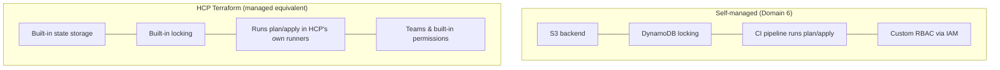
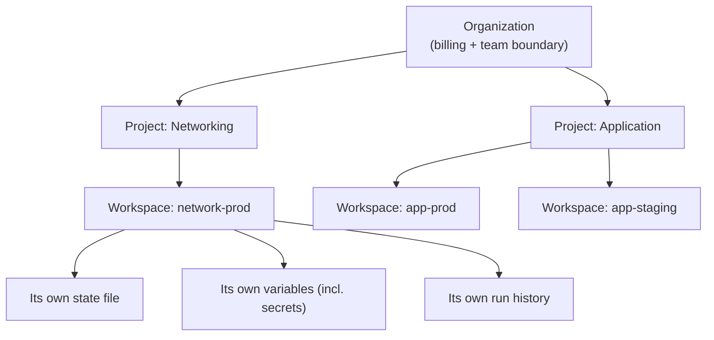
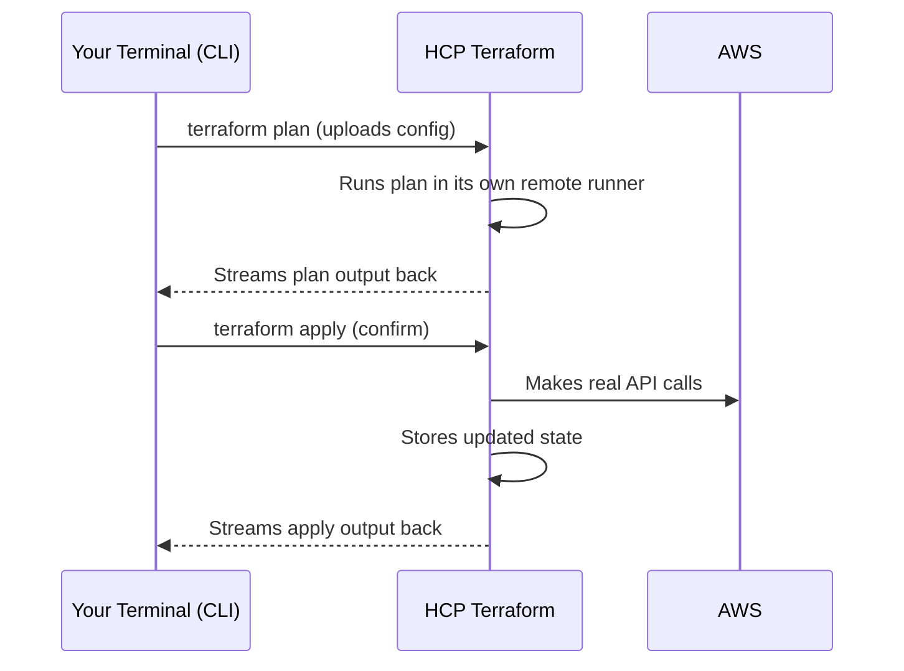
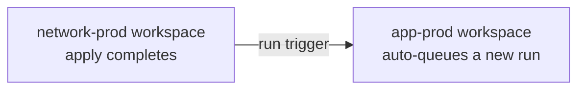

# Domain 8 — HCP Terraform

*Official exam objectives covered: 8a (Use HCP Terraform to create infrastructure), 8b (Collaboration and governance features), 8c (Organize and use workspaces/projects), 8d (Configure and use HCP Terraform integration)*
*Course lectures folded in: HCP Terraform overview & pricing, account creation, base structure (orgs/workspaces), CLI-driven run workflow, Sentinel, air-gapped environments, private registry, Teams, permissions, health assessments, run triggers, state migration, choosing a Terraform version*

---

## 1. What HCP Terraform Actually Is

### Definition
HCP Terraform (formerly Terraform Cloud) is HashiCorp's managed SaaS platform that replaces everything you'd otherwise have to self-host: a remote backend (state storage + locking), a place to actually *execute* `plan`/`apply` runs, team-based access control, and policy enforcement — all in one integrated product.



### What if a growing team never adopts HCP Terraform (or an equivalent) and keeps stitching together S3 + DynamoDB + a custom CI pipeline + hand-rolled RBAC forever?
It's entirely possible to run a fully functional, secure Terraform practice this way — many companies do. What you give up is the *integration*: policy enforcement (Sentinel), team permissions, and run history all become separate systems you have to build and maintain yourselves (a custom CI pipeline script enforcing "no public S3 buckets," a separate IAM policy per environment, a home-grown audit log) instead of one product providing all of it together. The trade-off is engineering time spent maintaining glue code vs. a subscription cost — a genuine, situation-dependent decision, not a universal "you must use HCP Terraform."

### HCP Terraform Pricing — What's Actually Gated Behind a Paid Tier
HashiCorp restructured HCP Terraform's pricing more than once historically, so treat the specific dollar figures below as illustrative, and always check HashiCorp's current official pricing page before making a real budgeting decision — but the *shape* of the tiering is stable and worth knowing conceptually for the exam:

| Tier | Roughly who it's for | What's typically included |
|---|---|---|
| **Free** | Individuals, small teams, learning/evaluation | A generous number of "Resources Under Management" (RUM), remote state + remote runs, the public/private module registry, VCS-driven workflow |
| **Standard / Plus (paid)** | Growing teams needing real governance | Everything in Free, plus **Teams & Sentinel policy enforcement**, SSO/SAML, more granular permissions, audit logging, Run Tasks integrations |
| **Enterprise / self-hosted (Terraform Enterprise)** | Regulated industries, air-gapped requirements | Everything above, self-hosted, including fully offline/air-gapped deployment |

**The single most exam-relevant fact:** billing is generally based on **Resources Under Management (RUM)** — roughly, the count of resources HCP Terraform is actively tracking state for across your workspaces — not per-user seats and not per-`apply`-run. **Sentinel policy enforcement and Teams-based permissions are gated behind a paid tier**, not available on the Free tier — meaning an individual learner exploring HCP Terraform on the free tier can practice the workspace/CLI-driven-run mechanics covered elsewhere in this file, but won't be able to hands-on test Sentinel policies without either a paid org or a trial.

**What if a team assumes governance features (Sentinel, SSO, granular Teams permissions) are available on every tier and designs their workflow around that assumption before checking?** They may build documentation, onboarding processes, or compliance sign-off procedures around a feature (like Sentinel) that turns out to require an upgrade — a real, if mundane, project-planning risk when the *engineering* design (Sections 4-5 of this file) assumes capabilities the *organization's actual subscription* doesn't yet include.

---

## 2. Base Structure: Organization → Project → Workspace (Objective 8c)


- **Organization**: the top-level container — billing, overall team membership, a shared private registry.
- **Project**: a grouping layer *above* workspaces, used to organize related workspaces (e.g., all workspaces belonging to one application, or one business unit) and apply permissions at the project level instead of one workspace at a time.
- **HCP Terraform Workspace** (a distinct concept from the CLI-native `terraform workspace`, Domain 6!): one workspace = one state file + its own variables + its own run history, typically mapped 1:1 to a root module / repo+directory combination.

**Exam trap, worth repeating one more time because it's genuinely confusing:** the CLI's `terraform workspace new dev` (Domain 6 — multiple states sharing one config directory, with a documented isolation caveat) and an **HCP Terraform workspace** (a fully separate configuration + state + variables + permissions boundary) share a name but solve fundamentally different problems. An HCP Terraform workspace *is* the real isolation mechanism that the CLI-native version explicitly falls short of providing.

### What if you organize every workspace flat, with no Projects, in a company with 100+ workspaces?
Permission management becomes unwieldy — granting a team access to "everything related to the payments service" means individually granting access to a dozen separate workspaces one at a time, and remembering to repeat that for every new workspace the payments team creates going forward. Projects exist specifically to let permissions be granted once, at the project level, and automatically apply to every current and future workspace inside it.

---

## 3. Using HCP Terraform to Create Infrastructure (Objective 8a)

### The CLI-Driven Run Workflow
```hcl
# main.tf
terraform {
  cloud {
    organization = "my-org"
    workspaces {
      name = "app-prod"
    }
  }
}
```
```bash
terraform login          # authenticate CLI to HCP Terraform
terraform plan            # runs remotely, streams output back to your terminal
terraform apply
```


**Why use this over a purely local/CI-only workflow:** state and any secret variables never touch your laptop or a generic CI runner's disk at all; every remote run automatically passes through any configured policy checks (Sentinel, Section 5) — a check you can't accidentally bypass by just running Terraform locally instead.

### The alternative: VCS-Driven Workflow
Instead of triggering runs from your own CLI, a workspace can be connected directly to a GitHub/GitLab repository — a `git push` or merged pull request automatically triggers a `plan` (and, depending on settings, an `apply`) in HCP Terraform. This is the more common pattern for team-owned, long-lived infrastructure; the CLI-driven workflow above is more common for individual exploration or for API/automation-driven use cases.

### What if a team keeps running Terraform purely locally, with HCP Terraform only used for remote state storage (no runs)?
This is a valid, supported pattern (HCP Terraform can act as *just* a backend) — but it forfeits the policy-enforcement guarantee: a locally-run `apply` never passes through Sentinel checks, since those only apply to runs HCP Terraform itself executes. If governance is the whole reason you adopted HCP Terraform, using it only for state storage undermines that goal.

### Real-World Scenario — Migrating State to HCP Terraform
```hcl
terraform {
  cloud {
    organization = "my-org"
    workspaces { name = "app-prod" }
  }
}
```
```bash
terraform init   # detects the existing S3 backend, prompts to migrate state into HCP Terraform
```
A team previously using an S3 + DynamoDB backend switches to HCP Terraform. Changing the backend config and re-running `init` triggers Terraform's standard "migrate state to the new backend?" prompt (the exact same generic mechanism as any backend change, Domain 6) — confirming copies the full state history in one step, with the S3 bucket now safely superseded (though often kept around, read-only, as a historical backup for a transition period).

---

## 4. Collaboration and Governance Features (Objective 8b)

### Teams and Permissions
- **Teams** are groups of users (e.g., `network-admins`, `app-developers`, `read-only-auditors`).
- Permissions are granted **per project or per workspace, per team** — e.g., `network-admins` gets `write` on the `network-prod` workspace, `app-developers` gets `read`-only there but `write` on `app-prod`.

**This is the real environment-isolation mechanism** that plain CLI workspaces (Domain 6) explicitly cannot provide — a mistake by an app developer literally cannot touch network infrastructure, because their team has no write permission on that workspace at all, enforced by the platform itself, not by convention or tribal knowledge about "which workspace is which."

### Sentinel — Policy as Code
```python
# example Sentinel policy (conceptual, not exact syntax)
import "tfplan/v2" as tfplan

no_public_s3 = rule {
    all tfplan.resources.aws_s3_bucket as _, buckets {
        all buckets as bucket {
            bucket.applied.acl is not "public-read"
        }
    }
}
```
Sentinel enforces rules that a plan must satisfy **before** apply is allowed — as an organization-wide gate, regardless of who's running it or which workspace. This is fundamentally different from a `variable { validation {} }` block (Domain 4c): variable validation is scoped to *one config*, written and maintainable only by that config's own authors; Sentinel is enforced centrally, across every workspace in the organization, by a governance team, and cannot be bypassed by an individual engineer simply choosing not to add a validation block to their own config.

**What if an org relies only on per-config variable validation instead of Sentinel for a company-wide rule like "no public S3 buckets"?** Enforcement depends entirely on every single engineer, across every team, remembering to write the same validation logic into every config that could possibly create an S3 bucket — a single missed config anywhere in the company is a policy violation nobody catches until a security audit (or a real incident) finds it.

### Health Assessments (Drift Detection)
HCP Terraform can periodically run a background `plan` (without applying) against a workspace specifically to detect drift, surfacing it as a workspace health status — proactive discovery instead of waiting for the next real deployment's `plan` to happen to notice.

### Real-World Scenario 1 — Blocking a Non-Compliant Change Before It Ships
A developer, unaware of a company-wide compliance requirement, writes an `aws_s3_bucket` resource with a public-read ACL for a quick internal tool. Their `terraform plan` succeeds locally with no warnings (their own config has no validation for this). The moment it's run through HCP Terraform, the org-wide Sentinel policy evaluates the plan and **hard-blocks the apply**, with a clear error naming the exact violating resource — caught before it ever reaches production, entirely independent of whether that individual developer knew the policy existed.

### Real-World Scenario 2 — Segregated Duties Between Network and App Teams
A `network-admins` team has `write` access only to workspaces inside the "Networking" project; an `app-developers` team has `write` access only inside the "Application" project, with `read`-only visibility into Networking's outputs. When an app developer's mistake could, in theory, have touched shared network infrastructure, the platform's permission model makes that structurally impossible — not because the developer was careful, but because their team simply has no write permission there at all.

---

## 5. Configuring and Using HCP Terraform Integration (Objective 8d)

### Private Registry
```hcl
module "internal_vpc" {
  source  = "app.terraform.io/my-org/vpc/aws"
  version = "1.2.0"
}
```
Beyond the public Terraform Registry, an organization can publish **internal-only** modules and providers, visible just within their own organization — same consumption syntax as a public module (Domain 5), just resolved against a private namespace.

### Run Triggers

Connects workspaces so a successful apply in one (`network-prod`) automatically **queues a run** in a dependent workspace (`app-prod`) — the SaaS-native equivalent of the `terraform_remote_state` cross-project pattern (Domain 7), but with automatic re-triggering instead of relying on someone remembering to manually re-run the dependent project.

**What if a team relies on `terraform_remote_state` alone, with no run trigger, across two independently-applied HCP Terraform workspaces?** Whenever the upstream project's outputs change, every downstream consumer must be *manually* re-run to pick up the new values — easy to forget, especially for infrastructure that changes infrequently, leading to downstream projects silently running against stale upstream outputs until someone happens to re-apply them.

### Choosing a Terraform Version
Each HCP Terraform workspace can pin its own Terraform CLI version — independent of what's installed on any individual contributor's laptop — set via the workspace's own settings, or respected automatically from a config's `required_version` (Domain 3) if compatible.

### Air-Gapped Environments
For organizations with zero external network access allowed (regulated/classified environments), HCP Terraform's SaaS offering simply isn't reachable — but the same underlying product, **Terraform Enterprise**, can be deployed fully self-hosted, including its own private registry mirror and offline license activation, entirely disconnected from the internet.

**Know this distinction precisely:** HCP Terraform = SaaS, hosted by HashiCorp. Terraform Enterprise = the same product, self-hosted by you, including air-gapped deployments where required.

### Real-World Scenario 1 — Publishing an Internal Compliance-Approved Module
A platform team builds a "compliant EC2 instance" module (correct tagging, correct default security group, mandatory encryption) and publishes it to the organization's **private** registry. Every application team across the company references `app.terraform.io/my-org/compliant-ec2/aws` instead of writing their own `aws_instance` resources from scratch — guaranteeing every team's instances meet the compliance baseline without each team needing to independently know or remember every requirement.

### Real-World Scenario 2 — A Regulated Client Needing Full Air-Gapping
A government contractor must run all infrastructure automation with zero external network access, as a hard contractual/regulatory requirement — HCP Terraform's SaaS offering is a non-starter, since it requires reaching HashiCorp's own servers. They deploy Terraform Enterprise instead, entirely within their own isolated network, including mirroring the provider/module registries internally so `terraform init` never needs to reach the public internet at all.

---

## 6. Practice Questions

### Easy
1. What are the two workflow options for triggering runs in HCP Terraform?
2. Which HashiCorp product enforces organization-wide policy gates on a plan before it can be applied?
3. True/False: an HCP Terraform "workspace" is the same concept as a CLI-native `terraform workspace`.

### Medium
4. Your org wants "no S3 bucket may have a public-read ACL" enforced regardless of which team runs `apply`. Which feature enforces this, and why can't a `variable { validation {} }` block achieve the same organization-wide guarantee?
5. Describe the permission model that would let a `network-admins` team modify the `network-prod` workspace but only view (not modify) `app-prod`.
6. Explain what a Run Trigger automates that you would otherwise have to do manually when using `terraform_remote_state` across two independently-applied HCP Terraform workspaces.

### Hard
7. A regulated client needs Terraform automation with zero external network access. Name the correct HashiCorp product for this (not HCP Terraform SaaS) and explain precisely what "air-gapped" requires beyond just "self-hosted" (think: registry access, license activation).
8. Compare, for a two-team (network/app) setup: (a) a self-managed pattern (S3 + DynamoDB + `terraform_remote_state` + manual re-runs), versus (b) an HCP Terraform pattern (two workspaces + a Run Trigger + Teams permissions). What operational risk does (b) remove that (a) leaves as a manual, human responsibility?

---
**Next:** [11-bonus-provisioners.md](11-bonus-provisioners.md)
