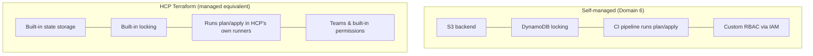
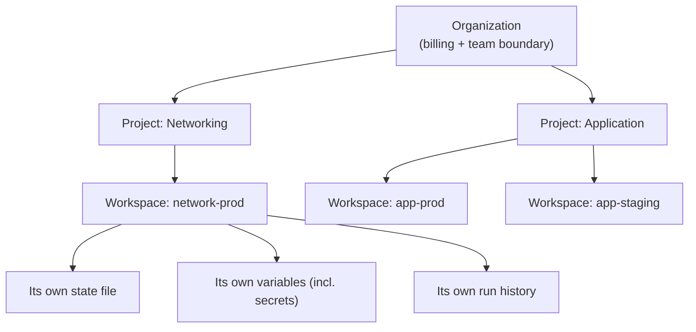
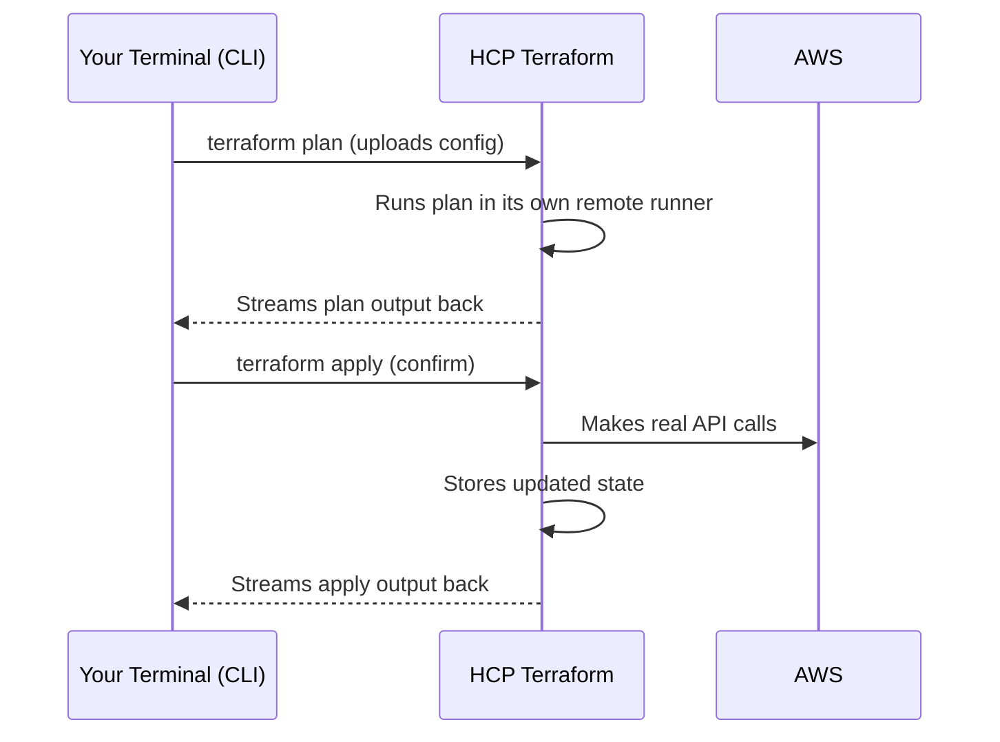
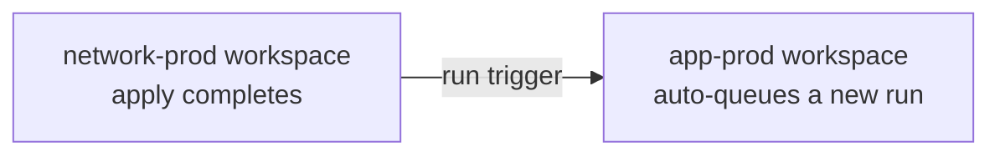

# Domain 8 — HCP Terraform

## What this domain covers

HCP Terraform is mainly about using Terraform in a **managed, team-oriented environment** instead of managing everything yourself.

The official exam objectives are:

* **8a — Use HCP Terraform to create infrastructure**
* **8b — Collaboration and governance features**
* **8c — Organize and use workspaces/projects**
* **8d — Configure and use HCP Terraform integration**

The important topics are:

* HCP Terraform overview
* Organization → Project → Workspace
* CLI-driven and VCS-driven workflows
* Teams and permissions
* Sentinel
* Health assessments / drift detection
* Private Registry
* Run Triggers
* Terraform version selection
* State migration
* Air-gapped environments
* HCP Terraform vs Terraform Enterprise 

---

# 1. What Is HCP Terraform?

## Definition

**HCP Terraform** is HashiCorp's managed **SaaS platform** for Terraform.

It provides capabilities that you would otherwise have to build and manage yourself:

* Remote state storage
* State locking
* Remote `plan` and `apply` execution
* Team-based access control
* Policy enforcement
* Run history
* Private Registry
* Collaboration features

For example, in a self-managed setup you might have:

```text
S3
  ↓
Terraform state

DynamoDB
  ↓
State locking

CI/CD
  ↓
terraform plan/apply

IAM
  ↓
Permissions
```

With HCP Terraform, these capabilities are integrated into one platform.



### Important point

HCP Terraform isn't mandatory.

A company can absolutely run Terraform using:

```text
S3 + DynamoDB + CI/CD + IAM
```

The benefit of HCP Terraform is that state, execution, permissions, governance, and run management are integrated rather than being separate systems that your team has to maintain.

---

# 2. HCP Terraform Pricing

The exact pricing can change, so don't memorize old dollar amounts from course material.

For the exam, understand the **conceptual model**.

| Tier                                  | Typical use                        | Typical capabilities                                            |
| ------------------------------------- | ---------------------------------- | --------------------------------------------------------------- |
| **Free**                              | Individuals, learning, small teams | Remote state, remote runs, Registry, VCS workflow               |
| **Standard / Plus**                   | Growing teams                      | Teams, Sentinel, SSO/SAML, granular permissions, audit features |
| **Enterprise / Terraform Enterprise** | Regulated/air-gapped environments  | Self-hosted enterprise deployment                               |

A key concept from the source is **Resources Under Management (RUM)**.

HCP Terraform generally bases billing around the resources it is managing rather than simply:

* number of users
* number of `terraform apply` executions

Also remember that governance capabilities such as **Teams-based permissions and Sentinel policy enforcement** are associated with paid capabilities in the source material. 

For the exam, focus on the features and concepts rather than old pricing numbers.

---

# 3. Organization → Project → Workspace

This is one of the **most important sections** in Domain 8.

The hierarchy is:

```text
Organization
     │
     ├── Project
     │      ├── Workspace
     │      └── Workspace
     │
     └── Project
            ├── Workspace
            └── Workspace
```

The source's diagram:



## Organization

The **Organization** is the top-level container.

It is associated with things such as:

* Billing
* Overall team membership
* Organization-level collaboration
* Private Registry

Think:

> **Organization = company/team-level container**

---

## Project

A **Project** is a grouping layer above workspaces.

For example:

```text
Organization
│
├── Networking Project
│
├── Application Project
│
└── Payments Project
```

Projects help you:

* Organize related workspaces
* Group infrastructure logically
* Apply permissions at the project level

For example, instead of separately managing access to 20 networking workspaces, you can organize them under a Networking project and manage access more centrally.

---

## HCP Terraform Workspace

An HCP Terraform **workspace** represents an individual Terraform working environment.

A workspace has its own:

* State
* Variables
* Run history
* Permissions/configuration relationship

For example:

```text
Application Project
│
├── app-dev
├── app-staging
└── app-prod
```

Each workspace has its own state.

---

# 4. VERY IMPORTANT — HCP Workspace vs CLI Terraform Workspace

This is a **major exam trap**.

They have the same name but represent different concepts.

### CLI Terraform workspace

From Domain 6:

```bash
terraform workspace new dev
```

You can have:

```text
Same Terraform configuration
        │
        ├── dev       → State A
        ├── staging   → State B
        └── prod      → State C
```

The purpose is primarily to maintain different states using the same configuration.

---

### HCP Terraform workspace

An HCP Terraform workspace is a managed platform boundary with its own:

* State
* Variables
* Runs/run history
* Permissions
* Configuration relationship

### Remember this

```text
CLI workspace
= different state for a configuration

HCP Terraform workspace
= managed workspace with state,
  variables, runs and permissions
```

**Do not treat them as the same thing.** 

---

# 5. Why Projects Are Useful

Imagine a company has 100 workspaces.

Without projects:

```text
Organization
├── workspace-1
├── workspace-2
├── workspace-3
├── ...
└── workspace-100
```

Permission management becomes difficult.

With projects:

```text
Organization
│
├── Networking
│   ├── network-dev
│   ├── network-staging
│   └── network-prod
│
└── Application
    ├── app-dev
    ├── app-staging
    └── app-prod
```

Now teams can be associated with the appropriate project/workspace boundaries.

So:

> **Project = organization and permission grouping layer above workspaces.**

---

# 6. Using HCP Terraform to Create Infrastructure

There are two important ways to trigger runs:

1. **CLI-driven workflow**
2. **VCS-driven workflow**

---

# 7. CLI-Driven Workflow

You can configure your Terraform code to use HCP Terraform:

```hcl
terraform {
  cloud {
    organization = "my-org"

    workspaces {
      name = "app-prod"
    }
  }
}
```

Then authenticate:

```bash
terraform login
```

and use:

```bash
terraform plan
terraform apply
```

The important point is that the Terraform run is executed remotely by HCP Terraform.

### Workflow

```text
Your terminal
      │
      │ terraform plan/apply
      ▼
HCP Terraform
      │
      ├── Runs Terraform
      ├── Manages state
      ├── Runs policies
      └── Communicates with AWS
```

The source represents this as:



Your terminal starts the operation, but HCP Terraform performs the remote run.

---

# 8. Why Use Remote Execution?

With local Terraform:

```text
Developer laptop
     │
     ├── Terraform
     ├── Credentials
     └── State access
```

With HCP Terraform:

```text
Developer
    │
    ▼
HCP Terraform
    │
    ├── Terraform execution
    ├── State
    ├── Variables/secrets
    └── Policy checks
    │
    ▼
AWS
```

This provides a more controlled and consistent execution environment.

One important benefit from the source is that remote runs can pass through configured governance policies such as Sentinel.


---

# 9. VCS-Driven Workflow

Instead of running Terraform manually from your terminal, you can connect an HCP Terraform workspace to a GitHub/GitLab repository.

For example:

```text
Developer
    │
    ▼
git push / Pull Request
    │
    ▼
HCP Terraform
    │
    ▼
terraform plan
    │
    ▼
terraform apply
```

Depending on workspace settings, a Git change can automatically trigger a plan and potentially an apply.

### Difference

**CLI-driven:**

```text
terraform plan/apply
        ↓
HCP Terraform
```

**VCS-driven:**

```text
git push / merge
        ↓
HCP Terraform
        ↓
plan/apply
```

### Exam question

> What are the two major ways to trigger HCP Terraform runs?

**Answer: CLI-driven and VCS-driven workflows.**

---

# 10. HCP Terraform Can Also Be Used Only for Remote State

HCP Terraform can act as a remote backend while Terraform execution still happens elsewhere.

For example:

```text
Local/CI Terraform
       │
       ▼
HCP Terraform
       │
       └── Remote state
```

This is supported.

However, if Terraform is applied locally:

```bash
terraform apply
```

the run isn't executed by HCP Terraform.

Therefore, HCP Terraform's Sentinel policy checks won't provide the same governance guarantee for that locally executed run.

### Remember

```text
HCP state only
≠
HCP remote execution
```

If governance is the main reason for using HCP Terraform, the actual run needs to go through HCP Terraform.

---

# 11. Migrating Existing State to HCP Terraform

Suppose you currently have:

```text
Terraform
    ↓
S3 backend
    +
DynamoDB locking
```

and want to move to HCP Terraform.

Configure:

```hcl
terraform {
  cloud {
    organization = "my-org"

    workspaces {
      name = "app-prod"
    }
  }
}
```

Then:

```bash
terraform init
```

Terraform detects the backend change and can ask whether you want to migrate the existing state.

Conceptually:

```text
Existing S3 state
       │
       │ terraform init
       │
       ▼
HCP Terraform state
```

This follows the same general Terraform backend migration mechanism you learned in Domain 6. 

---

# 12. Teams and Permissions

HCP Terraform provides **Teams** for grouping users.

Examples:

```text
network-admins
app-developers
read-only-auditors
```

Permissions can be assigned at the project/workspace level.

Example:

```text
network-admins
    │
    └── write → network-prod

app-developers
    │
    ├── read  → network-prod
    └── write → app-prod
```

This gives the organization a platform-enforced access boundary.

---

# 13. Why Teams Are Important

Imagine an application developer accidentally changes something in their Terraform configuration.

If their team has:

```text
write → app-prod
read  → network-prod
```

they cannot modify `network-prod`.

The platform itself prevents the unauthorized operation.

This is much stronger than simply telling developers:

> "Be careful which Terraform workspace you select."

So:

> **Teams + permissions provide actual access control between environments/workspaces.**


---

# 14. Sentinel — Policy as Code

**Sentinel** is HashiCorp's policy-as-code framework.

It allows organizations to define rules that Terraform plans must satisfy before they are allowed to apply.

For example:

> No S3 bucket should be publicly readable.

Conceptually:

```text
Terraform plan
      │
      ▼
Sentinel policy
      │
      ▼
Does plan comply?
    /       \
  Yes        No
   ↓          ↓
 Apply      Block
```

The source gives a conceptual policy such as:

```python
import "tfplan/v2" as tfplan

no_public_s3 = rule {
    all tfplan.resources.aws_s3_bucket as _, buckets {
        all buckets as bucket {
            bucket.applied.acl is not "public-read"
        }
    }
}
```

The exact Sentinel syntax is less important for this exam section than understanding what Sentinel does.

---

# 15. Sentinel vs Variable Validation

This is another **very important exam distinction**.

### Variable validation

Example:

```hcl
variable "instance_type" {
  type = string

  validation {
    condition     = contains(["t3.micro", "t3.small"], var.instance_type)
    error_message = "Invalid instance type."
  }
}
```

This validation belongs to **that Terraform configuration**.

Another Terraform project could simply not have that validation.

---

### Sentinel

Sentinel is designed for **centralized governance**.

For example:

```text
Organization
     │
     ├── Team A
     ├── Team B
     └── Team C
            │
            ▼
       Sentinel policy
            │
            ▼
"No public S3 buckets"
```

The policy can apply across the organization's HCP Terraform runs.

### Easy way to remember

```text
Variable validation
= configuration-level rule

Sentinel
= organization/governance-level rule
```


---

# 16. Example — Sentinel Blocking a Deployment

Suppose a developer creates a public S3 bucket.

Their Terraform configuration might successfully produce a normal plan.

But when the plan is evaluated by HCP Terraform:

```text
terraform plan
      ↓
Sentinel
      ↓
Public S3 bucket detected
      ↓
❌ Policy violation
      ↓
Apply blocked
```

This means the organization can enforce security/compliance requirements centrally rather than relying on every developer to remember to implement the same Terraform validation.

---

# 17. Health Assessments — Drift Detection

HCP Terraform can periodically perform a background `plan` to detect infrastructure drift.

Suppose Terraform expects:

```text
EC2 instance type = t3.micro
```

but someone manually changes AWS to:

```text
EC2 instance type = t3.large
```

That's drift.

A health assessment can help detect this proactively.

```text
Terraform expected state
        +
Real infrastructure
        │
        ▼
Background plan
        │
        ▼
Drift detected
```

The important idea is:

> **Health assessments allow HCP Terraform to detect drift without waiting for the next normal deployment.** 

---

# 18. Private Registry

HCP Terraform provides a **private Registry** for organization-specific modules and providers.

Example:

```hcl
module "internal_vpc" {
  source  = "app.terraform.io/my-org/vpc/aws"
  version = "1.2.0"
}
```

This module is intended for use within the organization's private namespace.

### Why use it?

Imagine a platform team creates a standard:

```text
company-compliant-ec2
```

module that automatically enforces:

* Required tags
* Encryption
* Approved networking
* Security standards

Instead of every application team creating EC2 resources independently, they can use the approved internal module.

```text
Platform Team
     │
     ▼
Private Registry
     │
     ├── compliant-ec2
     ├── compliant-vpc
     └── compliant-rds
     │
     ▼
Application Teams
```


---

# 19. Run Triggers

A **Run Trigger** allows one HCP Terraform workspace to automatically trigger a run in another workspace.

Example:

```text
network-prod
     │
     │ apply completes
     ▼
Run Trigger
     │
     ▼
app-prod
     │
     ▼
New run automatically queued
```

Mermaid:



So if:

```text
network-prod
```

successfully applies, HCP Terraform can automatically queue a run for:

```text
app-prod
```

---

# 20. Run Trigger vs `terraform_remote_state`

These concepts are related, but they solve different problems.

### `terraform_remote_state`

Used to **read outputs/data** from another Terraform project's state.

```text
Network project
      │
      ▼
Remote state
      │
      ▼
Application project
reads subnet_id
```

### Run Trigger

Used to **automatically trigger another workspace's run**.

```text
Network apply
      │
      ▼
Run Trigger
      │
      ▼
Application run
```

So memorize:

```text
terraform_remote_state
= share/read outputs

Run Trigger
= automatically trigger downstream run
```

Without a Run Trigger, the downstream project may need someone to manually run it after upstream changes.


---

# 21. Choosing the Terraform Version

Each HCP Terraform workspace can use a specific Terraform CLI version.

This is useful because developers might have different versions installed locally.

For example:

```text
Developer A → Terraform version X
Developer B → Terraform version Y
Developer C → Terraform version Z
```

HCP Terraform can provide a consistent version for a workspace.

You can also specify a Terraform version constraint in the configuration:

```hcl
terraform {
  required_version = "..."
}
```

Remember the distinction:

```text
required_version
= constrains Terraform CLI version
```

This is different from:

```hcl
required_providers {
  ...
}
```

which controls provider versions.

---

# 22. HCP Terraform vs Terraform Enterprise

This is a **must-know distinction**.

## HCP Terraform

```text
HCP Terraform
      ↓
SaaS
      ↓
Hosted by HashiCorp
```

You use HashiCorp's hosted service.

---

## Terraform Enterprise

```text
Terraform Enterprise
      ↓
Self-hosted
      ↓
Your organization operates it
```

Terraform Enterprise is particularly relevant when an organization requires:

* Strict regulatory controls
* Self-hosting
* Private infrastructure
* Air-gapped operation

### Remember

> **HCP Terraform = SaaS**

> **Terraform Enterprise = self-hosted**


---

# 23. Air-Gapped Environments

An **air-gapped environment** is an environment that has no external network connectivity.

For example:

```text
Internet
    X
    │
    │ completely blocked
    ▼
Private company network
```

If an organization cannot allow external connectivity, HCP Terraform SaaS isn't appropriate because HCP Terraform is hosted by HashiCorp.

Instead:

```text
Need normal SaaS
       ↓
HCP Terraform

Need self-hosted / air-gapped
       ↓
Terraform Enterprise
```

But air-gapped doesn't simply mean:

> "Install Terraform Enterprise on a server."

You also need to consider things such as:

* Provider availability
* Module availability
* Private registry mirrors
* Offline license activation
* Internal infrastructure required to run the platform

So an air-gapped environment must be able to operate without depending on the public internet.

---

# 24. Complete Domain 8 Architecture

Put the important pieces together:

```text
Organization
      │
      ├── Projects
      │      │
      │      └── Workspaces
      │             │
      │             ├── State
      │             ├── Variables
      │             ├── Runs
      │             └── Permissions
      │
      ├── Teams
      │
      ├── Private Registry
      │
      └── Sentinel Policies
```

A typical run looks like:

```text
Developer / Git
      │
      ▼
HCP Terraform Workspace
      │
      ├── Plan
      ├── Sentinel checks
      ├── Apply
      ├── State
      └── Run history
      │
      ▼
AWS / Azure / GCP / etc.
```

---

# 25. Domain 8 — Important Exam Questions

### Q1. What are the two major workflow options for HCP Terraform?

**Answer:**

```text
CLI-driven
VCS-driven
```

---

### Q2. Which feature provides centralized policy enforcement?

**Answer: Sentinel.**

---

### Q3. Is an HCP Terraform workspace the same as a CLI Terraform workspace?

**Answer: No.**

```text
CLI workspace
= different state for the same configuration

HCP Terraform workspace
= managed workspace with state,
  variables, runs and permissions
```

---

### Q4. Your organization wants to prevent public S3 buckets across all teams. What should you use?

**Answer: Sentinel.**

Why not variable validation?

Because variable validation belongs to an individual Terraform configuration, while Sentinel provides centralized organizational policy enforcement.

---

### Q5. Network admins should modify `network-prod`, while app developers should only be able to read it. What feature provides this?

**Answer: Teams and permissions.**

For example:

```text
network-admins
    ↓
write → network-prod

app-developers
    ↓
read → network-prod
```

---

### Q6. What does a Run Trigger do?

It automatically queues a run in a dependent workspace after the upstream workspace completes successfully.

```text
network-prod apply
       ↓
Run Trigger
       ↓
app-prod run
```

---

### Q7. A regulated company needs Terraform with zero external network access. What should it use?

**Answer: Terraform Enterprise**, not HCP Terraform SaaS.

---

# ⭐ Domain 8 Cheat Sheet

| Concept                      | Remember                                       |
| ---------------------------- | ---------------------------------------------- |
| **HCP Terraform**            | Managed Terraform SaaS                         |
| **Organization**             | Top-level container                            |
| **Project**                  | Groups related workspaces                      |
| **HCP Workspace**            | Managed state/run/variable/permission boundary |
| **CLI Workspace**            | Different state for same configuration         |
| **CLI-driven**               | `terraform plan/apply` triggers HCP run        |
| **VCS-driven**               | Git change triggers HCP run                    |
| **Teams**                    | Access control                                 |
| **Sentinel**                 | Centralized policy as code                     |
| **Health assessment**        | Proactive drift detection                      |
| **Private Registry**         | Internal modules/providers                     |
| **Run Trigger**              | Automatically trigger downstream workspace     |
| **`terraform_remote_state`** | Read outputs from another project's state      |
| **Terraform version**        | Can be controlled per HCP workspace            |
| **HCP Terraform**            | SaaS                                           |
| **Terraform Enterprise**     | Self-hosted / air-gapped                       |

---

# 🧠 Final Mental Model

Memorize these:

```text
Organization
    ↓
Project
    ↓
Workspace
```

```text
CLI-driven
= terraform command → HCP

VCS-driven
= Git change → HCP
```

```text
Teams
= WHO can access/modify

Sentinel
= WHAT rules must be followed

Health assessment
= Is infrastructure drifting?

Private Registry
= Internal Terraform modules/providers

Run Trigger
= Workspace A → automatically run Workspace B
```

And the **three biggest exam distinctions**:

```text
1. CLI workspace ≠ HCP Terraform workspace

2. Variable validation ≠ Sentinel
   Validation = config-level
   Sentinel = organization-level

3. HCP Terraform ≠ Terraform Enterprise
   HCP = SaaS
   Enterprise = self-hosted / air-gapped
```

### One-line memory trick

**HCP Terraform = Organization + Projects + Workspaces + Teams + Policies + Remote Runs + Registry.**
