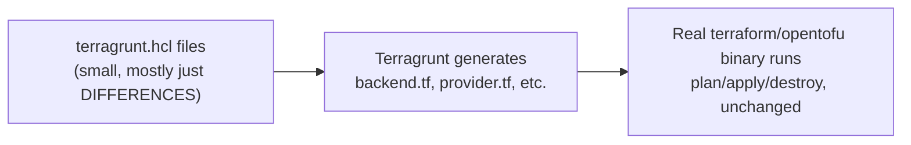
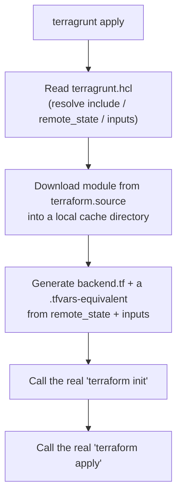

# Terragrunt (1 of 3) — Fundamentals: Why, Installation, Version Management, Basic Setup

*Not part of the official Terraform Associate exam — a course extra, and a genuinely useful real-world tool. Researched and verified against the current official docs (docs.terragrunt.com) as of this writing, in addition to the course's own material, so version differences are called out explicitly.*
*Course lectures folded in: Why Terragrunt?, Terragrunt Installation, Multiple Versions of Terragrunt/Terraform, Easy Switching Between Versions (+ demos), Terragrunt Basic Setup (+ demo), Terragrunt Blocks Explained, Terragrunt Flow*

---

## 1. Why Terragrunt? — The Problem It Solves, In Concrete Terms

### The problem, demonstrated
Imagine a company with three environments (dev, staging, prod), each needing a VPC, an EC2 fleet, and an RDS database — nine near-identical Terraform "projects" in total (3 environments × 3 components), or three environment folders each containing the same three resource groups. Without Terragrunt, each of those nine folders typically contains:
```hcl
# repeated, nearly identically, in EVERY one of the 9 folders
terraform {
  backend "s3" {
    bucket         = "my-org-tfstate"
    key            = "dev/vpc/terraform.tfstate"   # only this line actually differs
    region         = "ap-south-1"
    dynamodb_table = "terraform-locks"
    encrypt        = true
  }
}

provider "aws" {
  region = "ap-south-1"   # identical everywhere
}

module "vpc" {
  source = "../../../modules/vpc"   # identical everywhere
  cidr_block = "10.0.0.0/16"        # this differs per environment
}
```
Fix a typo in the backend config, or bump the AWS provider version, and you must find and correctly edit it in **nine separate places** — miss one, and that environment silently drifts out of sync with the rest, discovered only when something breaks there specifically.

### What Terragrunt actually is
A thin **wrapper** around the real `terraform`/`opentofu` binary, written by Gruntwork, that generates the repetitive boilerplate (backend config, provider config, module source) from a small number of centrally-defined files, and then calls the real Terraform CLI underneath. It does not replace Terraform's engine at all — `plan`/`apply`/`destroy` still run exactly as they always did; Terragrunt's job is purely to keep the *configuration surrounding* those calls DRY.



### What if a team keeps copy-pasting Terraform boilerplate instead of adopting Terragrunt?
This is entirely viable for a *small* number of environments (one or two) — the overhead of learning Terragrunt's own syntax isn't worth it yet. The practical threshold most teams notice: once you're maintaining a **third** near-identical environment/component folder and find yourself thinking "I need to remember to also fix this in the other two," that's the point where Terragrunt's DRY mechanisms start paying for themselves. Below that threshold, plain Terraform + well-designed modules alone is often the simpler, lower-overhead choice.

### Real-World Scenario 1 — A Bug Fix That Should Have Been One Line, Took a Day
A company managing 12 environment/component folders by hand (no Terragrunt) discovers their DynamoDB locking table name was misspelled in the original template and copy-pasted incorrectly into 4 of the 12 folders. Finding and fixing all 4 (and confirming the other 8 were actually correct, not just consistently wrong in a way nobody noticed) takes a full day of careful auditing. With Terragrunt's DRY state configuration (covered in file 2 of this series), the exact same fix would have been a single-line change in one root file, instantly correct everywhere.

### Real-World Scenario 2 — Onboarding a Fourth Environment
A company adds a `qa` environment alongside `dev`/`staging`/`prod`. Without Terragrunt, onboarding `qa` means copying an existing environment's folder structure, then carefully hunting through every copied file to update environment-specific values (state key paths, CIDR blocks) while leaving the shared boilerplate untouched — an error-prone, manual process. With Terragrunt's architecture-DRY pattern (file 2), onboarding `qa` is: create one small folder with a handful of lines specifying only what's different, and the shared configuration (backend, provider, CLI args) is inherited automatically.

---

## 2. Installing Terragrunt

Like Terraform itself, Terragrunt ships as a single static binary.

### Linux
```bash
wget https://github.com/gruntwork-io/terragrunt/releases/download/vX.Y.Z/terragrunt_linux_amd64
chmod +x terragrunt_linux_amd64
sudo mv terragrunt_linux_amd64 /usr/local/bin/terragrunt
terragrunt --version
```

### Windows
Download the `.exe` from the same GitHub releases page (or the current docs.terragrunt.com download page) and add it to your `PATH`, exactly like Terraform itself.

### macOS
```bash
brew install terragrunt   # Homebrew, recommended - handles upgrades via `brew upgrade`
```

**Prerequisite:** Terragrunt requires Terraform (or OpenTofu) to already be installed and on `PATH` — it calls out to the real binary under the hood; it is not a replacement for installing Terraform itself.

**What if you install Terragrunt without Terraform present?** Every `terragrunt plan`/`apply` fails immediately with an error that it can't find a `terraform` (or `tofu`) executable — Terragrunt has no engine of its own to fall back on.

---

## 3. Managing Multiple Versions of Terraform and Terragrunt

### The problem
Different projects on the same machine often need different Terraform (and Terragrunt) versions — Project A was built against Terraform `1.5.x` and hasn't been tested against newer releases; Project B needs `1.9.x` for a feature it depends on. A single global `terraform` binary satisfies only one of them at a time; upgrading globally for B silently risks breaking A.

### The fix — version managers
- **`tfenv`** for Terraform version switching.
- **`tgswitch`** (or `tfswitch`'s Terragrunt-aware sibling) for Terragrunt version switching.

```bash
# tfenv example
tfenv install 1.9.0
tfenv use 1.9.0
tfenv list
```
A `.terraform-version` file dropped into a project directory makes `tfenv` auto-select the right version whenever you `cd` into that folder — no manual switching required, and new teammates get the correct version automatically the moment they clone the repo.

### Example — seeing the switch happen automatically
```bash
cd project-a   # contains .terraform-version = "1.5.7"
terraform -version   # -> 1.5.7

cd ../project-b   # contains .terraform-version = "1.9.0"
terraform -version   # -> 1.9.0, switched automatically, no command typed
```

### What if you don't use a version manager and just keep one global Terraform install?
Every time you switch between an older and a newer project, you either have to manually reinstall/replace the global binary (tedious, error-prone, easy to forget) or accept the risk of running a project against an untested Terraform version — which, per Domain 2's provider-versioning lessons, is exactly the kind of silent, "worked yesterday, broke today with no code change" problem version pinning exists to prevent, just one layer up at the CLI level instead of the provider level.

### Real-World Scenario — A Consultant Working Across Multiple Clients
An infrastructure consultant works across five different client codebases simultaneously, each pinned to a different Terraform version by its own `.terraform-version` file (some clients haven't upgraded in over a year; others are on the latest release). `tfenv` means switching between client projects during the same workday requires zero manual reconfiguration — `cd`-ing into each client's repo transparently activates the correct version, every time.

---

## 4. Terragrunt Basic Setup

### The one required file: `terragrunt.hcl`
```
live/
└── dev/
    └── vpc/
        └── terragrunt.hcl
```
```hcl
# live/dev/vpc/terragrunt.hcl
terraform {
  source = "git::https://github.com/my-org/tf-modules.git//vpc?ref=v1.0.0"
}

inputs = {
  cidr_block = "10.0.0.0/16"
}
```
Notice there is **no** `main.tf` in this directory at all — `terragrunt.hcl` *points at* a module living elsewhere (a Git repo, tagged at a specific version) instead of containing resource code directly.

### Running it
```bash
cd live/dev/vpc
terragrunt init    # downloads the module referenced in terraform.source, then runs the real terraform init
terragrunt plan     # runs the real terraform plan against that downloaded module
terragrunt apply    # runs the real terraform apply
```
You type `terragrunt` instead of `terraform` — Terragrunt transparently assembles the actual Terraform working directory behind the scenes (in a cache folder, covered in file 3 of this series) and calls the real `terraform` binary for you underneath.

### What if you forget the `ref=v1.0.0` pin on a Git-sourced module?
Terragrunt will resolve the module from whatever the default branch's HEAD happens to be at `init` time — the exact same "no version pin" risk covered for Terraform providers and Registry modules (Domains 2 and 5), just applied to Terragrunt's own module-sourcing mechanism. Always pin a Git ref, exactly as you'd pin a provider or Registry module version.

---

## 5. Terragrunt Blocks Explained

| Block/Attribute | Purpose |
|---|---|
| `terraform { source = "..." }` | Which module to apply in this unit, and (optionally) hooks/extra CLI arguments — full detail in file 2 |
| `remote_state { ... }` | Auto-generates the Terraform `backend` block, and (in current Terragrunt versions) can even manage the S3 bucket/DynamoDB table's own creation for you — full detail in file 2 |
| `inputs = { ... }` | Values passed into the module — the Terragrunt equivalent of a Terraform `.tfvars` file |
| `include { ... }` | Pull in shared configuration from a parent `terragrunt.hcl` — the core DRY-architecture mechanism, full detail in file 2 |
| `dependency { ... }` | Reference another Terragrunt unit's outputs — full detail in file 3 |
| `locals { ... }` | Terragrunt's own local values, computed within `terragrunt.hcl` itself, referenced as `local.<name>` |
| `generate { ... }` | Directly generate an arbitrary `.tf` file (not just a backend) into the working directory — e.g., a shared `provider.tf` |

```hcl
terraform {
  source = "git::https://github.com/my-org/tf-modules.git//vpc?ref=v1.0.0"
}

inputs = {
  cidr_block = "10.0.0.0/16"
}
```

---

## 6. Terragrunt Flow — Putting the Blocks Together


Terragrunt never replaces Terraform's engine — it's a code-generation and orchestration layer sitting in front of it, at every single step.

### Real-World Scenario — Debugging "Which Terraform Command Is Terragrunt Actually Running?"
An engineer new to Terragrunt is confused why `terragrunt plan` behaves differently than expected. Running with `--terragrunt-log-level debug` (or, in newer versions, `--log-level debug`) reveals the *exact* underlying `terraform plan` command Terragrunt constructed — including which generated `backend.tf` and which resolved `inputs` were used — turning "Terragrunt is a black box" into "I can see precisely what real Terraform command this produces," which is often the fastest way to debug an unexpected Terragrunt behavior.

---

## 7. Practice Questions

### Easy
1. Does Terragrunt replace Terraform's execution engine, or wrap around it?
2. What is the one required file in every Terragrunt-managed directory?
3. Which tool would you use to let two different project folders on the same machine automatically use two different pinned Terraform versions?

### Medium
4. Write a minimal `terragrunt.hcl` that points at a Git-sourced VPC module tagged `v2.1.0`, passing `cidr_block = "10.0.0.0/16"` as an input.
5. Explain what problem `.terraform-version` + `tfenv` solves that a single global Terraform install cannot.
6. A team forgets to pin a `ref=` on a Git module source in `terraform { source = ... }`. Explain the concrete risk this creates, drawing a direct parallel to unpinned provider versions (Domain 2).

### Hard
7. A company maintains 9 near-identical environment/component folders by hand, without Terragrunt. Describe, with a concrete example, how a single typo in shared boilerplate can silently diverge across folders, and identify the specific threshold (in terms of folder count) at which adopting Terragrunt's DRY mechanisms becomes worth the added tooling complexity.
8. Using `--terragrunt-log-level debug` (or `--log-level debug`), describe how you would confirm exactly which real `terraform` command Terragrunt constructed for a given `terragrunt plan` invocation, and why this technique is useful for debugging unexpected behavior in a Terragrunt-wrapped project.

---
**Next:** [14-bonus-terragrunt-02-dry-patterns.md](14-bonus-terragrunt-02-dry-patterns.md)
