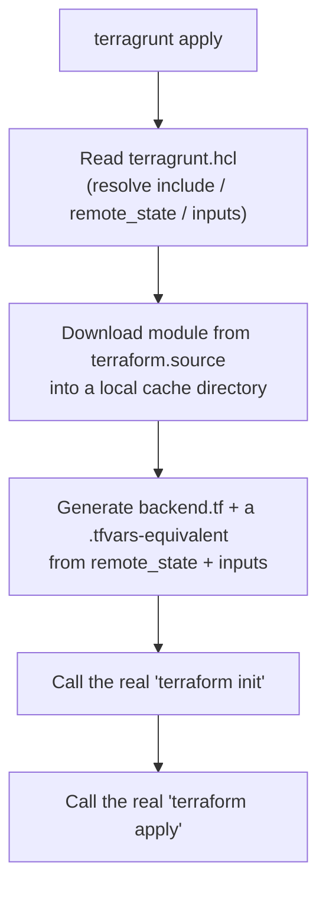

# Bonus — Terragrunt Fundamentals

> **Important:** Terragrunt is **not part of the official Terraform Associate exam**. This is a course extra focused on a real-world problem: **how to keep many Terraform environments DRY and manageable**. 

---

# 1. Why Terragrunt? — The Problem It Solves

The easiest way to understand Terragrunt is to first understand the problem it addresses.

Imagine a company has:

```text
3 environments
├── dev
├── staging
└── prod
```

And every environment needs:

```text
VPC
EC2
RDS
```

That gives:

```text
3 environments × 3 components = 9 Terraform projects/folders
```

Without Terragrunt, these folders often contain a lot of repeated Terraform configuration.

For example, you might have the same backend configuration everywhere:

```hcl
terraform {
  backend "s3" {
    bucket         = "my-org-tfstate"
    key            = "dev/vpc/terraform.tfstate"
    region         = "ap-south-1"
    dynamodb_table = "terraform-locks"
    encrypt        = true
  }
}

provider "aws" {
  region = "ap-south-1"
}

module "vpc" {
  source     = "../../../modules/vpc"
  cidr_block = "10.0.0.0/16"
}
```

Most of this is identical.

Only a few things may change:

```text
dev/vpc/terraform.tfstate
        ↓
staging/vpc/terraform.tfstate
        ↓
prod/vpc/terraform.tfstate
```

and perhaps:

```text
CIDR
environment
instance size
etc.
```

---

# 2. Why Copy-Pasting Becomes a Problem

Suppose you discover a mistake in the backend configuration.

You now have to check:

```text
dev/vpc
dev/ec2
dev/rds

staging/vpc
staging/ec2
staging/rds

prod/vpc
prod/ec2
prod/rds
```

That's **nine places**.

If you fix eight but accidentally miss one:

```text
8 folders → correct
1 folder  → old configuration
```

Now your environments are inconsistent.

This is the basic problem Terragrunt tries to solve:

> **Don't repeat the same Terraform boilerplate across many environment/component folders.**


---

# 3. What Exactly Is Terragrunt?

Terragrunt is a **wrapper around Terraform or OpenTofu**.

It does **not replace Terraform**.

Think:

```text id="tg1"
You
 │
 ▼
Terragrunt
 │
 │ generates/prepares configuration
 ▼
Terraform / OpenTofu
 │
 ▼
Cloud provider
```

Terragrunt's job is primarily to keep the configuration **around Terraform** DRY.

For example:

* backend configuration
* provider configuration
* module source
* inputs
* shared configuration
* dependencies

Terraform still performs the actual:

```text
plan
apply
destroy
```

operations. 

---

# 4. Terragrunt vs Terraform

This distinction is extremely important.

| Terraform                         | Terragrunt                               |
| --------------------------------- | ---------------------------------------- |
| Infrastructure-as-code engine     | Wrapper/orchestration layer              |
| Creates/manages infrastructure    | Helps organize Terraform                 |
| Has resources, modules, providers | Helps generate/reuse configuration       |
| `terraform plan`                  | `terragrunt plan`                        |
| `terraform apply`                 | `terragrunt apply`                       |
| Maintains Terraform state         | Helps configure how Terraform uses state |

Mental model:

```text id="tg2"
Terraform
= Does the infrastructure work

Terragrunt
= Makes managing many Terraform configurations easier
```

---

# 5. When Does Terragrunt Start Becoming Useful?

Terragrunt isn't automatically necessary for every Terraform project.

For a small project:

```text
1 environment
```

or perhaps:

```text
2 environments
```

plain Terraform + well-designed modules may be simpler.

The course gives a useful practical threshold:

> Once you're maintaining a **third near-identical environment/component folder** and thinking "I need to remember to fix this in the other two," Terragrunt's DRY mechanisms start becoming valuable. 

So:

```text
1–2 similar folders
      ↓
Terraform modules may be enough

3+ near-identical folders
      ↓
Terragrunt starts becoming attractive
```

This is a **practical guideline**, not a Terraform rule.

---

# 6. Example: Adding a New Environment

Suppose you currently have:

```text
dev
staging
prod
```

Now the company wants:

```text
qa
```

Without Terragrunt, you may have to:

```text
Copy existing environment
        ↓
Change backend key
        ↓
Change CIDR
        ↓
Change environment-specific values
        ↓
Check that shared configuration wasn't accidentally changed
```

With a Terragrunt architecture, the environment folder can contain only the values that are different.

Conceptually:

```text
Shared configuration
       │
       ├── dev
       ├── staging
       ├── prod
       └── qa
```

The details of this DRY architecture come in the next Terragrunt section.

---

# 7. Installing Terragrunt

Terragrunt is distributed as a **single binary**, similar to Terraform.

## Linux

Example:

```bash
wget https://github.com/gruntwork-io/terragrunt/releases/download/vX.Y.Z/terragrunt_linux_amd64

chmod +x terragrunt_linux_amd64

sudo mv terragrunt_linux_amd64 /usr/local/bin/terragrunt

terragrunt --version
```

---

## macOS

Using Homebrew:

```bash
brew install terragrunt
```

Then:

```bash
terragrunt --version
```

---

## Windows

Download the `.exe` and make sure it is available through your `PATH`.

---

# 8. Very Important: Terragrunt Still Needs Terraform

Terragrunt is **not Terraform itself**.

You need Terraform or OpenTofu installed.

Think:

```text id="tg3"
Terragrunt
    │
    │ calls
    ▼
Terraform/OpenTofu binary
    │
    ▼
Provider
    │
    ▼
Cloud API
```

If Terraform isn't installed or isn't available on `PATH`:

```bash
terragrunt plan
```

will fail because Terragrunt has no infrastructure engine of its own. 

### Exam/Interview-style question

**Q: Does installing Terragrunt remove the need to install Terraform?**

**A: No.**

Terragrunt wraps the Terraform/OpenTofu executable.

---

# 9. Multiple Terraform Versions

Now consider a developer working on multiple projects.

### Project A

```text
Terraform 1.5.x
```

### Project B

```text
Terraform 1.9.x
```

If your machine has only one global Terraform binary:

```text
/usr/local/bin/terraform
```

you have a problem.

If you upgrade Terraform for Project B:

```text
Project B → works
Project A → may break
```

because Project A was designed/tested against an older version.

---

# 10. Version Managers

A version manager lets you have multiple versions and switch between them.

For Terraform:

```text id="tg4"
tfenv
```

For Terragrunt:

```text id="tg5"
tgswitch
```

Example:

```bash
tfenv install 1.9.0
tfenv use 1.9.0
tfenv list
```

---

# 11. `.terraform-version`

One of the most useful features of `tfenv` is:

```text
.terraform-version
```

You can put it in the project directory.

For example:

```text
project-a/
├── .terraform-version
└── ...
```

Contents:

```text
1.5.7
```

Then:

```bash
cd project-a
terraform -version
```

automatically uses:

```text
1.5.7
```

Another project could have:

```text
project-b/
├── .terraform-version
└── ...
```

with:

```text
1.9.0
```

Then:

```bash
cd project-b
terraform -version
```

uses:

```text
1.9.0
```

So:

```text id="tg6"
project-a
.terraform-version = 1.5.7
        ↓
Terraform 1.5.7


project-b
.terraform-version = 1.9.0
        ↓
Terraform 1.9.0
```

No manual global reinstall is necessary. 

---

# 12. Why Version Management Matters

Remember that Terraform has several layers of versioning.

For example:

```text id="tg7"
Terraform CLI
      ↓
Provider
      ↓
Module
```

You've already learned provider/module version constraints.

Terragrunt adds another practical concern:

```text
Which Terraform/Terragrunt version is actually running?
```

So a project can pin its Terraform CLI version as well.

---

# 13. Basic Terragrunt Setup

The central file is:

```text
terragrunt.hcl
```

A simple structure could be:

```text id="tg8"
live/
└── dev/
    └── vpc/
        └── terragrunt.hcl
```

Notice something interesting:

There is **no `main.tf`** in this directory.

Instead, `terragrunt.hcl` points to the Terraform module containing the actual Terraform configuration. 

---

# 14. Minimal `terragrunt.hcl`

For example:

```hcl
terraform {
  source = "git::https://github.com/my-org/tf-modules.git//vpc?ref=v1.0.0"
}

inputs = {
  cidr_block = "10.0.0.0/16"
}
```

There are two important parts here.

### `terraform.source`

```hcl
terraform {
  source = "..."
}
```

Tells Terragrunt:

> "This is the Terraform module I want to use."

---

### `inputs`

```hcl
inputs = {
  cidr_block = "10.0.0.0/16"
}
```

Provides values to the Terraform module.

You can mentally compare it with Terraform variable input:

```text id="tg9"
Terraform
var.cidr_block
       ↑
       │
tfvars / CLI / environment


Terragrunt
inputs
       ↓
module variable
```

---

# 15. Running Terragrunt

Navigate into the directory:

```bash
cd live/dev/vpc
```

Then:

```bash
terragrunt init
```

Terragrunt:

```text id="tg10"
reads terragrunt.hcl
       ↓
downloads module
       ↓
prepares working directory
       ↓
runs Terraform init
```

Then:

```bash
terragrunt plan
```

and:

```bash
terragrunt apply
```

The important difference is simply that you're invoking:

```text
terragrunt
```

instead of:

```text
terraform
```

Terragrunt then calls the actual Terraform binary underneath. 

---

# 16. Why Pin the Git Module Version?

Look at:

```hcl
source = "git::https://github.com/my-org/tf-modules.git//vpc?ref=v1.0.0"
```

The important part is:

```text
ref=v1.0.0
```

This pins the Git reference.

Without it, you risk getting whatever the default branch contains at the time the module is downloaded.

For example:

```text id="tg11"
Today:
main → version 1.0

Tomorrow:
main → version 2.0
```

If your configuration doesn't pin the reference, the same Terragrunt configuration could potentially download different module code later.

So:

```text id="tg12"
Unpinned Git module
        ↓
"What does main contain today?"

Pinned Git ref
        ↓
"Use this specific version/ref"
```

This is conceptually similar to the provider/module version-pinning lessons from Terraform. 

---

# 17. Important Terragrunt Blocks

You should recognize these blocks/attributes.

| Block                        | Purpose                                              |
| ---------------------------- | ---------------------------------------------------- |
| `terraform { source = ... }` | Specifies the Terraform module/source                |
| `remote_state { ... }`       | Configures/generates Terraform backend configuration |
| `inputs = { ... }`           | Passes values into Terraform module                  |
| `include { ... }`            | Reuses configuration from parent `terragrunt.hcl`    |
| `dependency { ... }`         | Gets outputs from another Terragrunt unit            |
| `locals { ... }`             | Defines reusable Terragrunt-local values             |
| `generate { ... }`           | Generates arbitrary `.tf` files                      |


You don't need to deeply learn all of these yet.

The upcoming Terragrunt files will go deeper into:

```text
include
remote_state
dependency
```

---

# 18. `terraform` Block

Example:

```hcl
terraform {
  source = "git::https://github.com/my-org/tf-modules.git//vpc?ref=v1.0.0"
}
```

This tells Terragrunt where the Terraform code comes from.

Think:

```text id="tg13"
terragrunt.hcl
      │
      │ source
      ▼
Terraform module
      │
      ▼
Infrastructure
```

---

# 19. `inputs`

Example:

```hcl
inputs = {
  cidr_block = "10.0.0.0/16"
}
```

This passes values into the Terraform module.

If the Terraform module has:

```hcl
variable "cidr_block" {
  type = string
}
```

then Terragrunt supplies its value through:

```hcl
inputs = {
  cidr_block = "10.0.0.0/16"
}
```

The course describes this as roughly equivalent to supplying Terraform variable values through a `.tfvars`-style mechanism. 

---

# 20. `remote_state`

Terragrunt can configure the Terraform backend through:

```hcl
remote_state {
  ...
}
```

Instead of repeatedly writing backend blocks in every Terraform project, Terragrunt can generate/configure them.

Conceptually:

```text id="tg14"
Central Terragrunt configuration
          ↓
remote_state
          ↓
Terraform backend configuration
          ↓
Terraform state
```

This is one of the major DRY benefits of Terragrunt.

The next Terragrunt section goes into this much more deeply.

---

# 21. `include`

`include` allows one Terragrunt configuration to reuse configuration from another.

Think:

```text id="tg15"
root terragrunt.hcl
       │
       │ shared configuration
       ▼
dev/vpc/terragrunt.hcl
dev/ec2/terragrunt.hcl
prod/vpc/terragrunt.hcl
prod/ec2/terragrunt.hcl
```

Instead of copying the same configuration into every folder.

This is one of the **core DRY mechanisms** of Terragrunt.

---

# 22. `dependency`

Terragrunt can also retrieve outputs from another Terragrunt unit.

For example:

```text id="tg16"
VPC
 │
 │ output: vpc_id
 ▼
EC2
 │
 │ uses vpc_id
 ▼
Application
```

The `dependency` block helps express this relationship between separate Terragrunt units.

The detailed dependency workflow is covered later in the series.

---

# 23. Terragrunt's Overall Flow

This is the most important diagram in this file:




Let's understand it step by step.

---

## Step 1 — You run

```bash
terragrunt apply
```

---

## Step 2 — Terragrunt reads `terragrunt.hcl`

It determines things such as:

```text
source
inputs
include
remote_state
```

---

## Step 3 — Terragrunt downloads the module

If your source is:

```hcl
terraform {
  source = "git::https://github.com/my-org/tf-modules.git//vpc?ref=v1.0.0"
}
```

Terragrunt downloads that module into its local working/cache area.

---

## Step 4 — Terragrunt prepares Terraform configuration

It can generate things such as:

```text
backend.tf
```

and variable/input-related configuration.

---

## Step 5 — Terragrunt calls Terraform

Conceptually:

```bash
terraform init
```

---

## Step 6 — Terraform does the actual work

Eventually:

```bash
terraform apply
```

runs.

Therefore:

> **Terragrunt doesn't perform Terraform's infrastructure operations itself. It prepares/orchestrates the Terraform execution.**

---

# 24. Debugging Terragrunt

Sometimes you may wonder:

> "What Terraform command is Terragrunt actually running?"

Debug logging can help.

The course mentions:

```bash
--terragrunt-log-level debug
```

and notes that newer versions may use:

```bash
--log-level debug
```

For example:

```bash
terragrunt plan --log-level debug
```

The debug output can help you see things such as:

```text
Resolved module
Generated configuration
Inputs
Backend
Underlying Terraform command
```

This is useful when:

```text id="tg17"
terragrunt plan
        ↓
Unexpected result
        ↓
"What's Terragrunt actually doing?"
        ↓
Debug logging
        ↓
Inspect generated/underlying Terraform execution
```


---

# 25. Real-World Mental Model

Suppose you have:

```text
live/
├── dev/
│   ├── vpc/
│   ├── ec2/
│   └── rds/
│
├── staging/
│   ├── vpc/
│   ├── ec2/
│   └── rds/
│
└── prod/
    ├── vpc/
    ├── ec2/
    └── rds/
```

Terraform modules contain the reusable infrastructure logic:

```text
modules/
├── vpc/
├── ec2/
└── rds/
```

Terragrunt sits between those environments and the Terraform modules:

```text
                    Shared Terraform Modules
                    ┌─────────┬────────┬─────┐
                    │   VPC   │  EC2   │ RDS │
                    └────┬────┴───┬────┴──┬──┘
                         │         │       │
                 ┌───────┴─────────┴───────┴──────┐
                 │          Terragrunt             │
                 │   shared config + inputs       │
                 └───────┬─────────┬───────┬──────┘
                         │         │       │
                       dev     staging    prod
```

This separates:

```text
Terraform
= infrastructure logic

Terragrunt
= environment/configuration orchestration
```

---

# 26. Terraform Modules vs Terragrunt

This is an important distinction.

Terraform modules already solve:

> **How do I avoid duplicating infrastructure code?**

Terragrunt additionally helps solve:

> **How do I avoid duplicating the configuration surrounding those modules across many environments?**

For example:

```text id="tg18"
Terraform Module
       ↓
Reusable VPC infrastructure code
```

while Terragrunt can help make this:

```text id="tg19"
dev/vpc
staging/vpc
prod/vpc
```

share:

```text
backend configuration
provider configuration
inputs
module source
common settings
```

So:

```text id="tg20"
Terraform Modules
= DRY infrastructure code

Terragrunt
= DRY environment/configuration management
```

---

# 27. Practice Questions

Try these **before looking back at the explanations**.

## Easy

### 1.

Does Terragrunt replace Terraform's execution engine?

**Answer:** No. It wraps/orchestrates Terraform or OpenTofu.

### 2.

What is the primary configuration file in a Terragrunt-managed directory?

**Answer:**

```text
terragrunt.hcl
```

### 3.

Which tool can automatically switch Terraform versions based on `.terraform-version`?

**Answer:**

```text
tfenv
```

---

# 28. Medium

### 4. Write a minimal Terragrunt configuration

Requirement:

* Git-sourced VPC module
* version/tag `v2.1.0`
* `cidr_block = "10.0.0.0/16"`

Answer:

```hcl
terraform {
  source = "git::https://github.com/my-org/tf-modules.git//vpc?ref=v2.1.0"
}

inputs = {
  cidr_block = "10.0.0.0/16"
}
```

---

### 5. What problem does `.terraform-version` + `tfenv` solve?

Without version management:

```text
One global Terraform version
        ↓
Different projects may require different versions
        ↓
Manual switching/reinstalling
```

With:

```text
.terraform-version
        +
tfenv
```

each project can automatically use its required Terraform version.

---

### 6. What happens if a Git module isn't pinned?

For example:

```hcl
terraform {
  source = "git::https://github.com/my-org/tf-modules.git//vpc"
}
```

You haven't specified:

```text
ref=v1.0.0
```

The module can resolve from the default branch's current state.

Therefore, future runs may potentially use different module code as that branch changes.

Better:

```hcl
source = "git::https://github.com/my-org/tf-modules.git//vpc?ref=v1.0.0"
```

---

# 29. Hard Questions

### 7. Nine near-identical folders

Imagine:

```text
9 Terraform folders
```

and a shared backend setting was accidentally wrong in four of them.

Without Terragrunt:

```text
Find all 9
      ↓
Compare configuration
      ↓
Fix 4
      ↓
Verify remaining 5
```

With centralized Terragrunt DRY configuration, shared configuration can be maintained centrally instead of repeatedly copied.

The course's practical threshold for considering Terragrunt is around the **third near-identical folder**. 

---

### 8. Debugging `terragrunt plan`

If:

```bash
terragrunt plan
```

does something unexpected, use debug logging:

```bash
terragrunt plan --log-level debug
```

or, depending on the version:

```bash
terragrunt plan --terragrunt-log-level debug
```

Then inspect what Terragrunt resolved/generated and which underlying Terraform command it constructed.

This helps answer:

> "What is Terragrunt actually passing to Terraform?"

---

# 🧠 Final Cheat Sheet

## Terragrunt fundamentals

```text
Terragrunt
    ↓
Wrapper around Terraform/OpenTofu
```

It **does not replace Terraform**.

---

### Why Terragrunt?

```text
Many similar environments
        ↓
Repeated Terraform boilerplate
        ↓
Copy/paste problems
        ↓
Terragrunt
        ↓
DRY configuration
```

---

### Installation

```text
Linux     → binary
macOS     → brew install terragrunt
Windows   → .exe + PATH
```

And:

```text
Terragrunt requires Terraform/OpenTofu
```

---

### Version management

```text
tfenv
→ Terraform versions

tgswitch
→ Terragrunt versions
```

```text
.terraform-version
→ tells tfenv which Terraform version the project expects
```

---

### Basic file

```text
terragrunt.hcl
```

Example:

```hcl
terraform {
  source = "git::https://github.com/my-org/tf-modules.git//vpc?ref=v1.0.0"
}

inputs = {
  cidr_block = "10.0.0.0/16"
}
```

---

### Important blocks

```text
terraform {}
→ module/source

inputs {}
→ module inputs

remote_state {}
→ backend configuration

include {}
→ shared configuration

dependency {}
→ another Terragrunt unit's outputs

locals {}
→ reusable Terragrunt values

generate {}
→ generate .tf files
```

---

# 🔥 The Most Important Mental Model

Remember this:

```text
Terraform
─────────
"I know HOW to build the infrastructure."


Terragrunt
──────────
"I help you manage MANY Terraform configurations
without repeating the same surrounding configuration."
```

Or even shorter:

```text
Terraform Modules
        ↓
DRY infrastructure code

Terragrunt
        ↓
DRY environment/configuration management
```

And the complete flow:

```text
terragrunt apply
      ↓
Read terragrunt.hcl
      ↓
Resolve shared config + inputs
      ↓
Download Terraform module
      ↓
Generate/prep Terraform configuration
      ↓
Run real Terraform
      ↓
Terraform provider
      ↓
Cloud infrastructure
```

**For your Terraform Associate exam:** don't spend significant revision time memorizing Terragrunt syntax. This file explicitly says Terragrunt is **not part of the official Associate exam**. Learn the fundamentals because they're valuable for real-world DevOps work, but prioritize the Terraform domains and exam traps you've already covered. 
