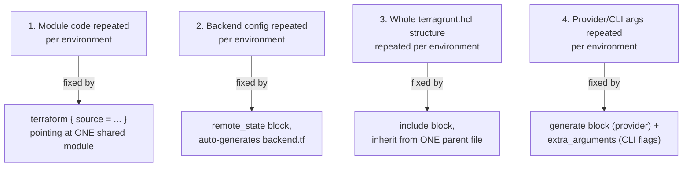

# Terragrunt (2 of 3) — The Four DRY Patterns: Modules, State, Architecture, CLI/Provider Config

*Course lectures folded in: Introduction to DRY Approaches, Keep your Terraform (modules) DRY (+ demo), Keep your Terraform state configuration DRY (+ demo), Keep your Terragrunt architecture DRY (+ another way to include, + overriding commons, + demo), Keep your Terraform CLI configuration DRY (+ demo), Keep your Terraform provider DRY, Keep your Terraform CLI args DRY, Terragrunt env configuration starting point*

---

## 0. The Four Targets, Mapped Out

Everything in this file solves one of four repetition problems. Keep this map in mind as you read each section:



---

## 1. Keep Your Terraform Modules DRY

### The problem
Without this pattern, every environment folder contains its own `main.tf` calling a module — meaning the *module call itself* is duplicated even if the module's internal code is shared:
```hcl
# dev/main.tf, staging/main.tf, prod/main.tf - all nearly identical
module "vpc" {
  source     = "../../modules/vpc"
  cidr_block = "10.0.0.0/16"   # only this line actually differs per environment
}
```

### The Terragrunt fix
```hcl
# live/dev/vpc/terragrunt.hcl
terraform {
  source = "../../../modules//vpc"
}

inputs = {
  cidr_block = "10.0.0.0/16"
}
```
```hcl
# live/staging/vpc/terragrunt.hcl
terraform {
  source = "../../../modules//vpc"   # SAME module reference
}

inputs = {
  cidr_block = "10.1.0.0/16"   # only the differing value
}
```
Notice the double-slash (`//`) syntax before `vpc` — this tells Terragrunt "the module lives at this path, inside this larger repo/directory," a Terraform module-addressing convention Terragrunt inherits directly.

### Example — using a versioned Git source instead of a local path (more realistic for a real, multi-repo company)
```hcl
terraform {
  source = "git::https://github.com/my-org/tf-modules.git//vpc?ref=v2.3.0"
}
```

### What if you skip this and keep each environment's module call fully independent?
A bug fix or security improvement discovered in the module requires manually re-applying the same fix to every environment's separate `main.tf` — and unlike a shared module reference, there's no single place a `version`/`ref` bump propagates from; every environment's fix is a separate, independently-remembered manual edit.

### Real-World Scenario 1 — A Security Fix Rolled Out to 5 Environments in One Commit
A platform team discovers their `vpc` module's default network ACL is unintentionally permissive. Because every environment's `terragrunt.hcl` references the same Git tag pattern (`ref=v2.3.0`), fixing the module and releasing `v2.4.0`, then bumping the `ref` in each environment's `terragrunt.hcl` (a one-line change per environment, easily scripted or done via a single coordinated PR), rolls the fix out everywhere — with each environment able to adopt the new version on its own schedule if needed, rather than everyone being forced to update simultaneously.

### Real-World Scenario 2 — Testing a Module Change Safely in One Environment First
A team wants to test an experimental module change in `dev` only, before rolling it out to `staging`/`prod`. Because each environment's `terragrunt.hcl` independently specifies its own `ref`, `dev` can point at a feature branch (`ref=feature-new-nat-config`) while `staging` and `prod` stay pinned to the stable `v2.3.0` tag — safe, isolated experimentation without touching the other environments' configuration at all.

---

## 2. Keep Your Terraform State Configuration DRY

### The problem
Without this pattern, every environment hand-writes its own `backend "s3" {}` block, with only the `key` path actually differing:
```hcl
# dev/main.tf
terraform {
  backend "s3" {
    bucket = "my-org-tfstate"
    key    = "dev/vpc/terraform.tfstate"    # only this differs
    region = "ap-south-1"
    dynamodb_table = "terraform-locks"
  }
}
```

### The Terragrunt fix
```hcl
# terragrunt.hcl
remote_state {
  backend = "s3"
  config = {
    bucket         = "my-org-tfstate"
    key            = "${path_relative_to_include()}/terraform.tfstate"
    region         = "ap-south-1"
    dynamodb_table = "terraform-locks"
    encrypt        = true
  }
}
```
`path_relative_to_include()` automatically resolves to `dev/vpc`, `staging/vpc`, `prod/vpc`, etc., based on where each child `terragrunt.hcl` actually lives relative to the file that defines this `remote_state` block — every environment gets a correctly, automatically separated state key, without a single hand-typed path.

### A materially important detail from current Terragrunt versions
Beyond just generating a `backend.tf`, modern Terragrunt's `remote_state` block can **also create the S3 bucket and DynamoDB table themselves** if they don't already exist — meaning the very first `terragrunt apply` in a brand-new environment can bootstrap its own remote state infrastructure, rather than requiring a separate, manual "create the state bucket first" step before Terragrunt can even run.

### What if you don't use `path_relative_to_include()` and instead hardcode each environment's `key`?
You're back to hand-typing a state path per environment — and the very first time someone copy-pastes an environment's `terragrunt.hcl` to bootstrap a new one and forgets to update the hardcoded `key`, **two environments silently point at the same state file**. The next `apply` in either environment can then corrupt or overwrite the other's state, an extremely dangerous, hard-to-immediately-notice failure mode.

### Real-World Scenario — Bootstrapping a Brand-New Environment From Scratch
A team onboarding a new `qa` environment runs `terragrunt apply` in a fresh `live/qa/vpc/` folder for the very first time. Because `remote_state` in modern Terragrunt can provision its own backing S3 bucket/DynamoDB table, and `path_relative_to_include()` automatically computes the correct, unique `key` path, the *entire* remote-state bootstrapping — bucket, locking table, and correctly-scoped key — happens automatically as part of that first apply, with zero manual AWS Console setup beforehand.

---

## 3. Keep Your Terragrunt Architecture DRY

### The problem
Even after Sections 1 and 2, if `remote_state` and CLI config (Section 4) are repeated verbatim in every environment's `terragrunt.hcl`, you've just moved the duplication from Terraform boilerplate to Terragrunt boilerplate — the underlying problem is unsolved.

### The fix — `include` blocks, inheriting from one parent file
```hcl
# live/terragrunt.hcl (root - shared config)
remote_state {
  backend = "s3"
  config = {
    bucket         = "my-org-tfstate"
    key            = "${path_relative_to_include()}/terraform.tfstate"
    region         = "ap-south-1"
    dynamodb_table = "terraform-locks"
    encrypt        = true
  }
}
```
```hcl
# live/dev/vpc/terragrunt.hcl (child - inherits the above)
include "root" {
  path = find_in_parent_folders()
}

terraform {
  source = "../../../modules//vpc"
}

inputs = {
  cidr_block = "10.0.0.0/16"
}
```
`find_in_parent_folders()` walks upward from the child file's location until it finds `live/terragrunt.hcl` — every environment's child file inherits the exact same backend configuration with zero duplication of the actual block content.

### An alternative form of `include` — an explicit path, for non-standard layouts
```hcl
include "root" {
  path = "${get_terragrunt_dir()}/../../terragrunt.hcl"
}
```
**Use** `find_in_parent_folders()` for the common case — a clean, uniform environment tree.
**Use** an explicit relative path when your folder structure has a genuine exception (one environment's config legitimately lives somewhere non-standard).

### Overriding inherited configuration — the piece most tutorials skip
```hcl
# root terragrunt.hcl
inputs = {
  environment = "shared"
  owner       = "platform-team"
}
```
```hcl
# child terragrunt.hcl - prod needs one extra input the others don't
include "root" {
  path   = find_in_parent_folders()
  expose = true
}

inputs = merge(
  include.root.inputs,
  { environment = "prod", enable_nat_gateway = true }
)
```
`include.root.inputs` (available specifically because `expose = true` was set) lets a child explicitly `merge()` in the parent's inputs and override or extend only what needs to change for this one environment — more precise and readable than relying purely on Terragrunt's automatic deep-merge behavior for `inputs` blocks across parent/child.

### What if you don't use `include` at all, and instead copy the same `remote_state` block into every environment's `terragrunt.hcl` by hand?
You've recreated exactly the Section 2 problem, just at the Terragrunt-config layer instead of the raw-Terraform layer — a bucket rename or a DynamoDB table rename now needs to be manually, correctly repeated in every environment's file, with the same "someone forgets one" risk as before Terragrunt was even introduced.

### Real-World Scenario 1 — Migrating the Entire Company's State Bucket in One Line
A company needs to move their Terraform state to a new, more tightly-access-controlled S3 bucket, as part of a security remediation. Because every environment inherits `remote_state` from one root `terragrunt.hcl`, the migration is a **single-line change** (the `bucket` value) in the root file — every environment picks it up on its next `terragrunt init` (which will prompt to migrate existing state, exactly like plain Terraform's backend-change behavior).

### Real-World Scenario 2 — Prod Needing One Config Difference Without a Forked Root File
A company's `prod` environment needs a longer `-lock-timeout` (Section 4) than dev/staging, because prod applies sometimes take longer and hit lock contention more often. Using the `include.root` + `merge()` override pattern, only `prod`'s child `terragrunt.hcl` needs the extra override — the root file, and every other environment inheriting from it, stays completely untouched.

---

## 4. Keep Your Terraform CLI Configuration and Provider DRY

### CLI arguments
```hcl
# root terragrunt.hcl
terraform {
  extra_arguments "common_vars" {
    commands  = ["plan", "apply", "destroy"]
    arguments = ["-lock-timeout=10m"]
  }
}
```
Any child `terragrunt.hcl` that includes this root automatically applies `-lock-timeout=10m` to every `plan`/`apply`/`destroy` it runs — nobody has to remember to type the flag manually, and a brand-new environment folder inherits it automatically, with no risk of a new environment "forgetting" a flag every other environment has.

### Provider configuration, generated centrally
```hcl
# root terragrunt.hcl
generate "provider" {
  path      = "provider.tf"
  if_exists = "overwrite"
  contents  = <<EOF
provider "aws" {
  region = "ap-south-1"
}
EOF
}
```
Terragrunt writes this generated `provider.tf` file into each unit's working directory automatically, before every run. **Don't** hand-write a `provider "aws" {}` block inside every module you author (Domain 5's anti-pattern, revisited) — **do** let Terragrunt's `generate` block inject it centrally, so a region change or a provider version bump happens in exactly one place, applying everywhere at once.

### Verifying it actually gets applied
```bash
terragrunt plan --log-level debug
```
Watch the debug output for the real, underlying `terraform plan` command Terragrunt constructs — you'll see `-lock-timeout=10m` appended automatically even though nobody typed it in this specific `plan` invocation.

### What if you don't centralize CLI args/provider config, and instead let each environment set its own?
The risk isn't hypothetical: a brand-new environment folder, created by copying an *old* environment folder from before a CLI-flag or provider-version standard was adopted, silently runs with outdated settings — because there's no central place enforcing consistency, only whatever happened to be copied. Centralizing via `include` + `extra_arguments`/`generate` means new environments inherit the **current** standard automatically, not whatever an old copy-paste template happened to contain.

### Real-World Scenario — A Provider Version Bump Applied Company-Wide in One Edit
A company centralizes their AWS provider version pin inside a root-level `generate "provider"` block (extending the example above to also include a `required_providers` block). Bumping from `~> 5.0` to `~> 5.10` to pick up a needed bug fix is a single edit to the root file — every environment picks up the new constraint on its next `init`, instead of the team needing to track down and edit a provider version pin duplicated across a dozen separate environment folders.

---

## 5. Practice Questions

### Easy
1. Which Terragrunt block automatically generates a Terraform `backend` configuration?
2. What function resolves to a unique, environment-specific path for use inside a `key` attribute?
3. Which Terragrunt block lets a child config inherit shared settings from a parent `terragrunt.hcl`?

### Medium
4. Write a root `terragrunt.hcl` with a `remote_state` block using `path_relative_to_include()`, and a child `terragrunt.hcl` that includes it via `find_in_parent_folders()`.
5. A child environment needs one extra input (`enable_nat_gateway = true`) beyond what the root's shared `inputs` provides. Show the `include ... expose = true` + `merge()` pattern that adds it without duplicating the root's other inputs.
6. Explain what risk is created if two environments' `terragrunt.hcl` files hardcode the same literal state `key` value by mistake, instead of using `path_relative_to_include()`.

### Hard
7. Design a root-level `generate "provider"` block that centrally injects both a `provider "aws" {}` block and a `required_providers` version constraint, and explain what happens across every environment the next time someone bumps the version in this one file.
8. A company needs to migrate their entire Terragrunt-managed estate to a new state S3 bucket, for security reasons. Using the architecture-DRY pattern from Section 3, describe exactly what changes, where, and what happens automatically the next time each environment runs `init`.

---
**Next:** [15-bonus-terragrunt-03-advanced-features.md](15-bonus-terragrunt-03-advanced-features.md)
