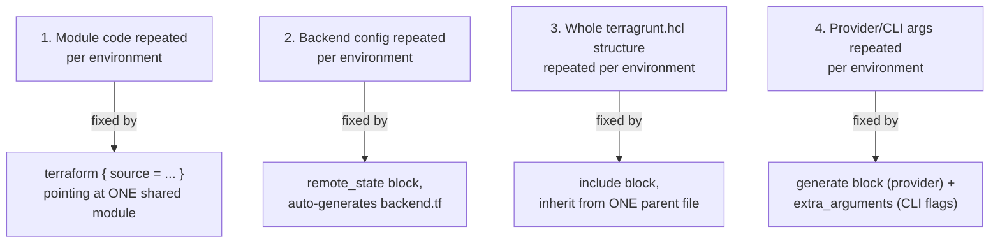

# Bonus — Terragrunt DRY Patterns

This is **Terragrunt (2 of 3)**. Like the previous section, it is a **course extra, not part of the official Terraform Associate exam**. The main goal here is understanding how Terragrunt removes different kinds of repetition from large Terraform codebases. 

The most important thing to remember is that there are **four different DRY problems**, and Terragrunt has a different mechanism for each one.

---

# 1. The Four DRY Patterns

Keep this diagram in your head throughout the chapter:




So the quick mapping is:

| Problem                                 | Terragrunt solution          |
| --------------------------------------- | ---------------------------- |
| Terraform module configuration repeated | `terraform { source = ... }` |
| Backend/state configuration repeated    | `remote_state`               |
| Terragrunt configuration repeated       | `include`                    |
| Provider configuration repeated         | `generate`                   |
| Terraform CLI arguments repeated        | `extra_arguments`            |

---

# 2. DRY Pattern #1 — Keep Terraform Modules DRY

## The problem

Suppose you have:

```text
dev/
staging/
prod/
```

Each environment needs a VPC.

Without this Terragrunt pattern, you might have:

```hcl
module "vpc" {
  source     = "../../modules/vpc"
  cidr_block = "10.0.0.0/16"
}
```

in:

```text
dev/main.tf
staging/main.tf
prod/main.tf
```

The module itself is shared, but the **module call is still duplicated**. 

---

# 3. Terragrunt Solution — `terraform.source`

Instead of putting the module call in every environment's `main.tf`, use:

```hcl
terraform {
  source = "../../../modules//vpc"
}

inputs = {
  cidr_block = "10.0.0.0/16"
}
```

For staging:

```hcl
terraform {
  source = "../../../modules//vpc"
}

inputs = {
  cidr_block = "10.1.0.0/16"
}
```

Notice:

```text
source → same
cidr   → different
```

So the environment configuration contains primarily **what is different**. 

---

# 4. Why the `//` Matters

You may see:

```hcl
source = "../../../modules//vpc"
```

There are two slashes:

```text
modules//vpc
        ^^
```

The idea is:

> The module is located at a particular subdirectory inside a larger source/repository.

For example:

```text
tf-modules/
├── vpc/
├── ec2/
└── rds/
```

You can point specifically to:

```text
vpc
```

inside the larger source.

---

# 5. Git-Based Module Source

In a real company, modules may be stored in Git:

```hcl
terraform {
  source = "git::https://github.com/my-org/tf-modules.git//vpc?ref=v2.3.0"
}
```

Here:

```text
git::https://...
        ↓
Git repository

//vpc
   ↓
vpc module inside repository

?ref=v2.3.0
        ↓
specific Git reference/version
```

This is preferable to blindly using a moving branch.

---

# 6. Important Practical Benefit

Suppose the VPC module has a security problem.

You fix it and release:

```text
v2.3.0 → v2.4.0
```

Then environments can update their source:

```text
ref=v2.3.0
```

to:

```text
ref=v2.4.0
```

The actual module implementation remains in **one shared location**.

The course also points out a useful advantage: environments can deliberately use different module versions, allowing you to test a new version in `dev` before moving `staging` and `prod`. 

For example:

```text
dev     → v2.4.0
staging → v2.3.0
prod    → v2.3.0
```

This gives controlled rollout.

---

# 7. DRY Pattern #1 — Mental Model

```text
Terraform module
       ↓
ONE reusable implementation

Terragrunt
       ↓
Each environment says:
"Use that module + here are my values"
```

So:

> **`terraform.source` = where the reusable Terraform code comes from.**

---

# 8. DRY Pattern #2 — Keep Terraform State Configuration DRY

Now we have a different problem.

Suppose every environment contains:

```hcl
terraform {
  backend "s3" {
    bucket         = "my-org-tfstate"
    key            = "dev/vpc/terraform.tfstate"
    region         = "ap-south-1"
    dynamodb_table = "terraform-locks"
  }
}
```

Then staging has almost the same thing:

```hcl
terraform {
  backend "s3" {
    bucket         = "my-org-tfstate"
    key            = "staging/vpc/terraform.tfstate"
    region         = "ap-south-1"
    dynamodb_table = "terraform-locks"
  }
}
```

Again, almost everything is duplicated.

Only:

```text
key
```

changes. 

---

# 9. Terragrunt Solution — `remote_state`

Terragrunt provides:

```hcl
remote_state {
  backend = "s3"

  config = {
    bucket         = "my-org-tfstate"
    key            = "${path_relative_to_include()}/terraform.tfstate"
    region         = "ap-south-1"
    dynamodb_table = "terraform-locks"
    encrypt        = true
  }
}
```


The important part is:

```hcl
key = "${path_relative_to_include()}/terraform.tfstate"
```

---

# 10. What Does `path_relative_to_include()` Do?

Imagine:

```text
live/
├── dev/
│   └── vpc/
│       └── terragrunt.hcl
│
├── staging/
│   └── vpc/
│       └── terragrunt.hcl
│
└── prod/
    └── vpc/
        └── terragrunt.hcl
```

The function can automatically derive the relative path.

Conceptually:

```text
dev/vpc
staging/vpc
prod/vpc
```

So your state keys become:

```text
dev/vpc/terraform.tfstate
staging/vpc/terraform.tfstate
prod/vpc/terraform.tfstate
```

You don't have to manually type every state path. 

---

# 11. Why This Is Important

Imagine someone creates:

```text
qa/vpc/
```

If the key is automatically generated from the directory structure:

```text
qa/vpc/terraform.tfstate
```

is naturally produced.

But if someone manually copies:

```hcl
key = "dev/vpc/terraform.tfstate"
```

into the new QA configuration and forgets to change it, you could end up with:

```text
dev → dev/vpc/terraform.tfstate
qa  → dev/vpc/terraform.tfstate
```

Two environments would be using the **same state file**.

That is extremely dangerous because both environments could manipulate the same state.

The source specifically highlights this as a major risk of hardcoding keys. 

---

# 12. Modern Terragrunt: State Infrastructure Bootstrap

The source also highlights a capability of current Terragrunt versions:

`remote_state` can do more than generate backend configuration.

It can also help create the backing infrastructure, such as:

```text
S3 bucket
DynamoDB locking table
```

if they don't already exist.

So conceptually:

```text
terragrunt apply
       ↓
Does state infrastructure exist?
       ↓
No
       ↓
Create it
       ↓
Configure backend
       ↓
Run Terraform
```


This is a **current Terragrunt feature**, rather than something you need to memorize for Terraform Associate.

---

# 13. DRY Pattern #2 — Mental Model

Remember:

```text
remote_state
      ↓
Terraform backend configuration
      ↓
State location
```

And:

```text
path_relative_to_include()
      ↓
Automatically derive unique state key
```

So:

> **`remote_state` = keep backend/state configuration DRY.**

---

# 14. DRY Pattern #3 — Keep Terragrunt Architecture DRY

Now suppose you've solved the first two problems.

You have:

```text
terraform.source
remote_state
```

But you've put the same `remote_state` block into every:

```text
dev/terragrunt.hcl
staging/terragrunt.hcl
prod/terragrunt.hcl
```

You've reduced Terraform duplication, but you've now created:

> **Terragrunt configuration duplication.**

The problem simply moved to another layer. 

---

# 15. Solution — `include`

Create a root Terragrunt configuration:

```text
live/
├── terragrunt.hcl
├── dev/
│   └── vpc/
│       └── terragrunt.hcl
├── staging/
└── prod/
```

The root file contains shared configuration:

```hcl
# live/terragrunt.hcl

remote_state {
  backend = "s3"

  config = {
    bucket         = "my-org-tfstate"
    key            = "${path_relative_to_include()}/terraform.tfstate"
    region         = "ap-south-1"
    dynamodb_table = "terraform-locks"
    encrypt        = true
  }
}
```


Then the child file says:

```hcl
include "root" {
  path = find_in_parent_folders()
}

terraform {
  source = "../../../modules//vpc"
}

inputs = {
  cidr_block = "10.0.0.0/16"
}
```

---

# 16. `find_in_parent_folders()`

This function tells Terragrunt:

> "Look upward through the parent directories until you find the appropriate `terragrunt.hcl`."

For example:

```text
live/
└── terragrunt.hcl       ← shared configuration
    │
    ├── dev/
    │   └── vpc/
    │       └── terragrunt.hcl
    │
    ├── staging/
    │
    └── prod/
```

The child can use:

```hcl
include "root" {
  path = find_in_parent_folders()
}
```

Terragrunt finds:

```text
live/terragrunt.hcl
```

and inherits its configuration. 

---

# 17. Explicit `include` Path

There is another option:

```hcl
include "root" {
  path = "${get_terragrunt_dir()}/../../terragrunt.hcl"
}
```

Use this when your directory structure doesn't fit the normal parent-folder layout.

### Simple rule

```text
Normal hierarchy
      ↓
find_in_parent_folders()

Non-standard hierarchy
      ↓
explicit path
```


---

# 18. Overriding Shared Configuration

Sometimes almost everything should be shared, but one environment needs a difference.

For example, root:

```hcl
inputs = {
  environment = "shared"
  owner       = "platform-team"
}
```

But production needs:

```text
environment = prod
enable_nat_gateway = true
```

You can expose the included configuration:

```hcl
include "root" {
  path   = find_in_parent_folders()
  expose = true
}
```

Then:

```hcl
inputs = merge(
  include.root.inputs,
  {
    environment        = "prod"
    enable_nat_gateway = true
  }
)
```


---

# 19. Understand `expose = true`

This is important.

Without:

```hcl
expose = true
```

you cannot use:

```hcl
include.root.inputs
```

in this pattern.

With:

```hcl
expose = true
```

the included configuration becomes accessible through:

```text
include.root
```

Then you can use:

```hcl
merge(...)
```

to extend or override values.

---

# 20. `merge()` Refresher

Suppose:

```hcl
merge(
  {
    environment = "shared"
    owner       = "platform-team"
  },
  {
    environment        = "prod"
    enable_nat_gateway = true
  }
)
```

The resulting map conceptually becomes:

```text
environment        = prod
owner              = platform-team
enable_nat_gateway = true
```

The child overrides:

```text
environment
```

while retaining:

```text
owner
```

from the parent.

So the pattern is:

```text
Parent configuration
       +
Child-specific changes
       ↓
merge()
       ↓
Final configuration
```

---

# 21. Why `include` Is So Powerful

Suppose you need to change:

```text
S3 bucket
```

from:

```text
my-old-tfstate
```

to:

```text
my-new-secure-tfstate
```

If every environment has its own backend configuration:

```text
dev       → edit
staging   → edit
prod      → edit
qa        → edit
...
```

With a shared root:

```text
live/terragrunt.hcl
        ↓
change bucket once
        ↓
all child configurations inherit it
```

This is the central architectural benefit of `include`. 

---

# 22. DRY Pattern #3 — Mental Model

Remember:

```text
include
   ↓
inherit shared Terragrunt configuration
```

And:

```text
find_in_parent_folders()
   ↓
find parent terragrunt.hcl
```

So:

> **`include` = reuse/inherit Terragrunt configuration from a parent.**

---

# 23. DRY Pattern #4 — Terraform CLI Arguments

There is another type of duplication.

Suppose every environment needs:

```bash
-lock-timeout=10m
```

Without Terragrunt, developers might have to remember:

```bash
terraform plan -lock-timeout=10m
terraform apply -lock-timeout=10m
terraform destroy -lock-timeout=10m
```

That's repetitive and easy to forget.

---

# 24. Solution — `extra_arguments`

At the root:

```hcl
terraform {
  extra_arguments "common_vars" {
    commands = ["plan", "apply", "destroy"]

    arguments = [
      "-lock-timeout=10m"
    ]
  }
}
```


Now child configurations inheriting this configuration automatically get:

```text
plan    → -lock-timeout=10m
apply   → -lock-timeout=10m
destroy → -lock-timeout=10m
```

The developer doesn't need to manually type it each time.

---

# 25. Provider Configuration — `generate`

Provider configuration can also be centralized.

Instead of every environment having:

```hcl
provider "aws" {
  region = "ap-south-1"
}
```

Terragrunt can generate a Terraform file.

Example:

```hcl
generate "provider" {
  path      = "provider.tf"
  if_exists = "overwrite"

  contents = <<EOF
provider "aws" {
  region = "ap-south-1"
}
EOF
}
```


Terragrunt generates:

```text
provider.tf
```

for the Terraform working directory.

So:

```text
Root terragrunt.hcl
        ↓
generate
        ↓
provider.tf
        ↓
Terraform
```

---

# 26. Why Centralize Provider Configuration?

Imagine 15 environments all have:

```hcl
provider "aws" {
  region = "ap-south-1"
}
```

Then you decide to change the standard region.

Without centralization:

```text
15 files → potentially 15 edits
```

With centralized generation:

```text
1 root file
      ↓
generate provider.tf
      ↓
all environments
```

This is another DRY mechanism.

---

# 27. Provider Version Can Also Be Centralized

The source gives an example where the generated provider configuration can be extended to include a Terraform:

```hcl
required_providers
```

configuration.

Conceptually:

```text
Root Terragrunt
      ↓
generate
      ↓
provider.tf
      ↓
provider configuration
+
required provider version
```

Then if the company changes its standard from:

```text
~> 5.0
```

to:

```text
~> 5.10
```

the centralized configuration can propagate that change across environments on their next initialization. 

---

# 28. Verifying Generated Configuration

If you're unsure what Terragrunt is actually doing, use debug logging:

```bash
terragrunt plan --log-level debug
```

You can inspect the underlying Terraform command Terragrunt constructs.

For example, you should be able to see that:

```text
-lock-timeout=10m
```

was automatically added even though you didn't type it manually. 

---

# 29. All Four Patterns Together

This is the big picture:

```text
                     Terragrunt
                         │
        ┌────────────────┼────────────────┐
        │                │                │
        ▼                ▼                ▼
   Shared module   Shared state      Shared architecture
   terraform.source remote_state     include
        │                │                │
        └────────────────┼────────────────┘
                         │
                         ▼
                 Environment-specific
                     configuration
                         │
                         ▼
                generate / extra_arguments
                         │
                         ▼
                    Terraform
```

The key is that each mechanism solves a **different duplication problem**.

---

# 30. Quick Comparison

| Terragrunt feature           | What problem does it solve? | Remember as                 |
| ---------------------------- | --------------------------- | --------------------------- |
| `terraform.source`           | Repeated module references  | **Which module?**           |
| `remote_state`               | Repeated backend config     | **Where is state?**         |
| `include`                    | Repeated Terragrunt config  | **What is shared?**         |
| `path_relative_to_include()` | Repeated/manual state keys  | **Which state path?**       |
| `generate`                   | Repeated provider `.tf`     | **Generate Terraform code** |
| `extra_arguments`            | Repeated CLI flags          | **Always add these flags**  |
| `expose`                     | Access included config      | **Expose parent config**    |
| `merge()`                    | Add/override shared inputs  | **Combine parent + child**  |

---

# 31. Practice Questions

## Easy

### 1. Which block automatically generates Terraform backend configuration?

**Answer:**

```text
remote_state
```

---

### 2. Which function helps generate an environment-specific state key?

**Answer:**

```text
path_relative_to_include()
```

---

### 3. Which block allows child Terragrunt configurations to inherit parent configuration?

**Answer:**

```text
include
```

---

# 32. Medium

### 4. Root + Child Example

Root:

```hcl
# live/terragrunt.hcl

remote_state {
  backend = "s3"

  config = {
    bucket = "my-org-tfstate"
    key    = "${path_relative_to_include()}/terraform.tfstate"
    region = "ap-south-1"
  }
}
```

Child:

```hcl
# live/dev/vpc/terragrunt.hcl

include "root" {
  path = find_in_parent_folders()
}

terraform {
  source = "../../../modules//vpc"
}
```

The child inherits the root's remote state configuration.

---

### 5. Child-specific input

Parent:

```hcl
inputs = {
  environment = "shared"
  owner       = "platform-team"
}
```

Child:

```hcl
include "root" {
  path   = find_in_parent_folders()
  expose = true
}

inputs = merge(
  include.root.inputs,
  {
    environment        = "prod"
    enable_nat_gateway = true
  }
)
```

Result:

```text
environment        = prod
owner              = platform-team
enable_nat_gateway = true
```

---

### 6. What happens if two environments accidentally use the same state key?

For example:

```text
dev → prod/terraform.tfstate
prod → prod/terraform.tfstate
```

Both environments can point to the **same Terraform state**.

That's extremely dangerous because Terraform state is what maps configuration/resource addresses to managed infrastructure.

The safe pattern is to generate unique keys using:

```hcl
path_relative_to_include()
```

---

# 33. Hard Questions

## 7. Centralized Provider Configuration

You could use:

```hcl
generate "provider" {
  path      = "provider.tf"
  if_exists = "overwrite"

  contents = <<EOF
terraform {
  required_providers {
    aws = {
      source  = "hashicorp/aws"
      version = "~> 5.10"
    }
  }

  provider "aws" {
    region = "ap-south-1"
  }
}
EOF
}
```

The exact generated structure should be validated against the Terraform/provider configuration you're targeting, but the **Terragrunt concept** is:

```text
root generate block
       ↓
generates provider Terraform configuration
       ↓
all included environments use it
```

Therefore, changing the centralized version constraint can propagate to every environment when Terragrunt regenerates the configuration and Terraform initializes.

---

# 34. State Bucket Migration Scenario

Suppose all environments currently use:

```text
my-old-tfstate
```

and the company wants:

```text
my-new-secure-tfstate
```

Because the backend configuration is centralized:

```hcl
remote_state {
  config = {
    bucket = "my-new-secure-tfstate"
    ...
  }
}
```

you change the bucket **once** in the root `terragrunt.hcl`.

Then each environment picks up the new configuration during its next:

```bash
terragrunt init
```

Terraform's normal backend-change/state-migration behavior then applies.

The source specifically compares this to the normal Terraform behavior when backend configuration changes. 

---

# 🧠 Final Cheat Sheet

### The four DRY problems

```text
1. Repeated module configuration
       ↓
   terraform.source


2. Repeated backend configuration
       ↓
   remote_state


3. Repeated Terragrunt configuration
       ↓
   include


4. Repeated provider / CLI configuration
       ↓
   generate + extra_arguments
```

---

### Functions/keywords to remember

```text
path_relative_to_include()
        ↓
Automatically create environment-specific state paths


find_in_parent_folders()
        ↓
Find parent terragrunt.hcl


expose = true
        ↓
Make included configuration accessible


merge()
        ↓
Combine/override parent inputs
```

---

# 🔥 The Mental Model

Think of Terragrunt DRY in **layers**:

```text
                    TERRAGRUNT
                         │
        ┌────────────────┼─────────────────┐
        │                │                 │
        ▼                ▼                 ▼
      MODULE           STATE          ARCHITECTURE
        │                │                 │
 source = ...       remote_state        include
        │                │                 │
        └────────────────┼─────────────────┘
                         │
                         ▼
                  COMMON SETTINGS
                         │
                  ┌──────┴──────┐
                  ▼             ▼
               generate    extra_arguments
                  │             │
                  ▼             ▼
              Provider       CLI flags
                         │
                         ▼
                     Terraform
```

The **one-line memory trick**:

> **`source` = module, `remote_state` = state, `include` = shared architecture, `generate` = generated Terraform, `extra_arguments` = CLI flags.**

And remember: **this is Terragrunt knowledge for real-world use, not Terraform Associate exam material.** 
