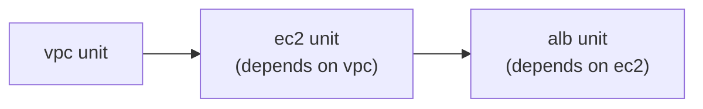

# Terragrunt (3 of 3) — Cache, Hooks, Dependencies, Auto-Retry, and Deploying a Full Tree with `run-all`

*Course lectures folded in: Terragrunt Cache, Auto-init, Terragrunt Hooks, Formatting, Dependency (between modules), Auto-retry, Run-all, Caution on AWS Costs, and the course's three progressively-built example projects — Deploy Your AWS Infra with Terragrunt Run-all (capstone)*

---

## 1. Terragrunt Cache

### What it is
`.terragrunt-cache/` is the local working directory Terragrunt generates behind the scenes for every unit — where the referenced module actually gets downloaded, and where generated files (`backend.tf`, a `.tfvars`-equivalent, any `generate` block output) actually live, just before the real `terraform`/`tofu` binary runs against them.
```
live/dev/vpc/
├── terragrunt.hcl
└── .terragrunt-cache/
    └── <hash>/
        └── <downloaded module contents + generated files>
```

### What if you commit `.terragrunt-cache/` to Git?
It's regenerated fresh on every run (a new hash-named subdirectory can even appear after a module version bump) — committing it bloats the repository with disposable, machine-generated content that will immediately diverge from what the next `terragrunt` run regenerates anyway. **Add `.terragrunt-cache/` to `.gitignore`**, exactly the same reasoning as ignoring `.terraform/` for plain Terraform.

---

## 2. Auto-init

### What it does
Terragrunt automatically runs the equivalent of `terraform init` for you whenever it detects the cache is missing, stale, or the module source has changed — you rarely need to type `terragrunt init` explicitly as a separate step.
```bash
terragrunt plan
# Terragrunt notices .terragrunt-cache is missing/stale for this unit
# -> runs the equivalent of "terraform init" automatically first
# -> then runs "terraform plan"
```

### What if you assume, out of habit from plain Terraform, that you always need a manual `terragrunt init` first?
Nothing breaks — running it manually first is harmless — but it's an unnecessary extra step for the common case. **Use:** just run `terragrunt plan`/`apply` directly for normal day-to-day work; auto-init handles re-initialization transparently whenever it's actually needed.

---

## 3. Terragrunt Hooks

### What they are and the specific problem they solve
Hooks run a shell command before or after a Terragrunt action — the orchestration-level equivalent of a Terraform provisioner (Bonus: Provisioners), but operating around the Terragrunt run itself rather than inside a single resource's lifecycle.

### Example 1 — failing fast if a required environment variable is missing
```hcl
terraform {
  before_hook "validate_env" {
    commands = ["apply"]
    execute  = ["bash", "-c", "test -n \"$AWS_PROFILE\" || (echo 'AWS_PROFILE not set' && exit 1)"]
  }
}
```
**What if you skip this check?** `terraform apply` proceeds using whatever AWS credentials happen to be ambient in the shell — potentially the *wrong* AWS account/profile if someone forgot to set `AWS_PROFILE` before running a command against a sensitive environment. The hook turns a possible "applied to the wrong account" incident into an immediate, loud, pre-apply failure instead.

### Example 2 — notifying a team channel after a successful apply
```hcl
terraform {
  after_hook "notify_slack" {
    commands     = ["apply"]
    execute      = ["bash", "-c", "curl -X POST $SLACK_WEBHOOK -d '{\"text\":\"Terragrunt apply completed for '${path_relative_to_include()}'\"}'"]
    run_on_error = false
  }
}
```
`run_on_error = false` ensures the notification only fires on a genuinely successful apply, not on a failed one — a small but important detail; the opposite setting (`run_on_error = true`) is useful for a *different* hook specifically meant to alert on failures.

### Real-World Scenario — Preventing an Apply Against the Wrong AWS Account
A company operates dev and prod in **separate AWS accounts**, switched via `AWS_PROFILE`. A `before_hook` on every `apply` command checks that the currently-active AWS account ID (queried via `aws sts get-caller-identity`) matches the account ID expected for that specific environment's `terragrunt.hcl` — if an engineer forgets to switch profiles and would otherwise apply dev's config against the prod account by mistake, the hook catches it and aborts before a single API call is made.

---

## 4. Formatting

### What it is
```bash
terragrunt hclfmt   # formats every terragrunt.hcl file recursively from the current directory
```
`terragrunt.hcl` is itself HCL, and Terragrunt ships its own formatter for it, parallel to `terraform fmt` (Domain 3).

### What if you skip this and let every engineer format `terragrunt.hcl` files their own way?
Exactly the same problem plain Terraform's `fmt` prevents (Domain 3) — pull requests get cluttered with whitespace-only diffs mixed into genuine logic changes, making real changes harder to spot during review. Run `terragrunt hclfmt` (often as a pre-commit hook or CI gate) for the same reason you'd run `terraform fmt -check`.

---

## 5. Dependency Between Modules

### The problem it solves
A two-tier deployment (`vpc`, then `ec2` inside it) needs `ec2`'s Terragrunt unit to read `vpc`'s outputs — the Terragrunt-native alternative to hand-writing a `terraform_remote_state` data source (Domain 7) inside the actual Terraform module code.

### The `dependency` block, in full
```hcl
# live/dev/ec2/terragrunt.hcl
dependency "vpc" {
  config_path = "../vpc"

  mock_outputs = {
    public_subnet_id = "subnet-00000000000000000"
  }
  mock_outputs_allowed_terraform_commands = ["plan"]
}

terraform {
  source = "../../../modules//ec2"
}

inputs = {
  subnet_id = dependency.vpc.outputs.public_subnet_id
}
```
Terragrunt automatically ensures `vpc` applies before `ec2` (when using `run-all`, Section 7) and reads `vpc`'s real outputs directly — no manual `terraform_remote_state` data source boilerplate required inside the module code itself.

### `mock_outputs` — a detail worth understanding, not just copying
`mock_outputs` lets `terragrunt plan` succeed on the `ec2` unit **even before `vpc` has ever actually been applied** — useful in CI, where you might want to `plan` an entire tree (to review a large batch of changes) before `apply`-ing any of it. `mock_outputs_allowed_terraform_commands = ["plan"]` deliberately restricts mocking to `plan` only — a real `apply` still fails loudly if the dependency genuinely doesn't exist yet, since applying with a *fake* subnet ID would create genuinely broken infrastructure, not just an inaccurate preview.

### The related, simpler `dependencies` block — ordering only, no output-reading
```hcl
dependencies {
  paths = ["../vpc", "../security-groups"]
}
```
Used purely to declare "these units must apply before this one, when running `run-all`" — without actually reading any of their outputs. Reach for `dependency` (singular) when you need actual output values wired in; reach for `dependencies` (plural) when you only need ordering enforced, with no data actually flowing between the units.

### What if you skip `mock_outputs` entirely?
`terragrunt plan` on the `ec2` unit fails outright if `vpc` hasn't been applied yet — which is *correct* behavior for a real `apply`, but overly strict for a CI pipeline that wants to preview an entire multi-unit tree's changes in one pass, including units whose dependencies haven't been created yet (e.g., a brand-new environment being planned for the very first time, end to end, before anything in it exists).

### Real-World Scenario 1 — Previewing an Entire New Environment Before Creating Anything
A team wants to review the full `plan` output for a brand-new `qa` environment (`vpc`, `ec2`, and a database tier, none of which exist yet) in a single CI run, before approving any of it. `mock_outputs` on every downstream unit's `dependency` block lets `run-all plan` (Section 7) succeed across the whole tree even though nothing has actually been created yet — giving reviewers a complete picture of what *would* be created, all at once.

### Real-World Scenario 2 — Ordering-Only Dependencies for Non-Output-Sharing Units
A `monitoring` unit needs to apply *after* an `ec2` unit exists (so its CloudWatch alarms have a real instance to attach to) but doesn't actually need to read any of `ec2`'s specific output values — it derives the instance ID it needs from a tag-based lookup instead. A `dependencies { paths = ["../ec2"] }` block enforces the correct ordering during `run-all` without the unnecessary overhead of wiring an actual output value through `dependency`.

---

## 6. Auto-retry

### What it solves
Cloud APIs sometimes fail transiently — rate limiting, brief network blips, eventual-consistency races (a resource that was "just created" not yet being visible to a subsequent API call). Terragrunt can automatically retry an operation when it recognizes a known, transient error message pattern.

```hcl
terraform {
  retryable_errors = [
    "(?s).*Error installing provider.*",
    "(?s).*RequestLimitExceeded.*",
    "(?s).*ThrottlingException.*",
  ]
  retry_max_attempts       = 3
  retry_sleep_interval_sec = 5
}
```

### What if you add a genuine configuration error's message pattern to `retryable_errors` by mistake?
Auto-retrying a real, deterministic bug (a syntax error, a missing required argument) just delays discovering it by three attempts' worth of wasted time before it fails anyway — retries only make sense for errors that have a real chance of succeeding on a subsequent attempt purely due to timing, never for errors that will fail identically every single time regardless of retry count.

### Real-World Scenario — A Large `run-all apply` Surviving Transient AWS Throttling
A company's `run-all apply` across 15 units occasionally hits `RequestLimitExceeded` from AWS when many units make API calls in quick succession. Without auto-retry, this single transient error fails the entire batch, requiring a full manual re-run (and re-review) of everything. With `retryable_errors` configured to recognize this specific error pattern, Terragrunt automatically waits and retries just the affected unit's specific failed step — the batch completes successfully without any human intervention.

---

## 7. `run-all` — Deploying an Entire Tree

> **Version note:** older Terragrunt versions use the standalone `terragrunt run-all apply` subcommand, exactly as the course teaches it. Current Terragrunt (1.0+) has moved toward `terragrunt run --all apply` as the preferred form, with `run-all` retained for backward compatibility during the transition. Both achieve the same thing; check your installed version's docs if the exact flag differs.

### What it does
Applies (or plans/destroys) an **entire tree** of Terragrunt units in one command, automatically respecting every `dependency`/`dependencies` relationship between them.
```bash
cd live/dev
terragrunt run-all apply     # or: terragrunt run --all apply, on newer versions
```

Terragrunt determines from `dependency`/`dependencies` blocks that `vpc` must apply before `ec2`, and `ec2` before `alb` — `run-all apply` walks the entire tree in the correct order automatically, instead of you `cd`-ing into each folder and running `apply` manually, in the right sequence, by hand.

### The full capstone workflow, tying together everything in this three-file series
```bash
cd project/live/dev
terragrunt run-all plan      # review the FULL batch of changes across every unit first
terragrunt run-all apply     # vpc applies first (dependency), then ec2, then alb, automatically
```
This is the payoff of the entire Terragrunt module: what would otherwise be dozens of hand-maintained, copy-pasted Terraform files across environments and tiers collapses into a handful of small `terragrunt.hcl` files, each only a few lines long, with every shared concern (modules, state, provider, CLI args, dependencies) defined exactly once and inherited everywhere it's needed.

### What if you run `run-all apply` against `prod` without first reviewing `run-all plan`?
The blast radius of one command just became "every unit in this entire tree, applied without human review" — precisely the kind of irreversible mistake that a `plan`-first habit (Domain 3) exists to prevent, now multiplied across an entire dependency tree instead of a single unit.

### Caution on AWS Costs (a practical reminder before you actually run any of this)
Every `apply` in this series of examples creates **real, billable** AWS resources. Run `terragrunt run-all destroy` as soon as you're done experimenting with a given example — don't leave NAT Gateways, EC2 instances, or EIPs running between study sessions. NAT Gateways in particular bill hourly **and** per GB processed, even when completely idle, making them one of the easiest ways to accumulate unexpected cost while working through a course like this. Setting up a simple AWS Billing Alert (a CloudWatch billing alarm) early on turns "an accidentally-left-running resource" into a notification you actually see, instead of a surprise on the monthly invoice.

---

## 8. Practice Questions

### Easy
1. What does `.terragrunt-cache/` contain, and should it be committed to Git?
2. Which Terragrunt block lets one unit read another unit's real Terraform outputs?
3. What is `mock_outputs` used for, and which Terragrunt command does it typically apply to?

### Medium
4. Write a `dependency` block for an `ec2` unit reading a `vpc` unit's `public_subnet_id` output, including a `mock_outputs` entry restricted to `plan` only.
5. Explain the difference between the `dependency` block and the `dependencies` block — specifically, what one of them provides that the other does not.
6. A `before_hook` checks that `AWS_PROFILE` is set before every `apply`. Explain the specific incident this prevents, and what happens instead if the hook is removed.

### Hard
7. Design a `retryable_errors` configuration that safely retries AWS API throttling errors up to 3 times, and explain why adding a genuine HCL syntax error's message pattern to this same list would be a mistake rather than a helpful safety net.
8. A company runs `terragrunt run-all apply` across a 15-unit tree in CI, and it occasionally fails midway due to transient AWS throttling. Design a combination of `retryable_errors` and `mock_outputs` (for a full `run-all plan` dry run beforehand) that makes this pipeline both resilient to transient failures and safely reviewable before any real changes are applied.

---
*This is the final file in the Terragrunt series. Return to [00-INDEX.md](00-INDEX.md) for the full course map.*
