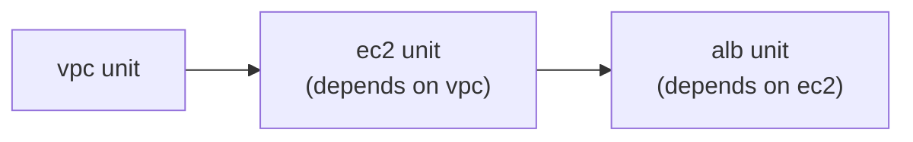

# Bonus — Terragrunt Advanced Features

This is **Terragrunt (3 of 3)** and focuses on the features that become useful when you have many Terragrunt units: **cache, auto-init, hooks, dependencies, retries, and `run-all`**. Like the previous two files, this is a **course extra and not part of the official Terraform Associate exam**. 

The most important mental model is:

```text
Terragrunt
   │
   ├── prepares/organizes Terraform execution
   ├── manages dependencies between units
   ├── runs commands across many units
   └── adds automation around Terraform
             │
             ▼
        Terraform/OpenTofu
             │
             ▼
       Cloud infrastructure
```

---

# 1. Terragrunt Cache

## What is `.terragrunt-cache/`?

When Terragrunt uses a module from:

```hcl
terraform {
  source = "../../../modules//vpc"
}
```

or a Git source:

```hcl
terraform {
  source = "git::https://github.com/my-org/tf-modules.git//vpc?ref=v1.0.0"
}
```

Terragrunt needs a local working directory where it can:

* download the module
* generate Terraform files
* prepare the configuration
* run Terraform against it

That working directory is:

```text
.terragrunt-cache/
```


For example:

```text id="qf1j2p"
live/dev/vpc/
├── terragrunt.hcl
└── .terragrunt-cache/
    └── <hash>/
        └── <downloaded module + generated files>
```

---

# 2. What Goes Inside the Cache?

Conceptually:

```text
terragrunt.hcl
       │
       ▼
Terragrunt processes configuration
       │
       ▼
.terragrunt-cache/
       │
       ├── downloaded Terraform module
       ├── generated backend.tf
       ├── generated provider configuration
       └── generated variable/input configuration
       │
       ▼
Terraform/OpenTofu runs here
```

So don't confuse:

```text
terragrunt.hcl
```

with:

```text
.terragrunt-cache/
```

The first is your **configuration**.

The second is a **generated working/cache directory**.

---

# 3. Should `.terragrunt-cache/` Be Committed to Git?

**No.**

Add:

```text
id="u6j2tr"
.terragrunt-cache/
```

to `.gitignore`.

Why?

Because it is:

* generated automatically
* disposable
* machine-generated
* regenerated by Terragrunt
* potentially different after module changes

This is similar to why you don't commit Terraform's:

```text
.terraform/
```

directory. 

### Mental model

```text
Your code
    ↓
terragrunt.hcl
    ↓
Generated cache
    ↓
Terraform
```

You commit:

```text
terragrunt.hcl
```

You **don't commit**:

```text
.terragrunt-cache/
```

---

# 4. Auto-init

One useful Terragrunt behavior is **automatic initialization**.

With normal Terraform, you're familiar with:

```bash
terraform init
terraform plan
```

Terragrunt can automatically perform the equivalent initialization when it determines that the working/cache state requires it.

For example:

```bash
terragrunt plan
```

may effectively do:

```text
Check cache/configuration
        ↓
Initialization required?
        ↓
Yes
        ↓
Terraform init
        ↓
Terraform plan
```


---

# 5. Do You Still Need `terragrunt init`?

You **can** run:

```bash
terragrunt init
```

and it isn't harmful.

But for normal day-to-day Terragrunt usage, you can generally start with:

```bash
terragrunt plan
```

or:

```bash
terragrunt apply
```

and Terragrunt handles required initialization automatically. 

So:

```text
Terraform
→ init is an important explicit workflow step

Terragrunt
→ auto-init can handle it when necessary
```

---

# 6. Terragrunt Hooks

Hooks allow you to run commands **before or after a Terragrunt operation**.

Think of them as automation surrounding the Terragrunt command.

For example:

```text
before_hook
     ↓
Terragrunt/Terraform command
     ↓
after_hook
```

The source compares them conceptually to Terraform provisioners, but there's an important difference:

```text
Provisioner
→ associated with a Terraform resource lifecycle

Terragrunt hook
→ associated with the Terragrunt operation
```


---

# 7. `before_hook`

Suppose you want to make sure an environment variable exists before `apply`.

Example:

```hcl id="kz4k74"
terraform {
  before_hook "validate_env" {
    commands = ["apply"]

    execute = [
      "bash",
      "-c",
      "test -n \"$AWS_PROFILE\" || (echo 'AWS_PROFILE not set' && exit 1)"
    ]
  }
}
```

The important concept is:

```text
terragrunt apply
      ↓
before_hook
      ↓
Check AWS_PROFILE
      ↓
Valid?
  ├── No → STOP
  └── Yes
       ↓
    Terraform apply
```

---

# 8. Why Is This Useful?

Imagine:

```text
AWS_PROFILE=prod
```

and you're about to run a production deployment.

If you accidentally have:

```text
AWS_PROFILE=dev
```

or no profile at all, you may execute the command against the wrong account/credentials.

A `before_hook` can fail **before the actual apply**.

The source gives the example of validating the active AWS account/profile before a sensitive deployment. 

---

# 9. `after_hook`

You can also run something **after** a command.

Example:

```hcl id="3p3khp"
terraform {
  after_hook "notify_slack" {
    commands = ["apply"]

    execute = [
      "bash",
      "-c",
      "curl -X POST $SLACK_WEBHOOK ..."
    ]

    run_on_error = false
  }
}
```

Conceptually:

```text
terragrunt apply
       ↓
Terraform apply
       ↓
Success
       ↓
after_hook
       ↓
Send notification
```

---

# 10. `run_on_error`

This is important.

```hcl id="n4qvlw"
run_on_error = false
```

means:

> Run the hook only when the command succeeds.

If:

```text
terraform apply → SUCCESS
```

then:

```text
notification → runs
```

If:

```text
terraform apply → FAILURE
```

then:

```text
notification → doesn't run
```

If you specifically want a hook to execute even after failure—for example, to send an alert—you can use:

```hcl id="e3t3q6"
run_on_error = true
```

The source specifically highlights this distinction. 

---

# 11. Hooks vs Provisioners

This distinction is worth remembering:

| Terraform Provisioner               | Terragrunt Hook                      |
| ----------------------------------- | ------------------------------------ |
| Runs as part of resource lifecycle  | Runs around Terragrunt operation     |
| Example: configure EC2              | Example: validate environment        |
| `remote-exec`, `local-exec`, `file` | `before_hook`, `after_hook`          |
| Resource-focused                    | Terraform/Terragrunt command-focused |

Mental shortcut:

```text
Provisioner → resource
Hook → Terragrunt command
```

---

# 12. Formatting Terragrunt Files

Terraform has:

```bash
terraform fmt
```

Terragrunt has:

```bash
terragrunt hclfmt
```

Example:

```bash
terragrunt hclfmt
```

This formats:

```text
terragrunt.hcl
```

files recursively from the current directory. 

---

# 13. Why Formatting Matters

Without consistent formatting:

```text
Engineer A → style A
Engineer B → style B
Engineer C → style C
```

Pull requests become full of:

```text
whitespace changes
indentation changes
formatting noise
```

rather than actual logic changes.

So the same principle applies:

```text
Terraform
→ terraform fmt

Terragrunt
→ terragrunt hclfmt
```

---

# 14. Dependencies Between Terragrunt Units

Now we reach one of the most important features in this chapter.

Imagine:

```text
VPC
 ↓
EC2
 ↓
ALB
```

The EC2 infrastructure needs something from the VPC, such as:

```text
subnet_id
```

The ALB may need something from EC2.

With separate Terragrunt units, you need a way to express those relationships.

---

# 15. The `dependency` Block

Example:

```hcl id="4s1k6h"
dependency "vpc" {
  config_path = "../vpc"

  mock_outputs = {
    public_subnet_id = "subnet-00000000000000000"
  }

  mock_outputs_allowed_terraform_commands = ["plan"]
}

terraform {
  source = "../../../modules//ec2"
}

inputs = {
  subnet_id = dependency.vpc.outputs.public_subnet_id
}
```


There are several important pieces here.

---

# 16. `config_path`

```hcl id="52ah32"
config_path = "../vpc"
```

This tells Terragrunt:

> "The dependency I need is located at `../vpc`."

For example:

```text id="j1yyqd"
live/dev/
├── vpc/
│   └── terragrunt.hcl
│
└── ec2/
    └── terragrunt.hcl
```

From:

```text id="rj3u0j"
ec2/
```

the VPC is:

```text id="gk3xjq"
../vpc
```

---

# 17. Reading Dependency Outputs

Suppose VPC produces:

```hcl id="h3k7s4"
output "public_subnet_id" {
  value = aws_subnet.public.id
}
```

The EC2 Terragrunt configuration can use:

```hcl id="2n0cqp"
inputs = {
  subnet_id = dependency.vpc.outputs.public_subnet_id
}
```

The flow becomes:

```text
VPC
 │
 │ output
 ▼
public_subnet_id
 │
 ▼
dependency.vpc.outputs.public_subnet_id
 │
 ▼
EC2 input
 │
 ▼
subnet_id
```

---

# 18. `dependency` vs `terraform_remote_state`

You may remember from Terraform Domain 7:

```hcl id="1n7p9h"
data "terraform_remote_state" "network" {
  ...
}
```

That allows one Terraform project to read outputs from another project's state.

Terragrunt provides a more natural Terragrunt-level mechanism:

```hcl id="l0d2s4"
dependency "vpc" {
  config_path = "../vpc"
}
```

Then:

```hcl id="lq8tqf"
dependency.vpc.outputs.public_subnet_id
```

So the mental distinction is:

```text
terraform_remote_state
→ Terraform-level state/output sharing

dependency
→ Terragrunt-level dependency + output sharing
```

The source describes `dependency` as the Terragrunt-native alternative to manually putting `terraform_remote_state` into the module code. 

---

# 19. `mock_outputs`

This is a very useful concept.

Suppose:

```text
VPC hasn't been applied yet
```

Therefore:

```text
VPC output doesn't actually exist
```

But you want to run:

```bash
terragrunt plan
```

for EC2 anyway.

You can provide mock output:

```hcl id="g5l2w8"
mock_outputs = {
  public_subnet_id = "subnet-00000000000000000"
}
```

This gives Terragrunt a fake value for planning.

---

# 20. Why Restrict Mock Outputs to `plan`?

The source uses:

```hcl id="4j9l8a"
mock_outputs_allowed_terraform_commands = ["plan"]
```

This is extremely important.

You want:

```text
plan
→ fake value is acceptable
```

because you're only previewing.

But:

```text
apply
→ fake subnet ID would be dangerous
```

because Terraform could attempt to create real infrastructure using a nonexistent/fake dependency.

So:

```text id="v1v4jh"
PLAN
  ↓
Mock output okay

APPLY
  ↓
Must use real dependency
```


---

# 21. `dependency` vs `dependencies`

This is a **very important distinction**.

They look almost identical but do different jobs.

---

## `dependency` — singular

Use:

```hcl id="h1v7ub"
dependency "vpc" {
  config_path = "../vpc"
}
```

when you need:

> **Outputs/data from another unit.**

Example:

```hcl id="3p5czt"
dependency.vpc.outputs.vpc_id
```

So:

```text
dependency
    ↓
Ordering + output values
```

---

## `dependencies` — plural

Example:

```hcl id="8j3y2k"
dependencies {
  paths = [
    "../vpc",
    "../security-groups"
  ]
}
```

This is for:

> **Ordering only.**

You are saying:

```text
VPC must be processed first
Security groups must be processed first
```

but you don't need their outputs.


---

# 22. The Easy Way to Remember

```text
dependency
    ↓
"I need something FROM it."

dependencies
    ↓
"I only need it BEFORE me."
```

Or:

| Feature        | Outputs? | Ordering? |
| -------------- | -------: | --------: |
| `dependency`   |    ✅ Yes |     ✅ Yes |
| `dependencies` |     ❌ No |     ✅ Yes |

This is one of the best exam/interview-style distinctions in this chapter.

---

# 23. What If You Don't Use `mock_outputs`?

Suppose:

```text
VPC doesn't exist
```

and EC2 has:

```hcl id="5y9j8h"
dependency "vpc" {
  config_path = "../vpc"
}
```

Then trying to plan EC2 independently may fail because the actual VPC outputs aren't available yet.

That is correct behavior for a real deployment.

But for a CI pipeline doing:

```bash
terragrunt run-all plan
```

across an entirely new environment, you may want the plan to work even before the dependencies have been applied.

That's where:

```text id="7k8q4z"
mock_outputs
```

can be useful. 

---

# 24. Auto-Retry

Cloud APIs don't always fail because your configuration is wrong.

Sometimes the failure is temporary.

Examples:

```text id="0m7jqi"
API throttling
Rate limiting
Temporary network failure
Eventual consistency
Temporary provider/API issue
```

Terragrunt can retry recognized errors.

---

# 25. `retryable_errors`

Example:

```hcl id="m4u8i1"
terraform {
  retryable_errors = [
    "(?s).*Error installing provider.*",
    "(?s).*RequestLimitExceeded.*",
    "(?s).*ThrottlingException.*"
  ]

  retry_max_attempts       = 3
  retry_sleep_interval_sec = 5
}
```


This means conceptually:

```text
Terraform operation
      ↓
Transient error?
      ↓
Yes
      ↓
Wait 5 seconds
      ↓
Retry
      ↓
Up to 3 attempts
```

---

# 26. What Should NOT Be Retried?

This is extremely important.

Don't retry errors that will definitely fail every time.

For example:

```text id="h4m3h7"
Syntax error
Missing required argument
Invalid configuration
Wrong resource argument
```

If the configuration is:

```text
wrong
```

then:

```text
attempt 1 → fails
attempt 2 → fails
attempt 3 → fails
```

You've just wasted time.

So:

```text
Transient error
→ retry makes sense

Deterministic configuration error
→ retry doesn't help
```


---

# 27. `run-all` — Deploying an Entire Tree

Now we combine dependencies with multi-unit execution.

Imagine:



You don't want to manually do:

```bash
cd vpc
terragrunt apply

cd ../ec2
terragrunt apply

cd ../alb
terragrunt apply
```

Terragrunt can execute the whole tree.

---

# 28. `terragrunt run-all apply`

Older Terragrunt syntax:

```bash
terragrunt run-all apply
```

The source notes that newer Terragrunt versions are moving toward:

```bash
terragrunt run --all apply
```

while `run-all` remains for compatibility during the transition. 

So understand the **concept**, not just the exact command spelling:

```text
run-all / run --all
        ↓
Run Terraform operation across multiple Terragrunt units
```

---

# 29. How `run-all` Handles Dependencies

Suppose:

```text id="u5r8w2"
VPC
 ↓
EC2
 ↓
ALB
```

and the configuration expresses:

```text
EC2 depends on VPC
ALB depends on EC2
```

When you run:

```bash
terragrunt run-all apply
```

Terragrunt determines the correct order:

```text id="u8c9j3"
VPC
 ↓
EC2
 ↓
ALB
```

You don't need to manually navigate into each folder and apply in the correct order. 

---

# 30. `run-all plan` First

The safest workflow is:

```bash
terragrunt run-all plan
```

first.

Review:

```text
VPC changes
EC2 changes
ALB changes
...
```

Then:

```bash
terragrunt run-all apply
```

This follows the same fundamental Terraform principle you've already learned:

```text
plan
  ↓
review
  ↓
apply
```

The difference is that now the operation covers **many units**.

---

# 31. Full Terragrunt Capstone Flow

A typical environment might look like:

```text id="8r1e5k"
live/dev/
│
├── vpc/
│   └── terragrunt.hcl
│
├── security-groups/
│   └── terragrunt.hcl
│
├── ec2/
│   └── terragrunt.hcl
│
└── alb/
    └── terragrunt.hcl
```

Relationships:

```text id="f4f0fz"
VPC
 │
 ├───────────────┐
 ▼               ▼
Security Groups  EC2
                   │
                   ▼
                  ALB
```

Then:

```bash id="7avt8q"
cd project/live/dev

terragrunt run-all plan
```

Review everything.

Then:

```bash id="5a2wz8"
terragrunt run-all apply
```

Terragrunt handles the dependency ordering.


---

# 32. Why `run-all apply` Can Be Dangerous

Suppose you have:

```text
15 units
```

and run:

```bash
terragrunt run-all apply
```

That's potentially a huge operation.

One command can affect:

```text
VPC
EC2
RDS
ALB
NAT Gateway
IAM
Security Groups
...
```

So don't think:

```text
run-all = just a convenient apply
```

Think:

```text
run-all
    ↓
potentially affects the ENTIRE environment tree
```

The source specifically warns against running it in production without first reviewing `run-all plan`. 

---

# 33. AWS Cost Warning

The examples in this Terragrunt course can create **real AWS resources**.

Resources such as:

```text
EC2
NAT Gateway
Elastic IP
RDS
```

can cost money.

In particular, NAT Gateways can generate charges from:

* hourly usage
* data processing

So when you're finished experimenting:

```bash
terragrunt run-all destroy
```

should be considered.


---

# 34. Putting Everything Together

Now look at the complete architecture:

```text
                     Root Terragrunt
                           │
                           │ include
                           ▼
                  Shared configuration
                           │
        ┌──────────────────┼──────────────────┐
        │                  │                  │
        ▼                  ▼                  ▼
   remote_state        generate          extra_arguments
        │                  │                  │
        ▼                  ▼                  ▼
      State             Provider            CLI flags
                           │
                           ▼
                  Terragrunt units
                           │
          ┌────────────────┼────────────────┐
          │                │                │
          ▼                ▼                ▼
         VPC              EC2              ALB
          │                │                │
          └── dependency ──┘                │
                           │                │
                           └── dependency ──┘
                                    │
                                    ▼
                              run-all apply
                                    │
                                    ▼
                               Terraform
                                    │
                                    ▼
                                  AWS
```

This is the overall purpose of the three Terragrunt files.

---

# 35. Practice Questions

## Easy

### 1. What is `.terragrunt-cache/`?

It is Terragrunt's local working/cache directory containing downloaded modules and generated configuration used before the real Terraform/OpenTofu binary runs.

Should it be committed?

**No.**

Add:

```text
.terragrunt-cache/
```

to `.gitignore`.

---

### 2. Which block lets one Terragrunt unit read another unit's outputs?

```text
dependency
```

Example:

```hcl
dependency "vpc" {
  config_path = "../vpc"
}
```

Then:

```hcl
dependency.vpc.outputs.vpc_id
```

---

### 3. What is `mock_outputs` for?

It provides temporary/fake dependency outputs, primarily so:

```bash
terragrunt plan
```

can work even when the real dependency hasn't been applied yet.

Typically restrict it with:

```hcl
mock_outputs_allowed_terraform_commands = ["plan"]
```

so fake values cannot accidentally be used during `apply`.


---

# 36. Medium Questions

## 4. Dependency Example

```hcl
dependency "vpc" {
  config_path = "../vpc"

  mock_outputs = {
    public_subnet_id = "subnet-00000000000000000"
  }

  mock_outputs_allowed_terraform_commands = ["plan"]
}

inputs = {
  subnet_id = dependency.vpc.outputs.public_subnet_id
}
```

The important parts:

```text
config_path
→ where dependency lives

dependency.vpc.outputs...
→ real output

mock_outputs
→ fake value for planning

mock_outputs_allowed...
→ restrict mock to plan
```

---

## 5. `dependency` vs `dependencies`

### `dependency`

```hcl
dependency "vpc" {
  config_path = "../vpc"
}
```

Used when you need **outputs**.

```text
dependency
→ ordering + data
```

### `dependencies`

```hcl
dependencies {
  paths = ["../vpc"]
}
```

Used when you only need **ordering**.

```text
dependencies
→ ordering only
```

### Memory trick:

> **Singular `dependency` = "give me something."**
> **Plural `dependencies` = "just go before me."**

---

# 37. Hard Questions

## 6. `before_hook` and AWS profiles

Suppose:

```hcl
terraform {
  before_hook "validate_env" {
    commands = ["apply"]
    ...
  }
}
```

checks:

```text
AWS_PROFILE
```

before every apply.

The purpose is to catch:

```text
Engineer intends:
prod account

Currently selected:
dev account
```

before Terraform starts changing infrastructure.

Without the hook, Terraform may proceed using whatever AWS credentials/profile are active.

With the hook:

```text
Wrong profile
    ↓
Hook fails
    ↓
Apply stops
```


---

# 38. Auto-Retry Design

A reasonable configuration for AWS throttling is:

```hcl
terraform {
  retryable_errors = [
    "(?s).*RequestLimitExceeded.*",
    "(?s).*ThrottlingException.*"
  ]

  retry_max_attempts       = 3
  retry_sleep_interval_sec = 5
}
```

This means:

```text
Recognized throttling error
        ↓
wait 5 sec
        ↓
retry
        ↓
up to 3 attempts
```

But don't add something like:

```text
HCL syntax error
```

to `retryable_errors`.

Why?

Because:

```text
Syntax error
    ↓
will fail every time
```

Retries don't fix configuration.


---

# 39. `run-all` + Retry + Mock Outputs

For a large CI pipeline, a good conceptual workflow is:

### Step 1 — Full plan

```bash
terragrunt run-all plan
```

Use `mock_outputs` where appropriate so a brand-new dependency tree can still be planned.

```text
Entire tree
    ↓
Plan
    ↓
Review
```

### Step 2 — Apply

```bash
terragrunt run-all apply
```

Now real dependency outputs are required.

```text
VPC
 ↓
EC2
 ↓
ALB
```

### Step 3 — Handle transient failures

Configure:

```hcl
retryable_errors = [
  "(?s).*RequestLimitExceeded.*",
  "(?s).*ThrottlingException.*"
]

retry_max_attempts       = 3
retry_sleep_interval_sec = 5
```

So:

```text
run-all apply
       │
       ├── dependency ordering
       │
       ├── transient failure?
       │        │
       │        └── retry
       │
       └── continue deployment
```

This combines the major features from the chapter.

---

# 🧠 Final Cheat Sheet

## Cache

```text
.terragrunt-cache/
→ Terragrunt working/cache directory
→ contains downloaded modules + generated files
→ DO NOT commit
```

---

## Auto-init

```text
terragrunt plan/apply
        ↓
Terragrunt detects initialization required
        ↓
runs initialization automatically
```

---

## Hooks

```text
before_hook
→ before Terragrunt/Terraform operation

after_hook
→ after operation

run_on_error = false
→ don't run after failure

run_on_error = true
→ can run even after failure
```

Mental model:

> **Hook = automation around a Terragrunt command.**

---

## Formatting

```bash
terragrunt hclfmt
```

formats Terragrunt HCL.

---

## Dependencies

```text
dependency
→ read another unit's outputs

dependencies
→ ordering only
```

### Remember:

```text
dependency
"I need something FROM you."

dependencies
"I need you BEFORE me."
```

---

## Mock outputs

```text
mock_outputs
→ fake dependency values

usually useful for:
plan

not safe for:
real apply
```

---

## Auto-retry

```text
retryable_errors
→ retry transient failures

retry_max_attempts
→ maximum attempts

retry_sleep_interval_sec
→ wait between attempts
```

Don't retry deterministic configuration errors.

---

## `run-all`

```bash
terragrunt run-all plan
```

or newer syntax:

```bash
terragrunt run --all plan
```

Plans the entire Terragrunt tree.

Then:

```bash
terragrunt run-all apply
```

or:

```bash
terragrunt run --all apply
```

applies the tree while respecting dependency ordering.

---

# 🔥 The Complete Terragrunt Mental Model

You've now covered all three Terragrunt files. Put them together like this:

```text
                    TERRAGRUNT
                        │
       ┌────────────────┼────────────────┐
       │                │                │
       ▼                ▼                ▼
     DRY             DEPENDENCY        EXECUTION
       │                │                │
       │                │                │
   ┌───┴────┐       dependency       run-all
   │        │           │                │
source   remote_state  outputs       whole tree
   │        │           │                │
include    state        │          correct order
   │                    │
generate               VPC
   │                    ↓
extra_arguments        EC2
                        ↓
                       ALB
       │
       ▼
.terragrunt-cache
       │
       ▼
generated Terraform configuration
       │
       ▼
Terraform/OpenTofu
       │
       ▼
Provider
       │
       ▼
AWS
```

### The **one-line memory trick** for this entire chapter:

> **Cache = where Terragrunt works, hooks = what happens around a command, `dependency` = get outputs, `dependencies` = ordering only, retry = handle transient failures, `run-all` = execute the whole tree.**

And the **most important safety habit**:

```text
run-all plan
     ↓
REVIEW
     ↓
run-all apply
```

because `run-all apply` can affect the **entire environment tree**, not just one Terraform unit. 
